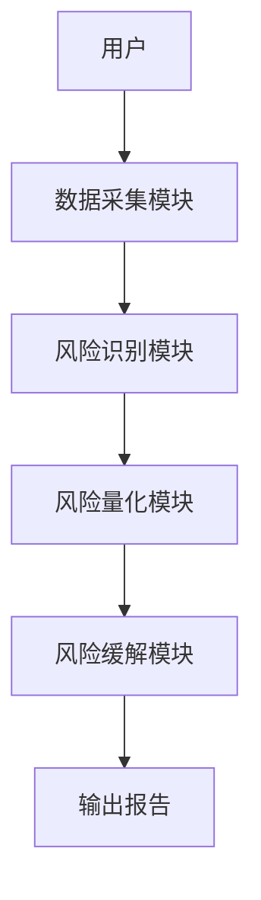

                 


```markdown
# 《芒格的"避免首要否认"在量子科技风险评估中的重要性》

---

## 关键词：芒格思想、量子科技、风险评估、概率论、量子计算

---

## 摘要：芒格的“避免首要否认”是一种重要的思维原则，强调避免拒绝接受显而易见的事实。本文将探讨这一思想在量子科技风险评估中的应用，通过量子概率论和量子计算的数学模型，分析其在风险识别、系统架构设计和项目实战中的重要性。文章结合理论与实践，为量子科技的风险管理提供新的视角。

---

## 第一部分：芒格“避免首要否认”思想的背景介绍

## 第1章：量子科技的背景与挑战

### 1.1 量子科技的基本概念

#### 1.1.1 量子科技的定义与特点

量子科技是基于量子力学原理发展起来的新兴技术领域，主要包括量子计算、量子通信和量子传感等。与经典技术相比，量子科技具有以下特点：

- **并行性**：量子系统能够在同一时间处理大量可能性。
- **叠加性**：量子状态可以同时存在于多个状态中。
- **纠缠性**：量子粒子之间可以产生强关联，信息传递速度快。
- **不确定性**：量子系统的测量结果具有概率性。

#### 1.1.2 量子科技的核心技术领域

- **量子计算**：利用量子比特进行计算，处理复杂问题的能力远超经典计算机。
- **量子通信**：通过量子态传输实现信息的安全通信。
- **量子传感**：利用量子效应提高测量精度和灵敏度。

#### 1.1.3 量子科技的应用前景

量子科技在密码学、材料科学、药物研发等领域具有广阔的应用前景。例如，量子计算可以加速药物分子的模拟，量子通信可以提供无条件安全的加密通信。

### 1.2 芒格“避免首要否认”思想的定义

#### 1.2.1 思想的来源与背景

芒格思想由投资者查理·芒格提出，强调避免拒绝接受显而易见的事实。他认为，许多人因为固有思维模式，常常忽视显而易见的真理。

#### 1.2.2 思想的核心概念

“避免首要否认”是指在决策过程中，要避免因先入为主的观念而忽视显而易见的事实。这种思想强调开放性和灵活性，要求我们在面对问题时，保持客观和理性。

#### 1.2.3 思想在投资领域的应用

在投资领域，芒格思想强调避免盲目跟风和情绪化决策。投资者应关注事实，避免被市场情绪左右。

### 1.3 量子科技与芒格思想的结合

#### 1.3.1 量子科技中的风险识别

量子科技的发展面临技术不确定性、市场接受度和伦理问题等多重风险。芒格思想提醒我们，要避免因技术复杂性而忽视这些显而易见的风险。

#### 1.3.2 量子科技中的决策优化

通过避免首要否认，量子科技的决策者可以更客观地评估技术可行性，避免因固有思维模式而错失机会或误判风险。

---

## 第二部分：量子科技风险评估的核心概念

## 第2章：量子科技风险评估的理论基础

### 2.1 量子概率论与风险评估

#### 2.1.1 量子概率的基本原理

量子概率与经典概率的主要区别在于，量子概率允许事件之间存在纠缠关系，而经典概率则假设事件独立。

#### 2.1.2 概率论在风险评估中的应用

在量子科技风险评估中，概率论用于量化技术失败的可能性和影响程度。例如，量子计算的纠错技术尚未成熟，可能导致计算失败的概率较高。

#### 2.1.3 量子概率与经典概率的对比

| 特性         | 量子概率                   | 经典概率                   |
|--------------|----------------------------|----------------------------|
| 独立性       | 事件之间可以纠缠           | 事件之间假设独立           |
| 可测性       | 测量结果具有概率性         | 测量结果具有确定性         |
| 应用场景     | 量子计算、量子通信         | 经典概率问题                |

### 2.2 量子计算与风险评估

#### 2.2.1 量子计算的基本原理

量子计算利用量子比特（qubit）进行计算，每个量子比特可以同时处于多个状态。例如，一个量子比特可以同时表示0和1。

#### 2.2.2 量子计算在风险评估中的优势

量子计算可以快速处理复杂问题，例如优化问题和模拟问题。这使得量子计算在风险评估中的应用具有潜力，例如评估量子算法的稳定性。

#### 2.2.3 量子计算的潜在风险

量子计算的快速发展可能对现有加密技术构成威胁，导致信息泄露风险增加。因此，需要提前采取措施，如开发抗量子加密算法。

---

## 第3章：芒格思想与量子科技风险评估的结合

### 3.1 “避免首要否认”在量子科技风险评估中的应用

#### 3.1.1 思想对风险识别的指导作用

芒格思想提醒我们，要避免因技术复杂性而忽视显而易见的风险。例如，在量子计算的纠错技术开发中，需要关注技术失败的可能性。

#### 3.1.2 思想对风险量化的影响

通过避免首要否认，可以更客观地评估技术可行性。例如，评估量子算法的纠错能力时，需要综合考虑技术成熟度和市场需求。

#### 3.1.3 思想对风险缓解的指导意义

芒格思想强调灵活性和适应性。在量子科技风险缓解中，需要根据实际情况调整策略，避免因固有思维模式而错失机会。

### 3.2 量子科技风险评估的系统架构

#### 3.2.1 系统功能设计

量子科技风险评估系统需要具备以下功能：

- 数据采集：收集量子科技相关的技术数据和市场数据。
- 风险识别：识别技术风险、市场风险和伦理风险。
- 风险量化：量化风险的影响程度和发生概率。
- 风险缓解：制定风险缓解策略。

#### 3.2.2 系统架构设计

以下是量子科技风险评估系统的架构设计：



---

## 第三部分：量子科技风险评估的算法原理

## 第4章：量子概率论与风险评估算法

### 4.1 量子概率论的基本原理

量子概率论是量子科技风险评估的理论基础。例如，量子计算的纠错技术涉及多个量子比特的状态叠加和纠缠，其概率计算需要考虑这些特性。

### 4.2 量子概率算法的实现

以下是一个简单的量子概率算法实现示例：

```python
import numpy as np

# 定义量子概率模型
def quantum_probability(n_qubits):
    # 初始化量子态
    state = np.ones(2**n_qubits) / (2**(n_qubits / 2))
    # 计算概率
    probabilities = np.abs(state) ** 2
    return probabilities

# 示例：2个量子比特的概率计算
n_qubits = 2
probabilities = quantum_probability(n_qubits)
print("Quantum probabilities:", probabilities)
```

### 4.3 量子概率算法的数学模型

量子概率算法的数学模型可以表示为：

$$ P(x) = |\langle x | \psi \rangle|^2 $$

其中，$\psi$ 是量子态，$x$ 是测量结果。

---

## 第四部分：量子科技风险评估的系统架构

## 第5章：系统分析与架构设计

### 5.1 系统功能设计

#### 5.1.1 数据采集模块

数据采集模块负责收集量子科技相关的技术数据和市场数据。例如，收集量子计算的纠错技术进展和市场接受度。

#### 5.1.2 风险识别模块

风险识别模块基于量子概率论，识别技术风险、市场风险和伦理风险。例如，识别量子计算技术失败的可能性。

### 5.2 系统架构设计

以下是量子科技风险评估系统的架构设计：


---

## 第五部分：量子科技风险评估的项目实战

## 第6章：项目实战与案例分析

### 6.1 项目环境安装

#### 6.1.1 安装必要的Python库

```bash
pip install numpy matplotlib
```

### 6.2 系统核心实现源代码

#### 6.2.1 量子概率计算代码

```python
import numpy as np

def quantum_probability(n_qubits):
    state = np.ones(2**n_qubits) / (2**(n_qubits / 2))
    probabilities = np.abs(state) ** 2
    return probabilities

n_qubits = 2
probabilities = quantum_probability(n_qubits)
print("Quantum probabilities:", probabilities)
```

### 6.3 代码应用解读与分析

以上代码实现了简单的量子概率计算，展示了量子概率在风险评估中的应用。通过计算不同量子比特数下的概率分布，可以帮助我们更好地理解量子系统的不确定性。

---

## 第六部分：最佳实践与总结

## 第7章：最佳实践与总结

### 7.1 小结

芒格的“避免首要否认”思想在量子科技风险评估中具有重要意义。通过避免拒绝接受显而易见的事实，我们可以更客观地评估技术风险，制定更有效的风险缓解策略。

### 7.2 注意事项

在实际应用中，需要注意以下几点：

- 风险评估应结合具体应用场景。
- 需要不断更新和优化风险评估模型。
- 需要关注技术发展的最新动态。

### 7.3 拓展阅读

建议进一步阅读以下内容：

- 量子概率论的相关文献。
- 量子计算的纠错技术。
- 风险评估的系统架构设计。

---

## 《芒格的"避免首要否认"在量子科技风险评估中的重要性》

通过本文的分析，我们可以看到，芒格的“避免首要否认”思想在量子科技风险评估中具有重要的指导意义。它提醒我们，要避免因技术复杂性而忽视显而易见的风险。希望本文的分析能够为量子科技的风险管理提供新的视角和方法。
```

