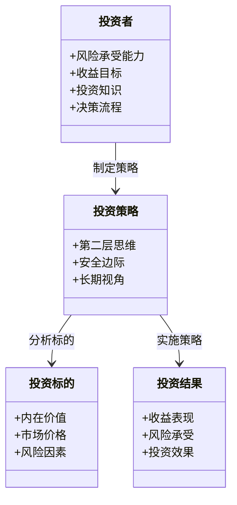
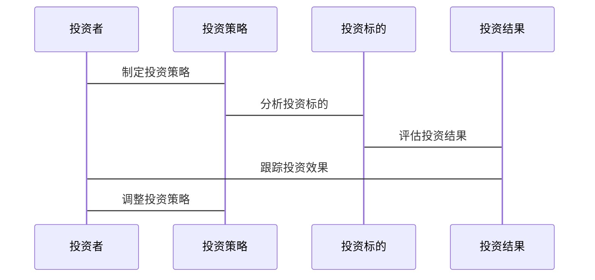

                 


# 《芒格的"避免首要否认"：克服投资决策中的心理障碍》

## 关键词：
芒格，投资心理，心理障碍，首要否认，投资策略，第二层思维，安全边际

## 摘要：
本文深入探讨了芒格提出的“避免首要否认”理念在投资决策中的应用，重点分析了投资过程中常见的心理障碍及其对决策的影响。通过结合芒格的投资策略和经典案例，本文详细阐述了如何识别和克服这些心理障碍，帮助投资者做出更理性和有效的决策。文章从理论到实践，结合实际案例，为投资者提供了一套系统化的解决方案。

---

## 第1章：芒格“避免首要否认”的核心理念

### 1.1 “首要否认”心理障碍的定义与特征

#### 1.1.1 什么是“首要否认”
“首要否认”是指投资者在面对信息时，倾向于忽视或否认与自己当前观点或决策相冲突的证据或事实。这种心理障碍源于人类的认知偏差和情绪偏好，使得投资者在决策过程中容易陷入自我确认的陷阱。

#### 1.1.2 “首要否认”的主要特征
- **选择性关注**：只关注支持自己观点的信息，忽视矛盾信息。
- **认知失调**：当面对与已有认知冲突的信息时，会产生不适感，倾向于否认或排斥。
- **情绪影响**：情绪化的决策更容易导致“首要否认”。

#### 1.1.3 “首要否认”与投资决策的关系
在投资中，“首要否认”会导致投资者坚持错误的决策，错失纠错和调整的机会，最终可能造成重大损失。

### 1.2 芒格的“避免首要否认”理论

#### 1.2.1 芒格投资理念的核心思想
芒格强调理性思考和独立判断，认为投资决策的核心是避免认知偏差和情绪干扰，追求长期的、可持续的收益。

#### 1.2.2 “避免首要否认”在芒格投资策略中的地位
“避免首要否认”是芒格投资策略的核心原则之一，旨在帮助投资者克服心理障碍，做出更理性的决策。

#### 1.2.3 芒格对心理障碍的洞察与解决方案
芒格提出了“第二层思维”和“安全边际”等方法，帮助投资者克服“首要否认”的心理障碍，提升决策的科学性和有效性。

---

## 第2章：投资决策中的心理障碍分析

### 2.1 常见心理偏差对投资决策的影响

#### 2.1.1 羊群效应
投资者容易受到市场情绪的影响，盲目跟随大众决策，导致非理性投资行为。

#### 2.1.2 过度自信
投资者往往高估自己的分析能力，忽视不确定性，导致决策失误。

#### 2.1.3 损失厌恶
投资者对潜在损失的敏感性高于对收益的敏感性，导致他们在亏损时过于保守，错失反弹机会。

#### 2.1.4 确认偏差
投资者倾向于寻找和关注支持自己已有观点的信息，忽视对立证据。

### 2.2 心理障碍与投资决策的互动关系

#### 2.2.1 心理障碍如何影响投资决策
- **认知偏差**：影响信息处理和决策判断。
- **情绪干扰**：导致非理性决策。
- **行为偏差**：引发过度交易或规避行为。

#### 2.2.2 投资决策中的情绪与认知偏差
投资者的情绪波动和认知偏差相互作用，进一步加剧决策偏差。

#### 2.2.3 心理障碍对投资结果的长期影响
长期来看，心理障碍会导致投资组合表现不佳，甚至造成重大损失。

---

## 第3章：芒格的“第二层思维”与投资决策

### 3.1 “第二层思维”的概念与特点

#### 3.1.1 什么是“第二层思维”
“第二层思维”是指在分析问题时，不仅考虑表面现象，还要深入思考问题的深层逻辑和潜在影响。

#### 3.1.2 “第二层思维”的核心要素
- **逆向思考**：从反方向入手，寻找市场的非共识观点。
- **长期视角**：关注事物的长期发展趋势，而非短期波动。
- **独立思考**：避免被市场情绪左右，坚持独立判断。

#### 3.1.3 “第二层思维”与“首要否认”的关系
通过“第二层思维”，投资者可以更好地识别和克服“首要否认”，做出更理性的决策。

### 3.2 “第二层思维”在投资中的应用

#### 3.2.1 通过“第二层思维”识别投资机会
芒格通过分析市场的非共识观点，识别被低估的投资标的。

#### 3.2.2 “第二层思维”与价值投资的结合
芒格的价值投资理念强调长期持有优质资产，通过“第二层思维”识别这些资产的内在价值。

#### 3.2.3 芒格的“第二层思维”案例分析
以伯克希尔·哈撒韦的投资决策为例，芒格通过“第二层思维”识别了多个具有长期竞争优势的企业。

---

## 第4章：克服“首要否认”的策略与方法

### 4.1 认识与分析“首要否认”的根源

#### 4.1.1 “首要否认”的心理根源
- **认知偏差**：人类倾向于确认已有的观点，忽视矛盾信息。
- **情绪偏好**：情绪化的决策更容易导致“首要否认”。

#### 4.1.2 “首要否认”的认知根源
- **信息处理偏差**：投资者倾向于选择性处理信息。
- **知识局限性**：知识的局限性导致投资者无法全面评估信息。

#### 4.1.3 “首要否认”的行为根源
- **行为惯性**：投资者习惯于按照已有模式决策。
- **社交压力**：害怕与群体观点不一致，导致否认矛盾信息。

### 4.2 克服“首要否认”的具体策略

#### 4.2.1 建立正确的投资心态
- **保持理性**：避免情绪化决策，坚持逻辑分析。
- **追求真理**：以寻找事实和真相为目标，而非坚持己见。
- **接受不确定性**：认识到投资中的不确定性，避免过度自信。

#### 4.2.2 提高自我认知能力
- **反思与总结**：定期反思自己的决策，识别“首要否认”的迹象。
- **学习与成长**：通过不断学习，提升自己的认知水平和决策能力。

#### 4.2.3 建立科学的投资决策流程
- **制定决策标准**：建立清晰的投资标准和流程，避免随意决策。
- **引入外部视角**：通过团队讨论或外部专家的意见，识别自己的盲点。
- **持续监控与调整**：定期评估决策效果，及时调整投资策略。

---

## 第5章：芒格的“安全边际”与投资决策

### 5.1 “安全边际”的概念与意义

#### 5.1.1 什么是“安全边际”
“安全边际”是指投资标的的实际价值与其市场价格之间的差额，旨在为投资提供一个“缓冲区”，降低投资风险。

#### 5.1.2 “安全边际”的核心要素
- **内在价值**：投资标的的真实价值。
- **市场价格**：市场的交易价格。
- **风险因素**：影响投资标的的潜在风险因素。

#### 5.1.3 “安全边际”与投资风险的关系
通过建立合理的“安全边际”，投资者可以降低投资风险，提高投资的可持续性。

### 5.2 “安全边际”在投资中的应用

#### 5.2.1 通过“安全边际”评估投资标的
芒格通过分析投资标的的内在价值和市场价格，识别具有安全边际的投资机会。

#### 5.2.2 “安全边际”与长期投资策略的结合
芒格强调长期投资，通过建立合理的“安全边际”，降低短期波动对投资组合的影响。

#### 5.2.3 芒格的“安全边际”案例分析
以伯克希尔·哈撒韦的投资决策为例，芒格通过分析企业的内在价值和市场价格，识别具有安全边际的投资标的。

---

## 第6章：投资决策中的心理障碍与应对策略

### 6.1 投资决策中的常见心理障碍

#### 6.1.1 过度乐观
投资者往往高估自己的分析能力，忽视潜在风险。

#### 6.1.2 过度悲观
投资者过于担忧市场风险，错失投资机会。

#### 6.1.3 过度自信
投资者过度依赖自己的判断，忽视外部意见和市场变化。

#### 6.1.4 过度反应
投资者对市场波动过于敏感，导致频繁交易和决策失误。

### 6.2 克服心理障碍的具体方法

#### 6.2.1 建立理性的投资框架
- **明确投资目标**：根据自身风险承受能力和投资目标，制定合理的投资策略。
- **坚持长期视角**：避免短期波动的干扰，关注长期投资价值。
- **保持理性心态**：在市场波动中保持冷静，避免情绪化决策。

#### 6.2.2 培养长期思维
- **关注长期趋势**：分析市场的长期发展趋势，识别具有持续竞争优势的投资标的。
- **避免短期炒作**：避免被市场短期波动所迷惑，坚持长期投资策略。
- **持续学习与成长**：通过不断学习，提升自己的投资能力和决策水平。

#### 6.2.3 建立有效的决策机制
- **制定决策规则**：建立清晰的投资规则和流程，避免随意决策。
- **引入外部视角**：通过团队讨论或外部专家的意见，识别自己的盲点。
- **定期评估与调整**：定期评估投资组合的表现，及时调整投资策略。

---

## 第7章：芒格的“避免首要否认”投资策略实战

### 7.1 投资策略的制定与实施

#### 7.1.1 投资策略的制定原则
- **长期导向**：关注长期投资价值，避免短期波动的干扰。
- **安全边际**：通过分析内在价值和市场价格，识别具有安全边际的投资机会。
- **独立思考**：坚持独立判断，避免被市场情绪左右。

#### 7.1.2 投资策略的实施步骤
- **第一步：明确投资目标**：根据自身风险承受能力和收益目标，制定合理的投资策略。
- **第二步：分析投资标的**：通过“第二层思维”和“安全边际”分析，识别具有长期竞争优势的投资机会。
- **第三步：建立投资组合**：根据分析结果，构建合理分散的投资组合，降低风险。
- **第四步：持续监控与调整**：定期评估投资组合的表现，及时调整投资策略。

#### 7.1.3 投资策略的动态调整
- **定期评估**：根据市场变化和自身情况，动态调整投资策略。
- **灵活应对**：在市场波动中，保持灵活性，及时调整投资组合。

### 7.2 实战案例分析

#### 7.2.1 芒格的经典投资案例
以伯克希尔·哈撒韦的投资决策为例，芒格通过分析企业的内在价值和市场价格，识别具有安全边际的投资机会。

#### 7.2.2 投资者如何应用“避免首要否认”策略
投资者可以通过建立理性的投资框架和科学的决策流程，克服“首要否认”的心理障碍，做出更理性的决策。

#### 7.2.3 投资策略的长期效果评估
通过长期跟踪和分析，评估投资策略的有效性和可持续性，不断优化投资组合。

---

## 第8章：系统分析与架构设计方案

### 8.1 问题场景介绍

#### 8.1.1 投资者面临的挑战
- **心理障碍**：认知偏差和情绪干扰影响投资决策。
- **信息过载**：海量信息导致决策困难。
- **市场波动**：短期波动对长期投资造成干扰。

### 8.2 项目介绍

#### 8.2.1 项目目标
通过分析芒格的“避免首要否认”理论，帮助投资者克服心理障碍，提升投资决策的科学性和有效性。

#### 8.2.2 项目范围
- **理论研究**：深入分析芒格的投资理念和策略。
- **案例分析**：通过实际案例，验证理论的可行性和有效性。
- **系统设计**：设计一套科学的投资决策流程和工具。

### 8.3 系统功能设计

#### 8.3.1 领域模型（mermaid类图）


#### 8.3.2 系统架构设计（mermaid架构图）


#### 8.3.3 系统接口设计
- **输入接口**：投资者的风险承受能力、收益目标、投资知识等。
- **输出接口**：投资策略、投资标的分析结果、投资组合建议等。

#### 8.3.4 系统交互设计（mermaid序列图）


---

## 第9章：项目实战

### 9.1 环境安装

#### 9.1.1 安装工具
- **Python**：用于数据分析和算法实现。
- **Jupyter Notebook**：用于数据分析和可视化。
- **Mermaid**：用于绘制图表和流程图。

#### 9.1.2 安装依赖
```bash
pip install mermaid
pip install numpy
pip install pandas
pip install matplotlib
```

### 9.2 系统核心实现源代码

#### 9.2.1 数据分析代码
```python
import numpy as np
import pandas as pd
import matplotlib.pyplot as plt

# 示例数据：投资标的的内在价值和市场价格
data = {
    '投资标的': ['股票A', '股票B', '股票C'],
    '内在价值': [100, 150, 200],
    '市场价格': [80, 120, 180]
}
df = pd.DataFrame(data)

# 计算安全边际
df['安全边际'] = df['内在价值'] - df['市场价格']
print(df)
```

#### 9.2.2 可视化代码
```python
import matplotlib.pyplot as plt

plt.figure(figsize=(10,6))
plt.plot(df['投资标的'], df['内在价值'], label='内在价值')
plt.plot(df['投资标的'], df['市场价格'], label='市场价格')
plt.xlabel('投资标的')
plt.ylabel('价值')
plt.legend()
plt.show()
```

### 9.3 代码应用解读与分析

#### 9.3.1 数据分析结果
通过上述代码，我们可以清晰地看到每个投资标的的内在价值和市场价格之间的差异，即“安全边际”。这为我们提供了重要的决策依据。

#### 9.3.2 可视化结果
通过图表，我们可以直观地看到投资标的的内在价值和市场价格的差异，从而更好地识别具有安全边际的投资机会。

### 9.4 实际案例分析

#### 9.4.1 案例背景
假设我们有三个投资标的：股票A、股票B和股票C，它们的内在价值分别为100、150和200，市场价格分别为80、120和180。

#### 9.4.2 分析过程
通过计算“安全边际”，我们可以看到：
- 股票A的安全边际为20（100 - 80）。
- 股票B的安全边际为30（150 - 120）。
- 股票C的安全边际为20（200 - 180）。

#### 9.4.3 投资决策
基于“安全边际”的分析，股票B具有最大的安全边际，因此可以作为优先投资的目标。

### 9.5 项目小结

#### 9.5.1 项目总结
通过本项目，我们学会了如何利用数据分析和可视化工具，识别具有安全边际的投资机会，从而做出更科学的投资决策。

#### 9.5.2 经验与教训
在实际操作中，我们需要注意数据的准确性和分析的深度，同时结合市场实际情况，灵活调整投资策略。

---

## 第10章：最佳实践 tips、小结、注意事项、拓展阅读

### 10.1 最佳实践 tips

#### 10.1.1 保持理性
在投资过程中，始终保持理性思考，避免情绪化决策。

#### 10.1.2 坚持学习
通过不断学习，提升自己的投资能力和决策水平。

#### 10.1.3 建立科学的决策流程
制定清晰的投资策略和流程，避免随意决策。

#### 10.1.4 保持长期视角
关注长期投资价值，避免被短期波动所干扰。

### 10.2 小结

通过本文的分析和实践，我们深入探讨了芒格的“避免首要否认”理念在投资决策中的应用，掌握了如何识别和克服心理障碍，提升投资决策的科学性和有效性。

### 10.3 注意事项

- **避免过度自信**：认识到自己的局限性，避免过度自信。
- **保持冷静**：在市场波动中保持冷静，避免情绪化决策。
- **持续优化**：定期评估和优化投资策略，适应市场变化。

### 10.4 拓展阅读

- **《芒格的“避免首要否认”：投资决策中的心理障碍》**
- **《巴菲特与芒格的投资思想》**
- **《投资心理学》**

---

## 结语

通过本文的系统分析和实战演练，我们不仅深入理解了芒格的“避免首要否认”理念，还掌握了如何在实际投资中克服心理障碍，提升决策的科学性和有效性。希望本文能为投资者提供有价值的参考和启发，帮助他们在投资道路上走得更远、更稳。

