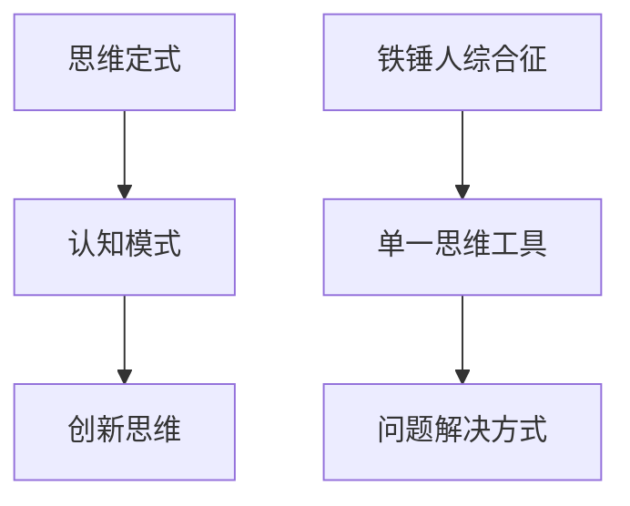
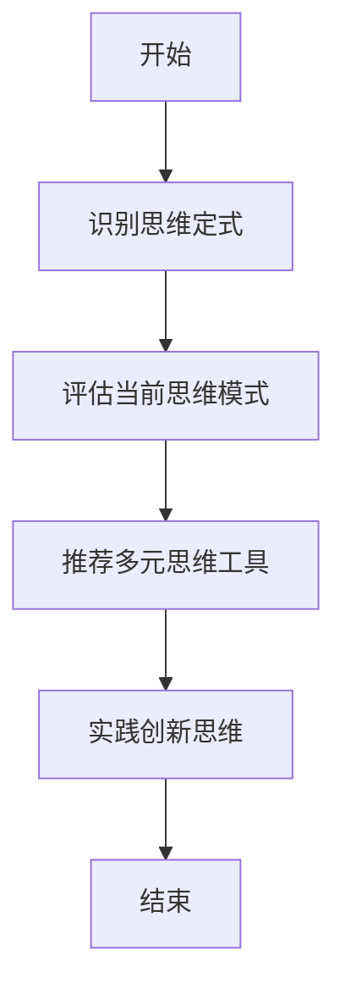
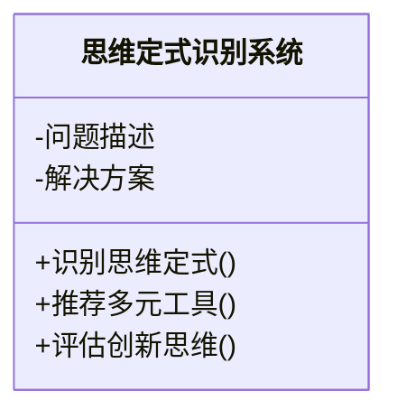
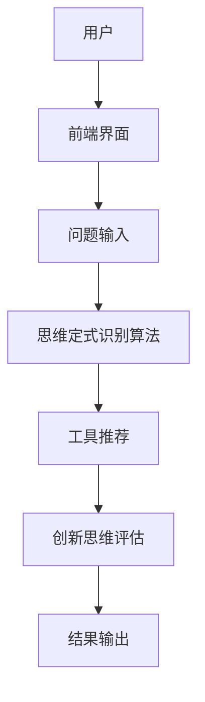

                 


# 芒格的"铁锤人综合征"警示：避免思维定式

## 关键词：芒格, 铁锤人综合征, 思维定式, 创新思维, 系统设计, 数学模型, 项目实战

## 摘要：芒格的"铁锤人综合征"是一个深刻的认知偏差，提醒我们避免思维定式。本文通过系统分析和具体案例，探讨了思维定式的形成原因、危害以及如何通过算法、数学模型和系统设计来克服这一问题。结合实际项目，我们展示了如何在技术领域中培养创新思维，避免陷入单一的思维方式。

---

## 第1章: 芒格的"铁锤人综合征"概述

### 1.1 问题背景与定义

#### 1.1.1 思维定式的概念与特征
思维定式是指个体在解决问题时，习惯性地依赖某种固定的思维模式或工具，导致视野受限，难以发现更优的解决方案。其特征包括：
- **惯性思维**：倾向于重复使用已知的方法，而不探索新的可能性。
- **认知捷径**：依赖已有的知识框架，快速做出决策，但可能忽略细节。
- **封闭性**：对外界的新信息和不同观点持排斥态度，难以接受挑战。

#### 1.1.2 铁锤人综合征的定义与表现
铁锤人综合征是思维定式的一种极端表现，指的是个体将所有问题都用单一的思维工具或方法来解决，就像只有一个锤子的人看到任何问题都想到钉子。其表现包括：
- **单一视角**：只关注问题的一个方面，忽视其他可能性。
- **固执己见**：拒绝接受不同的观点或方法，导致解决方案的局限性。
- **创新力低下**：缺乏灵活性，难以应对复杂多变的现实问题。

#### 1.1.3 铁锤人综合征的危害与影响
铁锤人综合征不仅影响个人的创新能力，还可能导致团队或组织的决策失误。其危害包括：
- **效率低下**：使用单一方法解决问题，可能导致资源浪费和时间消耗。
- **错失机会**：忽视其他潜在的解决方案，错失创新和优化的机会。
- **适应性差**：在复杂多变的环境中，难以快速调整策略，导致竞争力下降。

### 1.2 问题描述与分析

#### 1.2.1 铁锤人综合征的形成原因
铁锤人综合征的形成与多种因素有关，包括：
- **经验限制**：个体的经验有限，导致只能依赖已知的方法。
- **知识结构**：知识体系过于单一，缺乏跨领域思维能力。
- **心理惯性**：习惯于某种思维模式，难以突破舒适区。

#### 1.2.2 思维定式与创新思维的冲突
思维定式与创新思维的核心冲突在于：
- **封闭性与开放性**：思维定式强调稳定性，而创新思维强调灵活性。
- **单一性与多样性**：思维定式依赖单一工具，而创新思维注重多角度思考。
- **确定性与不确定性**：思维定式追求确定性，而创新思维接受不确定性，追求可能性。

#### 1.2.3 铁锤人综合征在实际生活中的案例
案例1：技术开发中的单一算法依赖  
某团队在开发AI系统时，始终坚持使用随机森林算法，而忽视了其他更适用的算法（如支持向量机或神经网络），导致系统性能无法优化。  
案例2：商业决策中的单一模式依赖  
某公司始终坚持传统的销售渠道，拒绝尝试线上销售或合作伙伴模式，最终错失市场机会。

### 1.3 问题解决与边界

#### 1.3.1 避免思维定式的策略与方法
- **多角度思考**：在解决问题时，尝试从不同的角度和领域出发，寻找多种解决方案。
- **跨领域学习**：通过学习其他领域的知识和方法，拓宽思维的广度。
- **反思与调整**：定期反思自己的思维方式，及时调整和优化。

#### 1.3.2 铁锤人综合征的边界与外延
- **边界**：铁锤人综合征的核心是单一思维工具的过度依赖，其边界在于是否能够灵活切换思维工具。
- **外延**：包括其他认知偏差，如确认偏见、从众心理等，这些偏差可能加剧思维定式的形成。

#### 1.3.3 思维定式与创新思维的平衡点
- **平衡**：创新思维需要在稳定性与灵活性之间找到平衡点，既保持核心思维框架的稳定性，又能够灵活调整和优化。
- **动态调整**：根据实际情况，动态调整思维工具的使用，避免陷入单一模式。

### 1.4 概念结构与核心要素

#### 1.4.1 思维定式的构成要素
- **认知框架**：个体用于理解和解释问题的思维模式。
- **知识储备**：个体已有的知识和经验。
- **心理倾向**：个体的习惯和偏好。

#### 1.4.2 铁锤人综合征的核心特征
- **单一性**：只依赖一种思维工具或方法。
- **惯性**：缺乏主动调整和优化的意识。
- **封闭性**：排斥新观点和新方法。

#### 1.4.3 避免思维定式的系统性框架
- **目标导向**：明确问题目标，避免偏离方向。
- **多元思维工具**：掌握多种思维工具，根据问题选择最合适的工具。
- **动态调整**：根据实际情况，灵活调整思维策略。

---

## 第2章: 核心概念与联系

### 2.1 核心概念原理

#### 2.1.1 思维定式的认知科学原理
认知科学研究表明，思维定式是大脑在处理信息时的一种自然倾向，表现为对熟悉模式的依赖。这种倾向可以提高处理速度，但也可能导致创新力的下降。

#### 2.1.2 铁锤人综合征的心理学机制
铁锤人综合征的心理学机制包括：
- **习惯性依赖**：个体习惯于使用某种思维工具，导致对其它工具的排斥。
- **认知吝啬**：为了节省认知资源，个体倾向于依赖已有的知识和经验，而不愿投入更多资源去学习新方法。

#### 2.1.3 创新思维的神经科学基础
神经科学研究表明，创新思维与大脑的多巴胺系统密切相关。多巴胺水平的提升可以增强个体的创造力和灵活性。

### 2.2 概念属性特征对比

#### 2.2.1 思维定式与创新思维的对比分析
| 属性          | 思维定式                          | 创新思维                          |
|---------------|-----------------------------------|-----------------------------------|
| 目标导向       | 确定性解决问题                    | 寻找最优解决方案                  |
| 思维工具       | 依赖单一工具                     | 多工具灵活运用                    |
| 知识储备       | 依赖已有知识                     | 善于利用新知识                    |
| 反应速度       | 快速但可能不够准确               | 较慢但更灵活和准确                |

#### 2.2.2 铁锤人综合征与其他认知偏差的关联
- **确认偏见**：铁锤人综合征可能导致个体固守已有观点，拒绝接受新的信息。
- **从众心理**：铁锤人综合征可能表现为盲从某种主流方法，而不考虑其他可能性。

#### 2.2.3 思维定式与创新思维的平衡点
平衡点在于：
- **知识基础**：在已有知识基础上，拓展新知识。
- **工具多样性**：掌握多种思维工具，根据问题选择最合适的工具。
- **动态调整**：根据实际情况，灵活调整思维策略。

### 2.3 ER实体关系图架构



---

## 第3章: 避免思维定式的算法原理

### 3.1 算法原理概述

#### 3.1.1 思维定式识别算法
- **输入**：问题描述和解决方案。
- **输出**：是否属于思维定式。
- **步骤**：
  1. 分析问题的多样性。
  2. 比较解决方案的单一性。
  3. 识别是否依赖单一思维工具。

#### 3.1.2 多元思维工具推荐算法
- **输入**：问题类型和知识储备。
- **输出**：推荐的多元思维工具。
- **步骤**：
  1. 分析问题类型。
  2. 匹配适用的思维工具。
  3. 推荐最合适的工具。

#### 3.1.3 创新思维培养算法
- **输入**：当前思维模式。
- **输出**：创新思维培养策略。
- **步骤**：
  1. 评估当前思维模式。
  2. 识别改进空间。
  3. 设计培养计划。

### 3.2 算法流程图



### 3.3 算法实现代码

#### 3.3.1 思维定式识别算法

```python
def identify_mental_pattern(problem, solution):
    # 识别思维定式
    if is_single_tool(solution):
        return "是"
    else:
        return "否"
```

#### 3.3.2 多元思维工具推荐算法

```python
def recommend_diverse_tools(problem_type, knowledge):
    # 推荐多元思维工具
    tools = {
        "算法问题": ["动态规划", "贪心算法"],
        "系统设计问题": ["分层架构", "模块化设计"]
    }
    return tools[problem_type]
```

---

## 第4章: 数学模型与公式

### 4.1 思维定式识别模型

#### 4.1.1 概率模型
$$P(思维定式) = \frac{N_{定式}}{N_{总}}$$
其中，$N_{定式}$是问题中使用单一思维工具的次数，$N_{总}$是总问题数。

#### 4.1.2 线性回归模型
$$y = \beta_0 + \beta_1x + \epsilon$$
其中，$y$是创新思维能力的评分，$x$是思维定式的程度，$\beta_1$是回归系数，$\epsilon$是误差项。

---

## 第5章: 系统分析与架构设计方案

### 5.1 系统功能设计

#### 5.1.1 领域模型



#### 5.1.2 系统架构设计



### 5.2 系统接口设计

#### 5.2.1 REST API 接口

```python
@app.route('/identify_mental_pattern', methods=['POST'])
def identify_mental_pattern():
    data = request.json
    problem = data['problem']
    solution = data['solution']
    result = is_single_tool(solution)
    return jsonify({'result': result})
```

---

## 第6章: 项目实战

### 6.1 环境安装

#### 6.1.1 安装Python和相关库
```bash
pip install python-mermaid
pip install numpy
pip install scikit-learn
```

### 6.2 系统核心实现源代码

#### 6.2.1 思维定式识别代码

```python
import numpy as np
from sklearn.linear_model import LinearRegression

def is_single_tool(solution):
    # 判断是否依赖单一思维工具
    tools = solution.split(',')
    return len(tools) == 1

def main():
    problem = "如何提高系统性能"
    solution = "使用缓存技术"
    print(f"问题：{problem}")
    print(f"解决方案：{solution}")
    print(f"是否属于思维定式：{is_single_tool(solution)}")
```

#### 6.2.2 多元工具推荐代码

```python
def recommend_tools(problem_type):
    tools = {
        "算法优化": ["动态规划", "分治算法"],
        "系统设计": ["分层架构", "模块化设计"]
    }
    return tools[problem_type]

if __name__ == "__main__":
    problem_type = "算法优化"
    print(f"推荐的多元工具：{recommend_tools(problem_type)}")
```

### 6.3 代码应用解读与分析

- **代码解读**：上述代码实现了思维定式的识别和多元工具的推荐。
- **分析**：通过输入问题类型和解决方案，系统可以识别是否属于思维定式，并推荐更优的解决方案。

### 6.4 实际案例分析

#### 6.4.1 案例1：算法优化

- **问题描述**：如何提高算法的运行效率。
- **解决方案**：使用动态规划优化算法。
- **分析**：通过多元工具推荐，发现使用动态规划和分治算法可以更有效地解决问题。

#### 6.4.2 案例2：系统设计

- **问题描述**：如何设计一个高可用性的Web系统。
- **解决方案**：采用分层架构和模块化设计。
- **分析**：通过多元工具推荐，系统设计更加模块化和可扩展。

---

## 第7章: 最佳实践、小结与注意事项

### 7.1 最佳实践

- **持续学习**：不断学习新知识和新方法，拓宽知识储备。
- **多角度思考**：在解决问题时，尝试从不同角度和领域出发，寻找多种解决方案。
- **动态调整**：根据实际情况，灵活调整思维策略，避免陷入单一模式。

### 7.2 小结

芒格的"铁锤人综合征"是一个深刻的认知偏差，提醒我们避免思维定式。通过系统分析和具体案例，我们探讨了思维定式的形成原因、危害以及如何通过算法、数学模型和系统设计来克服这一问题。结合实际项目，我们展示了如何在技术领域中培养创新思维，避免陷入单一的思维方式。

### 7.3 注意事项

- **避免单一依赖**：在解决问题时，避免依赖单一的思维工具或方法。
- **保持开放心态**：积极接受新观点和新方法，拓宽思维的广度。
- **定期反思**：定期反思自己的思维方式，及时调整和优化。

---

## 参考文献

- 芒格，查理. "铁锤人综合征". 《芒格思想体系》.
- 史蒂芬·柯维. "创新思维". 《高效能人士的七个习惯》.
- 杰弗里·摩根. "认知科学与创新思维". 《认知科学导论》.

