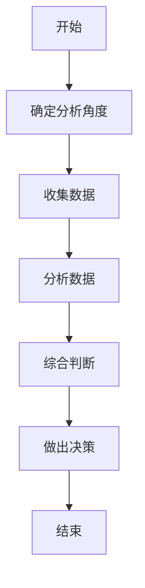
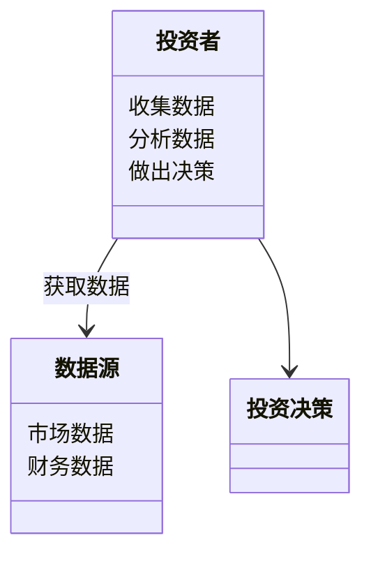
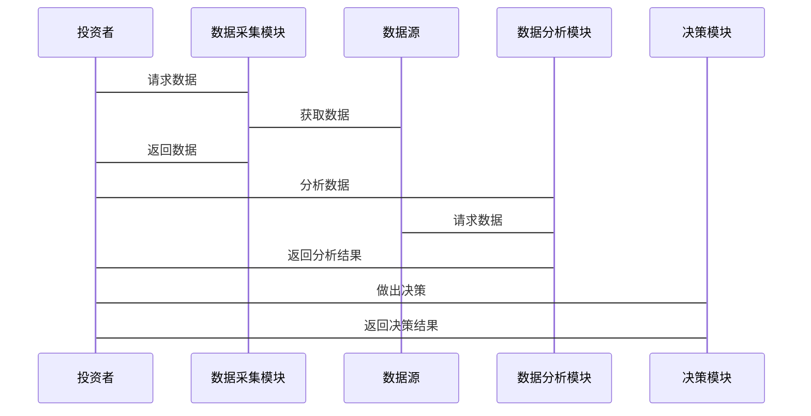

                 


# 芒格的"铁锤人综合征"警示：避免投资思维定式

## 关键词：芒格、铁锤人综合征、投资思维定式、多元思维模型、投资决策、系统分析、项目实战

## 摘要：本文通过分析芒格提出的“铁锤人综合征”，揭示投资中的思维定式问题，详细讲解如何通过多元思维模型和系统分析来避免思维定式，提升投资决策的科学性和有效性。文章结合实际案例，从算法原理、系统架构到项目实战，全面解析避免投资思维定式的策略和方法。

---

## 第一部分: 芒格的"铁锤人综合征"背景介绍

### 第1章: 芒格与"铁锤人综合征"概述

#### 1.1 芒格的生平与投资理念
- **1.1.1 芒格的生平简介**
  查理·芒格（Charlie Munger）是美国著名投资者，巴菲特的合作伙伴，出生于1924年。他不仅是投资界的传奇人物，也是心理学、认知科学领域的研究者。芒格的职业生涯始于律师，后来转向投资领域，并与沃伦·巴菲特共同创立了伯克希尔哈撒韦公司。

- **1.1.2 芒格的主要投资理念**
  芒格的投资理念强调长期价值投资，注重安全边际和内在价值。他认为投资不仅仅是对数字的分析，更是对人性、心理学的理解。芒格提倡多元思维模型，认为投资者需要从多个角度分析问题，避免单一思维模式。

- **1.1.3 芒格对投资思维的贡献**
  芒格在投资领域提出了许多深刻的见解，其中“铁锤人综合征”是他在1980年代提出的概念，旨在警示投资者避免陷入思维定式。

#### 1.2 "铁锤人综合征"的定义与背景
- **1.2.1 "铁锤人综合征"的定义**
  “铁锤人综合征”是指投资者因为长期使用某种思维方式或工具，导致他们只能用锤子来思考问题，即思维方式固化，无法灵活应对复杂的投资环境。

- **1.2.2 投资思维定式的形成原因**
  投资思维定式通常由经验、知识局限、习惯等因素导致。投资者一旦形成固定思维模式，往往难以接受新的信息和观点，容易忽略市场变化和潜在机会。

- **1.2.3 "铁锤人综合征"在投资中的表现**
  在投资中，"铁锤人综合征"表现为投资者过于依赖某种策略或模型，忽视市场的多样性和复杂性。例如，某些投资者只关注市盈率，而忽视其他关键指标。

#### 1.3 本章小结
本章通过介绍芒格的生平和投资理念，详细阐述了“铁锤人综合征”的定义、形成原因及其在投资中的表现，为后续分析奠定了基础。

---

## 第二部分: 核心概念与联系

### 第2章: "铁锤人综合征"的核心概念

#### 2.1 思维定式的类型
- **2.1.1 简单化思维**
  简单化思维是指投资者将复杂的市场现象简化为单一因素，例如只关注市盈率而忽视其他指标。

- **2.1.2 从众思维**
  从众思维是指投资者盲目跟随市场趋势或专家意见，缺乏独立判断能力。

- **2.1.3 过度自信思维**
  过度自信思维是指投资者对自己的判断过度自信，忽视潜在风险和不确定性。

#### 2.2 投资决策中的思维定式与"铁锤人综合征"的关系
- **2.2.1 思维定式对投资决策的影响**
  思维定式可能导致投资者忽略重要信息，做出错误决策，错失潜在机会。

- **2.2.2 "铁锤人综合征"的特征与表现**
  “铁锤人综合征”表现为投资者固守单一策略，无法灵活应对市场变化，导致投资失败。

- **2.2.3 投资者如何识别"铁锤人综合征"**
  投资者可以通过自我反思、多角度分析和持续学习来识别和避免“铁锤人综合征”。

#### 2.3 核心概念对比表
| 思维定式类型 | 定义 | 对投资决策的影响 |
|--------------|------|----------------|
| 简单化思维    | 将复杂问题简化为单一因素 | 导致忽视关键指标，决策失误 |
| 从众思维      | 盲目跟随市场趋势 | 缺乏独立判断，错失机会 |
| 过度自信思维  | 过度自信，忽视风险 | 导致决策失误，承担更大风险 |

#### 2.4 思维模型的ER实体关系图
```mermaid
er
  entity 思维定式 {
    id
    名称
    类型
  }
  entity 投资决策 {
    id
    决策内容
    时间
  }
  思维定式 -->> 投资决策: 影响
```

---

## 第三部分: 算法原理讲解

### 第3章: 多元思维模型与投资决策

#### 3.1 多元思维模型的定义与特点
- **3.1.1 多元思维模型的定义**
  多元思维模型是一种通过多个角度分析问题的方法，旨在避免思维定式，全面理解问题。

- **3.1.2 多元思维模型的特点**
  多元思维模型强调全面性、灵活性和系统性，适用于复杂的投资环境。

- **3.1.3 多元思维模型与"铁锤人综合征"的关系**
  多元思维模型是避免“铁锤人综合征”的有效工具，帮助投资者从多个角度分析问题，避免单一思维模式。

#### 3.2 基于多元思维模型的决策算法


#### 3.3 多元思维模型的数学模型
- 投资决策的数学模型：
  $$ \text{决策} = \sum_{i=1}^{n} w_i \cdot x_i $$
  其中，\( w_i \) 是分析角度的权重，\( x_i \) 是对应的数据。

---

## 第四部分: 系统分析与架构设计方案

### 第4章: 投资决策系统的分析与设计

#### 4.1 问题场景介绍
- 投资者需要在复杂市场环境中做出决策，避免思维定式。

#### 4.2 系统功能设计


#### 4.3 系统架构设计


#### 4.4 系统接口设计
- 数据采集接口：从市场数据源获取数据。
- 数据分析接口：使用多元思维模型分析数据。
- 决策接口：基于分析结果做出投资决策。

#### 4.5 系统交互设计


---

## 第五部分: 项目实战

### 第5章: 多元思维模型的应用

#### 5.1 环境安装
- 需要安装Python、数据分析工具（如Pandas、NumPy）和可视化工具（如Matplotlib）。

#### 5.2 核心代码实现
```python
import pandas as pd
import numpy as np

def multi_perspective_analysis(dataframe):
    # 计算多种指标
    metrics = dataframe.apply(lambda x: {
        '市盈率': x['市盈率'],
        '市净率': x['市净率'],
        'ROE': x['ROE']
    }, axis=1)
    return metrics

# 示例数据
data = {
    '公司名称': ['A', 'B', 'C'],
    '市盈率': [15, 20, 25],
    '市净率': [2, 3, 4],
    'ROE': [10, 15, 20]
}
df = pd.DataFrame(data)
result = multi_perspective_analysis(df)
print(result)
```

#### 5.3 案例分析
- 案例：分析三家公司，计算市盈率、市净率和ROE，综合判断投资价值。

---

## 第六部分: 最佳实践、小结、注意事项和拓展阅读

### 第6章: 投资中的注意事项

#### 6.1 最佳实践
- 定期反思和调整思维方式。
- 多角度分析问题，避免单一思维模式。
- 持续学习，更新知识和技能。

#### 6.2 小结
通过本文的分析，我们了解了“铁锤人综合征”的危害，学习了多元思维模型的应用方法，并通过实际案例展示了如何避免思维定式，提升投资决策的科学性和有效性。

#### 6.3 注意事项
- 投资者需保持警惕，避免陷入思维定式。
- 注重长期价值，而非短期波动。

#### 6.4 拓展阅读
- 查理·芒格的《穷查理宝典》
- 《思考，快与慢》
- 《投资最重要的事》

---

通过本文的详细分析和实践，读者可以更好地理解“铁锤人综合征”的危害，并通过多元思维模型和系统分析来避免思维定式，提升投资决策的科学性和有效性。

