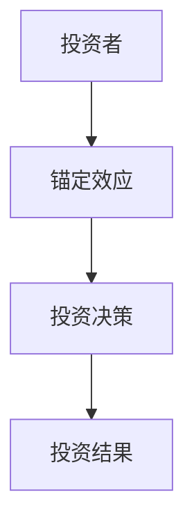
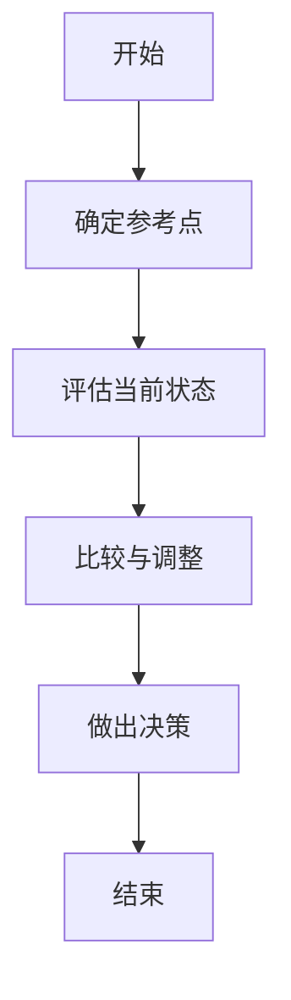
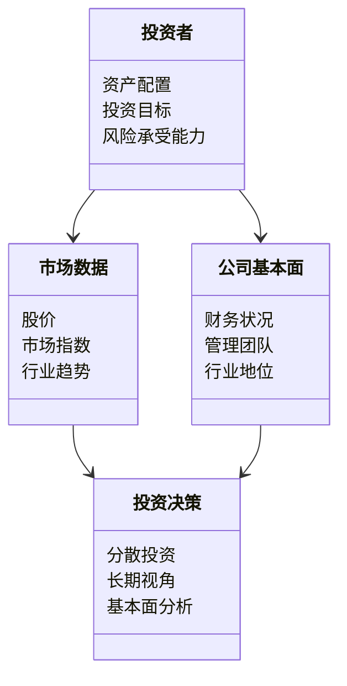
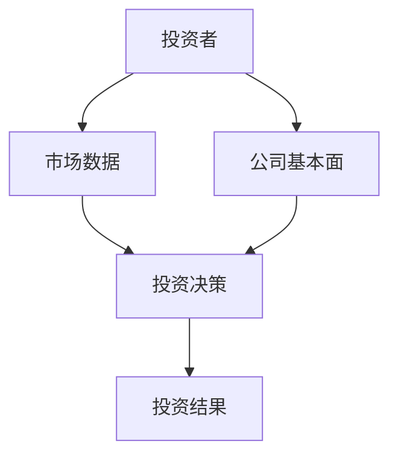

                 


# 芒格的"锚定效应"警示在投资中的应用

## 关键词：芒格、锚定效应、投资决策、心理偏差、风险管理

## 摘要：芒格的“锚定效应”是指投资者在决策过程中过度依赖某个参考点，导致决策偏差的现象。本文通过分析“锚定效应”的心理机制、数学模型和算法原理，结合实际投资案例，探讨如何识别和避免“锚定效应”在投资中的负面影响，提出科学的投资决策方法。

---

# 第一部分: 芒格的"锚定效应"背景介绍

## 第1章: 芒格的"锚定效应"概述

### 1.1 芒格的"锚定效应"的定义与背景

#### 1.1.1 什么是"锚定效应"
"锚定效应"（Anchoring Effect）是心理学中的一个基本概念，指人们在决策时，往往过度依赖某个初始信息或参考点，导致决策出现偏差。这个参考点可能是一个数字、价格、市场指数或其他相关信息。

例如，在投资中，许多投资者会将买入成本作为决策的锚点，当市场波动时，他们会根据买入成本的变化来判断是否卖出或继续持有，而不是根据市场整体情况或公司基本面进行理性决策。

#### 1.1.2 芒格对"锚定效应"的研究与贡献
芒格（Charlie Munger）作为伯克希尔·哈撒韦公司的副主席，以其独特的投资哲学和心理学洞察闻名。他多次强调，投资者需要克服人性中的各种心理偏差，包括“锚定效应”。芒格认为，“锚定效应”是导致投资者决策失误的主要原因之一，尤其是在市场波动剧烈时。

#### 1.1.3 "锚定效应"在投资中的应用背景
在投资领域，"锚定效应"的表现尤为明显。许多投资者在买入某只股票后，会将买入价格作为心理锚点，当股价下跌时，他们可能会因为害怕亏损而卖出，或者在股价上涨时因为过度自信而追涨。这种行为往往导致投资决策偏离基本面分析，增加投资风险。

### 1.2 投资中的"锚定效应"问题背景

#### 1.2.1 投资决策中的常见偏差
投资决策中存在多种心理偏差，如“过度自信”、“损失厌恶”、“ confirmation bias”等。其中，“锚定效应”是最常见的偏差之一，它使得投资者在决策时过于依赖某个固定点，而忽视了其他相关信息。

#### 1.2.2 "锚定效应"在投资决策中的具体表现
投资者在以下几种情况下容易受到“锚定效应”的影响：
1. **买入成本偏差**：投资者将买入成本作为参考点，当股价低于买入成本时，他们倾向于卖出，反之则倾向于持有或加仓。
2. **市场指数偏差**：投资者过度关注市场指数的变化，当指数下跌时，他们可能卖出股票，当指数上涨时则大量买入。
3. **专家意见偏差**：投资者过于依赖专家的推荐或市场分析师的报告，将这些信息作为决策的锚点。

#### 1.2.3 "锚定效应"对投资结果的影响
“锚定效应”会导致投资者在决策时忽略市场整体趋势和公司基本面，从而做出错误的投资决策。例如，在市场下跌时，许多投资者因为股价低于买入成本而卖出，但实际上，这可能是长期持有的好机会。相反，在市场上涨时，投资者可能因为过度自信而追高，导致亏损。

### 1.3 芒格"锚定效应"的解决思路

#### 1.3.1 理解"锚定效应"的本质
芒格认为，投资者需要理解“锚定效应”的本质，即它是一种心理偏差，而不是客观事实。投资者应该认识到，买入成本只是一个参考点，而不是投资决策的唯一依据。

#### 1.3.2 如何识别和避免"锚定效应"
为了识别和避免“锚定效应”，投资者可以采取以下措施：
1. **分散投资**：通过分散投资，减少对单一股票的依赖，避免因某一只股票的波动而做出冲动决策。
2. **长期视角**：投资者应该以长期视角看待市场波动，避免因短期市场波动而做出决策。
3. **基本面分析**：投资者应该关注公司的基本面，如财务状况、行业地位、管理团队等，而不是仅仅关注股价波动。

#### 1.3.3 芒格的"逆向思维"在投资中的应用
芒格提倡“逆向思维”，即在市场恐慌时买入，在市场疯狂时卖出。这种思维方式可以帮助投资者避免“锚定效应”的影响，做出更理性的投资决策。

---

## 第2章: "锚定效应"的核心概念与联系

### 2.1 "锚定效应"的心理机制

#### 2.1.1 心理学视角下的"锚定效应"
“锚定效应”源于心理学中的“启发式偏差”（Heuristic Bias），即人们在决策时，会依赖某些简单的、容易获得的信息，而不是全面分析问题。这种偏差使得人们在面对不确定性和复杂性时，倾向于依赖某些固定的锚点，从而做出错误的决策。

#### 2.1.2 "锚定效应"的形成过程
“锚定效应”的形成过程可以分为以下几个阶段：
1. **选择参考点**：投资者选择一个参考点，如买入成本、市场指数或专家意见。
2. **调整评估**：投资者根据这个参考点对当前情况进行评估，判断是否偏离参考点。
3. **做出决策**：投资者根据评估结果做出决策，如卖出或持有股票。

#### 2.1.3 "锚定效应"与投资决策的关系
“锚定效应”通过影响投资者的评估和决策过程，使得投资决策偏离理性分析。例如，当股价低于买入成本时，投资者可能会认为股价被低估，而实际上，这可能是市场整体下跌的结果。

### 2.2 "锚定效应"的行为特征对比

#### 2.2.1 不同投资者的"锚定效应"表现
不同投资者的“锚定效应”表现不同，这取决于他们的投资经验、心理特征和信息处理能力。例如，经验丰富的投资者可能更容易识别和避免“锚定效应”，而新手投资者则更容易受到其影响。

#### 2.2.2 "锚定效应"与"损失厌恶"的对比
“损失厌恶”是指投资者对损失的厌恶程度远高于对收益的追求。这种心理偏差与“锚定效应”密切相关，因为当股价低于买入成本时，投资者会感到损失，从而做出卖出决策。

#### 2.2.3 "锚定效应"与"过度自信"的联系
“过度自信”是指投资者对自己的判断过于自信，认为自己能够准确预测市场走势。这种心理偏差与“锚定效应”密切相关，因为投资者往往过于依赖自己的初始判断，而忽视其他相关信息。

### 2.3 "锚定效应"的ER实体关系图



---

## 第3章: "锚定效应"的算法原理

### 3.1 "锚定效应"的算法流程



### 3.2 "锚定效应"的数学模型

#### 3.2.1 基本公式
$$ V = \text{参考点} + \text{偏差} $$

#### 3.2.2 投资决策中的期望值模型
$$ E = \sum (P_i \times V_i) $$

其中：
- \( P_i \) 是第 \( i \) 种情况的概率
- \( V_i \) 是第 \( i \) 种情况的效用值

#### 3.2.3 实际案例分析
假设某投资者买入某股票的价格为 $100，当前股价为 $120。根据“锚定效应”，投资者可能会认为股价被高估，从而卖出股票。但实际上，市场可能处于上涨趋势，公司基本面良好，投资者应该根据市场整体情况和公司基本面进行决策，而不是仅仅依赖买入成本。

---

## 第4章: 系统分析与架构设计

### 4.1 问题场景介绍
投资者在面对市场波动和公司基本面变化时，容易受到“锚定效应”的影响，做出错误的投资决策。为了帮助投资者克服这一问题，我们可以设计一个基于“锚定效应”分析的投资决策支持系统。

### 4.2 系统功能设计

#### 4.2.1 领域模型


#### 4.2.2 系统架构


---

## 第5章: 项目实战

### 5.1 环境安装
为了实现基于“锚定效应”的投资决策支持系统，我们需要安装以下工具：
1. Python 3.8+
2. Jupyter Notebook
3. Pandas
4. NumPy
5. Matplotlib

### 5.2 核心功能实现

#### 5.2.1 数据获取与处理
```python
import pandas as pd
import numpy as np
import matplotlib.pyplot as plt

# 获取市场数据
data = pd.read_csv('market_data.csv')
# 计算股价偏离参考点
data['偏离'] = data['股价'] - data['参考点']
```

#### 5.2.2 投资决策算法
```python
def anchor_effect_decision(data):
    # 确定参考点
    reference_point = data['参考点'].values[0]
    # 计算偏离
    deviation = data['股价'] - reference_point
    # 判断偏离方向
    if deviation > 0:
        return '卖出'
    else:
        return '持有'

# 应用决策算法
data['决策'] = data.apply(anchor_effect_decision, axis=1)
```

### 5.3 案例分析与解读

#### 5.3.1 投资组合优化
假设某投资者的投资组合中包含多只股票，每只股票的买入成本不同。通过分析每只股票的偏离情况，投资者可以做出更理性的决策。

#### 5.3.2 风险管理策略
通过识别和避免“锚定效应”，投资者可以制定更有效的风险管理策略，如分散投资、设置止损点等。

### 5.4 项目小结
通过本项目的实战，我们可以看到，基于“锚定效应”的投资决策支持系统可以帮助投资者克服心理偏差，做出更理性的投资决策。

---

## 第6章: 总结与展望

### 6.1 总结
芒格的“锚定效应”是投资决策中常见的心理偏差之一。通过理解其本质、识别其表现、避免其影响，投资者可以制定更科学的投资策略。

### 6.2 未来展望
未来的研究可以进一步探讨“锚定效应”与其他心理偏差的交互作用，以及如何通过技术手段（如人工智能）帮助投资者克服这些偏差，做出更理性的决策。

---

## 附录: 进一步阅读与工具推荐

### 附录1: 相关书籍推荐
1. 《芒格投资哲学》
2. 《行为金融学》
3. 《投资心理学》

### 附录2: 开源工具推荐
1. Python的Pandas库
2. Matplotlib库
3. Jupyter Notebook

通过以上内容，我们可以看到，芒格的“锚定效应”不仅是投资决策中的一个重要概念，也是行为金融学中的一个重要研究方向。通过科学的方法和工具，我们可以帮助投资者克服这一心理偏差，制定更理性的投资策略。

