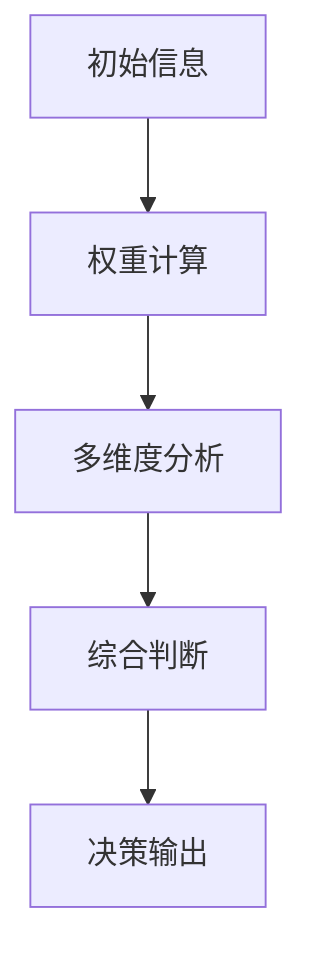
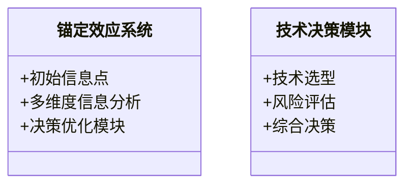

                 


# 芒格的"锚定效应"警示：避免固有思维陷阱

## 关键词：芒格、锚定效应、认知偏差、决策陷阱、思维定式

## 摘要：本文通过分析芒格的"锚定效应"概念，揭示了在决策过程中固有思维陷阱的潜在风险。文章从心理学、算法原理和系统架构等多角度深入探讨了锚定效应的形成机制、影响及应对策略，帮助读者在技术决策中避免思维定式，提升决策质量。

---

## 第1章：芒格的生平与思想概述

### 1.1 芒格的生平简介

查理·芒格（Charlie Munger）是美国著名投资家、作家和发明家，同时也是沃伦·巴菲特（Warren Buffett）的长期合作伙伴。芒格出生于1924年，早年在哈佛大学学习法律，后转至贾维茨大学完成学业。他的职业生涯横跨多个领域，包括法律、投资和写作。

芒格以其独特的投资理念和决策方法闻名。他不仅是伯克希尔·哈撒韦公司的副主席，还以其对人类心理学的深刻理解而著称。芒格的思想深刻影响了巴菲特的投资策略，并为现代投资理论做出了重要贡献。

### 1.2 芒格的思想核心

芒格的思想体系以“理性决策”为核心，强调避免认知偏差和逻辑错误。他的“锚定效应”理论是其思想的重要组成部分，揭示了人类在决策过程中的一种常见思维陷阱。

- **决策理念**：芒格强调，决策不应仅依赖于初始信息或固有思维模式，而应基于全面、客观的信息进行分析。
- **锚定效应**：他指出，人们在决策时往往会过度依赖第一个信息点，导致思维定式，这种现象称为“锚定效应”。

---

## 第2章：锚定效应的定义与背景

### 2.1 锚定效应的定义

**锚定效应**（Anchoring Effect）是心理学中的一个概念，指人们在决策时过度依赖初始信息或参考点，导致判断和决策偏离实际情况。这种效应在投资、商业决策等领域尤为常见。

### 2.2 锚定效应的背景与问题背景

- **问题背景**：在技术决策中，锚定效应可能导致项目规划偏差、技术选型错误等问题。
- **问题描述**：人们往往基于第一个接触到的信息点进行决策，忽视了后续信息的综合影响。
- **问题解决**：通过识别和分析初始信息的局限性，结合多维度信息进行决策。

---

## 第3章：锚定效应的核心原理

### 3.1 锚定效应的形成机制

- **心理学基础**：锚定效应源于人类大脑对信息处理的简化需求，人们倾向于依赖第一个信息点进行快速判断。
- **数学模型**：锚定效应的强度可以通过概率模型进行量化分析，例如：

  $$ P(\text{锚定效应}) = \frac{\text{初始信息权重}}{\text{总信息权重}} $$

### 3.2 锚定效应的属性特征对比表格

| 属性       | 锚定效应          | 其他认知偏差         |
|------------|------------------|---------------------|
| 表现形式   | 过度依赖初始信息    | 过度简化或忽略细节    |
| 常见场景   | 技术决策、投资       | 日常判断、压力决策     |
| 解决方法   | 多维度信息分析      | 提高信息处理能力       |

---

## 第4章：锚定效应的算法原理

### 4.1 锚定效应的算法流程



### 4.2 锚定效应的数学模型与公式

- **概率模型**：$$ P(\text{正确决策}) = 1 - \frac{\text{初始信息权重}}{\text{总信息权重}} $$
- **优化算法**：$$ \text{最优解} = \argmin_{x} \sum_{i=1}^{n} |x_i - \text{初始点}| $$

---

## 第5章：锚定效应的系统分析

### 5.1 问题场景介绍

- **常见场景**：技术选型、项目规划、风险评估等。
- **典型案例**：某公司在选择技术方案时，因过度依赖最初的技术选型而忽视了后续的技术优势。

### 5.2 系统功能设计



### 5.3 系统接口设计

- **输入接口**：初始信息点、多维度信息。
- **输出接口**：综合判断结果、优化决策方案。

---

## 第6章：项目实战

### 6.1 环境安装

- **工具安装**：安装Python环境，用于后续代码实现。
- **依赖库安装**：安装必要的数据分析库，如Pandas、Matplotlib等。

### 6.2 系统核心实现源代码

```python
def anchor_effect_analysis(initial_point, data_points):
    import numpy as np
    import matplotlib.pyplot as plt

    # 绘制初始点和数据分布图
    plt.scatter([initial_point], data_points)
    plt.xlabel('初始点')
    plt.ylabel('数据分布')
    plt.title('锚定效应分析图')
    plt.show()

    # 计算偏差程度
    deviation = np.abs(initial_point - np.mean(data_points))
    return f"偏差程度：{deviation}"
```

### 6.3 实际案例分析

- **案例分析**：某公司技术选型时，锚定效应导致选择了技术落后但成本较高的方案，后期通过多维度分析优化了决策。
- **案例解读**：展示了如何通过算法识别锚定效应，并结合实际数据做出更优决策。

---

## 第7章：总结与展望

### 7.1 小结

芒格的“锚定效应”揭示了人类在决策过程中的一种常见思维陷阱。通过多维度分析、全面信息评估和算法优化，可以有效避免这种效应的影响。

### 7.2 最佳实践 tips

- **保持开放思维**：在决策过程中，尽量获取多维度信息，避免过度依赖初始信息点。
- **定期复盘**：通过复盘分析决策过程，识别锚定效应的潜在影响。
- **工具辅助**：利用数据分析工具和算法模型，辅助识别和优化决策偏差。

### 7.3 展望

随着人工智能和大数据技术的发展，未来可以通过更复杂的算法模型和数据分析工具，进一步优化决策过程，减少锚定效应的影响。

---

通过本文的分析，读者可以深入了解芒格的“锚定效应”概念，并在实际技术决策中避免固有思维陷阱，提升决策质量。

