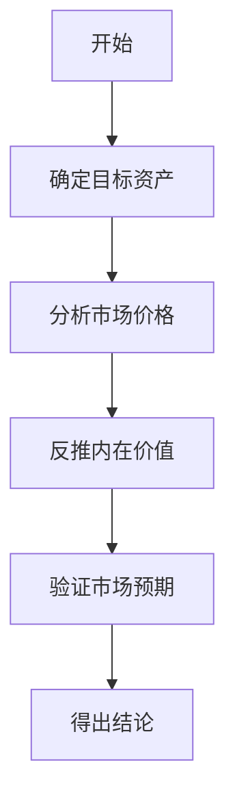

                 


```markdown
# 芒格的"颠倒思考"在投资分析中的应用

## 关键词：芒格、颠倒思考、投资分析、逆向思维、价值评估、数学模型

## 摘要：  
芒格的“颠倒思考”是一种以结果为导向的逆向思维方式，在投资分析中具有独特的优势。本文将从芒格的投资哲学出发，详细探讨“颠倒思考”的核心概念、数学模型、系统架构以及实际应用，结合具体案例，为投资者提供一种全新的分析框架。

---

# 第一部分: 引言

## 第1章: 芒格及其投资哲学

### 1.1 芒格的生平简介  
查理·芒格（Charlie Munger）是世界著名投资者、伯克希尔哈撒韦公司的副主席，被誉为“巴菲特的智囊”。他不仅是一位成功的投资者，更是一位深邃的思想家，提出了许多影响投资领域的理论，其中“颠倒思考”是其最具代表性的思想之一。

### 1.2 “颠倒思考”的核心理念  
“颠倒思考”是一种从结果出发，逆向推导原因的思维方式。它不同于传统的从原因到结果的正向思维，而是通过分析结果，反推可能的原因，从而找到问题的本质。这种思维方式在投资分析中尤为重要，因为市场往往充满不确定性，而“颠倒思考”可以帮助投资者在混乱中找到清晰的方向。

### 1.3 本文的研究目的与意义  
本文旨在通过分析芒格的“颠倒思考”理论，探讨其在投资分析中的应用，并结合实际案例，为投资者提供一种新的分析工具。通过这种逆向思维方式，投资者可以更好地理解市场、评估企业价值，并做出更明智的投资决策。

---

# 第二部分: “颠倒思考”的理论基础与数学模型

## 第2章: “颠倒思考”的核心概念与理论基础

### 2.1 “颠倒思考”的核心概念  
- **逆向思维**：从结果出发，反向推导原因。  
- **因果关系**：强调因果关系的非对称性，即原因导致结果，但结果并不一定能完全反映原因。  
- **逻辑框架**：通过分析结果，寻找可能的原因，并验证这些原因的合理性。

### 2.2 理论基础  
- **经济学基础**：价值与市场的关系。资产的内在价值是其未来现金流的折现值，而市场价格是市场参与者对这种价值的主观定价。  
- **心理学基础**：行为偏差与决策错误。投资者的行为往往受到心理偏差的影响，而“颠倒思考”可以帮助投资者克服这些偏差。  
- **投资学基础**：资产定价与市场预期。通过分析市场价格，反向推导市场对资产未来现金流的预期。

### 2.3 “颠倒思考”与传统投资分析的对比  
- **传统分析方法**：从公司基本面出发，分析其盈利能力、财务状况等，预测其未来股价走势。  
- **“颠倒思考”**：从市场价格出发，反推市场对公司的估值，进而分析公司的内在价值。  
- **对比与互补**：传统方法注重公司的内在价值，而“颠倒思考”注重市场价格与内在价值的对比，两者结合可以更全面地分析投资标的。

## 第3章: “颠倒思考”的数学模型与算法原理

### 3.1 数学模型  
“颠倒思考”的核心是通过分析市场价格，反推公司的内在价值。其数学模型可以表示为：  
$$ V = \frac{CF}{(1 + r)^n} $$  
其中，\( V \) 表示资产的内在价值，\( CF \) 表示未来现金流，\( r \) 表示折现率，\( n \) 表示现金流的持续年限。

### 3.2 算法原理  
- **步骤1：确定目标资产的市场价格**  
- **步骤2：分析市场价格反映的市场预期**  
- **步骤3：反向推导资产的内在价值**  
- **步骤4：验证内在价值与市场价格的关系**  

### 3.3 逆向思维的逻辑流程图（mermaid）



---

# 第三部分: 系统分析与架构设计

## 第4章: 系统分析与架构设计

### 4.1 系统功能设计  
- **功能模块1：市场价格分析模块**  
  - 输入：资产的市场价格  
  - 输出：市场价格反映的市场预期  
- **功能模块2：内在价值计算模块**  
  - 输入：未来现金流、折现率、年限  
  - 输出：资产的内在价值  

### 4.2 系统架构设计（mermaid）


### 4.3 系统交互设计（mermaid）


---

# 第四部分: 项目实战

## 第5章: 项目实战

### 5.1 环境安装  
- **工具**：Python、Jupyter Notebook  
- **库**：pandas、numpy、matplotlib  

### 5.2 核心代码实现  

```python
import pandas as pd
import numpy as np

def calculate_intrinsic_value(cash_flows, discount_rate, years):
    return sum(cash_flows[i] / (1 + discount_rate) ** i for i in range(years))

# 示例数据
cash_flows = [100, 150, 200, 250]
discount_rate = 0.1
years = 4

iv = calculate_intrinsic_value(cash_flows, discount_rate, years)
print(f"内在价值：{iv}")
```

### 5.3 案例分析：以苹果公司为例  
- **背景**：假设苹果公司的市场价格为 $150，市场预期其未来4年的现金流分别为 $100、$150、$200、$250，折现率为10%。  
- **计算内在价值**：  
  $$ V = \frac{100}{1.1^1} + \frac{150}{1.1^2} + \frac{200}{1.1^3} + \frac{250}{1.1^4} $$  
  计算结果为：$462.32  
- **结论**：如果市场价格低于内在价值，说明资产被低估，值得投资；如果市场价格高于内在价值，说明资产被高估，应避免投资。

---

# 第五部分: 总结与展望

## 第6章: 总结

### 6.1 核心内容回顾  
- “颠倒思考”是一种从结果出发，反向推导原因的思维方式。  
- 其数学模型可以帮助投资者评估资产的内在价值，并与市场价格进行对比，做出投资决策。  

### 6.2 最佳实践 tips  
- 在实际投资中，结合“颠倒思考”与传统分析方法，可以更全面地评估资产的价值。  
- 需要注意市场预期的不确定性，以及心理偏差对投资决策的影响。  

### 6.3 项目小结  
通过本文的分析与实战，读者可以掌握“颠倒思考”的核心思想，并将其应用于实际投资分析中，提升投资决策的科学性和准确性。

## 第7章: 注意事项与拓展阅读

### 7.1 注意事项  
- “颠倒思考”是一种辅助工具，而非万能公式，需要结合实际情况灵活运用。  
- 投资者应关注市场环境的变化，及时调整分析策略。  

### 7.2 拓展阅读  
- 《聪明的投资者》——巴菲特的经典投资著作。  
- 《逆向思维》——深入探讨逆向思维在各个领域的应用。  

---

# 结语

芒格的“颠倒思考”为我们提供了一种全新的投资分析方法，通过从结果出发，反向推导原因，帮助投资者在复杂多变的市场中找到清晰的方向。希望本文能够为投资者提供有价值的参考，帮助他们在投资领域取得更大的成功。
```

