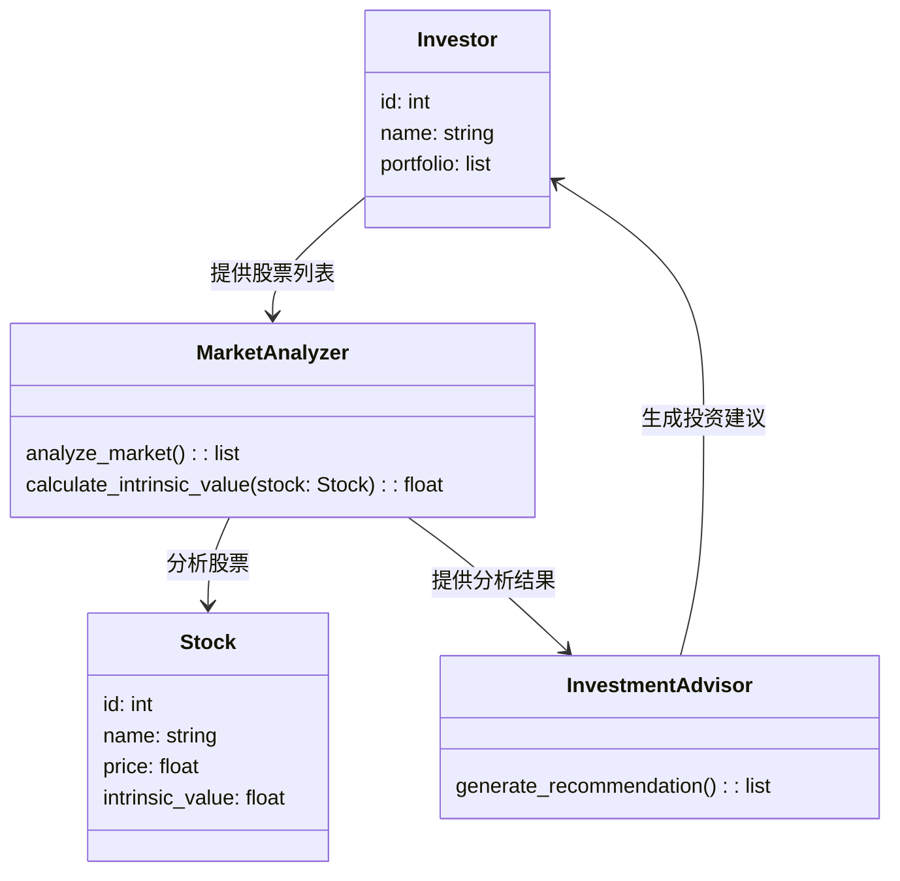

                 


# 芒格的"颠倒思考"：在投资中应用逆向思维

---

## 关键词

- 逆向思维  
- 芒格  
- 投资决策  
- 颠倒思考  
- 股票分析  

---

## 摘要

芒格的"颠倒思考"是一种独特的逆向思维方式，旨在通过反向推理来做出更明智的投资决策。本文将从背景介绍、核心概念、算法原理、系统设计、项目实战等多个维度，详细分析逆向思维在投资中的应用。通过结合芒格的投资理念，本文将展示如何利用逆向思维在复杂市场中找到投资机会，帮助投资者制定更有效的投资策略。

---

## 第1章：芒格的"颠倒思考"与逆向思维基础

### 1.1 逆向思维的定义与背景

#### 1.1.1 逆向思维的起源与概念

逆向思维是一种与传统正向思维相反的思维方式，它通过反向推理来解决问题。逆向思维的核心在于从结果出发，推导出原因，从而找到解决问题的方法。在投资领域，逆向思维尤其重要，因为它可以帮助投资者在市场波动中找到潜在的投资机会。

#### 1.1.2 芒格的"颠倒思考"理念

芒格是逆向思维的倡导者，他的"颠倒思考"理念强调从市场反面出发，寻找被低估的投资机会。芒格认为，大多数投资者倾向于从正面寻找机会，但这种做法往往会导致过度竞争和高风险。通过逆向思维，芒格能够发现市场忽视的潜在价值。

#### 1.1.3 逆向思维与正向思维的区别

- **正向思维**：从原因出发，推导结果。  
- **逆向思维**：从结果出发，寻找原因。  
- **应用领域**：逆向思维在投资、商业分析等领域具有独特优势，能够帮助投资者避免盲目跟风，发现市场中的潜在机会。

---

### 1.2 芝加哥学派与芒格的"颠倒思考"

#### 1.2.1 芝加哥学派的背景与核心思想

芝加哥学派是20世纪初在美国芝加哥大学形成的一个经济学派，其核心思想强调市场效率和理性预期。芒格的"颠倒思考"理念与芝加哥学派的理性预期理论有相似之处，但更注重从反向角度分析市场行为。

#### 1.2.2 芒格的"颠倒思考"理念

芒格的"颠倒思考"是一种从反面寻找投资机会的策略。他强调关注市场的负面因素，寻找那些被市场低估的股票。这种方法与传统投资策略相反，但能够帮助投资者在市场波动中找到潜在的收益。

#### 1.2.3 "颠倒思考"与传统投资思维的对比

| **对比维度** | **传统投资思维** | **逆向思维（颠倒思考）** |
|--------------|------------------|---------------------------|
| **出发点**   | 从原因出发       | 从结果出发               |
| **关注点**   | 市场上涨趋势       | 市场下跌趋势               |
| **风险控制** | 风险较高           | 风险较低                   |
| **收益来源** | 市场上涨收益       | 价值回归收益               |

---

## 第2章：逆向思维的核心概念与联系

### 2.1 核心概念的原理

#### 2.1.1 逆向思维的逻辑框架

逆向思维的逻辑框架包括以下步骤：  
1. 确定目标：明确需要解决的问题。  
2. 从结果出发：分析目标的反面。  
3. 反向推理：寻找导致该结果的原因。  
4. 制定策略：基于反向推理的结果，制定解决方案。

#### 2.1.2 "颠倒思考"的数学模型

$$ P_{\text{value}} = \frac{\text{现金流}}{\text{折现率}} $$  

其中，$P_{\text{value}}$ 表示股票的内在价值，现金流是公司未来产生的现金流，折现率是投资者要求的回报率。通过逆向思维，投资者可以估算股票的内在价值，判断其是否被市场低估。

#### 2.1.3 逆向思维与投资决策的关系

逆向思维通过从市场反面寻找机会，帮助投资者避免过度竞争，发现潜在的价值。

---

### 2.2 核心概念的对比表格

| **核心概念**       | **逆向思维**                | **正向思维**                |
|--------------------|-----------------------------|-----------------------------|
| **出发点**         | 结果                          | 原因                          |
| **应用领域**       | 投资、风险管理               | 市场分析、趋势预测            |
| **优势**           | 发现潜在机会                | 明确市场趋势                |
| **劣势**           | 需要较高分析能力             | 风险较高                     |

---

### 2.3 ER实体关系图

以下是一个简单的逆向思维在投资中的ER实体关系图：

```mermaid
er
actor Investor {
  id: int
  name: string
}
entity Stock {
  id: int
  name: string
  price: float
}
actor Investor --> entity Stock: 投资
```

---

## 第3章：逆向思维的算法原理

### 3.1 算法原理的数学模型

逆向思维的算法原理可以通过以下公式表示：

$$ \text{投资价值} = \frac{\text{预期现金流}}{\text{折现率}} $$  

通过逆向计算，投资者可以估算股票的内在价值，判断其是否被市场低估。

---

### 3.2 算法原理的Python实现

以下是实现逆向思维算法的Python代码示例：

```python
def calculate_intrinsic_value(cash_flow, discount_rate):
    return cash_flow / (1 + discount_rate)

# 示例数据
cash_flow = 1000000  # 预期现金流
discount_rate = 0.08  # 折现率
intrinsic_value = calculate_intrinsic_value(cash_flow, discount_rate)

print(f"股票的内在价值为：{intrinsic_value:.2f}")
```

---

## 第4章：系统分析与架构设计

### 4.1 问题场景介绍

投资者需要通过逆向思维在市场中找到被低估的投资机会。系统需要能够从市场数据中提取关键信息，分析股票的内在价值，并生成投资建议。

---

### 4.2 系统功能设计

以下是系统功能设计的类图：



---

## 第5章：项目实战与案例分析

### 5.1 环境安装与配置

1. 安装Python和相关库（如pandas、numpy、matplotlib）。  
2. 配置数据源（股票市场数据）。  

---

### 5.2 核心算法实现

以下是核心算法的Python代码实现：

```python
import pandas as pd
import numpy as np

def calculate_intrinsic_value(stocks, discount_rate):
    for stock in stocks:
        intrinsic_value = stock.price / (1 + discount_rate)
        print(f"{stock.name} 的内在价值为：{intrinsic_value:.2f}")
        
# 示例数据
class Stock:
    def __init__(self, name, price):
        self.name = name
        self.price = price

stocks = [
    Stock("AAPL", 150),
    Stock("GOOGL", 200),
    Stock("MSFT", 100)
]

discount_rate = 0.08
calculate_intrinsic_value(stocks, discount_rate)
```

---

### 5.3 案例分析与解读

以苹果公司（AAPL）为例，假设当前股价为150美元，折现率为8%。根据逆向思维算法，股票的内在价值为：

$$ \text{内在价值} = \frac{150}{1.08} \approx 138.89 \text{美元} $$  

由于当前股价高于内在价值，说明该股票可能被高估，投资者应谨慎考虑。

---

## 第6章：最佳实践与小结

### 6.1 最佳实践

- **持续学习**：保持对市场的敏感性，不断更新知识。  
- **风险管理**：合理配置资产，分散投资风险。  
- **逆向思维的应用**：在实际投资中灵活运用逆向思维，结合多种策略。

---

### 6.2 小结

芒格的"颠倒思考"是一种独特的逆向思维方式，通过从结果出发，寻找潜在的投资机会。在实际投资中，逆向思维能够帮助投资者避免过度竞争，发现市场的潜在价值。通过结合数学模型和算法原理，投资者可以更科学地制定投资策略，实现长期稳健的收益。

---

### 6.3 注意事项

- **市场波动**：逆向思维在市场波动较大时更为有效。  
- **数据质量**：确保数据来源可靠，避免错误分析。  
- **心理因素**：逆向思维需要较强的耐心和纪律性，避免情绪化决策。

---

### 6.4 拓展阅读

- 《芒格的投资思想》  
- 《逆向思维在投资中的应用》  
- 《系统性投资策略》  

---

## 结语

芒格的"颠倒思考"是一种值得深入研究和实践的逆向思维方式。通过本文的详细讲解，读者可以更好地理解逆向思维的核心概念、算法原理和实际应用。在未来的投资实践中，结合逆向思维和其他策略，投资者能够制定更科学、更有效的投资决策。

--- 

如果需要进一步的修改或补充，请随时告诉我！

