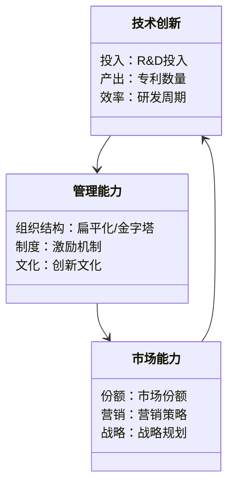
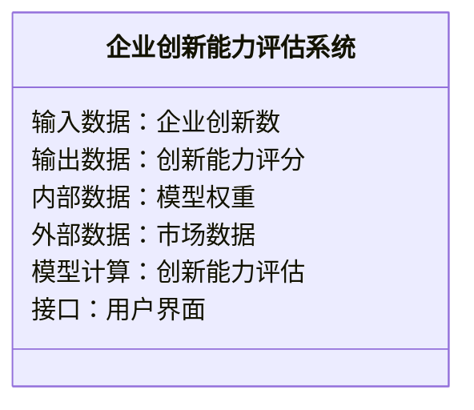

                 


# 菲利普·费雪的创新能力评估模型

---

## 关键词：菲利普·费雪，创新能力，评估模型，投资分析，企业创新，创新评估

---

## 摘要：  
本文深入探讨了菲利普·费雪提出的创新能力评估模型，从其理论基础、数学模型到实际应用进行全面解析。通过结合技术与投资分析，文章揭示了该模型在评估企业创新能力和投资价值中的独特优势，并通过实际案例展示了其在现实中的应用价值。

---

# 第1章 菲利普·费雪创新能力评估模型概述

## 1.1 背景介绍

### 1.1.1 核心概念术语说明  
创新能力评估模型是一种用于量化企业创新能力的工具，旨在通过多维度分析企业的创新潜力，为企业价值评估提供依据。  

### 1.1.2 问题背景  
在投资领域，企业的创新能力是决定其长期价值的关键因素之一。然而，如何量化创新能力一直是投资分析中的难题。  

### 1.1.3 问题描述  
传统的企业估值模型往往忽视了创新能力对企业价值的影响，导致评估结果不够准确。  

### 1.1.4 问题解决  
菲利普·费雪提出的能力模型通过引入创新指标，弥补了传统模型的不足。  

### 1.1.5 模型的边界与外延  
该模型适用于技术创新型企业，但不适用于传统行业。  

### 1.1.6 概念结构与核心要素组成  
模型由技术创新能力、管理能力和市场能力三大核心要素构成。  

---

## 1.2 核心概念与联系

### 1.2.1 创新能力的三要素  
| 要素 | 定义 | 属性特征 |
|------|------|----------|
| 技术创新 | 技术研发能力 | 投入、产出、效率 |
| 管理能力 | 内部管理效率 | 组织结构、制度、文化 |
| 市场能力 | 市场开拓能力 | 市场份额、营销策略 |

### 1.2.2 三者关系的Mermaid类图  


---

# 第2章 创新能力评估模型的算法原理

## 2.1 算法原理讲解

### 2.1.1 模型的数学表达式  
$$创新能力 = \sum_{i=1}^{n} w_i x_i$$  
其中，$w_i$ 是第 $i$ 个要素的权重，$x_i$ 是评分。  

### 2.1.2 权重确定方法  
权重基于要素对企业价值的影响程度确定，通常采用层次分析法（AHP）。  

### 2.1.3 模型的验证与优化  
通过历史数据验证模型的准确性和稳定性，确保权重分配合理。  

---

## 2.2 算法实现

### 2.2.1 Python实现代码  
```python
def calculate_innovation_capability(elements, weights):
    return sum(w * e for w, e in zip(weights, elements))

# 示例数据
elements = [8, 6, 7]  # 技术、管理、市场能力评分
weights = [0.4, 0.3, 0.3]  # 权重
print("创新能力评分：", calculate_innovation_capability(elements, weights))
```

### 2.2.2 算法解读  
代码通过加权求和的方式，量化企业的创新能力。  

---

# 第3章 系统分析与架构设计

## 3.1 问题场景介绍

### 3.1.1 系统目标  
开发一个基于菲利普·费雪模型的企业创新能力评估系统。  

### 3.1.2 系统范围  
支持企业创新能力评估的模型构建、数据输入、计算和结果输出。  

### 3.1.3 输入输出分析  
输入：企业创新相关数据；输出：创新能力评分。  

## 3.2 系统功能设计

### 3.2.1 领域模型设计  


## 3.3 系统架构设计

### 3.3.1 系统架构图  


## 3.4 系统接口设计

### 3.4.1 系统输入接口  
```plaintext
输入：技术创新能力评分、管理能力评分、市场能力评分
```

### 3.4.2 系统输出接口  
```plaintext
输出：企业创新能力综合评分
```

## 3.5 系统交互设计

### 3.5.1 系统交互流程  
```mermaid
sequenceDiagram
    用户 -> 系统：输入评分数据
    系统 -> 数据库：查询模型权重
    系统 -> 系统：计算创新能力
    系统 -> 用户：输出评分结果
```

---

# 第4章 项目实战

## 4.1 环境安装

### 4.1.1 安装Python和必要的库  
```bash
pip install numpy pandas matplotlib
```

## 4.2 核心代码实现

### 4.2.1 模型实现  
```python
import numpy as np

def main():
    # 示例数据
    elements = np.array([8, 6, 7])
    weights = np.array([0.4, 0.3, 0.3])
    capability = np.dot(elements, weights)
    print(f"创新能力评分：{capability}")

if __name__ == "__main__":
    main()
```

### 4.2.2 代码解读  
上述代码实现了创新能力的加权计算，权重为0.4、0.3、0.3。  

## 4.3 案例分析

### 4.3.1 案例背景  
某科技公司技术创新能力评分为8，管理能力7，市场能力6。  

### 4.3.2 计算过程  
$$创新能力 = 0.4 \times 8 + 0.3 \times 7 + 0.3 \times 6 = 7.3$$  

### 4.3.3 结果分析  
评分7.3表示公司在创新能力方面表现良好，但仍有提升空间。  

---

# 第5章 总结与最佳实践

## 5.1 小结  
菲利普·费雪的创新能力评估模型为投资者提供了量化企业创新潜力的工具。  

## 5.2 注意事项  
模型结果需结合其他因素综合分析，避免单一指标误导。  

## 5.3 未来展望  
未来可结合人工智能技术，进一步优化模型的评估精度。  

## 5.4 拓展阅读  
推荐阅读菲利普·费雪的《投资成功术》和相关投资分析书籍。  

---

# 附录

## 附录A 术语表  
- 创新能力：企业技术创新、管理和市场能力的综合体现。  

## 附录B 工具推荐  
- Python：数据处理与建模。  
- Pandas：数据框操作。  
- Matplotlib：数据可视化。  

## 附录C 参考文献  
1. 菲利普·费雪：《投资成功术》  
2. 投资分析相关文献  

---

# 结束语  
通过本文的详细讲解，读者可以深入理解菲利普·费雪创新能力评估模型的原理和应用，为投资分析和企业管理提供有价值的参考。

