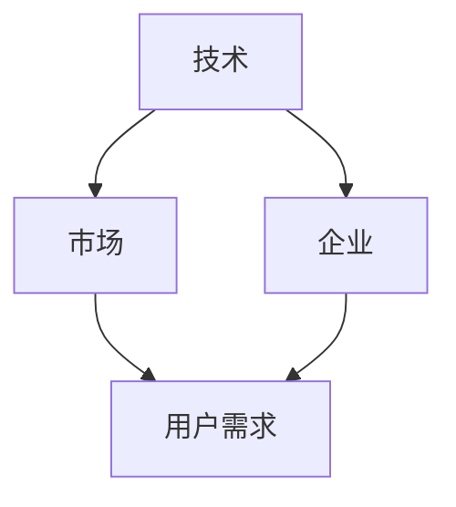
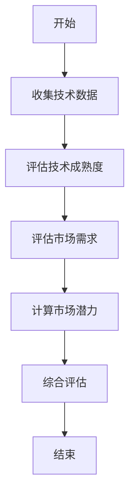

                 


# 菲利普·费雪的技术创新评估方法

## 关键词：
技术创新评估，菲利普·费雪，技术成熟度，市场潜力，投资回报

## 摘要：
本文详细探讨菲利普·费雪的技术创新评估方法，结合实际案例，分析技术成熟度、市场需求、投资回报等关键因素，帮助读者掌握技术创新评估的核心原理和应用方法。

---

# 菲利普·费雪的技术创新评估方法

## 第一部分：技术创新评估的背景与核心概念

### 第1章：技术创新评估的背景与问题背景

#### 1.1 技术创新的定义与重要性
- **技术创新的定义**：技术创新是指引入新的技术或改进现有技术，以提高产品或服务的性能、质量和效率。
- **技术创新的重要性**：在现代经济中，技术创新是企业竞争优势的核心来源，能够推动经济增长和社会进步。
- **技术创新与企业竞争力的关系**：技术创新不仅提升企业自身的竞争力，还能为客户创造更大的价值。

#### 1.2 技术创新评估的必要性
- **技术创新评估的目的**：通过评估技术创新的可行性和潜在价值，帮助企业做出科学的投资决策。
- **技术创新评估的边界与外延**：评估不仅关注技术本身，还考虑市场、用户需求和竞争环境等多个因素。
- **技术创新评估的核心要素**：技术成熟度、市场需求、投资回报率、竞争环境等。

#### 1.3 技术创新评估的现状与挑战
- **当前技术创新评估的主要方法**：包括定性分析和定量分析，常用的方法有技术评估矩阵、SWOT分析等。
- **技术创新评估中的常见问题**：数据收集困难、评估指标的选择、技术与市场的匹配度等。
- **技术创新评估的未来发展趋势**：结合人工智能和大数据分析，构建更加智能化的评估体系。

---

## 第二部分：技术创新评估的核心概念与联系

### 第2章：技术创新评估的核心概念

#### 2.1 技术创新评估的核心原理
- **技术创新评估的基本原理**：通过分析技术的可行性和市场的潜力，评估其商业价值。
- **技术创新评估的关键因素**：技术成熟度、市场需求、竞争环境、投资回报率等。
- **技术创新评估的数学模型**：通过数学公式量化技术的综合价值。

#### 2.2 技术创新评估的核心概念对比
- **技术创新与市场需求的关系**：技术创新需要满足市场需求，才能实现商业价值。
- **技术成熟度与市场潜力的对比**：技术成熟度高的技术更容易被市场接受，但市场潜力大的技术可能需要更长时间的培养。
- **技术创新与投资回报的关联**：技术创新的成功往往伴随着较高的投资回报，但失败的风险也较高。

#### 2.3 技术创新评估的ER实体关系图



---

## 第三部分：技术创新评估的算法原理

### 第3章：技术创新评估的数学模型与公式

#### 3.1 技术创新评估的数学模型
- **技术成熟度指数公式**
  $$TMI = \frac{M + C}{2}$$
  其中，M为技术成熟度，C为技术可行性。
- **市场潜力评估公式**
  $$MPI = \frac{D \times P}{2}$$
  其中，D为市场容量，P为技术渗透率。
- **综合评估公式**
  $$CEI = \alpha \times TMI + (1-\alpha) \times MPI$$
  其中，α为权重系数，取值范围在0到1之间。

#### 3.2 技术创新评估的算法实现

```python
# 技术成熟度和市场潜力评估函数
def calculate_TMI(maturity, feasibility):
    return (maturity + feasibility) / 2

def calculate_MPI(market_size, penetration_rate):
    return (market_size * penetration_rate) / 2

# 综合评估指数计算函数
def calculate_CEI(TMI, MPI, alpha=0.5):
    return alpha * TMI + (1 - alpha) * MPI

# 示例计算
maturity = 0.8
feasibility = 0.7
market_size = 1000
penetration_rate = 0.3

TMI = calculate_TMI(maturity, feasibility)
MPI = calculate_MPI(market_size, penetration_rate)
CEI = calculate_CEI(TMI, MPI)

print(f"技术成熟度指数 (TMI): {TMI}")
print(f"市场潜力指数 (MPI): {MPI}")
print(f"综合评估指数 (CEI): {CEI}")
```

#### 3.3 技术创新评估的流程图



---

## 第四部分：技术创新评估的系统架构设计

### 第4章：技术创新评估的系统分析与架构

#### 4.1 系统功能设计
- **技术数据输入模块**：收集技术相关数据，包括技术成熟度、市场需求等。
- **评估模型模块**：实现技术创新评估的数学模型，计算TMI、MPI和CEI。
- **结果展示模块**：将评估结果以可视化形式展示，便于用户理解和决策。

#### 4.2 系统架构设计


#### 4.3 系统接口设计
- **输入接口**：接收技术数据和评估参数。
- **输出接口**：展示评估结果，包括TMI、MPI和CEI。

---

## 第五部分：技术创新评估的项目实战

### 第5章：技术创新评估的项目实战

#### 5.1 环境安装
- **安装Python和相关库**：numpy、pandas、scikit-learn等。
- **安装Mermaid工具**：用于绘制流程图和架构图。

#### 5.2 核心代码实现

```python
import numpy as np
import pandas as pd

# 示例数据
technologies = ['AI', '5G', '区块链']
maturity = [0.8, 0.7, 0.6]
feasibility = [0.7, 0.8, 0.5]
market_size = [1000, 2000, 1500]
penetration_rate = [0.3, 0.2, 0.4]

# 计算TMI、MPI和CEI
TMI = np.array([calculate_TMI(m, f) for m, f in zip(maturity, feasibility)])
MPI = np.array([calculate_MPI(ms, pr) for ms, pr in zip(market_size, penetration_rate)])
CEI = np.array([calculate_CEI(t, m, alpha=0.5) for t, m in zip(TMI, MPI)])

# 存储结果
results = pd.DataFrame({
    '技术': technologies,
    '技术成熟度指数 (TMI)': TMI,
    '市场潜力指数 (MPI)': MPI,
    '综合评估指数 (CEI)': CEI
})

print(results)
```

#### 5.3 案例分析
- **案例：AI技术的评估**
  - TMI：0.75
  - MPI：0.3
  - CEI：0.525
  - 结论：AI技术具有较高的市场潜力，但需要进一步提升技术成熟度。

---

## 第六部分：技术创新评估的最佳实践与小结

### 第6章：技术创新评估的最佳实践

#### 6.1 小结
- 技术创新评估是企业投资决策的重要工具，能够帮助企业在技术创新中找到高价值的机会。
- 通过数学模型和系统架构的设计，可以提高评估的准确性和效率。

#### 6.2 注意事项
- 确保数据的准确性和完整性。
- 根据实际情况调整评估模型的参数和权重。
- 定期更新评估模型，以适应技术和市场的变化。

#### 6.3 拓展阅读
- 菲利普·费雪的其他投资理论。
- 大数据分析在技术创新评估中的应用。
- 人工智能在技术创新评估中的潜在应用。

---

通过以上步骤，您可以系统地掌握菲利普·费雪的技术创新评估方法，并在实际项目中灵活应用。

