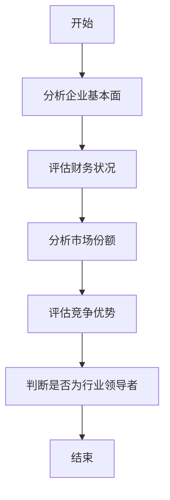

                 


# 菲利普·费雪的行业领导者识别技巧

## 关键词：菲利普·费雪、行业领导者、投资技巧、选股标准、成长股、财务分析

## 摘要：菲利普·费雪是投资界的重要人物，他提出了“成长股”投资理念，并总结出一套识别行业领导者的技巧。本文从背景介绍、核心概念、算法原理、数学模型、系统分析和项目实战等多个方面，详细讲解菲利普·费雪的行业领导者识别技巧，帮助投资者更好地理解和应用这些方法。

---

## 第一部分：背景介绍

### 第1章：问题背景与定义

#### 1.1 什么是行业领导者
行业领导者是指在特定行业中占据主导地位，具有强大的市场影响力、竞争优势和持续增长能力的企业。这类企业通常在行业内拥有较高的市场份额、品牌影响力和盈利能力。

#### 1.2 行业领导者的核心特征
- 市场占有率高
- 具备强大的竞争优势
- 具有持续增长的潜力
- 具备优秀的管理团队
- 具有良好的财务状况

#### 1.3 菲利普·费雪的行业领导者识别方法
菲利普·费雪认为，行业领导者不仅仅是市场份额的领导者，更是能够在行业中持续创新和增长的企业。他提出了以下几点识别方法：
1. 寻找具有强大竞争优势的企业
2. 分析企业的成长性和盈利能力
3. 评估企业的管理团队和企业文化
4. 关注企业的市场份额和行业地位

### 第2章：菲利普·费雪的投资理念

#### 2.1 菲利普·费雪的成长股投资策略
菲利普·费雪主张投资那些具有持续增长潜力的成长股，而不是仅仅关注于低市盈率的股票。他认为，成长股的投资回报主要来自于企业的持续增长，而不是短期的价格波动。

#### 2.2 行业领导者在投资中的重要性
行业领导者通常具有较高的市场地位和竞争优势，能够在行业中持续增长，并为投资者带来稳定的回报。因此，识别行业领导者是投资成功的关键。

#### 2.3 菲利普·费雪的成功案例分析
菲利普·费雪通过投资英特尔等成长股企业，取得了巨大的成功。他的投资理念证明了行业领导者识别技巧的有效性。

---

## 第二部分：核心概念与联系

### 第3章：行业领导者的核心概念与联系

#### 3.1 核心概念原理
行业领导者的核心概念包括市场地位、竞争优势、增长潜力和管理能力。这些因素共同构成了企业的领导地位。

#### 3.2 核心概念对比分析
| 特征          | 行业领导者       | 行业跟随者     |
|---------------|------------------|----------------|
| 市场份额       | 高               | 低             |
| 竞争优势      | 强               | 弱             |
| 增长潜力      | 大               | 小             |
| 管理团队       | 优秀             | 一般           |

#### 3.3 ER实体关系图
```mermaid
erDiagram
    customer[顾客] 
    company[公司] 
    market[市场] 
    competitor[竞争对手] 
    investor[投资者] 
    customer -|< relationship >- company
    company -|< operates >- market
    company -- competes-with --> competitor
    investor -- invests-in --> company
```

---

## 第三部分：算法原理

### 第4章：菲利普·费雪行业领导者识别的算法原理

#### 4.1 算法原理概述
菲利普·费雪的行业领导者识别算法主要基于对企业基本面的分析，包括财务指标、市场份额、竞争优势等多个方面。

#### 4.2 算法流程图


---

## 第四部分：数学模型与公式

### 第5章：数学模型与公式

#### 5.1 净利润公式
$$净利润 = 营业收入 - 营业成本 - 费用$$

#### 5.2 净资产收益率公式
$$ROE = \frac{净利润}{平均股东权益}$$

#### 5.3 资产回报率公式
$$ROA = \frac{净利润}{平均总资产}$$

---

## 第五部分：系统分析与架构设计方案

### 第6章：系统分析与架构设计方案

#### 6.1 问题场景介绍
- 投资者需要快速识别行业领导者
- 系统目标：开发一个能够自动识别行业领导者的工具

#### 6.2 系统功能设计
- 领域模型：企业、市场、投资者
- 系统架构：基于云计算的分布式系统
- 接口设计：API接口用于数据获取和分析

#### 6.3 系统架构图


---

## 第六部分：项目实战

### 第7章：项目实战

#### 7.1 环境安装
- 安装Python和相关库（如Pandas、NumPy）
- 配置数据库和API接口

#### 7.2 核心实现代码
```python
import pandas as pd

def is_industry_leader(company_data):
    # 判断企业是否为行业领导者
    if company_data['市场份额'] > 0.2 and company_data['ROE'] > industry_average_ROE:
        return True
    else:
        return False

# 示例数据
data = {
    '公司名称': ['公司A', '公司B', '公司C'],
    '市场份额': [0.3, 0.2, 0.1],
    'ROE': [15%, 10%, 8%]
}

df = pd.DataFrame(data)
print(is_industry_leader(df.iloc[0]))
```

#### 7.3 实际案例分析
以苹果公司为例，分析其是否为行业领导者：
- 市场份额：在科技行业中占据领先地位
- 竞争优势：强大的品牌和技术优势
- 增长潜力：持续推出新产品，保持增长

---

## 第七部分：总结与建议

### 7.1 项目小结
菲利普·费雪的行业领导者识别技巧通过对企业基本面和市场地位的分析，帮助投资者找到具有持续增长潜力的企业。

### 7.2 最佳实践 tips
- 定期分析企业的财务指标和市场份额
- 关注企业的竞争优势和管理团队
- 长期持有优质股票，避免频繁交易

### 7.3 注意事项
- 投资有风险，需谨慎决策
- 结合市场环境和宏观经济因素
- 定期复盘和调整投资策略

### 7.4 拓展阅读
- 《菲利普·费雪的投资哲学》
- 《股票投资实战策略》

---

以上是《菲利普·费雪的行业领导者识别技巧》的技术博客文章大纲，按照逻辑逐步展开，确保内容的深度和可读性。

