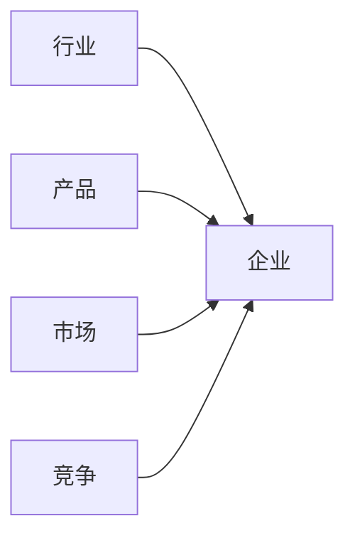
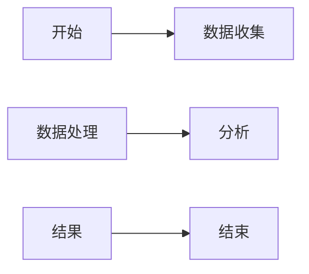
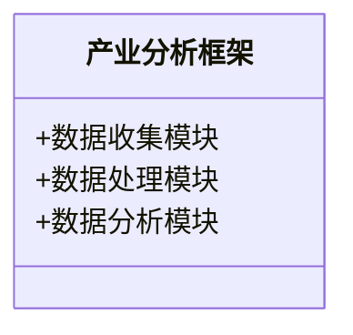
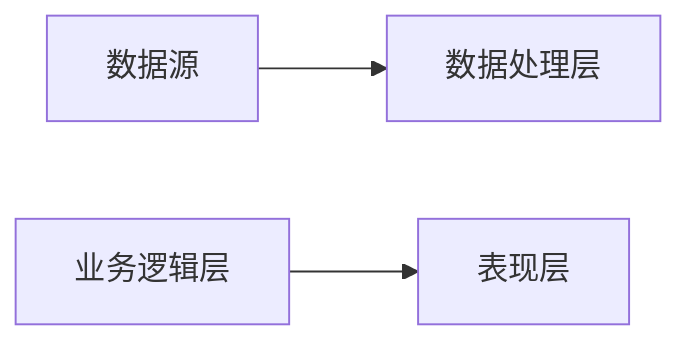

                 


# 菲利普费雪的产业分析框架

> 关键词：产业分析，投资分析，菲利普·费雪，成长股，投资策略

> 摘要：本文深入探讨菲利普·费雪的产业分析框架，从背景介绍、核心概念、数学模型到系统架构设计和项目实战，全面解析其在投资分析中的应用。通过实际案例和详细步骤，帮助读者掌握如何利用这一框架进行有效投资决策。

---

## 第一部分：产业分析框架的背景与核心概念

### 第1章：产业分析框架的背景介绍

#### 1.1 产业分析框架的定义与背景

产业分析是投资决策中的关键步骤，旨在通过研究行业结构、竞争状况和市场趋势，评估企业的投资价值。菲利普·费雪是价值投资的先驱，他提出的产业分析框架为投资者提供了系统化的方法。

#### 1.2 问题背景与问题描述

在投资决策中，了解企业的行业环境至关重要。费雪认为，投资成功不仅取决于企业的财务状况，还与其所在行业的成长潜力密切相关。因此，分析企业所处的产业环境是评估其长期价值的基础。

#### 1.3 问题解决思路

费雪的产业分析框架强调从宏观到微观的分析，包括行业生命周期、市场结构、竞争优势和管理层质量等方面，帮助投资者识别高成长潜力的企业。

---

### 第2章：菲利普·费雪的产业分析框架

#### 2.1 核心概念与联系

##### 2.1.1 产业分析框架的核心原理

费雪的框架基于以下核心原理：
1. **行业生命周期**：分析行业所处的阶段，如导入期、成长期、成熟期和衰退期。
2. **市场竞争结构**：评估行业的竞争程度，如垄断、寡头垄断等。
3. **竞争优势**：识别企业的核心竞争力，如成本优势、技术优势等。
4. **管理层质量**：考察企业管理层的决策能力和战略眼光。

##### 2.1.2 核心概念的属性特征对比表格

| 核心概念 | 属性特征 |
|----------|----------|
| 行业生命周期 | 阶段划分：导入期、成长期、成熟期、衰退期 |
| 市场竞争结构 | 类型：垄断、寡头垄断、完全竞争 |
| 竞争优势 | 类型：成本优势、技术优势、品牌优势 |
| 管理层质量 | 评价指标：决策能力、战略眼光、诚信 |

##### 2.1.3 ER实体关系图架构的 Mermaid 流程图



---

### 第3章：投资分析的算法原理

#### 3.1 算法原理的 Mermaid 流程图



#### 3.2 算法原理的 Python 源代码

```python
def industry_analysis(data):
    # 数据处理
    processed_data = data_processing(data)
    # 数据分析
    result = analyze(processed_data)
    return result
```

---

### 第4章：数学模型与公式

#### 4.1 核心数学模型

##### 4.1.1 投资回报率（ROE）公式

$$ROE = \frac{净利润}{平均股东权益}$$

##### 4.1.2 资产回报率（ROA）公式

$$ROA = \frac{净利润}{平均总资产}$$

#### 4.2 详细讲解与举例说明

##### 4.2.1 投资回报率的计算

假设某公司净利润为100万元，平均股东权益为500万元，则：

$$ROE = \frac{100}{500} = 20\%$$

##### 4.2.2 资产回报率的计算

假设某公司净利润为80万元，平均总资产为400万元，则：

$$ROA = \frac{80}{400} = 20\%$$

---

### 第5章：系统分析与架构设计方案

#### 5.1 系统分析

##### 5.1.1 问题场景介绍

系统旨在帮助投资者分析企业所处的行业环境，评估企业的投资价值。

##### 5.1.2 系统功能设计（领域模型 Mermaid 类图）



#### 5.2 系统架构设计

##### 5.2.1 系统架构 Mermaid 架构图



---

### 第6章：项目实战

#### 6.1 环境安装与配置

##### 6.1.1 安装 Python 和相关库

```bash
pip install pandas numpy matplotlib
```

#### 6.2 核心实现源代码

##### 6.2.1 数据收集与处理代码

```python
import pandas as pd

# 数据收集
data = pd.read_csv('industry_data.csv')

# 数据处理
processed_data = data[['Revenue', 'Profit', 'Market Share']].fillna(0)
```

##### 6.2.2 数据分析与建模代码

```python
def analyze(data):
    # 计算ROE
    roe = data['Profit'] / data['Equity']
    # 计算ROA
    roa = data['Profit'] / data['Assets']
    return pd.DataFrame({'ROE': roe, 'ROA': roa})

result = analyze(processed_data)
print(result)
```

#### 6.3 代码应用解读与分析

##### 6.3.1 代码功能解读

上述代码展示了如何从数据中提取关键指标并进行计算，帮助投资者评估企业的财务表现。

##### 6.3.2 代码实现细节分析

- 数据处理模块：处理缺失值，确保数据完整性。
- 分析模块：计算ROE和ROA，评估企业的盈利能力。

---

### 第7章：最佳实践与小结

#### 7.1 最佳实践

1. **数据来源**：确保数据准确可靠。
2. **模型选择**：根据实际情况选择合适的分析模型。
3. **持续学习**：关注行业动态，及时调整分析框架。

#### 7.2 小结

菲利普·费雪的产业分析框架为投资者提供了系统化的方法，帮助识别高成长潜力的企业。通过本文的详细讲解，读者可以掌握这一框架的核心要素和实际应用。

---

# 总结

通过本文的详细分析，读者可以全面了解菲利普·费雪的产业分析框架，从背景、核心概念到实际应用，逐步掌握这一投资分析方法。希望本文能为投资者提供有价值的参考，帮助他们在复杂的市场环境中做出明智的投资决策。

