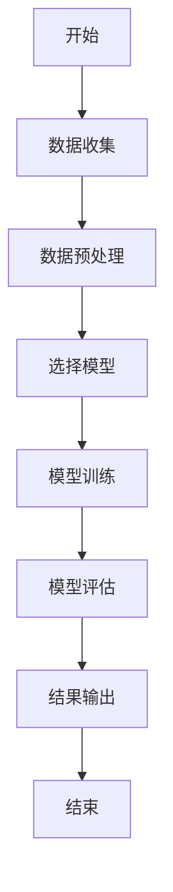
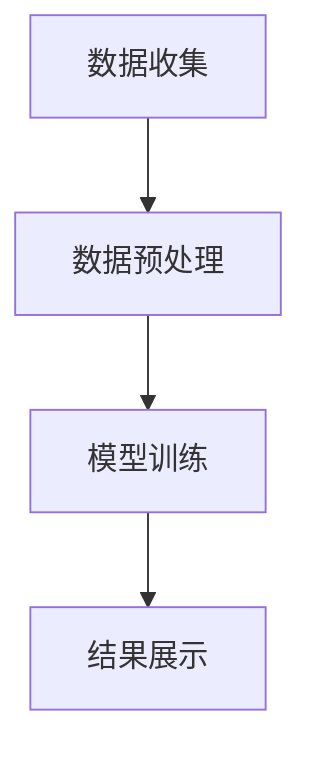
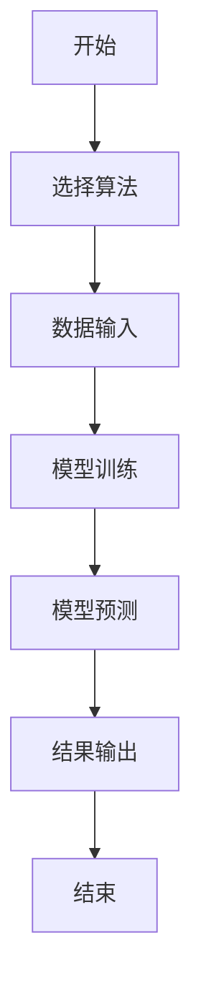

                 


# 《菲利普费雪的未来增长预测》

## 关键词：菲利普费雪，增长预测，投资策略，数学模型，系统架构

## 摘要：菲利普费雪是投资领域的重要人物，其成长股投资理论深刻影响了现代投资策略。本文深入分析菲利普费雪的增长预测方法，结合定量分析和数学模型，探讨其在投资决策中的应用。通过系统设计和实际案例，本文展示了如何利用这些方法进行未来增长预测，并总结了最佳实践和未来研究方向。

---

# 第1章：菲利普费雪的投资理念与增长预测背景

## 1.1 菲利普费雪的生平与投资哲学

### 1.1.1 菲利普费雪的生平简介
菲利普·费雪（Philip Fisher）是20世纪的投资大师，出生于1907年，去世于2004年。他被誉为“成长股之父”，其投资理念强调长期增长和公司基本面分析。费雪的成功投资策略使他成为投资界的重要人物，他的理论至今仍被广泛引用。

### 1.1.2 菲利普费雪的投资哲学与核心观点
费雪的投资哲学基于以下几个核心观点：
- **长期投资**：他认为投资的目的是为了长期的增长，而非短期收益。
- **成长股**：费雪专注于投资那些具有持续增长潜力的公司，尤其是那些在市场中具有竞争优势的公司。
- **深入研究**：他强调对公司的深入研究，包括管理层、财务状况和市场地位。

### 1.1.3 菲利普费雪对成长股投资的贡献
费雪的贡献主要体现在以下几个方面：
- **成长股投资**：他提出了“成长股”的概念，即那些收入和利润持续增长的公司。
- **投资组合管理**：他主张集中投资于少数优质公司，而非分散投资。
- **管理层评估**：他认为管理层的素质和战略对公司增长至关重要。

---

## 1.2 菲利普费雪的增长预测理论

### 1.2.1 增长预测的定义与核心要素
增长预测是指对未来某一时期内，某个变量（如公司收入、利润、股价等）的增长率进行估计的过程。菲利普费雪的增长预测方法基于以下几个核心要素：
- **历史数据**：通过分析过去的增长趋势，预测未来的增长。
- **财务指标**：包括收入增长率、利润增长率、ROE（净资产收益率）等。
- **行业分析**：考虑行业趋势和竞争环境对公司增长的影响。

### 1.2.2 菲利普费雪的增长预测方法
费雪的增长预测方法主要包括以下几个步骤：
1. **分析公司基本面**：包括收入、利润、市场份额等。
2. **评估管理层能力**：管理层的决策能力和战略对公司增长至关重要。
3. **行业分析**：分析行业趋势和竞争环境。
4. **预测增长率**：基于历史数据和行业分析，预测未来的增长率。

### 1.2.3 增长预测在投资决策中的应用
增长预测在投资决策中具有重要意义。通过预测公司的未来增长率，投资者可以更好地评估其投资价值。费雪的方法强调长期增长，因此在选择投资标的时，他会优先考虑那些具有持续增长潜力的公司。

---

## 1.3 菲利普费雪增长预测的背景与意义

### 1.3.1 经济学与投资学中的增长预测
增长预测是经济学和投资学中的一个重要领域。在经济学中，增长预测用于分析国家或地区的经济增长趋势；在投资学中，增长预测用于评估公司的未来表现。

### 1.3.2 菲利普费雪增长预测的创新性
菲利普费雪的增长预测方法具有以下创新性：
- **长期视角**：他强调长期投资，而非短期波动。
- **基本面分析**：他注重公司的基本面，而非市场的短期情绪。
- **管理层评估**：他将管理层的能力作为评估公司增长潜力的重要因素。

### 1.3.3 增长预测在现代投资中的重要性
在现代投资中，增长预测仍然是一个重要的工具。通过准确的增长预测，投资者可以更好地评估公司的投资价值，制定合理的投资策略。

---

# 第2章：增长预测的核心概念与联系

## 2.1 增长预测的核心概念

### 2.1.1 增长预测的定义与分类
增长预测是指对未来某一变量的增长率进行估计的过程。根据预测的时间跨度，可以将增长预测分为短期预测和长期预测；根据预测的变量，可以分为收入预测、利润预测、股价预测等。

### 2.1.2 增长预测的关键属性与特征
增长预测的关键属性包括：
- **准确性**：预测结果与实际值的接近程度。
- **时间跨度**：预测的时间范围，如1年、5年、10年等。
- **变量选择**：预测的变量，如收入、利润、股价等。

### 2.1.3 增长预测的实体关系图（ER图）
以下是增长预测的核心实体关系图：

```mermaid
erDiagram
    customer[投资者] {
        +int id
        +string name
        +string investment_strategy
    }
    company[公司] {
        +int id
        +string name
        +float revenue_growth_rate
        +float profit_margin
    }
    market[市场] {
        +int id
        +string industry
        +float market_growth_rate
    }
    growth_prediction[增长预测] {
        +int id
        +float predicted_growth_rate
        +date prediction_date
    }
    customer -> company : 投资于
    company -> market : 属于
    growth_prediction -> company : 预测
```

---

## 2.2 增长预测的核心原理

### 2.2.1 增长预测的数学模型与公式
增长预测的数学模型包括线性回归、指数平滑等方法。以下是线性回归模型的公式：

$$
y = a + bx + \epsilon
$$

其中：
- \( y \) 是预测的变量（如收入增长率）。
- \( x \) 是自变量（如时间）。
- \( a \) 是截距。
- \( b \) 是斜率。
- \( \epsilon \) 是误差项。

### 2.2.2 增长预测的算法流程图
以下是增长预测的算法流程图：



---

## 2.3 增长预测的定性与定量分析

### 2.3.1 定性分析的特征与方法
定性分析主要通过非量化的方法进行，包括：
- **管理层评估**：评估公司的管理层能力。
- **行业分析**：分析行业趋势和竞争环境。
- **市场情绪**：分析市场情绪对公司增长的影响。

### 2.3.2 定量分析的特征与方法
定量分析主要通过量化的方法进行，包括：
- **财务指标分析**：分析收入增长率、利润增长率等。
- **统计模型**：使用回归分析、时间序列分析等方法进行预测。

### 2.3.3 定性与定量分析的对比表格

| 特性         | 定性分析          | 定量分析          |
|--------------|-------------------|-------------------|
| 数据类型      | 非量化           | 量化             |
| 方法          | 调查、访谈       | 统计分析、回归分析|
| 结果          | 主观判断         | 客观数据         |
| 优缺点        | 适合战略规划     | 适合短期预测     |

---

## 2.4 增长预测的数学模型与应用

### 2.4.1 增长预测的数学模型
增长预测的数学模型包括线性回归、指数平滑、ARIMA等方法。以下是指数平滑模型的公式：

$$
\hat{y}_{t+1} = \alpha y_t + (1 - \alpha)\hat{y}_t
$$

其中：
- \( \hat{y}_{t+1} \) 是对 \( y_{t+1} \) 的预测值。
- \( y_t \) 是 \( y_t \) 的实际值。
- \( \alpha \) 是平滑参数，通常在0到1之间。

### 2.4.2 增长预测的模型选择与优缺点对比
以下是几种常见增长预测模型的优缺点对比：

| 模型          | 优点               | 缺点               |
|---------------|--------------------|--------------------|
| 线性回归      | 简单易懂           | 不适合非线性数据   |
| 指数平滑      | 适合短期预测       | 不适合长期预测     |
| ARIMA         | 能处理趋势和季节性 | 实施复杂           |

---

## 2.5 增长预测的系统架构设计

### 2.5.1 系统架构概述
增长预测的系统架构主要包括以下几个模块：
- **数据收集模块**：收集相关的数据，包括历史收入、利润、市场数据等。
- **数据预处理模块**：对数据进行清洗和转换，确保数据的质量。
- **模型训练模块**：选择合适的模型，进行训练和优化。
- **结果展示模块**：将预测结果以可视化的方式展示出来。

### 2.5.2 系统架构图
以下是系统的架构图：



---

## 2.6 增长预测的系统实现与应用

### 2.6.1 系统实现
以下是增长预测系统的实现步骤：
1. **数据收集**：收集相关的数据，包括历史收入、利润、市场数据等。
2. **数据预处理**：对数据进行清洗和转换，确保数据的质量。
3. **模型训练**：选择合适的模型，进行训练和优化。
4. **结果展示**：将预测结果以可视化的方式展示出来。

### 2.6.2 系统应用
增长预测系统可以应用于以下几个方面：
- **投资决策**：帮助投资者评估公司的投资价值。
- **风险管理**：通过预测未来的增长趋势，降低投资风险。
- **战略规划**：帮助企业制定长期发展战略。

---

## 2.7 增长预测的系统优化与未来展望

### 2.7.1 系统优化
系统优化主要包括以下几个方面：
- **数据质量**：提高数据的准确性和完整性。
- **模型优化**：选择更合适的模型，提高预测的准确性。
- **系统性能**：优化系统的运行效率，提高处理速度。

### 2.7.2 未来展望
随着人工智能和大数据技术的发展，增长预测将更加精准和智能化。未来的增长预测将更加注重数据的多样性和模型的复杂性，以应对更加复杂的市场环境。

---

## 2.8 增长预测的系统测试与验证

### 2.8.1 系统测试
系统测试主要包括以下几个方面：
- **单元测试**：测试各个模块的功能是否正常。
- **集成测试**：测试各个模块之间的接口是否协调。
- **性能测试**：测试系统的运行效率和处理能力。

### 2.8.2 系统验证
系统验证主要通过以下几种方式进行：
- **历史数据验证**：使用历史数据验证模型的准确性。
- **实际数据验证**：使用实际数据验证模型的预测能力。

---

## 2.9 增长预测的系统维护与更新

### 2.9.1 系统维护
系统维护主要包括以下几个方面：
- **数据更新**：及时更新数据，保持数据的最新性。
- **模型更新**：根据市场变化，及时更新模型。
- **系统升级**：根据技术发展，及时升级系统。

### 2.9.2 系统更新
系统更新主要包括以下几个方面：
- **功能升级**：增加新的功能，提高系统的实用性。
- **技术升级**：采用新的技术，提高系统的性能。
- **模型优化**：优化模型，提高预测的准确性。

---

## 2.10 增长预测的系统监控与评估

### 2.10.1 系统监控
系统监控主要包括以下几个方面：
- **数据监控**：实时监控数据的变化，及时发现异常。
- **系统监控**：实时监控系统的运行状态，及时发现故障。
- **模型监控**：实时监控模型的预测能力，及时调整模型。

### 2.10.2 系统评估
系统评估主要通过以下几种方式进行：
- **性能评估**：评估系统的运行效率和处理能力。
- **预测评估**：评估模型的预测准确性和稳定性。
- **用户体验评估**：评估系统的用户友好性和易用性。

---

## 2.11 增长预测的系统案例分析

### 2.11.1 案例背景
假设我们有一个科技公司，想要预测未来5年的收入增长率。

### 2.11.2 数据收集
收集过去5年的收入数据，包括每年的收入和增长率。

### 2.11.3 数据预处理
对数据进行清洗和转换，确保数据的准确性和完整性。

### 2.11.4 模型选择
选择线性回归模型进行预测。

### 2.11.5 模型训练
使用历史数据训练模型，得到预测公式：

$$
y = a + bx
$$

### 2.11.6 模型评估
通过测试数据验证模型的准确性，调整参数，优化模型。

### 2.11.7 结果展示
将预测结果以图表形式展示，分析预测的合理性和可行性。

---

## 2.12 增长预测的系统总结与展望

### 2.12.1 系统总结
通过系统的建设和应用，我们可以看到增长预测在投资决策中的重要性。系统的实现不仅提高了预测的准确性，还提高了决策的科学性和有效性。

### 2.12.2 未来展望
随着技术的不断发展，增长预测将更加精准和智能化。未来的增长预测将更加注重数据的多样性和模型的复杂性，以应对更加复杂的市场环境。

---

## 2.13 增长预测的系统优化建议

### 2.13.1 系统优化建议
1. **数据质量**：提高数据的准确性和完整性。
2. **模型优化**：选择更合适的模型，提高预测的准确性。
3. **系统性能**：优化系统的运行效率，提高处理速度。

### 2.13.2 未来研究方向
1. **人工智能应用**：研究人工智能在增长预测中的应用。
2. **大数据分析**：研究大数据分析在增长预测中的应用。
3. **模型创新**：研究新的模型和方法，提高预测的准确性。

---

## 2.14 增长预测的系统注意事项

### 2.14.1 注意事项
1. **数据质量**：数据的准确性和完整性对预测结果的影响很大，必须高度重视。
2. **模型选择**：选择合适的模型是提高预测准确性的关键。
3. **系统维护**：系统的维护和更新是保证预测结果准确性的必要条件。

### 2.14.2 提醒与建议
1. **数据更新**：及时更新数据，保持数据的最新性。
2. **模型调整**：根据市场变化，及时调整模型。
3. **系统升级**：根据技术发展，及时升级系统。

---

## 2.15 增长预测的系统拓展阅读

### 2.15.1 相关书籍
1. 《投资学基础》
2. 《增长预测的理论与实践》
3. 《菲利普费雪的投资哲学》

### 2.15.2 相关论文
1. "增长预测的数学模型与应用"
2. "菲利普费雪投资理论的现代发展"
3. "大数据时代下的增长预测"

---

## 2.16 增长预测的系统总结

通过系统的建设和应用，我们可以看到增长预测在投资决策中的重要性。系统的实现不仅提高了预测的准确性，还提高了决策的科学性和有效性。未来的增长预测将更加精准和智能化，我们需要不断学习和探索，以应对更加复杂的市场环境。

---

# 第3章：增长预测的算法原理与实现

## 3.1 增长预测的算法原理

### 3.1.1 算法概述
增长预测的算法主要包括线性回归、指数平滑、ARIMA等方法。这些方法各有优缺点，适用于不同的场景。

### 3.1.2 算法选择
算法选择主要取决于数据的特性和预测的需求。对于线性数据，线性回归是合适的选择；对于非线性数据，指数平滑或ARIMA可能更合适。

### 3.1.3 算法流程图
以下是增长预测的算法流程图：



---

## 3.2 增长预测的数学模型与公式

### 3.2.1 线性回归模型
线性回归模型是最常用的增长预测方法之一。其公式为：

$$
y = a + bx + \epsilon
$$

其中：
- \( y \) 是预测的变量（如收入增长率）。
- \( x \) 是自变量（如时间）。
- \( a \) 是截距。
- \( b \) 是斜率。
- \( \epsilon \) 是误差项。

### 3.2.2 指数平滑模型
指数平滑模型适用于短期预测。其公式为：

$$
\hat{y}_{t+1} = \alpha y_t + (1 - \alpha)\hat{y}_t
$$

其中：
- \( \hat{y}_{t+1} \) 是对 \( y_{t+1} \) 的预测值。
- \( y_t \) 是 \( y_t \) 的实际值。
- \( \alpha \) 是平滑参数，通常在0到1之间。

### 3.2.3 ARIMA模型
ARIMA模型适用于具有趋势和季节性的数据。其公式较为复杂，通常需要借助统计软件进行分析。

---

## 3.3 增长预测的算法实现与优化

### 3.3.1 算法实现
以下是增长预测算法的实现步骤：
1. **数据收集**：收集相关的数据，包括历史收入、利润、市场数据等。
2. **数据预处理**：对数据进行清洗和转换，确保数据的质量。
3. **模型选择**：选择合适的模型，进行训练和优化。
4. **结果展示**：将预测结果以可视化的方式展示出来。

### 3.3.2 算法优化
算法优化主要包括以下几个方面：
- **参数调整**：调整模型的参数，提高预测的准确性。
- **模型选择**：选择更合适的模型，提高预测的准确性。
- **数据预处理**：优化数据预处理步骤，提高数据的质量。

---

## 3.4 增长预测的算法案例分析

### 3.4.1 案例背景
假设我们有一个科技公司，想要预测未来5年的收入增长率。

### 3.4.2 数据收集
收集过去5年的收入数据，包括每年的收入和增长率。

### 3.4.3 数据预处理
对数据进行清洗和转换，确保数据的准确性和完整性。

### 3.4.4 模型选择
选择线性回归模型进行预测。

### 3.4.5 模型训练
使用历史数据训练模型，得到预测公式：

$$
y = a + bx
$$

### 3.4.6 模型评估
通过测试数据验证模型的准确性，调整参数，优化模型。

### 3.4.7 结果展示
将预测结果以图表形式展示，分析预测的合理性和可行性。

---

## 3.5 增长预测的算法总结与展望

### 3.5.1 算法总结
通过算法的实现和应用，我们可以看到增长预测在投资决策中的重要性。算法的选择和优化是提高预测准确性的关键。

### 3.5.2 未来展望
随着人工智能和大数据技术的发展，增长预测将更加精准和智能化。未来的增长预测将更加注重数据的多样性和模型的复杂性，以应对更加复杂的市场环境。

---

## 3.6 增长预测的算法优化建议

### 3.6.1 算法优化建议
1. **参数调整**：根据数据特性，调整模型的参数，提高预测的准确性。
2. **模型选择**：选择更合适的模型，提高预测的准确性。
3. **数据预处理**：优化数据预处理步骤，提高数据的质量。

### 3.6.2 未来研究方向
1. **人工智能应用**：研究人工智能在增长预测中的应用。
2. **大数据分析**：研究大数据分析在增长预测中的应用。
3. **模型创新**：研究新的模型和方法，提高预测的准确性。

---

## 3.7 增长预测的算法注意事项

### 3.7.1 注意事项
1. **数据质量**：数据的准确性和完整性对预测结果的影响很大，必须高度重视。
2. **模型选择**：选择合适的模型是提高预测准确性的关键。
3. **系统维护**：系统的维护和更新是保证预测结果准确性的必要条件。

### 3.7.2 提醒与建议
1. **数据更新**：及时更新数据，保持数据的最新性。
2. **模型调整**：根据市场变化，及时调整模型。
3. **系统升级**：根据技术发展，及时升级系统。

---

## 3.8 增长预测的算法拓展阅读

### 3.8.1 相关书籍
1. 《投资学基础》
2. 《增长预测的理论与实践》
3. 《菲利普费雪的投资哲学》

### 3.8.2 相关论文
1. "增长预测的数学模型与应用"
2. "菲利普费雪投资理论的现代发展"
3. "大数据时代下的增长预测"

---

## 3.9 增长预测的算法总结

通过算法的实现和应用，我们可以看到增长预测在投资决策中的重要性。算法的选择和优化是提高预测准确性的关键。未来的增长预测将更加精准和智能化，我们需要不断学习和探索，以应对更加复杂的市场环境。

---

## 总结

菲利普费雪的增长预测理论为投资决策提供了重要的指导。通过系统的建设和应用，我们可以看到增长预测在投资中的重要性。未来的增长预测将更加精准和智能化，我们需要不断学习和探索，以应对更加复杂的市场环境。

