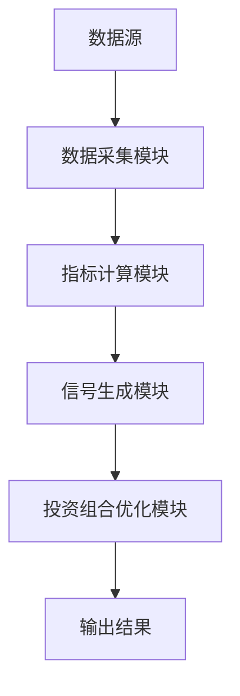

                 


# 行业轮动策略：识别和投资热点行业

---

## 关键词
行业轮动，热点行业，投资策略，经济周期，市场分析，技术分析，基本面分析，投资组合优化，数学模型，算法原理。

---

## 摘要
行业轮动策略是一种动态调整投资组合的方法，旨在根据市场环境的变化，投资于表现较好的行业以实现超额收益。本文从行业轮动的背景、核心概念、算法原理、系统设计、项目实战等多个角度进行详细阐述，结合实际案例分析和代码实现，帮助读者掌握行业轮动策略的理论与实践。文章还探讨了行业轮动策略的优势与局限性，并提供了优化建议和未来研究方向。

---

# 第1章: 行业轮动策略概述

## 1.1 行业轮动的基本概念
### 1.1.1 行业轮动的定义
行业轮动策略是指根据市场环境的变化，动态调整投资组合中行业权重的一种投资策略。其核心在于识别和投资当前表现较好的行业，同时规避表现不佳的行业。

### 1.1.2 行业轮动的背景与意义
随着经济周期的波动和市场环境的变化，不同行业的表现会出现显著差异。行业轮动策略通过捕捉这些差异，能够在不同市场环境下优化投资收益。

### 1.1.3 行业轮动的核心要素
- **经济周期**：不同行业在不同经济周期的表现不同，例如，周期性行业在经济扩张期表现较好，而防御性行业在经济衰退期表现较好。
- **市场情绪**：市场情绪的变化会影响行业的短期表现。
- **行业基本面**：行业的财务状况、成长性等因素是长期投资的重要依据。

## 1.2 行业轮动的理论基础
### 1.2.1 经济周期与行业轮动的关系
经济周期的波动对行业表现有显著影响。例如：
- 在经济扩张期，周期性行业（如能源、工业）表现较好。
- 在经济衰退期，防御性行业（如公用事业、医疗保健）表现较好。

### 1.2.2 市场情绪与行业轮动的关联
市场情绪的变化会影响投资者对行业的偏好。例如，当市场情绪高涨时，成长性行业可能受到更多关注；当市场情绪低迷时，防御性行业可能更受欢迎。

### 1.2.3 行业轮动的驱动因素分析
行业轮动的主要驱动因素包括：
- **宏观经济指标**：GDP增速、利率、通胀等。
- **市场指标**：市盈率、市净率、成交量等。
- **行业基本面指标**：ROE、收入增长率、利润率等。

---

# 第2章: 行业轮动的核心概念与联系

## 2.1 行业轮动的核心概念
### 2.1.1 行业轮动的驱动因素
- **宏观经济因素**：如经济周期、利率政策、货币政策等。
- **市场因素**：如市场情绪、资金流向等。
- **行业因素**：如行业竞争格局、政策影响等。

### 2.1.2 行业轮动的分类与特点
- **基于经济周期的轮动策略**：根据经济周期的变化选择不同的行业。
- **基于市场风格的轮动策略**：根据市场风格的变化（如价值风格、成长风格）选择行业。
- **基于行业基本面的轮动策略**：根据行业基本面指标的变化选择行业。

## 2.2 行业轮动的核心原理
### 2.2.1 行业轮动的数学模型
行业轮动策略可以通过多因子模型来实现，其数学模型如下：

$$
R_i = \beta_i (R_m - R_f) + \alpha_i + \sum_{k=1}^n w_k F_k + \epsilon_i
$$

其中：
- \( R_i \) 表示行业 \( i \) 的超额收益。
- \( \beta_i \) 表示行业 \( i \) 的 beta 系数。
- \( R_m \) 表示市场收益。
- \( R_f \) 表示无风险收益率。
- \( \alpha_i \) 表示行业 \( i \) 的超额收益。
- \( w_k \) 表示因子 \( k \) 的权重。
- \( F_k \) 表示因子 \( k \) 的值。
- \( \epsilon_i \) 表示误差项。

### 2.2.2 行业轮动的信号生成机制
行业轮动的信号生成机制通常包括以下几个步骤：
1. **数据采集**：获取行业的历史价格、财务数据、宏观经济指标等。
2. **指标计算**：计算行业的技术指标（如相对强弱指数 RSI）、基本面指标（如市盈率、ROE）等。
3. **信号生成**：根据预设的规则生成买入或卖出信号。
4. **组合优化**：根据信号生成投资组合，并进行风险调整。

---

# 第3章: 行业轮动策略的算法原理

## 3.1 行业轮动策略的数学模型
### 3.1.1 行业轮动的多因子模型
多因子模型通过多个因子的线性组合来解释行业收益的差异。常用的因子包括价值因子、动量因子、成长因子等。

### 3.1.2 行业轮动的因子权重计算
因子权重可以通过回归分析或风险平价等方法来确定。

### 3.1.3 行业轮动的因子筛选方法
常用的因子筛选方法包括：
- **回归分析**：通过回归分析确定因子的重要性。
- **信息比率测试**：筛选出信息比率较高的因子。
- **分层排序法**：将因子值进行排序，并根据排序结果进行筛选。

## 3.2 行业轮动策略的信号生成
### 3.2.1 基于技术指标的信号生成
常用的技术指标包括相对强弱指数（RSI）、移动平均线（MA）、MACD 等。

### 3.2.2 基于基本面指标的信号生成
常用的基本面指标包括市盈率（PE）、市净率（PB）、ROE 等。

### 3.2.3 基于市场情绪的信号生成
市场情绪可以通过投资者情绪指标（如恐慌指数 VIX）或资金流向指标来衡量。

---

# 第4章: 行业轮动策略的系统分析与架构设计

## 4.1 行业轮动系统的功能设计
### 4.1.1 数据采集模块
数据采集模块负责获取行业的历史价格、财务数据、宏观经济指标等。

### 4.1.2 指标计算模块
指标计算模块负责计算行业的技术指标、基本面指标等。

### 4.1.3 信号生成模块
信号生成模块根据预设的规则生成买入或卖出信号。

### 4.1.4 投资组合优化模块
投资组合优化模块根据信号生成最终的投资组合，并进行风险调整。

## 4.2 行业轮动系统的架构设计
### 4.2.1 系统架构图


### 4.2.2 模块交互流程图


---

# 第5章: 行业轮动策略的项目实战

## 5.1 环境安装与数据准备
### 5.1.1 Python环境搭建
安装 Python 和必要的库，如 pandas、numpy、scikit-learn 等。

### 5.1.2 数据源选择与获取
从 Yahoo Finance 或其他数据源获取行业数据。

### 5.1.3 数据清洗与预处理
对数据进行缺失值填充、标准化等预处理。

## 5.2 核心代码实现
### 5.2.1 数据采集代码
```python
import pandas as pd
import numpy as np

# 获取行业数据
def get_industry_data(ticker):
    # 数据获取逻辑
    pass

# 示例代码
data = pd.DataFrame()
data['close'] = get_industry_data('AAPL')  # 苹果公司作为示例
```

### 5.2.2 指标计算代码
```python
# 计算相对强弱指数 RSI
def calculate_rsi(prices, period=14):
    # 计算涨跌幅度
    delta = prices['close'].diff()
    up = delta.where(delta > 0, 0)
    down = delta.where(delta < 0, 0)
    # 计算RSI
    rs = up.rolling(period).mean() / down.rolling(period).mean()
    rsi = 100 - (100 - rs.rolling(period).mean())
    return rsi

rsi = calculate_rsi(data)
```

### 5.2.3 信号生成代码
```python
# 生成买卖信号
def generate_signals(rsi, threshold=30):
    signals = pd.Series(index=rsi.index)
    signals[rsi > threshold] = 1  # 买入信号
    signals[rsi < threshold] = -1  # 卖出信号
    return signals

signals = generate_signals(rsi)
```

### 5.2.4 投资组合优化代码
```python
# 最优投资组合优化
def optimize_portfolio(signals, returns):
    # 示例代码
    pass

optimized_portfolio = optimize_portfolio(signals, returns)
```

## 5.3 案例分析与解读
### 5.3.1 实例分析
以苹果公司为例，分析行业轮动策略在实际中的应用。

### 5.3.2 结果解读
解读优化后的投资组合，并分析其表现。

---

# 第6章: 最佳实践与小结

## 6.1 最佳实践 tips
- 定期回顾和优化策略。
- 结合宏观经济分析和行业基本面分析。
- 使用多因子模型提高策略的有效性。

## 6.2 小结
行业轮动策略是一种有效的投资策略，但其成功取决于对经济周期、市场情绪和行业基本面的深刻理解。通过结合多因子模型和系统化的方法，可以提高策略的稳定性和收益能力。

## 6.3 注意事项
- 风险控制是关键。
- 需要定期监控和调整策略。
- 避免过度拟合模型。

## 6.4 拓展阅读
推荐相关书籍和论文，供读者进一步学习。

---

# 结语
行业轮动策略是一种动态调整投资组合的方法，通过识别和投资热点行业，可以在不同市场环境下实现超额收益。本文从理论到实践，详细阐述了行业轮动策略的核心概念、算法原理和系统设计，并通过实际案例分析和代码实现，帮助读者掌握行业轮动策略的理论与实践。希望本文能为读者在投资决策中提供有价值的参考。

