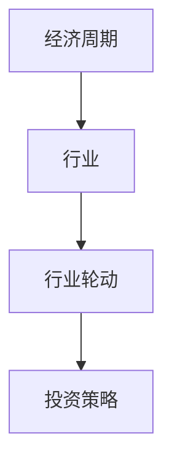
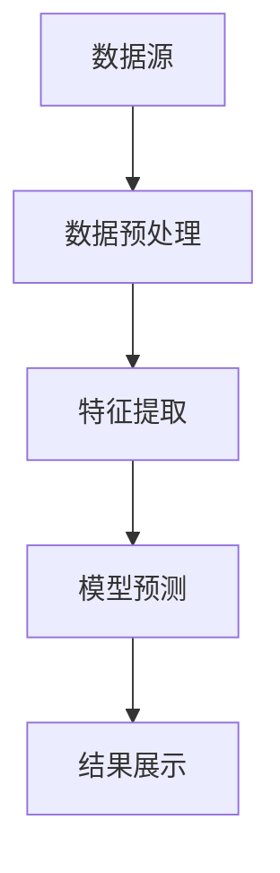
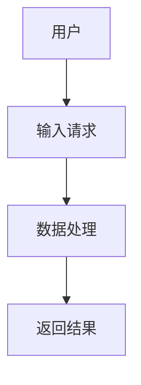

                 


# 行业轮动：识别下一个市场热点的方法

## 关键词：
行业轮动、投资策略、经济周期、时间序列分析、因子分析、机器学习

## 摘要：
本文详细探讨了行业轮动的概念、分析方法和实际应用，帮助投资者识别市场热点。通过宏观经济分析、因子分析和机器学习算法，结合系统架构设计和实战案例，提供了一套完整的行业轮动识别方法。文章内容丰富，结构清晰，适合投资专业人士和技术爱好者阅读。

---

## 第一部分：行业轮动概述

### 第1章：行业轮动的基本概念

#### 1.1 行业轮动的定义与背景
- **行业轮动**是指在不同经济周期中，行业表现轮流上升的现象。
- 投资者通过识别行业轮动，可以在市场变化中抓住投资机会，实现超额收益。
- 行业轮动与其他投资策略（如股票选择、资产配置）的区别在于，它专注于行业间的动态变化。

#### 1.2 行业轮动的核心要素
- **经济周期**：不同经济阶段下，行业轮动的模式不同。
- **行业特征**：行业间的生产模式、市场需求和竞争结构差异影响轮动。
- **市场情绪**：投资者情绪波动推动行业轮动，但需警惕非理性变化。

### 第2章：行业轮动的理论基础

#### 2.1 经济学基础
- **宏观经济指标**：GDP增速、CPI、PMI等指标预测行业轮动。
- **经济周期理论**：经济周期分为复苏、过热、滞胀和衰退，对应不同行业表现。
- **产业结构**：朝阳行业和夕阳行业的轮动规律。

#### 2.2 投资学基础
- **资产配置**：行业轮动是资产配置的重要组成部分，优化收益与风险。
- **市场情绪**：投资者情绪影响行业轮动，需结合市场整体表现分析。
- **风险管理**：行业轮动策略需考虑回撤和波动性，避免过度风险。

---

## 第二部分：行业轮动的分析框架

### 第3章：行业轮动的核心概念与联系

#### 3.1 行业轮动的核心概念
- **周期性**：行业轮动具有周期性，复苏期和过热期的行业表现差异显著。
- **驱动因素**：宏观经济、政策变化、技术创新和市场供需驱动行业轮动。
- **风险管理**：行业轮动需结合风险控制，避免单一行业过度投资。

#### 3.2 行业轮动的概念属性特征对比
| 特性 | 行业轮动特征 |
|------|--------------|
| 周期性 | 周期性显著，行业轮动呈现规律性 |
| 驱动因素 | 多因素驱动，包括经济、政策和技术 |
| 预测难度 | 中高难度，需结合多种指标分析 |

#### 3.3 ER实体关系图架构


---

## 第三部分：行业轮动的算法原理

### 第4章：行业轮动的分析方法

#### 4.1 时间序列分析
- **基本概念**：时间序列数据用于预测行业轮动趋势。
- **分解方法**：将时间序列分解为趋势、周期和噪声，提取有用信息。
- **预测模型**：ARIMA模型用于行业轮动预测，考虑历史数据和趋势。

#### 4.2 因子分析
- **因子选择**：选取宏观经济、行业基本面和技术指标作为因子。
- **因子权重**：通过回归分析确定各因子的权重，优化预测准确性。
- **应用案例**：使用因子分析预测科技行业轮动，展示实际应用效果。

#### 4.3 机器学习算法
- **支持向量机（SVM）**：用于行业分类，提高预测准确性。
- **神经网络（RNN）**：处理时间依赖数据，捕捉行业轮动的复杂模式。
- **算法流程**：
  1. 数据预处理：标准化和缺失值处理。
  2. 特征提取：选择关键因子。
  3. 模型训练：使用训练数据构建预测模型。
  4. 模型预测：对目标行业进行预测并评估结果。

---

## 第四部分：行业轮动的系统分析与架构设计

### 第5章：行业轮动监测系统架构

#### 5.1 系统功能设计
- **数据采集**：实时采集宏观经济、行业数据。
- **特征提取**：提取关键因子，构建行业轮动指标。
- **模型预测**：使用机器学习模型预测行业轮动趋势。
- **结果展示**：可视化预测结果，提供投资建议。

#### 5.2 系统架构设计


#### 5.3 系统接口设计
- 数据接口：与数据源API对接，获取实时数据。
- 用户界面：可视化界面展示预测结果和投资建议。

#### 5.4 系统交互设计


---

## 第五部分：行业轮动的实战应用

### 第6章：行业轮动实战项目

#### 6.1 环境安装
- **工具安装**：安装Python、Pandas、Scikit-learn和TensorFlow。
- **数据获取**：通过API获取行业数据。

#### 6.2 核心代码实现
```python
import pandas as pd
from sklearn.svm import SVC
from sklearn.metrics import accuracy_score

# 数据预处理
data = pd.read_csv('industry_data.csv')
X = data.drop('target', axis=1)
y = data['target']

# 模型训练
model = SVC()
model.fit(X, y)

# 模型预测
y_pred = model.predict(X)
print("准确率:", accuracy_score(y, y_pred))
```

#### 6.3 实际案例分析
- 分析科技行业在经济复苏期的轮动情况，预测其未来走势，展示模型的应用效果。

#### 6.4 项目小结
- 项目实现了行业轮动监测系统，验证了算法的有效性，为投资决策提供了支持。

---

## 第六部分：行业轮动的最佳实践

### 第7章：总结与展望

#### 7.1 总结
- 行业轮动是投资的重要策略，通过分析宏观经济、因子分析和机器学习算法，可以有效识别市场热点。
- 系统架构设计和实战项目展示了方法的实际应用，帮助投资者优化策略。

#### 7.2 小结
- 本文提供了从理论到实践的完整方法，投资者可以结合实际市场情况灵活应用。
- 关注行业轮动的最新研究，结合新技术提升预测准确性。

#### 7.3 注意事项
- 行业轮动策略需结合市场环境，避免单一依赖模型。
- 风险管理是投资成功的关键，需合理控制仓位和杠杆。

#### 7.4 拓展阅读
- 推荐阅读相关书籍，深入学习行业轮动的高级策略和最新算法。

---

通过以上结构，本文系统地介绍了行业轮动的概念、分析方法和实战应用，为投资者识别市场热点提供了有力支持。

