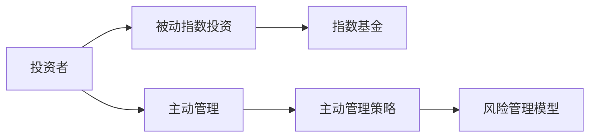
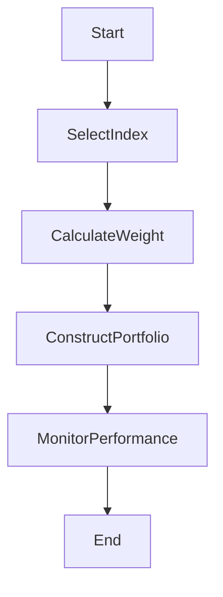
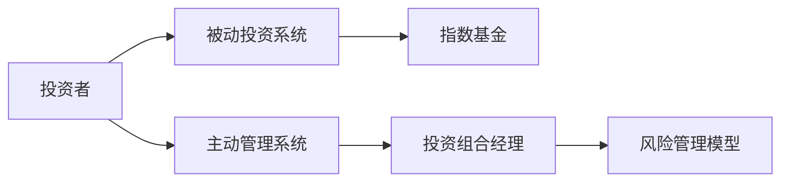

                 


# 被动指数投资 vs 主动管理：哪种更适合当前市场环境？

## 关键词：
- 被动指数投资
- 主动管理
- 市场环境
- 投资策略
- 风险管理

## 摘要：
在当前金融市场环境下，被动指数投资和主动管理各有优劣。被动投资以低成本和低风险著称，适合长期稳定投资；而主动管理则追求超额收益，但需承担更高的风险和成本。本文通过分析两者的背景、核心概念、算法原理、数学模型、系统架构及项目实战，探讨在不同市场环境下哪种策略更为适合。

---

## 第一部分：被动指数投资与主动管理的背景与核心概念

### 第1章：被动指数投资与主动管理的概述

#### 1.1 被动指数投资的定义与特点
- **被动投资**：投资者通过跟踪指数（如标普500）来构建投资组合，不主动调整资产配置。
- **指数基金**：被动投资的核心工具，费用低，风险分散。
- **历史发展**：始于20世纪70年代，如今已成为主流投资方式之一。

#### 1.2 主动管理的定义与特点
- **主动投资**：依赖专业管理人的市场预测和选股能力，追求超额收益。
- **主动管理策略**：包括股票选择、行业配置和时机选择。
- **历史发展**：传统投资方式，但近年来面临被动投资的挑战。

#### 1.3 当前市场环境下的投资策略选择
- **市场波动性**：被动投资在波动市中表现稳定。
- **投资者需求**：被动投资适合风险偏好较低的投资者，主动管理适合追求高收益的投资者。

### 第2章：被动指数投资与主动管理的核心概念对比

#### 2.1 核心概念对比分析
- **被动投资**：目标是复制指数表现，风险分散，费用低。
- **主动管理**：目标是超越市场表现，风险集中，费用高。

#### 2.2 被动与主动投资的属性特征对比表
| 属性       | 被动投资         | 主动管理         |
|------------|------------------|------------------|
| 投资目标     | 复制指数表现       | 追求超额收益     |
| 风险管理     | 分散风险         | 集中风险         |
| 费用         | 低               | 高               |

#### 2.3 ER实体关系图


### 第3章：被动指数投资的算法原理与实现

#### 3.1 被动指数投资的算法流程


#### 3.2 Python实现被动指数投资的核心算法
```python
import pandas as pd
import numpy as np

# 示例指数数据
index_data = pd.DataFrame({
    '股票': ['A', 'B', 'C'],
    '权重': [0.3, 0.4, 0.3]
})

# 计算投资组合的权重
weights = index_data['权重'].values

# 示例投资组合
portfolio = ['股票A', '股票B', '股票C']
```

---

## 第二部分：被动指数投资与主动管理的算法原理与数学模型

### 第4章：被动指数投资的数学模型

#### 4.1 被动投资的指数计算公式
$$ 指数表现 = \sum (\text{权重}_i \times \text{股票}_i) $$

#### 4.2 风险管理模型
$$ 风险调整后收益 = \text{超额收益} - \text{风险溢价} $$

### 第5章：主动管理的策略分析

#### 5.1 主动管理的资产配置模型
$$ \text{最优资产配置} = \argmin_w \left( w^T \Sigma w - \lambda w^T \mu \right) $$

#### 5.2 风险管理模型
$$ \text{风险调整后收益} = \text{超额收益} - \text{风险溢价} $$

---

## 第三部分：被动指数投资与主动管理的系统分析与架构设计

### 第6章：系统架构设计

#### 6.1 系统架构图


#### 6.2 系统接口设计
- 被动投资系统接口：指数数据接口、权重计算接口。
- 主动管理系统接口：市场数据接口、交易执行接口。

### 第7章：项目实战

#### 7.1 环境安装
- Python：安装必要的库如Pandas、NumPy。

#### 7.2 系统核心实现
```python
import pandas as pd
import numpy as np

def calculate_portfolio_value(weights, prices):
    return np.dot(weights, prices)

# 示例数据
prices = pd.Series([100, 150, 200])
weights = pd.Series([0.3, 0.4, 0.3])

# 计算投资组合价值
portfolio_value = calculate_portfolio_value(weights, prices)
print(portfolio_value)
```

---

## 第四部分：被动指数投资与主动管理的最佳实践

### 第8章：小结与展望

#### 8.1 小结
- 被动投资适合长期稳定投资，费用低，风险分散。
- 主动管理适合市场环境复杂，追求超额收益。

#### 8.2 注意事项
- 投资者应根据自身风险偏好和市场环境选择策略。
- 定期评估和调整投资组合。

#### 8.3 拓展阅读
- 阅读更多关于投资策略和风险管理的书籍和文章。

---

通过以上分析，可以看出被动指数投资和主动管理各有优劣，投资者应根据市场环境和个人需求选择适合的策略。被动投资在当前市场环境下表现出色，但主动管理在特定情况下仍具有价值。

