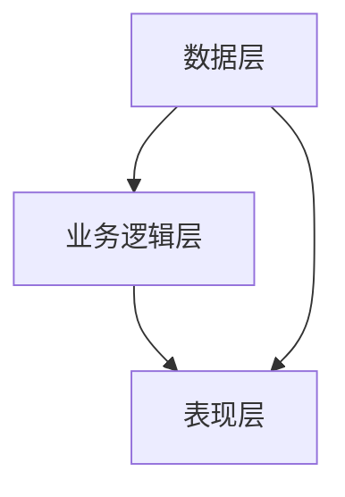
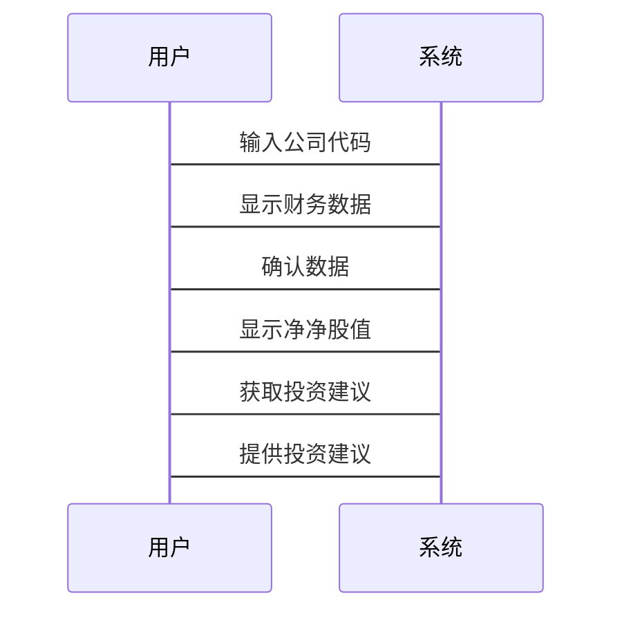

                 

# 净净股投资的系统分析与架构设计

## 4.1 净净股投资系统的功能需求
### 4.1.1 系统目标
净净股投资系统的目的是帮助投资者计算和评估公司的净净股价值，从而辅助投资决策。

### 4.1.2 功能需求概述
- 数据采集与处理：从财务报表中提取相关数据，计算各项财务指标。
- 净净股计算：根据财务指标计算净净股值。
- 投资决策支持：提供可视化分析和投资建议。

## 4.2 系统架构设计
### 4.2.1 系统架构概述
系统采用分层架构，包括数据层、业务逻辑层和表现层。

### 4.2.2 系统架构图

## 4.3 系统功能模块
### 4.3.1 数据处理模块
- 数据清洗：处理缺失值和异常值。
- 数据转换：将数据转换为适合计算的格式。

### 4.3.2 净净股计算模块
- 计算各项财务指标。
- 根据公式计算净净股值。

### 4.3.3 可视化模块
- 展示净净股计算结果。
- 提供图表分析，如折线图、柱状图等。

## 4.4 系统接口设计
### 4.4.1 数据接口
- 输入接口：接收财务数据。
- 输出接口：返回计算结果。

### 4.4.2 用户接口
- 输入界面：用户输入公司代码或财务数据。
- 输出界面：显示净净股值和投资建议。

## 4.5 系统交互流程
### 4.5.1 用户操作流程
1. 用户输入公司代码。
2. 系统获取公司财务数据。
3. 系统计算净净股值。
4. 系统显示结果并给出建议。

### 4.5.2 系统交互图

## 4.6 系统实现细节
### 4.6.1 数据来源
- 数据可以来自财务报表、数据库或网络API。

### 4.6.2 技术选型
- 使用Python进行数据处理和计算。
- 使用Matplotlib或Seaborn进行数据可视化。

### 4.6.3 系统优化
- 数据缓存：避免重复计算。
- 并行处理：提高计算效率。

## 4.7 系统测试
### 4.7.1 测试方法
- 单元测试：测试每个模块的功能。
- 集成测试：测试系统整体流程。

### 4.7.2 测试案例
- 测试净净股计算是否正确。
- 测试可视化图表是否准确。

## 4.8 系统部署
### 4.8.1 部署环境
- 可以在本地部署，也可以部署在云服务器上。

### 4.8.2 部署步骤
1. 安装依赖库。
2. 配置数据源。
3. 启动系统服务。

## 4.9 系统维护
### 4.9.1 数据更新
- 定期更新财务数据。
- 处理数据变化带来的影响。

### 4.9.2 系统升级
- 定期检查系统漏洞。
- 更新系统版本。

通过以上系统分析与架构设计，我们可以构建一个高效、可靠的净净股投资系统，帮助投资者更好地进行投资决策。

