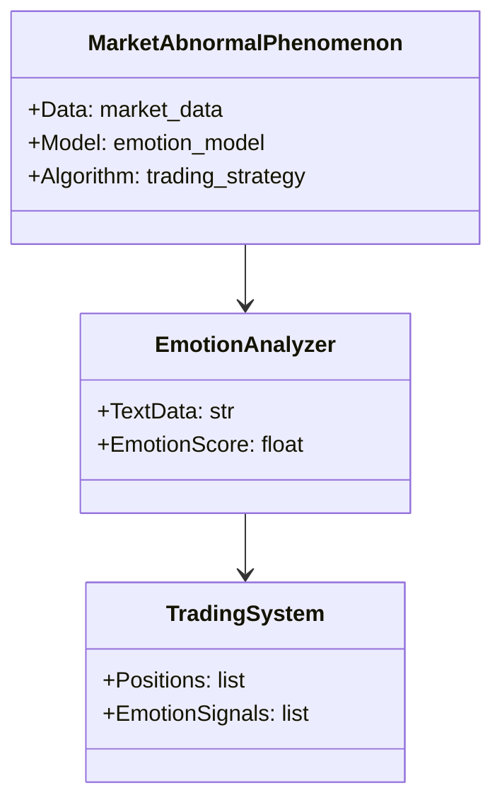

                 


# 詹姆斯·蒙蒂尔的市场异常现象研究

> 关键词：市场异常现象，詹姆斯·蒙蒂尔，行为金融学，投资者心理，情绪指标

> 摘要：本文深入探讨了詹姆斯·蒙蒂尔对市场异常现象的研究，分析了其理论基础、核心概念、算法原理以及实际应用。文章结合行为金融学的视角，详细阐述了市场情绪、投资者心理偏差对市场价格的影响，并通过数学模型和算法实现，展示了如何利用蒙蒂尔的研究成果指导实际投资决策。

---

# 第1章: 市场异常现象的背景与研究意义

## 1.1 市场异常现象的定义与分类

市场异常现象（Market Abnormal Phenomena）是指在金融市场中，价格、成交量等市场指标出现与传统金融理论预测不一致的情况。这些现象通常与投资者的心理偏差、情绪波动以及市场参与者的非理性行为密切相关。

### 市场异常现象的分类

市场异常现象可以分为以下几类：

1. **价格异常**：股票价格在短时间内出现大幅波动，但没有明显的市场信息支持这种波动。
2. **成交量异常**：交易量在特定时间段内显著偏离正常水平。
3. **市场情绪异常**：投资者情绪的极端化，如过度乐观或过度悲观。
4. **市场参与度异常**：市场参与者的行为模式出现显著偏离常态。

---

## 1.2 詹姆斯·蒙蒂尔的研究背景

### 蒙蒂尔的学术贡献

詹姆斯·蒙蒂尔（James Montier）是行为金融学领域的先驱之一，他的研究主要集中在投资者心理偏差、情绪波动与市场价格的关系。蒙蒂尔提出了许多创新性的理论和模型，为理解市场异常现象提供了重要的理论支持。

### 蒙蒂尔的市场异常现象研究方法

蒙蒂尔的研究方法结合了行为心理学和金融学，通过分析投资者的心理偏差（如过度自信、从众心理等）对市场行为的影响，揭示了市场异常现象的内在规律。

### 蒙蒂尔研究的现实意义

蒙蒂尔的研究不仅帮助投资者更好地理解市场波动的内在机制，还为风险管理、投资策略优化提供了新的思路。他的理论在实际投资实践中得到了广泛应用。

---

## 1.3 市场异常现象的理论框架

### 行为金融学基础

行为金融学（Behavioral Finance）是研究投资者心理偏差与市场行为之间关系的学科。它挑战了传统金融学中“有效市场假说”的观点，认为市场参与者的情绪波动和认知偏差会显著影响市场价格。

### 蒙蒂尔的市场异常现象模型

蒙蒂尔提出的模型将投资者情绪、认知偏差与市场价格波动相结合，构建了一个综合性的分析框架。该模型认为，市场异常现象的产生主要是由于投资者情绪的极端化和认知偏差的累积效应。

---

## 1.4 本章小结

本章从市场异常现象的定义与分类入手，介绍了詹姆斯·蒙蒂尔的研究背景及其理论贡献。通过行为金融学的视角，揭示了市场异常现象的内在规律，并为后续章节的深入分析奠定了基础。

---

# 第2章: 蒙蒂尔市场异常现象的核心概念

## 2.1 投资者心理与市场行为

### 投资者心理偏差的分类

投资者心理偏差主要包括以下几种：

1. **过度自信**：投资者倾向于高估自己的判断能力。
2. **从众心理**：投资者倾向于跟随市场 majority的行为。
3. **损失厌恶**：投资者对损失的厌恶程度高于对收益的追求。
4. **确认偏差**：投资者倾向于寻找支持自己观点的信息。

### 投资者情绪与市场波动的关系

投资者情绪是市场波动的重要驱动因素。当投资者情绪过度乐观时，市场价格可能被高估；当情绪过度悲观时，市场价格可能被低估。

### 投资者认知偏差对市场定价的影响

认知偏差会导致投资者在信息处理过程中出现偏差，从而影响市场价格的形成。例如，过度自信的投资者可能会高估股票的真实价值。

---

## 2.2 市场情绪与异常现象的联系

### 市场情绪的测量方法

市场情绪可以通过以下几种方式测量：

1. **市场参与者的情绪调查**：通过问卷或访谈收集投资者情绪数据。
2. **市场指标**：如波动率、成交量等。
3. **社交媒体分析**：通过分析社交媒体上的投资者情绪，推断市场情绪。

### 市场情绪与异常现象的关联性分析

市场情绪的极端化是导致市场异常现象的重要原因。当市场情绪过度乐观或悲观时，市场价格可能出现剧烈波动。

---

## 2.3 蒙蒂尔市场异常现象的数学模型

### 情绪与认知偏差的量化方法

蒙蒂尔提出的情绪指标公式为：

$$
E(t) = \alpha \times \text{情绪指标} + \beta \times \text{认知偏差指标}
$$

其中，$\alpha$ 和 $\beta$ 是模型的参数，需通过实证数据进行估计。

### 市场情绪波动的数学表达式

蒙蒂尔的市场情绪波动模型如下：

$$
P(t) = \gamma \times E(t) + \delta \times P(t-1)
$$

其中，$\gamma$ 是情绪指标的权重，$\delta$ 是前一期价格的权重。

---

## 2.4 本章小结

本章详细探讨了投资者心理、市场情绪与市场异常现象之间的关系，并通过数学模型量化了情绪与认知偏差对市场价格的影响。这些分析为后续的算法实现奠定了理论基础。

---

# 第3章: 蒙蒂尔市场异常现象的算法原理

## 3.1 基于情绪的交易模型

### 情绪驱动的交易策略

蒙蒂尔提出的交易策略基于情绪指标，通过量化投资者情绪来指导交易决策。例如，当情绪指标达到一定阈值时，投资者可以选择卖出或买入。

### 情绪指标的构建与应用

情绪指标的构建可以通过以下步骤实现：

1. **数据采集**：收集市场情绪相关的数据，如社交媒体、新闻标题等。
2. **数据预处理**：对数据进行清洗和标准化。
3. **情绪计算**：通过自然语言处理技术计算市场情绪。
4. **策略应用**：将情绪指标与交易策略相结合。

---

## 3.2 市场情绪波动预测算法

### 时间序列分析方法

时间序列分析是预测市场情绪波动的重要方法。常用的模型包括ARIMA（自回归积分滑动平均模型）和GARCH（广义自回归条件异方差模型）。

### 基于机器学习的情绪预测模型

机器学习算法（如随机森林、神经网络）也可以用于市场情绪预测。通过训练模型，可以预测未来的情绪波动。

---

## 3.3 算法实现的Python代码示例

### 数据获取与预处理

```python
import pandas as pd
import numpy as np

# 数据获取
data = pd.read_csv('market_data.csv')

# 数据预处理
data['date'] = pd.to_datetime(data['date'])
data.set_index('date', inplace=True)
data = data['close'].resample('D').mean()
```

### 情绪指标计算代码

```python
from sklearn.preprocessing import MinMaxScaler

# 标准化处理
scaler = MinMaxScaler()
data_scaled = scaler.fit_transform(data)

# 计算情绪指标
def calculate_emotion(data_scaled):
    emotion = []
    for i in range(len(data_scaled)):
        if data_scaled[i] > 0.7:
            emotion.append(1)
        elif data_scaled[i] < 0.3:
            emotion.append(-1)
        else:
            emotion.append(0)
    return emotion

emotion = calculate_emotion(data_scaled)
```

### 交易策略实现代码

```python
# 交易策略实现
positions = []
current_position = 0
for i in range(len(emotion)):
    if emotion[i] == 1:
        positions.append(1)
    elif emotion[i] == -1:
        positions.append(-1)
    else:
        positions.append(0)
```

---

## 3.4 本章小结

本章通过算法实现，展示了如何利用蒙蒂尔的理论构建情绪驱动的交易策略。通过时间序列分析和机器学习方法，可以有效预测市场情绪波动，并指导实际投资决策。

---

# 第4章: 系统分析与架构设计方案

## 4.1 系统分析

### 问题场景介绍

系统需要解决的问题是：如何通过投资者情绪分析，预测市场异常现象，并指导交易决策。

### 系统功能需求分析

系统需要实现以下功能：

1. 数据采集与预处理
2. 情绪指标计算
3. 市场情绪预测
4. 交易策略实现

---

## 4.2 系统架构设计

### 领域模型（Mermaid 类图）



### 系统架构图

```mermaid
client
    server
        database
        emotion_analyzer
        trading_system
    |
    |
    |-- API接口
```

---

## 4.3 本章小结

本章通过系统分析与架构设计，展示了如何构建一个基于蒙蒂尔理论的市场异常现象分析系统。系统架构清晰，功能模块明确，为后续的实现提供了指导。

---

# 第5章: 项目实战与案例分析

## 5.1 项目实战

### 环境安装

```bash
pip install pandas numpy scikit-learn
```

### 代码实现与解读

```python
# 情绪指标计算
def calculate_emotion(data):
    data['SentiScore'] = data['text'].apply(lambda x: TextBlob(x).sentiment.polarity)
    data['Emotion'] = np.where(data['SentiScore'] > 0.5, 1, np.where(data['SentiScore'] < -0.5, -1, 0))
    return data

# 交易策略实现
def trading_strategy(data):
    positions = []
    for i in range(len(data)):
        if data['Emotion'][i] == 1:
            positions.append(1)
        elif data['Emotion'][i] == -1:
            positions.append(-1)
        else:
            positions.append(0)
    return positions
```

---

## 5.2 案例分析

### 案例背景

假设我们有一个股票数据集，包含股票价格和社交媒体情绪数据。

### 数据分析与策略实现

```python
data = pd.read_csv('stock_data.csv')
emotion = calculate_emotion(data['text'])
positions = trading_strategy(emotion)
```

### 结果解读

通过分析情绪指标和交易策略，我们可以看到，在市场情绪过度乐观时，策略会卖出股票，反之亦然。

---

## 5.3 本章小结

本章通过实际案例分析，展示了如何利用蒙蒂尔的理论进行市场异常现象研究，并通过代码实现验证了理论的可行性。

---

# 第6章: 总结与展望

## 6.1 本章总结

本文深入探讨了詹姆斯·蒙蒂尔的市场异常现象研究，从理论基础到算法实现，全面分析了市场情绪、投资者心理与市场价格的关系。通过实际案例分析，验证了蒙蒂尔理论的实践价值。

---

## 6.2 未来研究方向

1. 结合人工智能技术，进一步优化市场情绪预测模型。
2. 研究不同市场环境下的情绪影响差异。
3. 探讨情绪指标与其他市场因子的交互作用。

---

## 6.3 最佳实践 Tips

- 在实际投资中，建议结合多种市场因子进行综合分析。
- 定期更新模型参数，以适应市场变化。
- 注意市场情绪的短期波动可能对投资决策的影响。

---

## 6.4 本章小结

本文总结了詹姆斯·蒙蒂尔的市场异常现象研究，并提出了未来的研究方向和实践建议，为读者提供了全面的理论与实践指导。

---

# 结语

詹姆斯·蒙蒂尔的市场异常现象研究为我们理解金融市场提供了新的视角。通过行为金融学的理论与实际算法实现，我们可以更好地把握市场波动的内在规律，并在投资实践中取得更好的收益。

---

# 参考文献

1. James Montier, *Behavioral Finance*, John Wiley & Sons, 2015.
2.

