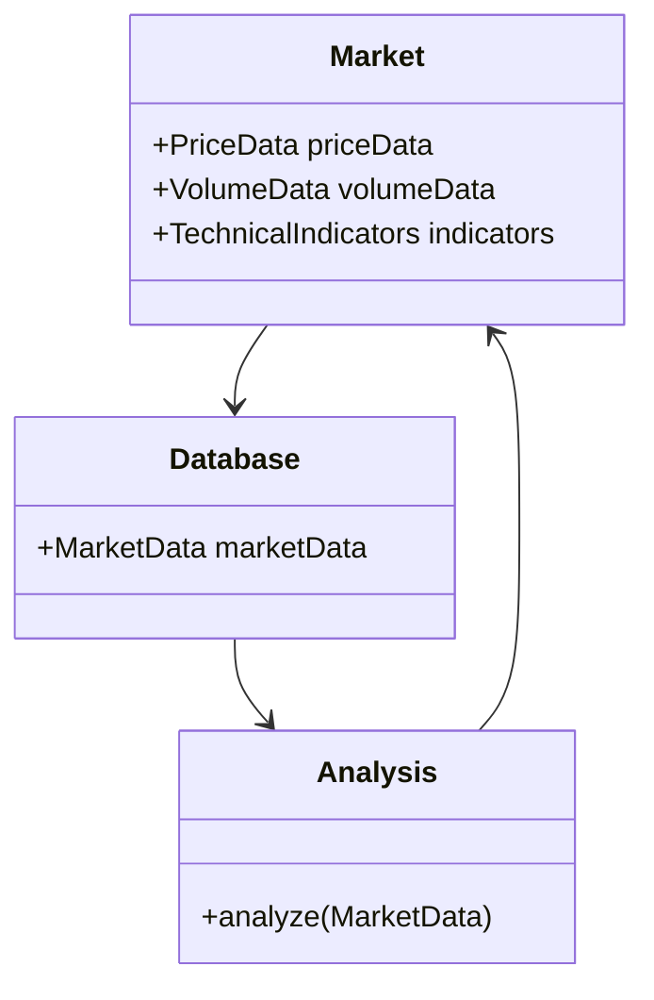
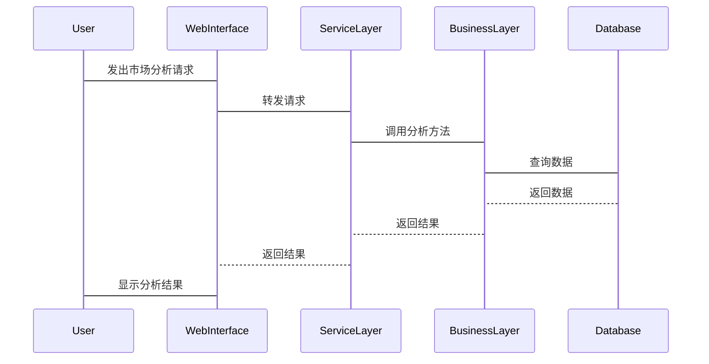

                 

# 詹姆斯蒙蒂尔的市场异常研究

---

## 关键词：
市场异常，交易策略，技术分析，统计套利，詹姆斯蒙蒂尔

---

## 摘要：
本文深入探讨了詹姆斯蒙蒂尔的市场异常研究，分析了市场异常的定义、识别方法、交易策略设计及其实现。通过技术分析、统计套利和系统架构设计，结合实际案例，展示了如何利用蒙蒂尔的理论进行有效投资。文章内容丰富，结构清晰，适合对金融市场和交易策略感兴趣的读者。

---

## 目录：

1. 市场异常研究的背景与基础
2. 蒙蒂尔的市场异常理论
3. 市场异常的识别与分析
4. 交易策略的设计与实现
5. 蒙蒂尔交易系统的架构与实现
6. 案例分析：蒙蒂尔策略的实际应用
7. 总结与展望

---

## 第1章：市场异常研究的背景与基础

### 1.1 市场异常的定义与分类

#### 1.1.1 市场异常的定义
市场异常是指市场价格偏离正常波动的模式，可能是短期的波动或长期趋势的变化。这种现象通常由市场结构、参与者行为或信息不对称引起。

#### 1.1.2 市场异常的类型与特征
- **短期异常**：如闪崩或快速反弹，通常由突发事件或市场情绪变化引发。
- **长期异常**：如长期趋势的逆转，可能与基本面变化或政策调整相关。

#### 1.1.3 异常与正常市场的区分标准
通过统计测试（如Z-score）和机器学习算法（如Isolation Forest）来识别异常。

### 1.2 市场异常的产生原因

#### 1.2.1 市场结构因素
- 市场深度不足导致流动性问题。
- 交易机制的缺陷，如订单簿失衡。

#### 1.2.2 市场参与者的心理与行为
- 投资者情绪波动，如恐慌性抛售或贪婪性买入。
- 群体思维导致的价格偏差。

#### 1.2.3 信息不对称的影响
- 内部信息导致的价格操纵。
- 信息传播延迟引发的市场反应差异。

---

## 第2章：蒙蒂尔的市场异常理论

### 2.1 蒙蒂尔的交易理念

#### 2.1.1 蒙蒂尔的交易哲学
- 价格反映所有信息：价格波动是市场情绪的体现。
- 交易机会源于价格偏差：市场异常是获利机会。

#### 2.1.2 蒙蒂尔的成功案例
- 1987年股灾后的反弹策略。
- 如何利用短期波动捕捉超额收益。

### 2.2 蒙蒂尔的市场分析方法

#### 2.2.1 技术分析与基本面分析的结合
- 技术指标（如RSI、MACD）与基本面数据（如 earnings growth）的综合分析。

#### 2.2.2 蒙蒂尔的交易信号识别
- 利用价格形态识别趋势反转点。
- 结合成交量分析判断信号强度。

---

## 第3章：市场异常的识别与分析

### 3.1 技术分析法

#### 3.1.1 常用技术指标
- **RSI（相对强度指数）**：衡量价格超买或超卖状态。
  $$ RSI = \frac{100 - \frac{100 - A}{(B - A)} } $$
- **MACD（移动平均收敛散度）**：通过短期和长期均线的交叉判断趋势。

#### 3.1.2 图表形态分析
- 头肩顶：价格从高点回落，形成M头形态。
- 双底：价格在底部形成W形态，预示反弹。

### 3.2 统计套利方法

#### 3.2.1 统计套利的基本原理
- 寻找价格偏差，利用均值回归策略进行套利。

#### 3.2.2 市场中性策略的应用
- 通过做多低估资产和做空高估资产，构建市场中性组合。

---

## 第4章：市场异常的量化分析

### 4.1 数据分析方法

#### 4.1.1 数据清洗与预处理
- 去除缺失值和异常值。
- 标准化处理（z-score标准化）。

#### 4.1.2 数据可视化与初步分析
- 使用折线图展示价格趋势。
- 利用箱线图检测异常值。

### 4.2 统计模型的应用

#### 4.2.1 时间序列分析
- ARIMA模型预测未来价格走势。

#### 4.2.2 异常检测算法
- 使用马尔可夫链模型识别状态转移。

---

## 第5章：交易策略的设计与实现

### 5.1 策略目标设定

#### 5.1.1 短期与长期策略的区别
- 短期策略：抓住短期价格波动。
- 长期策略：捕捉长期趋势变化。

#### 5.1.2 风险与收益的平衡
- 设置止损点和止盈点，控制风险。

### 5.2 策略的数学模型

#### 5.2.1 简单的线性回归模型
- 预测价格与时间的关系。
$$ Price = a \times Time + b $$

#### 5.2.2 时间序列模型的构建
- 使用ARIMA模型预测未来价格。

---

## 第6章：蒙蒂尔交易系统的架构与实现

### 6.1 系统功能设计

#### 6.1.1 领域模型（Mermaid类图）

### 6.2 系统架构设计

#### 6.2.1 系统架构（Mermaid架构图）

### 6.3 系统接口设计

#### 6.3.1 数据接口
- 数据获取接口：从数据库读取历史数据。
- 数据存储接口：将分析结果存入数据库。

#### 6.3.2 交易接口
- 订单提交接口：向交易系统发送买卖指令。
- 状态查询接口：获取当前订单状态。

### 6.4 系统交互设计

#### 6.4.1 交互流程（Mermaid序列图）

---

## 第7章：案例分析：蒙蒂尔策略的实际应用

### 7.1 案例背景
分析2008年金融危机后的市场反弹，蒙蒂尔如何利用策略获利。

### 7.2 数据分析与策略实现
- 使用Python代码实现RSI指标计算和交易信号生成。

### 7.3 实际案例分析
- 选取某段时间的市场数据，展示策略的应用和结果。

### 7.4 经验总结
- 策略的有效性取决于市场的波动性和数据质量。
- 需要根据市场变化调整策略参数。

---

## 第8章：总结与展望

### 8.1 总结
蒙蒂尔的市场异常研究为交易者提供了有效的工具和方法，结合技术分析和统计套利，能够捕捉市场机会。

### 8.2 展望
未来，结合人工智能和大数据分析，市场异常研究将更加精准和高效。

---

## 最佳实践 Tips

1. **数据质量**：确保数据的准确性和完整性。
2. **风险管理**：设置合理的止损点，控制风险。
3. **持续学习**：关注市场变化，不断优化策略。

---

通过以上详细的结构和内容安排，读者可以系统地了解詹姆斯蒙蒂尔的市场异常研究，并在实际操作中应用这些策略。

