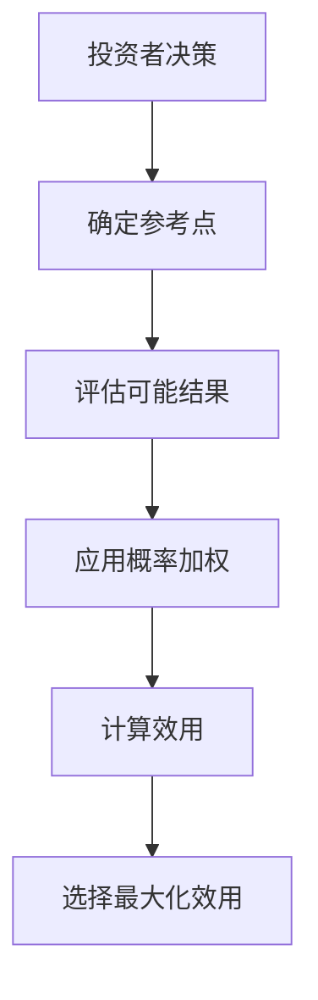
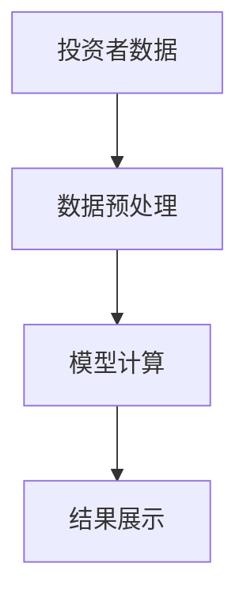

                 


# 第一部分: 詹姆斯蒙蒂尔的行为金融学应用概述

## 第1章: 行为金融学的背景与核心概念

### 1.1 行为金融学的起源与发展
#### 1.1.1 传统金融学的局限性
- 描述传统金融学的假设，如理性投资者假设的局限性。
- 引出行为金融学的必要性。

#### 1.1.2 行为金融学的兴起
- 简述行为金融学的发展历程，包括主要研究者和理论。
- 提到蒙蒂尔在行为金融学中的重要贡献。

#### 1.1.3 蒙蒂尔的贡献
- 详细讨论蒙蒂尔的前景理论，包括其对损失和收益的不同处理方式。
- 对比其他行为金融学家的理论，如特沃斯基和卡尼曼。

### 1.2 蒙蒂尔行为金融学的核心概念
#### 1.2.1 投资者心理与行为偏差
- 列出常见的投资者行为偏差，如过度自信、从众心理等。
- 用表格对比不同偏差的影响和表现。

#### 1.2.2 前景理论与损失厌恶
- 详细解释前景理论的核心观点，包括参考点和概率加权。
- 通过mermaid图展示前景理论的决策过程。

#### 1.2.3 行为金融学与传统金融学的对比
- 列表对比传统金融学和行为金融学在假设、模型和应用上的差异。
- 强调行为金融学在实际投资中的应用价值。

## 第2章: 蒙蒂尔行为金融学的核心理论

### 2.1 前景理论的数学模型
#### 2.1.1 前景理论的基本假设
- 解释前景理论中的参考点、概率加权函数和损益分离性。

#### 2.1.2 前景理论的公式表示
$$U(x) = \frac{x^{k}}{1 + x^{k}}$$
- 解释公式中的变量和参数，说明k值对效用函数的影响。

#### 2.1.3 前景理论与实际决策的对比
- 通过实例说明前景理论如何解释实际中的投资决策偏差。

### 2.2 损失厌恶与投资决策
#### 2.2.1 损失厌恶的定义
- 解释损失厌恶的概念，说明其如何影响投资者的决策。

#### 2.2.2 损失厌恶对投资组合的影响
- 分析损失厌恶如何导致投资组合的风险调整，如过度规避波动性资产。

#### 2.2.3 损失厌恶与风险偏好
- 探讨损失厌恶与风险偏好的关系，如何共同影响投资决策。

### 2.3 蒙蒂尔的行为金融学框架
#### 2.3.1 行为金融学的核心框架
- 用mermaid图展示行为金融学的框架，包括心理、行为和市场影响三个层面。

#### 2.3.2 蒙蒂尔框架与传统模型的对比
- 列表对比蒙蒂尔框架与CAPM、APT等传统模型在假设和应用上的差异。

#### 2.3.3 蒙蒂尔框架的实证支持
- 引用实证研究，说明蒙蒂尔框架的有效性和适用性。

## 第3章: 蒙蒂尔行为金融学的算法与数学模型

### 3.1 前景理论的算法实现
#### 3.1.1 前景理论的算法流程


#### 3.1.2 前景理论的代码实现
```python
def prospect_theory_utility(reward, loss, k=0.88):
    return (reward**k - loss**k) / (1 + reward**k - loss**k)
```
- 说明代码中的参数和函数，解释如何计算效用值。

### 3.2 损失厌恶的数学模型
#### 3.2.1 损失厌恶的数学公式
$$U(x) = x^{\gamma}$$
- 解释γ参数的意义，如何反映风险厌恶程度。

#### 3.2.2 损失厌恶的实证分析
- 讨论实证研究中损失厌恶系数的估计方法和结果。

#### 3.2.3 损失厌恶与投资组合优化
- 探讨如何在投资组合优化中考虑损失厌恶，调整风险和收益的权重。

## 第4章: 蒙蒂尔行为金融学的系统架构与设计

### 4.1 行为金融学系统的总体架构
#### 4.1.1 系统功能模块
- 列出系统的主要功能模块，如数据采集、模型构建、结果分析等。

#### 4.1.2 系统功能设计
```mermaid
classDiagram
    class 投资者行为分析系统 {
        +数据输入模块
        +模型计算模块
        +结果展示模块
    }
    投资者行为分析系统 -> 数据输入模块: 输入投资者数据
    数据输入模块 -> 模型计算模块: 分析行为偏差
    模型计算模块 -> 结果展示模块: 显示分析结果
```

#### 4.1.3 系统架构设计

- 解释每个模块的功能和模块之间的关系。

## 第5章: 蒙蒂尔行为金融学的项目实战

### 5.1 项目背景与目标
- 描述实际投资场景，如股票市场中的投资者行为分析。

### 5.2 项目实现
#### 5.2.1 数据收集与处理
- 说明如何收集投资者行为数据，如交易记录、问卷调查结果。

#### 5.2.2 模型实现
```python
def calculate_behavior_bias(dataframe):
    # 计算前景理论效用
    utils = dataframe.apply(lambda x: prospect_theory_utility(x['收益'], x['损失']))
    return utils
```
- 详细解释代码实现，包括数据处理和模型应用。

#### 5.2.3 实证分析与结果展示
- 展示分析结果，如投资者的行为偏差分布图。

### 5.3 实际案例分析
- 分析一个具体案例，如某基金投资者的行为偏差，解释如何通过蒙蒂尔理论优化投资策略。

## 第6章: 总结与展望

### 6.1 核心观点总结
- 总结蒙蒂尔行为金融学的核心观点及其在投资决策中的应用价值。

### 6.2 注意事项与局限性
- 讨论行为金融学的应用限制，如模型的复杂性和数据的可获得性。

### 6.3 未来研究方向
- 提出未来研究的方向，如结合大数据和机器学习进一步完善行为金融学模型。

### 6.4 最佳实践 tips
- 提供实际应用中的建议，如如何在投资决策中平衡理性与行为偏差。

## 第7章: 小结

- 总结全文，强调蒙蒂尔行为金融学的重要性及其在实际投资中的应用潜力。
- 鼓励读者进一步学习和应用行为金融学理论。

---

### 附录: 参考文献与拓展阅读
- 列出相关书籍、论文和在线资源，供读者进一步学习。

