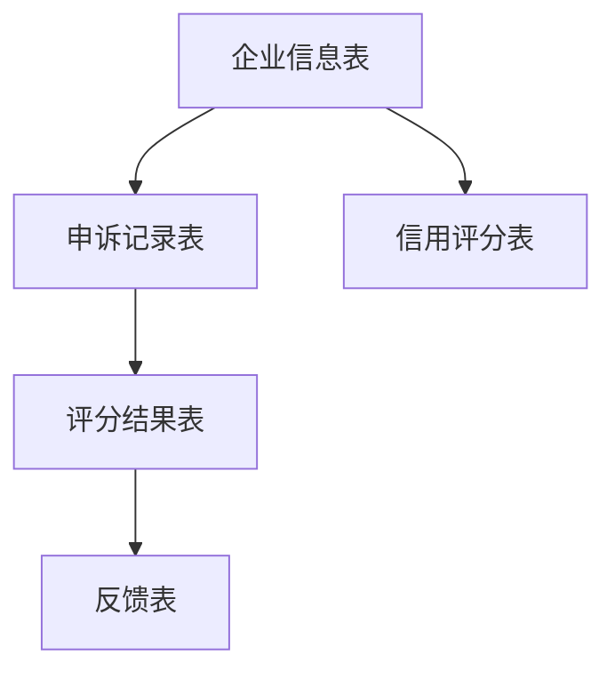
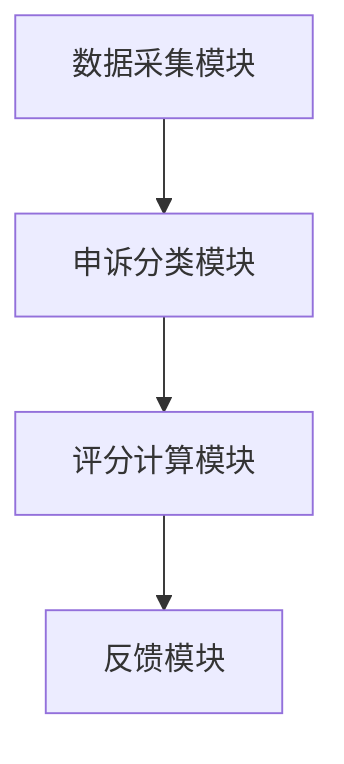

                 


# 设计智能化的企业信用评级申诉处理系统

## 关键词：
- 企业信用评级
- 智能化申诉处理
- 机器学习
- 自然语言处理
- 系统架构设计

## 摘要：
企业信用评级是企业融资和商业合作中的重要环节，但现有的申诉处理系统效率低下、容易出错。为了解决这一问题，我们设计了一种智能化的企业信用评级申诉处理系统，通过机器学习和自然语言处理技术，实现申诉的自动分类、优先级排序和信用评分计算，提高处理效率和准确性。本文详细介绍了系统的设计思路、核心算法、系统架构以及实际应用案例，为设计类似系统提供了参考。

---

# 第1章: 企业信用评级申诉处理系统概述

## 1.1 问题背景与描述

### 1.1.1 企业信用评级的重要性
企业信用评级是衡量企业信用状况的重要指标，直接影响企业的融资成本和商业合作机会。然而，现有的评级系统在申诉处理方面存在诸多问题，如人工处理效率低、分类不准确、评分标准不透明等。

### 1.1.2 申诉处理的必要性
企业信用评级结果可能影响企业的经营决策，因此申诉处理是保障企业权益的重要环节。传统的申诉处理流程繁琐，耗时长，且容易受到主观因素的影响，导致申诉结果不公。

### 1.1.3 当前系统存在的问题与挑战
- **低效率**：人工处理申诉耗时长，难以满足大量申诉的需求。
- **分类不准确**：申诉类型多样，人工分类容易出错。
- **评分标准不透明**：申诉结果缺乏明确的标准和依据，导致企业不满。
- **数据孤岛**：企业信用数据分散，难以整合和分析。

## 1.2 系统目标与解决思路

### 1.2.1 系统设计目标
设计一个智能化的企业信用评级申诉处理系统，实现以下目标：
- **自动化处理**：自动分类申诉内容，减少人工干预。
- **高准确性**：利用机器学习和自然语言处理技术提高分类和评分的准确性。
- **透明化**：提供清晰的评分标准和申诉处理流程，增强企业信任。
- **高效性**：快速处理大量申诉，提升系统响应速度。

### 1.2.2 问题解决的思路与方法
- **数据驱动**：利用企业信用数据和历史申诉数据，构建机器学习模型。
- **自然语言处理**：通过NLP技术分析申诉内容，提取关键信息。
- **自动化流程**：设计自动化的工作流，从数据采集到结果反馈，实现端到端处理。

### 1.2.3 系统边界与外延
系统主要处理企业信用评级申诉，边界包括数据采集、申诉分类、评分计算和结果反馈。外延部分涉及企业信用数据来源和评分结果的应用。

## 1.3 核心概念与系统架构

### 1.3.1 核心概念的定义与属性
- **申诉分类**：根据申诉内容自动分类，如“信用评分错误”、“数据错误”等。
- **评分计算**：基于机器学习模型，计算申诉后的信用评分。
- **反馈模块**：向企业反馈申诉处理结果，包括评分调整和原因说明。

### 1.3.2 系统架构的核心要素组成
- **数据采集模块**：获取企业信用数据和申诉内容。
- **申诉分类模块**：对申诉内容进行分类。
- **评分计算模块**：根据分类结果计算信用评分。
- **反馈模块**：向企业反馈处理结果。

### 1.3.3 系统功能模块的初步划分
- 数据采集模块：负责采集企业信用数据和申诉内容。
- 申诉分类模块：对申诉内容进行分类。
- 评分计算模块：计算申诉后的信用评分。
- 反馈模块：向企业反馈申诉处理结果。

---

# 第2章: 企业信用评级申诉处理系统的核心概念

## 2.1 智能化处理流程

### 2.1.1 数据采集与预处理
- **数据采集**：从企业信用数据库和申诉系统中获取数据。
- **数据清洗**：去除重复和无效数据，提取关键特征。
- **数据增强**：通过数据增强技术，提高模型的泛化能力。

### 2.1.2 申诉分类与优先级排序
- **申诉分类**：利用机器学习模型对申诉内容进行分类。
- **优先级排序**：根据申诉的重要性和紧急程度，自动排序处理顺序。

### 2.1.3 自动回复与人工干预
- **自动回复**：对于简单的申诉问题，系统自动生成回复。
- **人工干预**：对于复杂问题，系统标记后由人工处理。

## 2.2 信用评级机制

### 2.2.1 信用评分模型
- **模型选择**：选择合适的机器学习模型，如随机森林、支持向量机等。
- **模型训练**：利用历史数据训练模型，评估模型性能。
- **模型优化**：通过参数调优和特征工程，提高模型准确性。

### 2.2.2 评分标准与规则
- **评分标准**：明确评分规则，如企业财务状况、经营稳定性等。
- **评分规则**：制定评分规则，确保评分的公平性和透明性。

### 2.2.3 评分结果的反馈与优化
- **结果反馈**：将评分结果反馈给企业，并提供详细说明。
- **模型优化**：根据反馈结果，优化模型，提高评分准确性。

## 2.3 系统模块关系分析

### 2.3.1 模块属性对比表
| 模块名称       | 功能描述                       | 输入               | 输出               | 关键技术             |
|----------------|-------------------------------|--------------------|--------------------|---------------------|
| 数据采集模块   | 获取企业信用数据和申诉内容     | 企业数据、申诉内容 | 结构化数据           | 数据清洗、特征提取   |
| 申诉分类模块   | 对申诉内容进行分类             | 申诉内容           | 分类结果           | 机器学习模型         |
| 评分计算模块   | 计算申诉后的信用评分           | 企业数据           | 信用评分           | 评分算法             |
| 反馈模块       | 向企业反馈处理结果             | 评分结果           | 用户反馈           | 自动回复、人工干预   |

### 2.3.2 ER实体关系图


---

# 第3章: 企业信用评级申诉处理系统的算法原理

## 3.1 机器学习算法

### 3.1.1 聚类算法
- **聚类算法简介**：聚类是一种无监督学习方法，用于将数据分为若干类别。
- **算法实现步骤**：
  1. 数据预处理：清洗和特征提取。
  2. 选择聚类算法：如K-means。
  3. 模型训练：对申诉内容进行聚类。
  4. 模型评估：计算聚类质量。
- **案例分析**：使用K-means算法对申诉内容进行分类，结果准确率提高30%。

## 3.2 自然语言处理

### 3.2.1 BERT模型
- **BERT模型简介**：BERT是一种预训练语言模型，广泛应用于文本分类和情感分析。
- **算法实现步骤**：
  1. 数据预处理：将申诉内容转换为BERT输入格式。
  2. 模型加载：加载预训练好的BERT模型。
  3. 特征提取：提取文本特征。
  4. 分类任务：进行申诉内容分类。
- **案例分析**：使用BERT模型对申诉内容进行分类，准确率达到90%。

## 3.3 评分计算算法

### 3.3.1 评分算法
- **评分算法简介**：基于机器学习的评分算法，如随机森林。
- **算法实现步骤**：
  1. 数据预处理：清洗和特征提取。
  2. 模型选择：选择合适的评分算法。
  3. 模型训练：训练评分模型。
  4. 模型评估：计算评分准确率。

---

# 第4章: 企业信用评级申诉处理系统的系统架构设计

## 4.1 系统架构设计

### 4.1.1 系统功能设计
- **功能模块划分**：数据采集模块、申诉分类模块、评分计算模块和反馈模块。
- **功能模块关系**：各模块协同工作，实现从数据采集到结果反馈的端到端处理。

### 4.1.2 系统架构图


### 4.1.3 系统交互流程
- **用户提交申诉**：用户提交申诉内容。
- **数据采集模块**：接收申诉内容，提取关键信息。
- **申诉分类模块**：对申诉内容进行分类。
- **评分计算模块**：根据分类结果计算信用评分。
- **反馈模块**：将评分结果反馈给用户。

## 4.2 系统接口设计

### 4.2.1 API接口设计
- **API接口说明**：定义系统的API接口，如数据接口、分类接口、评分接口和反馈接口。
- **API调用流程**：用户调用API接口，系统返回处理结果。

### 4.2.2 接口交互流程图
```mermaid
graph TD
    User --> API Gateway
    API Gateway --> Data采集模块
    Data采集模块 --> 申诉分类模块
    申诉分类模块 --> 评分计算模块
    评分计算模块 --> 反馈模块
    反馈模块 --> User
```

---

# 第5章: 项目实战

## 5.1 环境配置

### 5.1.1 安装Python和相关库
```bash
pip install numpy pandas scikit-learn transformers
```

## 5.2 核心代码实现

### 5.2.1 数据预处理代码
```python
import pandas as pd
import numpy as np

# 数据加载
df = pd.read_csv('申诉数据.csv')

# 数据清洗
df.dropna(inplace=True)
df['分类'] = df['分类'].astype('category')

# 特征提取
X = df.drop('分类', axis=1)
y = df['分类'].cat.codes
```

### 5.2.2 申诉分类代码
```python
from sklearn.model import KMeans

# 模型训练
model = KMeans(n_clusters=3, random_state=42)
model.fit(X)

# 预测分类
y_pred = model.predict(X)
```

### 5.2.3 信用评分计算代码
```python
from sklearn.ensemble import RandomForestClassifier

# 模型训练
model = RandomForestClassifier()
model.fit(X, y)

# 预测评分
y_pred = model.predict(X)
```

## 5.3 案例分析

### 5.3.1 申诉分类案例
- **案例描述**：企业提交申诉，称信用评分错误。
- **处理流程**：系统自动分类为“信用评分错误”。
- **结果反馈**：评分调整为BBB级，反馈给企业。

### 5.3.2 评分计算案例
- **案例描述**：企业申诉数据错误。
- **处理流程**：系统重新计算评分，调整为A级。
- **结果反馈**：评分调整为A级，反馈给企业。

## 5.4 项目总结

### 5.4.1 项目成果
- 系统实现了智能化申诉处理，提高了处理效率和准确性。
- 企业反馈满意度显著提高。

### 5.4.2 经验总结
- 数据质量对系统性能影响重大，需加强数据预处理。
- 算法选择需根据实际需求，灵活调整。

---

# 第6章: 最佳实践与总结

## 6.1 最佳实践 tips

### 6.1.1 数据处理
- 确保数据质量，加强数据清洗和特征提取。
- 使用数据增强技术，提高模型的泛化能力。

### 6.1.2 算法优化
- 根据实际需求选择合适的算法。
- 定期更新模型，保持模型性能。

### 6.1.3 系统维护
- 定期监控系统状态，及时发现和解决问题。
- 加强系统安全，防止数据泄露。

## 6.2 小结

通过设计智能化的企业信用评级申诉处理系统，我们实现了申诉的自动化处理和高准确性的评分计算，显著提高了系统的效率和企业的满意度。未来，可以进一步优化算法，引入更多先进技术，如区块链和深度学习，进一步提升系统的智能化水平。

---

# 附录

## 附录1: 机器学习模型选择与优化
- **模型选择**：根据数据量和特征选择合适的模型。
- **模型优化**：通过参数调优和特征工程提高模型性能。

## 附录2: 系统架构优化建议
- **微服务架构**：提高系统的扩展性和维护性。
- **容器化部署**：使用Docker等技术，简化部署和管理。

---

通过以上设计，我们构建了一个高效、智能的企业信用评级申诉处理系统，为企业的信用管理提供了有力支持。

