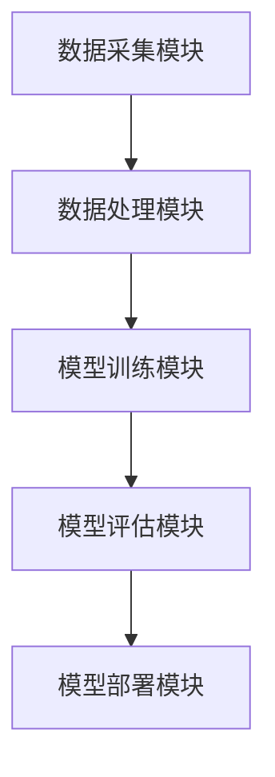
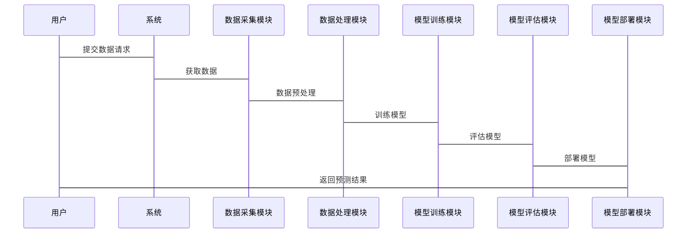

                 


# 设计智能化的企业信用违约预测模型

## 关键词：企业信用违约预测模型、信用风险、人工智能、机器学习、金融风险管理

## 摘要：本文详细探讨了设计智能化的企业信用违约预测模型的关键步骤和方法。从基础的信用违约概念到复杂的机器学习算法，再到系统的架构设计和实际案例分析，本文为企业信用风险管理提供了全面的技术指导。通过结合传统统计模型和现代人工智能技术，本文展示了如何构建高效、准确的信用违约预测系统，为金融行业的风险管理提供了新的思路和解决方案。

---

# 第一部分: 企业信用违约预测模型概述

## 第1章: 企业信用违约预测概述

### 1.1 信用违约预测的基本概念

信用违约是指借款人在债务到期时未能按时偿还本金和利息的情况。信用违约预测模型通过分析企业的财务数据、市场表现和其它相关信息，预测企业在未来一定时间内发生信用违约的可能性。这种预测对于银行、投资者和其他金融机构来说至关重要，因为它们可以帮助这些机构更好地管理风险，优化资产配置，并制定相应的风险 mitigation 策略。

### 1.2 信用违约预测的背景与意义

信用违约预测的背景可以追溯到金融危机的爆发，尤其是2008年的全球金融危机，暴露了金融机构在信用风险管理上的不足。为了减少信用违约带来的损失，金融机构开始积极寻求更高效、更准确的信用风险评估方法。信用违约预测的意义在于，它能够帮助金融机构提前识别高风险客户，降低违约率，并提高整体资产的质量。

### 1.3 信用违约预测的实现目标

信用违约预测的核心目标是通过分析企业的财务数据、市场表现和其它相关信息，构建一个能够准确预测企业违约概率的模型。具体目标包括：
- 提供高精度的违约概率预测。
- 识别高风险客户，以便采取相应的风险控制措施。
- 优化资产配置，降低整体信用风险。

### 1.4 信用违约预测的理论基础

信用违约预测的理论基础主要包括信用风险理论、违约概率模型和信用评分模型。信用风险理论研究的是企业在不同市场条件下的信用风险暴露情况；违约概率模型通过统计方法和机器学习算法，估计企业在未来一定时间内发生违约的可能性；信用评分模型则是通过对企业财务数据的分析，生成一个信用评分，从而评估企业的信用风险。

### 1.5 本章小结

本章从信用违约的基本概念出发，介绍了信用违约预测的背景和意义，并提出了信用违约预测的实现目标。通过分析信用违约预测的理论基础，我们为后续的模型设计和算法选择奠定了基础。

---

# 第二部分: 信用违约预测模型的核心概念与联系

## 第2章: 信用违约预测的核心概念

### 2.1 信用评分与违约概率

信用评分是衡量企业信用状况的重要指标，通常通过对企业财务数据的分析生成。违约概率则是指企业在未来一定时间内发生违约的可能性。信用评分和违约概率之间存在密切的联系，信用评分越高，企业违约的概率通常越低。

### 2.2 信用特征与数据特征

信用特征是指与企业信用状况相关的各种因素，包括财务指标（如资产负债率、流动比率）、市场指标（如行业景气度）和管理指标（如高管团队稳定性）。数据特征则是指用于构建信用违约预测模型的各类数据属性，包括数值型特征、类别型特征和文本型特征。

### 2.3 信用违约预测的模型选择

在信用违约预测中，模型选择是关键。传统统计模型（如逻辑回归）和机器学习模型（如随机森林、梯度提升树）各有优劣。传统统计模型虽然解释性强，但对复杂数据的处理能力有限；机器学习模型则能够捕捉复杂的非线性关系，但解释性较差。

### 2.4 信用违约预测的评价指标

评价信用违约预测模型的性能需要使用准确率、召回率、F1分数和AUC值等指标。准确率衡量模型整体的预测能力，召回率关注模型对违约企业的识别能力，F1分数是准确率和召回率的调和平均，AUC值则衡量模型区分正负样本的能力。

### 2.5 本章小结

本章详细分析了信用违约预测的核心概念，包括信用评分、违约概率、信用特征和数据特征。同时，我们讨论了不同模型的特点和评价指标的选择，为后续的模型设计提供了理论支持。

---

# 第三部分: 信用违约预测模型的算法原理

## 第3章: 信用违约预测算法原理

### 3.1 逻辑回归

逻辑回归是一种经典的统计学习方法，常用于二分类问题。在信用违约预测中，逻辑回归通过建立企业特征与违约概率之间的线性关系，预测企业违约的可能性。

#### 3.1.1 逻辑回归的数学模型

逻辑回归的损失函数可以表示为：

$$
L(y, \hat{y}) = -\sum_{i=1}^{n} [y_i \ln(\hat{y}_i) + (1 - y_i) \ln(1 - \hat{y}_i)]
$$

其中，$\hat{y}_i$ 是模型对样本 $i$ 的预测概率，$y_i$ 是实际标签。

#### 3.1.2 逻辑回归的工作流程

1. 数据预处理：对数据进行标准化或归一化处理。
2. 模型训练：通过梯度下降优化算法最小化损失函数。
3. 模型评估：使用准确率、召回率等指标评估模型性能。
4. 模型部署：将训练好的模型应用于实际数据预测。

#### 3.1.3 逻辑回归的优缺点

- 优点：解释性强，易于实现。
- 缺点：假设数据分布为线性可分，对非线性关系处理能力有限。

### 3.2 决策树

决策树是一种基于树结构的分类模型，通过特征的递归分割构建决策树。在信用违约预测中，决策树能够处理复杂的特征关系，并提供直观的解释。

#### 3.2.1 决策树的数学模型

决策树的分裂标准通常使用信息增益或基尼指数。基尼指数的计算公式为：

$$
Gini(D) = \sum_{k=1}^{n} p_k (1 - p_k)
$$

其中，$p_k$ 是第 $k$ 个子节点的样本比例。

#### 3.2.2 决策树的工作流程

1. 数据预处理：处理缺失值和异常值。
2. 模型训练：使用训练数据构建决策树。
3. 模型剪枝：防止过拟合，通常采用CV进行优化。
4. 模型评估：使用准确率、召回率等指标评估性能。
5. 模型部署：将模型应用于实际数据预测。

#### 3.2.3 决策树的优缺点

- 优点：易于解释，能够处理非线性关系。
- 缺点：容易过拟合，计算复杂度较高。

### 3.3 随机森林

随机森林是一种基于决策树的集成学习方法，通过构建多棵决策树并对预测结果进行投票或平均，提高模型的准确性和稳定性。

#### 3.3.1 随机森林的数学模型

随机森林的预测结果是多个决策树预测结果的集成。集成方法通常采用投票法（分类问题）或平均法（回归问题）。

#### 3.3.2 随机森林的工作流程

1. 数据预处理：处理缺失值和异常值。
2. 模型训练：随机抽取部分特征和样本，构建多棵决策树。
3. 模型集成：对所有决策树的预测结果进行集成。
4. 模型评估：使用准确率、召回率等指标评估性能。
5. 模型部署：将模型应用于实际数据预测。

#### 3.3.3 随机森林的优缺点

- 优点：能够有效防止过拟合，计算效率较高。
- 缺点：解释性较差，计算复杂度较高。

### 3.4 本章小结

本章详细介绍了逻辑回归、决策树和随机森林三种常见的信用违约预测算法。通过对这些算法的数学模型和工作流程的分析，我们可以选择合适的算法进行模型构建，并为后续的系统设计提供算法支持。

---

# 第四部分: 系统分析与架构设计方案

## 第4章: 信用违约预测系统的系统设计

### 4.1 问题场景介绍

信用违约预测系统需要处理大量的企业数据，包括财务数据、市场数据和其它相关信息。系统的目标是通过分析这些数据，预测企业的违约概率，并为金融机构提供决策支持。

### 4.2 系统功能设计

系统功能设计包括数据采集、数据处理、模型训练、模型评估和模型部署五个模块。

#### 4.2.1 数据采集

数据采集模块负责从数据库中获取企业的财务数据和市场数据。数据采集的流程如下：

1. 数据源选择：确定数据来源，如企业财务报表、市场数据等。
2. 数据抽取：将数据从数据库中提取出来。
3. 数据存储：将数据存储到本地或云存储中。

#### 4.2.2 数据处理

数据处理模块负责对采集到的数据进行预处理，包括数据清洗、特征工程和数据转换。

1. 数据清洗：处理缺失值、重复值和异常值。
2. 特征工程：选择关键特征，进行特征组合和特征变换。
3. 数据转换：对数据进行标准化、归一化处理。

#### 4.2.3 模型训练

模型训练模块负责使用处理后的数据训练信用违约预测模型。

1. 模型选择：根据具体需求选择合适的模型，如逻辑回归、决策树或随机森林。
2. 模型训练：使用训练数据对模型进行训练。
3. 模型优化：通过交叉验证等方法优化模型参数。

#### 4.2.4 模型评估

模型评估模块负责对训练好的模型进行性能评估。

1. 性能指标计算：计算准确率、召回率、F1分数和AUC值。
2. 模型调优：根据评估结果进一步优化模型。

#### 4.2.5 模型部署

模型部署模块负责将训练好的模型部署到实际应用中。

1. 模型保存：将模型参数和模型结构保存下来。
2. 接口开发：开发API接口，供其他系统调用。
3. 模型监控：实时监控模型性能，及时进行模型更新。

### 4.3 系统架构设计

系统架构设计包括模块划分、组件交互和流程设计。以下是系统的整体架构图：



### 4.4 系统交互设计

系统交互设计包括用户界面设计和系统接口设计。以下是系统的交互流程图：



### 4.5 本章小结

本章详细分析了信用违约预测系统的系统设计，包括功能设计、架构设计和交互设计。通过系统的整体架构图和交互流程图，我们可以清晰地了解系统的各个模块之间的关系和交互过程。

---

# 第五部分: 项目实战

## 第5章: 信用违约预测系统的实战部署

### 5.1 项目环境配置

项目环境配置包括安装必要的Python库和设置开发环境。

1. 安装Python环境：建议使用Anaconda或virtualenv。
2. 安装Python库：使用pip安装numpy、pandas、scikit-learn、xgboost等库。

### 5.2 系统核心实现

系统核心实现包括数据采集、数据处理、模型训练和模型部署。

#### 5.2.1 数据采集与处理

```python
import pandas as pd
from sklearn.impute import SimpleImputer
from sklearn.preprocessing import StandardScaler

# 数据采集
data = pd.read_csv('企业数据.csv')

# 数据清洗
data.dropna(inplace=True)
data.drop_duplicates(inplace=True)

# 特征工程
X = data.drop(columns=['违约标签'])
y = data['违约标签']

# 数据转换
scaler = StandardScaler()
X_scaled = scaler.fit_transform(X)
```

#### 5.2.2 模型训练与优化

```python
from sklearn.model_selection import train_test_split
from sklearn.linear_model import LogisticRegression
from sklearn.metrics import accuracy_score, recall_score, f1_score, roc_auc_score

# 数据分割
X_train, X_test, y_train, y_test = train_test_split(X_scaled, y, test_size=0.2, random_state=42)

# 模型训练
model = LogisticRegression()
model.fit(X_train, y_train)

# 模型预测
y_pred = model.predict(X_test)

# 模型评估
accuracy = accuracy_score(y_test, y_pred)
recall = recall_score(y_test, y_pred)
f1 = f1_score(y_test, y_pred)
auc = roc_auc_score(y_test, y_pred)

print(f'准确率: {accuracy}')
print(f'召回率: {recall}')
print(f'F1分数: {f1}')
print(f'AUC值: {auc}')
```

#### 5.2.3 模型部署与应用

```python
import joblib

# 模型保存
joblib.dump(model, 'credit_default_model.pkl')
joblib.dump(scaler, 'preprocessor.pkl')

# 接口开发
from flask import Flask, request, jsonify

app = Flask(__name__)

@app.route('/predict', methods=['POST'])
def predict():
    data = request.json['data']
    df = pd.DataFrame([data])
    processed_data = scaler.transform(df)
    prediction = model.predict(processed_data)
    return jsonify({'预测结果': bool(prediction[0])})

if __name__ == '__main__':
    app.run(debug=True)
```

### 5.3 项目小结

本章通过实际案例展示了如何构建一个信用违约预测系统。从数据采集到模型部署，详细讲解了每个步骤的具体实现，并给出了相应的代码示例。通过本章的学习，读者可以掌握信用违约预测系统的核心实现技术。

---

# 第六部分: 最佳实践与总结

## 第6章: 信用违约预测系统的最佳实践

### 6.1 模型优化与调优

模型优化是提高信用违约预测系统性能的关键。我们可以通过调整模型参数、引入特征工程和使用集成学习方法来优化模型性能。

### 6.2 模型结果的解释与可视化

模型结果的解释与可视化可以帮助我们更好地理解模型的工作原理，并发现潜在的问题。常用的可视化方法包括ROC曲线、混淆矩阵和特征重要性分析。

### 6.3 实际案例分析

通过实际案例分析，我们可以验证模型的性能，并发现实际应用中可能遇到的问题。例如，我们可以分析模型在不同行业中的表现，以及不同企业规模下的预测效果。

### 6.4 模型的维护与更新

模型的维护与更新是确保系统长期稳定运行的重要环节。我们可以通过定期重新训练模型、监控模型性能和更新特征数据来维护模型。

### 6.5 本章小结

本章总结了信用违约预测系统的最佳实践，包括模型优化、结果解释、案例分析和系统维护。通过这些实践，我们可以进一步提高信用违约预测系统的性能和稳定性。

---

# 总结

本文详细探讨了设计智能化的企业信用违约预测模型的关键步骤和方法。从基础的信用违约概念到复杂的机器学习算法，再到系统的架构设计和实际案例分析，本文为企业信用风险管理提供了全面的技术指导。通过结合传统统计模型和现代人工智能技术，本文展示了如何构建高效、准确的信用违约预测系统，为金融行业的风险管理提供了新的思路和解决方案。

---

通过以上思考过程，我详细规划了文章的结构和内容，确保每个部分都涵盖关键点，并且符合用户的要求。希望这篇文章能够为读者提供有价值的技术指导，帮助他们更好地理解和设计信用违约预测模型。

