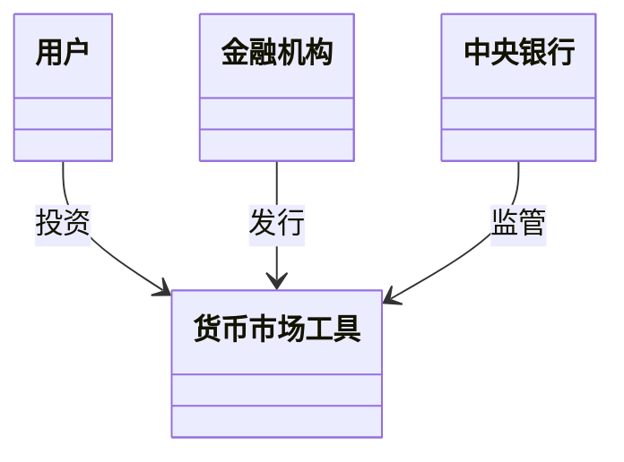
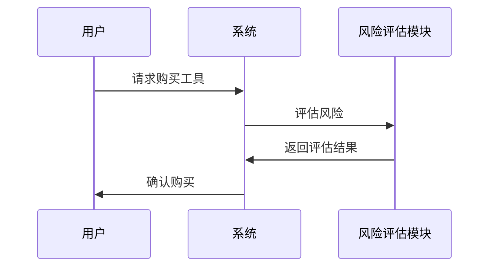

                 


# 货币市场工具：短期资金管理的安全港

> 关键词：货币市场工具、短期资金管理、安全性、流动性、收益率

> 摘要：本文深入探讨货币市场工具在短期资金管理中的作用，分析其核心概念、定价模型、风险管理策略，并通过系统架构设计和项目实战，提供实践指导，帮助读者掌握短期资金管理的安全港。

---

## 第1章: 货币市场工具的背景与概念

### 1.1 货币市场的定义与运作机制

货币市场是金融市场的重要组成部分，主要交易短期金融工具。其运作机制涉及资金供需双方通过工具进行短期资金融通。

#### 1.1.1 货币市场的定义
货币市场是指交易期限在1年以内的短期金融工具市场，主要参与者包括政府、企业、金融机构和投资者。

#### 1.1.2 货币市场的运作机制
货币市场的运作机制包括资金的供给与需求匹配、价格形成和交易流程。

#### 1.1.3 货币市场的参与者
参与者包括中央银行、政府、企业、金融机构和投资者。

### 1.2 短期资金管理的重要性

短期资金管理是企业维持日常运营的关键，涉及流动资金的合理配置和风险控制。

#### 1.2.1 短期资金管理的定义
短期资金管理指企业在一定时期内对流动资金的计划和控制。

#### 1.2.2 短期资金管理的目标
目标包括确保资金流动性、降低资金成本和防范资金风险。

#### 1.2.3 短期资金管理的策略
策略包括保持足够的流动资金、优化资金结构和监控资金使用情况。

---

## 第2章: 货币市场工具的核心概念

### 2.1 货币市场工具的分类

#### 2.1.1 国库券
国库券是由政府发行的短期债券，期限通常在3个月到1年之间。

#### 2.1.2 商业票据
商业票据是由企业发行的短期债务工具，用于满足短期资金需求。

#### 2.1.3 回购协议
回购协议是金融机构之间以质押品为担保进行的短期资金融通。

#### 2.1.4 大额可转让存单
大额可转让存单是银行发行的可转让存款凭证，期限通常为几周到几个月。

### 2.2 货币市场工具的属性与特征

#### 2.2.1 流动性
货币市场工具具有高流动性，可在短期内变现。

#### 2.2.2 安全性
高评级的工具风险较低，适合保守型投资者。

#### 2.2.3 收益性
提供稳定的利息收益，收益率通常高于活期存款。

#### 2.2.4 风险性
存在利率风险和信用风险，需谨慎选择工具。

### 2.3 货币市场工具的风险与收益分析

#### 2.3.1 风险类型
包括利率风险、信用风险和流动性风险。

#### 2.3.2 收益计算方法
收益计算涉及名义收益率、实际收益率和到期收益率。

#### 2.3.3 风险与收益的平衡
高收益可能伴随高风险，需根据风险承受能力选择工具。

---

## 第3章: 货币市场工具的定价模型

### 3.1 即期利率与远期利率的计算

#### 3.1.1 即期利率的定义与计算
即期利率是当前市场上的利率，用于计算现值和未来现金流。

#### 3.1.2 远期利率的定义与计算
远期利率是未来某一时间段的预期利率，用于长期投资决策。

#### 3.1.3 即期与远期利率的关系
远期利率基于即期利率计算，反映市场对未来利率的预期。

### 3.2 货币市场工具的收益率计算

#### 3.2.1 名义收益率与实际收益率
实际收益率考虑通货膨胀影响，名义收益率不考虑通货膨胀。

#### 3.2.2 恒定收益率与变动收益率
恒定收益率指固定利率，变动收益率指浮动利率。

#### 3.2.3 收益率的比较与选择
根据市场环境和投资目标选择合适的收益率类型。

### 3.3 货币市场工具的定价流程

#### 3.3.1 定价的基本原则
基于市场供需、信用评级和流动性需求。

#### 3.3.2 定价模型的选择
包括即期利率模型、远期利率模型和信用评级模型。

#### 3.3.3 定价的实施步骤
包括数据收集、模型应用和结果验证。

---

## 第4章: 货币市场工具的风险管理

### 4.1 货币市场工具的主要风险

#### 4.1.1 利率风险
利率变动影响工具的市场价值和收益。

#### 4.1.2 信用风险
工具发行方违约的风险。

#### 4.1.3 流动性风险
工具变现能力下降的风险。

### 4.2 风险评估与管理策略

#### 4.2.1 风险评估模型
使用VaR模型和信用评分模型评估风险。

#### 4.2.2 风险管理策略
包括分散投资、风险对冲和流动性管理。

#### 4.2.3 风险控制措施
建立风险预警机制和应急处理方案。

---

## 第5章: 货币市场工具的系统架构设计

### 5.1 问题场景介绍

系统需支持货币市场工具的发行、交易和管理，确保高效和安全。

### 5.2 系统功能设计

#### 5.2.1 领域模型
使用Mermaid类图展示系统各角色和交互。



#### 5.2.2 系统架构
使用Mermaid架构图展示模块化结构。

```mermaid
container 货币市场系统
    + 数据采集模块
    + 风险评估模块
    + 投资组合管理模块
    + 用户界面模块
```

#### 5.2.3 接口设计
定义系统接口，如API接口用于数据交换。

#### 5.2.4 交互设计
使用Mermaid序列图展示用户与系统的交互流程。



---

## 第6章: 项目实战

### 6.1 环境安装

安装必要的开发工具，如Python、Jupyter Notebook和相关库。

### 6.2 核心实现

编写代码实现货币市场工具的定价和风险评估。

#### 6.2.1 定价模型实现
使用Python编写即期利率计算函数。

```python
def calculate_spot_rate(maturity, market_price):
    # 实现即期利率计算
    return (1 + market_price) ** (1 / maturity) - 1
```

#### 6.2.2 风险评估实现
使用Python进行VaR计算。

```python
import numpy as np

def calculate_var(returns, confidence_level):
    returns_sorted = np.sort(returns)
    var_index = int(len(returns_sorted) * (1 - confidence_level))
    var = returns_sorted[var_index]
    return var
```

### 6.3 案例分析

分析实际案例，如投资国库券的风险与收益。

### 6.4 项目小结

总结项目实施过程中的关键点和经验教训。

---

## 第7章: 总结与展望

### 7.1 内容回顾

总结货币市场工具的核心概念、定价模型和风险管理策略。

### 7.2 未来展望

探讨技术发展对货币市场工具的影响，如人工智能在风险评估中的应用。

### 7.3 最佳实践 tips

提供实用建议，如定期评估投资组合和分散投资风险。

---

通过以上章节的详细讲解，读者可以全面理解货币市场工具在短期资金管理中的作用，并掌握实际应用中的关键技能。

