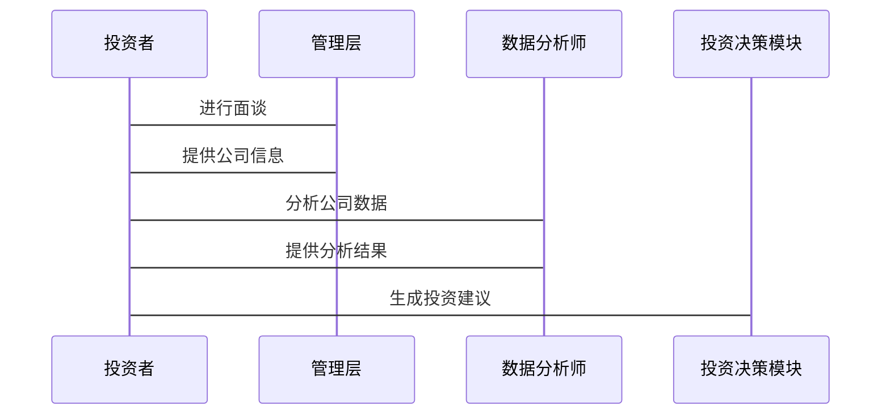

                 


# 《费雪的“与经理人面谈”：深入了解公司管理层》

> 关键词：费雪，投资分析，公司管理层，面谈策略，决策分析

> 摘要：本文深入分析了费雪的“与经理人面谈”方法，探讨其在投资决策中的应用，通过系统分析和案例研究，揭示了该方法的核心逻辑和实际价值，为投资者和企业管理者提供了实用的指导和启示。

---

## 第一部分：背景介绍

### 第1章：费雪与“与经理人面谈”概述

#### 1.1 费雪的背景与投资理念

- **1.1.1 费雪的生平简介**
  - 本杰明·格雷厄姆的学生，价值投资的倡导者。
  - 强调长期投资和对公司管理层的深入分析。

- **1.1.2 费雪的投资哲学与方法**
  - 投资目标：寻找能够持续增长的公司。
  - 方法：通过与管理层面谈，评估公司的成长潜力和管理质量。

- **1.1.3 费雪与“与经理人面谈”的起源**
  - 出于对管理层决策的理解和信任，发展出独特的面谈策略。

#### 1.2 与经理人面谈的核心理念

- **1.2.1 面谈的目的与意义**
  - 通过直接交流获取公司内部信息。
  - 评估管理层的诚信、能力和战略。

- **1.2.2 面谈的核心问题与解决思路**
  - 核心问题：公司未来增长的潜力和风险。
  - 解决思路：通过系统性面谈和数据分析，结合财务指标进行验证。

- **1.2.3 面谈的边界与外延**
  - 面谈的范围：管理层、财务、行业。
  - 外延：结合市场趋势和宏观经济因素。

#### 1.3 与经理人面谈的核心要素

- **1.3.1 面谈的关键要素与组成**
  - 管理层：战略、决策、诚信。
  - 公司基本面：财务状况、行业地位。
  - 宏观环境：经济趋势、政策影响。

- **1.3.2 面谈的逻辑结构与框架**
  - 问题分类：战略、财务、市场。
  - 分析步骤：信息收集、评估、验证。

- **1.3.3 面谈的实施步骤与方法**
  - 准备阶段：制定面谈提纲，收集公司资料。
  - 实施阶段：现场面谈，记录关键点。
  - 后续分析：结合数据，验证结论。

---

## 第二部分：核心概念与联系

### 第2章：与经理人面谈的核心概念

#### 2.1 面谈的核心概念原理

- **2.1.1 面谈的基本原理**
  - 通过直接交流获取内部信息，评估公司价值。
  - 结合定量分析，提高投资决策的准确性。

- **2.1.2 面谈的关键要素**
  - 管理层的诚信与能力。
  - 公司的财务健康状况。
  - 行业的竞争格局和发展趋势。

- **2.1.3 面谈的逻辑关系**
  - 管理层决策影响公司业绩。
  - 公司业绩影响股价和投资回报。

#### 2.2 核心概念的属性特征对比

- **2.2.1 面谈对象的属性对比**
  - 管理层：决策能力、战略眼光。
  - 公司：财务状况、市场地位。
  - 行业：发展趋势、竞争状况。

- **2.2.2 面谈内容的属性对比**
  - 战略：短期 vs 长期目标。
  - 财务：盈利能力 vs 成本控制。
  - 市场：增长潜力 vs 风险。

- **2.2.3 面谈结果的属性对比**
  - 正面：增长潜力大，管理能力强。
  - 负面：财务隐患，管理不善。

#### 2.3 ER实体关系图架构

```mermaid
erDiagram
    actor 投资者 {
        <属性> 管理层诚信
        <属性> 管理层能力
    }
    entity 公司 {
        <属性> 财务状况
        <属性> 市场地位
    }
    entity 行业 {
        <属性> 发展趋势
        <属性> 竞争状况
    }
    relationship 面谈结果 : 投资决策
```

---

## 第三部分：系统分析与架构设计方案

### 第3章：与经理人面谈的系统分析

#### 3.1 问题场景介绍

- **3.1.1 面谈的背景与目标**
  - 背景：识别优质投资标的，评估管理层。
  - 目标：通过面谈和数据验证，优化投资决策。

- **3.1.2 面谈的主要问题**
  - 管理层的诚信与能力。
  - 公司的财务状况和市场地位。
  - 行业的竞争格局和趋势。

- **3.1.3 面谈的预期成果**
  - 提供投资决策的参考依据。
  - 识别潜在风险和机会。

#### 3.2 项目介绍

- **3.2.1 项目目标与范围**
  - 目标：建立系统化的面谈流程和分析框架。
  - 范围：涵盖管理层、财务、行业分析。

- **3.2.2 项目的主要参与者**
  - 投资者：制定面谈策略。
  - 管理层：提供信息和反馈。
  - 数据分析师：支持分析和验证。

- **3.2.3 项目的实施步骤**
  - 准备阶段：制定面谈计划。
  - 实施阶段：开展面谈，记录关键信息。
  - 分析阶段：结合数据，评估公司价值。

#### 3.3 系统功能设计

- **3.3.1 面谈流程的设计**
  - 确定面谈对象：选择目标公司。
  - 制定面谈提纲：涵盖战略、财务、市场。
  - 实施面谈：记录关键点。

- **3.3.2 面谈内容的分类**
  - 战略：公司目标、市场策略。
  - 财务：利润、成本、现金流。
  - 管理：团队能力、决策风格。

- **3.3.3 面谈结果的分析**
  - 战略评估：短期 vs 长期目标。
  - 财务评估：ROE、毛利率、现金流。
  - 管理评估：诚信、决策能力。

#### 3.4 系统架构设计


- **3.4.1 面谈系统的整体架构**
  - 输入：面谈提纲、公司资料。
  - 处理：面谈记录、数据分析。
  - 输出：投资建议、风险评估。

- **3.4.2 系统模块的划分**
  - 面谈模块：记录和整理面谈内容。
  - 数据分析模块：结合财务指标进行验证。
  - 投资决策模块：生成投资建议。

- **3.4.3 系统模块之间的交互**
  - 面谈模块与数据分析模块：数据共享。
  - 数据分析模块与投资决策模块：分析结果传递。

#### 3.5 系统接口设计

- **3.5.1 系统的主要接口**
  - 面谈模块接口：记录面谈内容。
  - 数据分析模块接口：获取财务数据。
  - 投资决策模块接口：生成投资建议。

- **3.5.2 接口的交互流程**
  - 面谈记录 -> 数据分析 -> 投资建议。

#### 3.6 系统交互设计



---

## 第四部分：项目实战

### 第4章：与经理人面谈的项目实战

#### 4.1 案例分析

- **4.1.1 案例背景**
  - 公司：XYZ科技公司。
  - 行业：科技行业，竞争激烈。

- **4.1.2 面谈过程**
  - 管理层：CEO、CFO。
  - 问题：公司未来三年的目标、财务状况、行业竞争。

- **4.1.3 数据分析**
  - 财务指标：ROE、毛利率、现金流。
  - 市场分析：市场份额、竞争对手。

#### 4.2 系统核心实现源代码

```python
# 示例代码：计算ROE和毛利率
import pandas as pd

# 假设df是公司财务数据
def calculate_roe(df):
    net_income = df['净利润'].iloc[-1]
    equity = df['股东权益'].iloc[-1]
    return net_income / equity

def calculate_gross_profit_margin(df):
    gross_profit = df['毛利润'].iloc[-1]
    revenue = df['收入'].iloc[-1]
    return gross_profit / revenue

# 示例使用
data = {
    '净利润': [100, 150, 200],
    '股东权益': [500, 600, 700],
    '毛利润': [200, 250, 300],
    '收入': [1000, 1200, 1400]
}
df = pd.DataFrame(data)
ro

