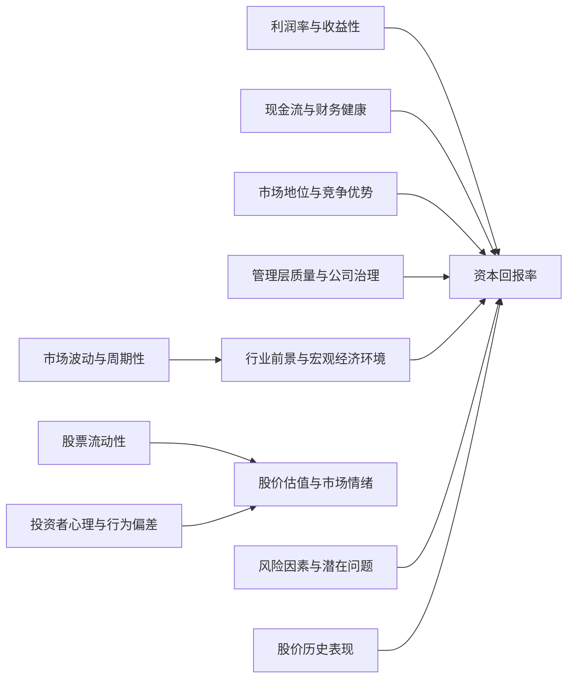
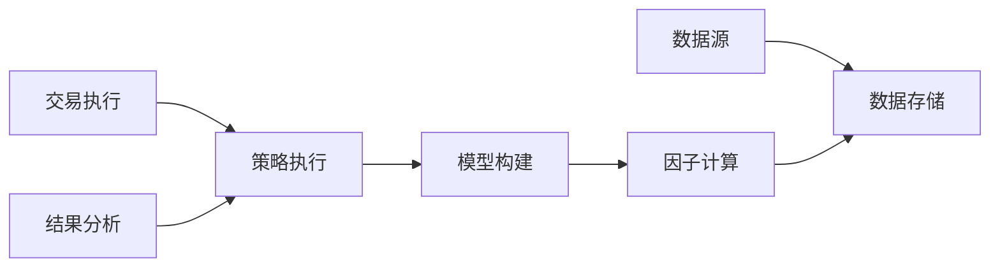

                 


```markdown
# 费雪的“十五个点”在当代投资中的应用与调整

## 关键词：费雪投资理论、十五个点、现代投资、投资策略、风险管理

## 摘要：本文深入探讨了费雪的“十五个点”投资理论在当代的应用与调整，分析了其核心概念、现代环境下的变化、系统架构设计及实际案例，提供了最佳实践和未来投资趋势的见解。

---

# 第1章: 费雪的生平与投资理论概述

## 1.1 费雪的生平与投资理念
### 1.1.1 费雪的早年经历与职业发展
- **早年经历**：费雪出生于金融世家，早期在银行和投资公司工作，积累了丰富的投资经验。
- **职业发展**：成为知名的投资顾问，倡导价值投资理念，强调长期持有优质股票。

### 1.1.2 费雪的投资哲学与核心思想
- **长期投资**：认为市场短期波动不可预测，但优质企业长期会有稳定的回报。
- **价值投资**：寻找具有持续增长潜力的优秀企业，而非关注短期市场波动。

### 1.1.3 费雪对投资理论的贡献
- **理论基础**：奠定了现代价值投资的理论基础，影响了巴菲特等后续投资者。

## 1.2 费雪的“十五个点”理论
### 1.2.1 “十五个点”的定义与目标
- **定义**：费雪提出的15个关键因素，用于评估企业的盈利能力、管理质量、行业地位等。
- **目标**：帮助投资者识别具有长期增长潜力的优秀企业。

### 1.2.2 “十五个点”的具体内容与分类
- **利润率与收益性**：企业盈利能力的持续性。
- **资本回报率**：衡量企业投资回报能力。
- **现金流与财务健康**：评估企业的财务状况和现金流稳定性。
- **市场地位与竞争优势**：企业在行业中的地位和竞争优势。
- **管理层质量与公司治理**：管理层的诚信和决策能力。
- **行业前景与宏观经济环境**：行业发展趋势和宏观经济影响。
- **股价估值与市场情绪**：股价的合理性和市场情绪。
- **股票流动性**：股票的交易活跃程度。
- **风险因素与潜在问题**：识别潜在风险和问题。

### 1.2.3 “十五个点”在投资决策中的作用
- **综合评估**：通过分析15个点，全面评估企业的投资价值。
- **筛选优质企业**：帮助投资者筛选出具有长期增长潜力的企业。

## 1.3 现代投资环境的变化
### 1.3.1 当今市场环境与费雪时代的差异
- **信息透明度**：现代市场信息更加透明，投资者可以更方便地获取信息。
- **市场波动性**：现代市场波动性更大，受到更多因素影响。
- **技术进步**：大数据和人工智能在投资中的应用日益广泛。

### 1.3.2 投资者行为的变化
- **机构投资者增加**：机构投资者在市场中占据更大比例。
- **个人投资者参与度提高**：更多个人投资者参与市场，投资行为更加多样化。

### 1.3.3 投资工具与信息的演变
- **技术分析工具**：投资者使用更多的技术分析工具。
- **量化投资**：量化投资策略的应用越来越广泛。

---

# 第2章: 费雪“十五个点”的核心要素分析

## 2.1 “十五个点”的具体内容与特征
### 2.1.1 利润率与收益性
- **定义**：企业的盈利能力，通常通过净利润率、毛利率等指标衡量。
- **重要性**：高利润率表明企业有较强的盈利能力，具有长期增长潜力。

### 2.1.2 资本回报率
- **定义**：企业投资资本的回报能力，通常用ROE（股东权益回报率）衡量。
- **重要性**：高资本回报率表明企业利用资本的能力强，能够为股东创造更多价值。

### 2.1.3 现金流与财务健康
- **定义**：企业产生的现金流情况，反映企业的财务健康状况。
- **重要性**：健康的现金流是企业持续发展的基础。

### 2.1.4 市场地位与竞争优势
- **定义**：企业在市场中的地位及其竞争优势。
- **重要性**：强大的市场地位和竞争优势是企业长期增长的关键因素。

### 2.1.5 管理层质量与公司治理
- **定义**：管理层的素质和公司的治理结构。
- **重要性**：高素质的管理层和良好的公司治理能够提高企业的管理效率和决策质量。

### 2.1.6 行业前景与宏观经济环境
- **定义**：行业的发展趋势和宏观经济环境对企业的影响。
- **重要性**：行业前景和宏观经济环境是企业长期发展的外部因素。

### 2.1.7 股价估值与市场情绪
- **定义**：股票的市场价格与市场情绪的关系。
- **重要性**：合理的股价估值和市场情绪是投资决策的重要参考。

### 2.1.8 股票流动性
- **定义**：股票在市场上的交易活跃程度。
- **重要性**：高流动性能够减少交易成本，提高资金的灵活性。

### 2.1.9 风险因素与潜在问题
- **定义**：投资中可能存在的风险因素和潜在问题。
- **重要性**：识别和评估风险是投资决策的重要步骤。

## 2.2 “十五个点”的相互关系与整体架构
### 2.2.1 “十五个点”的概念图（Mermaid）


## 2.3 “十五个点”分析框架的数学模型
### 2.3.1 利润率与资本回报率的关系
$$ \text{资本回报率} = \frac{\text{净利润}}{\text{股东权益}} $$

### 2.3.2 现金流与股价估值的关系
$$ \text{股价合理价值} = \frac{\text{现金流的现值}}{\text{折现率}} $$

### 2.3.3 市场地位与竞争优势的评估
$$ \text{市场占有率} = \frac{\text{企业销售额}}{\text{行业销售额}} $$

---

# 第3章: 费雪“十五个点”的现代应用与调整

## 3.1 现代投资环境下的调整策略
### 3.1.1 结合量化分析
- **大数据与人工智能**：利用大数据和AI技术对“十五个点”进行量化分析和预测。
- **因子投资**：将“十五个点”转化为可量化的因子，构建多因子投资模型。

### 3.1.2 动态调整
- **实时监控**：根据市场变化和企业情况，实时调整投资组合。
- **风险管理**：引入现代风险管理技术，如VaR（在险价值）模型。

## 3.2 “十五个点”与现代投资理论的结合
### 3.2.1 CAPM模型的应用
$$ \text{预期收益} = r_f + \beta (R_m - r_f) $$

### 3.2.2 投资组合理论的结合
$$ \text{最优投资组合} = \argmin_w \left( w^T \Sigma w \right) \text{ subject to } \mu^T w = \mu_a $$

## 3.3 不同经济周期下的策略调整
### 3.3.1 经济扩张期
- **高成长企业**：重点考虑利润率和资本回报率。
- **行业龙头**：选择市场地位稳固的企业。

### 3.3.2 经济衰退期
- **防御性行业**：如公用事业、医疗保健等。
- **低估值企业**：寻找被市场低估的优质企业。

## 3.4 现代投资工具的应用
### 3.4.1 交易所交易基金（ETF）
- **行业ETF**：投资特定行业的ETF，如科技ETF。
- **因子ETF**：投资基于因子的投资组合，如低波动性ETF。

### 3.4.2 算法交易
- **高频交易**：利用算法快速捕捉市场机会。
- **自动化投资**：通过算法自动执行投资决策。

---

# 第4章: 系统架构与投资策略设计

## 4.1 投资系统架构设计
### 4.1.1 系统功能设计
- **数据采集**：收集企业财务数据、市场数据等。
- **因子计算**：根据“十五个点”计算量化因子。
- **模型构建**：基于因子构建投资模型。
- **策略执行**：根据模型生成投资信号，执行交易。

### 4.1.2 系统架构图（Mermaid）


## 4.2 投资策略设计
### 4.2.1 策略类型
- **多因子策略**：结合多个因子构建投资组合。
- **动量策略**：利用动量效应进行投资。

### 4.2.2 策略优化
- **参数优化**：使用遗传算法等方法优化策略参数。
- **回测与验证**：通过历史数据验证策略的有效性。

---

# 第5章: 项目实战与案例分析

## 5.1 成功案例分析
### 5.1.1 案例背景
- **公司名称**：苹果公司（AAPL）
- **行业**：科技

### 5.1.2 分析过程
- **利润率**：苹果的利润率一直保持在较高水平。
- **资本回报率**：ROE长期高于行业平均水平。
- **市场地位**：作为全球市值最大的公司之一，市场地位稳固。

### 5.1.3 投资建议
- **长期持有**：基于苹果的高利润率和市场地位，建议长期持有。

## 5.2 失败案例分析
### 5.2.1 案例背景
- **公司名称**：乐视网
- **行业**：科技

### 5.2.2 分析过程
- **利润率**：乐视网的利润率波动较大，财务健康状况不佳。
- **资本回报率**：ROE长期低于行业平均水平。
- **管理层问题**：管理层决策失误，公司治理不善。

### 5.2.3 教训总结
- **全面评估**：在投资前需要全面评估企业的财务状况和管理层质量。
- **风险管理**：及时识别潜在风险，避免重大损失。

---

# 第6章: 最佳实践与总结

## 6.1 投资策略调整的注意事项
### 6.1.1 系统性思维
- **整体分析**：在分析企业时，要从多个角度全面考虑，避免片面判断。

### 6.1.2 动态调整
- **定期复盘**：定期检查投资组合，根据市场变化和企业情况调整投资策略。

## 6.2 风险管理的重要性
### 6.2.1 风险控制
- **止损策略**：设定止损点，控制投资风险。
- **分散投资**：通过分散投资降低非系统性风险。

## 6.3 未来投资趋势
### 6.3.1 数字化转型
- **科技企业**：随着数字化转型的推进，科技企业将继续保持增长。
- **人工智能**：人工智能技术的应用将推动投资分析的进一步发展。

## 6.4 总结
- **理论与实践结合**：将费雪的“十五个点”与现代投资理论相结合，能够更好地适应当前市场环境。
- **持续学习**：投资是一个不断学习和适应的过程，需要持续关注市场变化和企业动态。

---

# 参考文献

1. 费雪：《怎样选择成长股》
2. 格雷厄姆：《证券分析》
3. 现代投资组合理论（MPT）
4. CAPM模型

---

# 结语

费雪的“十五个点”理论为现代投资提供了宝贵的思路，但在实际应用中需要结合现代金融学的理论和工具，进行动态调整和优化。通过系统的架构设计和量化分析，投资者能够更好地捕捉投资机会，降低投资风险，实现长期稳健的投资收益。
```

