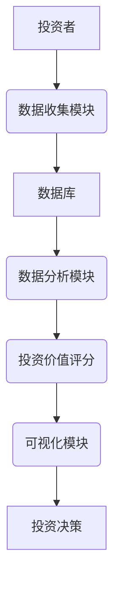

                 


# 费雪的'探索型投资'：发现未被市场认可的潜力股

## 关键词：费雪，探索型投资，潜力股，价值投资，多因子模型

## 摘要：本文深入探讨了菲利普·费雪的探索型投资方法，分析其核心理念、数学模型和系统架构，结合实际案例，展示如何发现未被市场认可的潜力股。

---

# 第一部分：引言

## 第1章：投资的基本概念与探索型投资的背景

### 1.1 投资的基本概念

### 1.1.1 投资的定义与分类

投资是指将资金投入某个领域，以期获得超过投入资金的收益。根据投资对象的不同，可以分为股票、债券、房地产等多种类型。股票投资是其中最常见的形式，涉及购买公司的部分股权，分享其利润和增长。

### 1.1.2 投资的基本原则

成功的投资需要遵循分散化、长期持有和价值投资等原则。分散化可以降低风险，长期持有有助于获得复利效应，而价值投资则强调购买被市场低估的资产。

### 1.1.3 投资的市场环境

市场环境包括宏观经济状况、政策法规、行业趋势等，这些因素都会影响投资的决策和收益。例如，经济繁荣时期可能股市表现良好，而经济衰退时期则可能带来更大的波动。

### 1.2 探索型投资的背景

### 1.2.1 传统投资方法的局限性

传统投资方法如市盈率法和股息率法存在一定的局限性。市盈率法仅关注当前利润，无法反映未来的增长潜力；股息率法则忽视了再投资的重要性，可能导致投资者错失成长型企业的机会。

### 1.2.2 费雪投资理念的提出

菲利普·费雪是价值投资的先驱，他提出了探索型投资的理念，强调寻找那些具有强大增长潜力但尚未被市场充分认识到的公司。这种方法弥补了传统方法的不足，为投资者提供了新的视角。

### 1.2.3 探索型投资的定义与特点

探索型投资是一种主动型投资策略，强调深入研究和挖掘市场中未被充分重视的潜力股。其特点包括注重长期增长、关注企业基本面、强调深入研究等。

---

## 第2章：菲利普·费雪与探索型投资方法

### 2.1 费雪的生平与投资理念

### 2.1.1 费雪的生平简介

菲利普·费雪是美国著名的投资专家，被誉为“成长股之父”。他的投资理念强调长期增长和深入研究，为现代投资理论奠定了基础。

### 2.1.2 费雪的投资理念与核心思想

费雪的核心思想是寻找那些具有强大增长潜力的公司，并长期持有。他认为，投资的成功取决于对企业的深入了解和对市场趋势的准确把握。

### 2.2 探索型投资的核心要素

### 2.2.1 未被市场认可的潜力股的特征

这些股票通常具有较高的成长潜力，但市场对其未来表现缺乏足够的认识。这类股票可能处于新兴行业或具有独特的竞争优势。

### 2.2.2 探索型投资的筛选标准

筛选标准包括高ROE、低市盈率、稳定的收益增长等。费雪提出的“十倍股”概念强调寻找那些能够在未来几年内增长十倍的公司。

### 2.2.3 探索型投资的风险与收益分析

尽管探索型投资有可能带来超额收益，但也伴随着较高的风险，尤其是在市场波动较大的情况下。投资者需要具备深入的行业研究能力和长期持股的耐心。

---

## 第3章：探索型投资的理论基础

### 3.1 价值投资理论

### 3.1.1 价值投资的定义与核心理念

价值投资强调购买被市场低估的资产，通过长期持有实现收益。其核心理念是寻找市场价格低于内在价值的股票。

### 3.1.2 价值投资与探索型投资的区别与联系

价值投资关注价格与价值的匹配，而探索型投资更关注企业的成长潜力。两者都强调深入研究，但侧重点不同。

### 3.2 市场情绪与投资者心理

### 3.2.1 市场情绪对股价的影响

市场情绪的波动会影响股价，过度乐观可能导致股价高估，而过度悲观可能导致股价低估。

### 3.2.2 投资者心理与投资决策

投资者的心理偏差，如从众心理和过度自信，会影响投资决策，可能导致非理性投资行为。

### 3.3 费雪的多因子模型

### 3.3.1 多因子模型的定义与特点

多因子模型通过多个因素（如市值、价值、动量等）来解释股票的收益。费雪的多因子模型结合了成长性和价值性，旨在筛选出具有强大增长潜力的公司。

### 3.3.2 费雪多因子模型的构建与应用

通过分析多个因子，构建一个综合评分模型，评估股票的投资价值。例如，结合ROE、收入增长率和市盈率等指标，筛选出具有高成长潜力的公司。

---

## 第4章：探索型投资的核心概念与联系

### 4.1 核心概念的原理

### 4.1.1 未被市场认可的潜力股的识别方法

通过深入研究企业的财务状况、行业地位和竞争优势，识别那些具有未被市场充分认识到的增长潜力的公司。

### 4.1.2 探索型投资的核心要素与属性

核心要素包括成长性、估值合理性和管理团队的稳定性。这些要素共同决定了企业的长期增长潜力。

### 4.2 核心概念的对比表格

| **指标**       | **探索型投资**       | **传统价值投资**      |
|----------------|----------------------|-----------------------|
| 核心目标       | 寻找高成长潜力股     | 寻找被低估的股票      |
| 关注重点       | 未来的增长潜力       | 当前的内在价值         |
| 投资策略       | 长期持有，耐心等待增长 | 长期持有，等待价格回归价值 |
| 风险承受能力   | 较高                 | 中等                  |

### 4.3 ER实体关系图

```mermaid
er
    entity 投资者 {
        id
        名称
    }
    entity 股票 {
        id
        名称
        市盈率
        ROE
        收入增长率
    }
    entity 管理团队 {
        id
        名称
        稳定性
    }
    entity 行业地位 {
        id
        名称
        竞争优势
    }
    投资者 -- 所有：持有
    股票 -- 所属：属于
    管理团队 -- 管理：管理
    行业地位 -- 属于：行业
```

---

## 第5章：探索型投资的数学模型与算法原理

### 5.1 探索型投资的数学模型

### 5.1.1 费雪多因子模型的数学表达

费雪的多因子模型通过多个因子的加权组合来评估股票的投资价值。公式如下：

$$
\text{投资价值} = \alpha \times \text{ROE} + \beta \times \text{收入增长率} + \gamma \times \text{市盈率}
$$

其中，$\alpha$、$\beta$、$\gamma$为各因子的权重，需根据实际情况调整。

### 5.1.2 多因子模型的实现步骤

1. 收集目标股票的财务数据，包括ROE、收入增长率和市盈率。
2. 确定各因子的权重，通常通过历史数据回归分析确定。
3. 计算每只股票的投资价值评分。
4. 根据评分筛选出评分最高的股票作为投资标的。

### 5.1.3 代码实现

```python
import pandas as pd

# 假设df为股票数据，包含ROE、收入增长率、市盈率
def calculate_investment_score(row):
    weights = {'ROE': 0.4, '收入增长率': 0.5, '市盈率': 0.1}
    score = 0
    for factor, weight in weights.items():
        score += row[factor] * weight
    return score

df['投资价值评分'] = df.apply(calculate_investment_score, axis=1)
top_stocks = df.sort_values('投资价值评分', ascending=False).head(10)
print(top_stocks)
```

### 5.1.4 模型的优势与局限性

优势：多因子模型综合考虑了多个因素，能够更全面地评估股票的投资价值。局限性：模型的权重需要根据市场环境调整，且无法完全预测未来的市场变化。

---

## 第6章：探索型投资的系统分析与架构设计

### 6.1 系统分析

### 6.1.1 问题场景介绍

构建一个投资分析系统，帮助投资者发现未被市场认可的潜力股。系统需要具备数据收集、分析和可视化功能。

### 6.1.2 系统功能设计

- 数据收集模块：收集股票的财务数据和市场数据。
- 数据分析模块：计算投资价值评分，筛选潜力股。
- 可视化模块：展示分析结果，帮助投资者做出决策。

### 6.2 系统架构设计



### 6.3 系统接口设计

- 数据接口：从金融数据源获取股票数据。
- 用户接口：提供数据输入和结果展示功能。

### 6.4 系统交互流程

1. 投资者输入筛选条件。
2. 系统收集相关数据。
3. 数据分析模块计算投资价值评分。
4. 可视化模块展示结果。
5. 投资者根据结果做出投资决策。

---

## 第7章：探索型投资的项目实战

### 7.1 项目环境安装

安装必要的Python库，如Pandas、NumPy和Matplotlib。

### 7.2 系统核心实现

实现数据收集、分析和可视化的功能。

### 7.3 代码实现与解读

```python
import pandas as pd
import matplotlib.pyplot as plt

# 数据收集模块
data = pd.read_csv('stock_data.csv')

# 数据分析模块
data['投资价值评分'] = data.apply(lambda row: 0.4*row['ROE'] + 0.5*row['收入增长率'] + 0.1*row['市盈率'], axis=1)

# 可视化模块
top_stocks = data.sort_values('投资价值评分', ascending=False).head(5)
plt.figure(figsize=(10, 6))
top_stocks['投资价值评分'].plot.bar()
plt.title('Top 5 Potential Stocks')
plt.xlabel('Stock Name')
plt.ylabel('Investment Score')
plt.show()
```

### 7.4 案例分析

以某行业为例，分析几只股票的投资价值评分，找出未被市场充分认识到的潜力股。

### 7.5 项目总结

总结项目的实施过程和成果，分析可能的优化方向。

---

## 第8章：探索型投资的结论与展望

### 8.1 结论

探索型投资通过深入研究和多因子模型，能够发现未被市场认可的潜力股，为投资者带来超额收益。

### 8.2 未来展望

随着大数据和人工智能技术的发展，探索型投资将更加精准和高效。未来的研究可以结合机器学习算法，进一步提升模型的预测能力。

---

## 最佳实践 tips

- **深入研究**：在投资前，对企业的财务状况和行业地位进行详细分析。
- **长期持有**：避免频繁交易，耐心等待企业的成长。
- **分散投资**：通过分散投资降低风险，提高整体收益。

---

## 小结

探索型投资是一种主动型投资策略，通过深入研究和多因子模型，能够发现市场中的潜力股。投资者需要具备扎实的行业知识和长期持股的耐心，才能在市场中获得超额收益。

---

## 注意事项

- **风险提示**：投资有风险，需谨慎决策。
- **数据准确性**：确保数据来源可靠，避免因数据错误导致决策失误。
- **持续学习**：市场变化莫测，需不断学习和更新投资策略。

---

## 拓展阅读

- 费雪的《股票作手回忆录》
- 巴菲特的价值投资理念
- 多因子模型的进一步研究

---

以上是《费雪的'探索型投资'：发现未被市场认可的潜力股》的完整内容，希望对您有所帮助！

