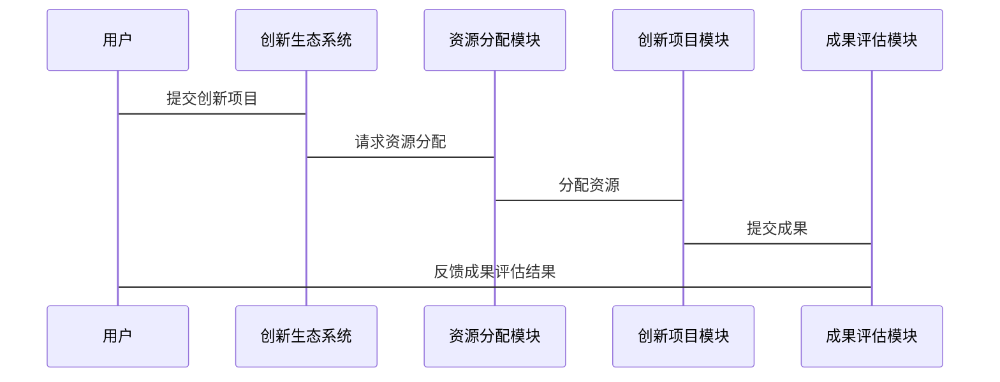

                 


# 费雪的'臭鼬工厂'理论：创新如何推动公司增长

> 关键词：臭鼬工厂理论, 创新, 公司增长, 内部创业, 资源分配, 创新生态系统

> 摘要：本文深入探讨了费雪的“臭鼬工厂”理论，分析了创新在公司增长中的关键作用。通过详细阐述理论的核心要素、数学模型、系统架构设计及实际案例，本文为读者提供了全面的理解和应用指南。从理论背景到算法实现，从系统设计到项目实战，本文旨在帮助读者掌握如何通过创新推动企业可持续增长。

---

# 第一部分: 费雪的“臭鼬工厂”理论概述

## 第1章: 费雪的“臭鼬工厂”理论背景

### 1.1 创新与公司增长的关系

#### 1.1.1 创新在公司增长中的核心作用
创新是公司增长的核心驱动力。通过引入新技术、新产品和新商业模式，公司可以在竞争激烈的市场中保持优势。创新不仅带来收入增长，还能降低运营成本，提高效率。

#### 1.1.2 费雪的“臭鼬工厂”理论的起源
“臭鼬工厂”理论由费雪在其著作《创新与增长的理论》中提出，强调通过内部创业机制将创新转化为实际业务增长。该理论认为，公司可以通过建立类似“臭鼬工厂”的内部实验室，鼓励员工尝试创新项目，从而推动公司整体增长。

#### 1.1.3 理论的核心概念与问题背景
- **核心概念**：创新、内部创业、资源分配。
- **问题背景**：传统创新理论往往关注外部市场和技术，忽视了公司内部创新机制的重要性。费雪通过“臭鼬工厂”理论，提出了通过内部创业推动公司增长的新思路。

### 1.2 创新理论的发展历程

#### 1.2.1 传统创新理论的局限性
传统创新理论主要关注外部市场和技术趋势，忽视了公司内部创新机制的建设。这种理论难以解释公司如何通过内部创新实现持续增长。

#### 1.2.2 “臭鼬工厂”理论的提出与演变
费雪提出“臭鼬工厂”理论，强调通过内部创业机制，将创新转化为实际业务增长。该理论的核心是通过建立内部实验室，鼓励员工尝试创新项目，从而推动公司整体增长。

#### 1.2.3 理论的适用范围与边界
“臭鼬工厂”理论适用于所有希望通过内部创新实现增长的企业，特别是那些希望在快速变化的市场中保持竞争优势的公司。然而，该理论不适用于那些缺乏内部创新机制的企业。

---

## 第2章: “臭鼬工厂”理论的核心要素

### 2.1 创新生态系统

#### 2.1.1 创新生态系统的构成要素
创新生态系统由以下要素构成：
1. **创新文化**：公司内部鼓励创新的文化氛围。
2. **资源支持**：公司为创新项目提供的资金、技术和人力资源支持。
3. **创新机制**：公司内部的创新流程和管理机制。

#### 2.1.2 创新与公司增长的内在联系
创新通过引入新技术、新产品和新商业模式，直接推动公司收入增长和市场份额扩大。同时，创新还能提高公司效率，降低运营成本。

#### 2.1.3 创新生态系统的核心特征
- **多样性**：创新生态系统包含多种类型的创新项目和资源。
- **协同性**：创新生态系统中的各个要素相互协同，共同推动公司增长。
- **动态性**：创新生态系统能够根据市场需求变化进行调整。

### 2.2 内部创业机制

#### 2.2.1 内部创业的概念与特点
内部创业是指公司内部员工通过尝试创新项目，推动公司业务增长的过程。其特点包括：
1. **低风险**：内部员工可以在公司内部进行创新尝试，风险相对较低。
2. **高效率**：内部员工对公司内部资源和技术有深入了解，能够快速推动创新项目。

#### 2.2.2 内部创业与公司增长的关系
内部创业通过引入新的技术和产品，直接推动公司收入增长。同时，内部创业还能提高员工的积极性和创造力，从而提升公司整体竞争力。

#### 2.2.3 内部创业的实施路径
1. **建立内部实验室**：公司可以建立“臭鼬工厂”式的内部实验室，鼓励员工尝试创新项目。
2. **提供资源支持**：公司为内部创业项目提供资金、技术和人力资源支持。
3. **建立激励机制**：公司通过激励机制，鼓励员工积极参与内部创业。

---

## 第3章: “臭鼬工厂”理论的数学模型与算法

### 3.1 创新驱动增长的数学模型

#### 3.1.1 模型的构建与假设
- **假设**：假设公司通过内部创业机制推动创新，创新项目成功的概率与公司资源投入成正比。
- **变量**：
  - $C$：公司资源投入。
  - $I$：创新项目数量。
  - $G$：公司增长。

#### 3.1.2 创新投入与增长的关系式
$$ G = k \cdot C \cdot I $$
其中，$k$为常数，表示资源投入与增长之间的关系。

#### 3.1.3 模型的验证与应用
通过实际案例验证模型的有效性。例如，假设公司投入$C=10$，创新项目数量$I=5$，常数$k=0.2$，则公司增长$G=10 \cdot 5 \cdot 0.2=10$。

### 3.2 创新资源分配的算法

#### 3.2.1 资源分配的基本原理
资源分配的目的是最大化创新项目的成功率，从而推动公司增长。资源分配需要考虑以下因素：
1. **项目的潜力**：项目的市场潜力越大，资源分配越多。
2. **项目的风险**：项目的风险越高，资源分配越谨慎。

#### 3.2.2 资源分配的优化算法
1. **确定项目的潜力和风险**。
2. **计算每个项目的资源分配系数**。
3. **根据系数分配资源**。

#### 3.2.3 算法的实现与案例分析
通过Python代码实现资源分配算法，具体步骤如下：
1. **输入项目的潜力和风险数据**。
2. **计算每个项目的资源分配系数**。
3. **输出资源分配结果**。

---

## 第4章: 系统分析与架构设计方案

### 4.1 问题场景介绍

#### 4.1.1 企业创新面临的挑战
- **资源分配不合理**：公司资源有限，难以同时支持多个创新项目。
- **创新项目成功率低**：由于缺乏有效的管理机制，创新项目成功率较低。
- **创新文化缺失**：公司内部缺乏鼓励创新的文化氛围。

#### 4.1.2 “臭鼬工厂”理论的应用场景
- **建立内部实验室**：公司通过建立内部实验室，鼓励员工尝试创新项目。
- **提供资源支持**：公司为创新项目提供资金、技术和人力资源支持。
- **建立激励机制**：公司通过激励机制，鼓励员工积极参与内部创业。

### 4.2 系统功能设计

#### 4.2.1 领域模型（Mermaid 类图）
```mermaid
classDiagram
    class 创新生态系统 {
        + 创新文化
        + 资源支持
        + 创新机制
    }
    class 内部创业机制 {
        + 创新项目
        + 资源分配
        + 成果评估
    }
    class 系统架构 {
        + 顶层架构
        + 模块划分
        + 接口设计
    }
    class 创新生态系统 -- 创新项目
```

#### 4.2.2 系统架构设计（Mermaid 架构图）


#### 4.2.3 系统接口设计
1. **资源分配接口**：提供资源分配模块与创新项目模块之间的接口。
2. **成果评估接口**：提供成果评估模块与内部创业机制之间的接口。

#### 4.2.4 系统交互设计（Mermaid 序列图）


---

## 第5章: 项目实战

### 5.1 环境安装与配置

#### 5.1.1 开发环境的搭建
- **操作系统**：建议使用Windows 10或macOS。
- **编程语言**：Python 3.8及以上版本。
- **开发工具**：建议使用PyCharm或VS Code。

#### 5.1.2 工具链的安装与配置
- **Python包**：安装numpy、pandas、matplotlib等常用包。
- **版本控制**：使用Git进行代码版本管理。

#### 5.1.3 数据集的准备与预处理
- **数据来源**：可以从公开数据集获取创新项目相关数据。
- **数据清洗**：对数据进行清洗，确保数据质量。

### 5.2 核心算法实现

#### 5.2.1 创新评估算法的实现
1. **数据输入**：读取创新项目的数据。
2. **计算潜力和风险**：根据公式计算每个项目的潜力和风险。
3. **资源分配**：根据潜力和风险分配资源。

#### 5.2.2 资源分配算法的实现
1. **数据输入**：读取创新项目的数据。
2. **计算资源分配系数**：根据公式计算每个项目的资源分配系数。
3. **输出结果**：输出资源分配结果。

#### 5.2.3 系统功能模

---

# 第二部分: 总结与展望

## 第6章: 总结与展望

### 6.1 理论总结
“臭鼬工厂”理论通过内部创业机制，将创新转化为实际业务增长。该理论强调公司内部创新机制的重要性，为公司增长提供了新的思路。

### 6.2 最佳实践 tips
- **建立内部实验室**：公司可以建立“臭鼬工厂”式的内部实验室，鼓励员工尝试创新项目。
- **提供资源支持**：公司为创新项目提供资金、技术和人力资源支持。
- **建立激励机制**：公司通过激励机制，鼓励员工积极参与内部创业。

### 6.3 小结
通过本文的分析，我们可以看到，“臭鼬工厂”理论为公司增长提供了新的思路。公司可以通过内部创业机制，将创新转化为实际业务增长，从而在竞争激烈的市场中保持优势。

### 6.4 注意事项
- **资源分配**：资源分配需要根据项目的潜力和风险进行合理分配。
- **创新文化**：公司需要建立鼓励创新的文化氛围，才能有效推动内部创业。

### 6.5 拓展阅读
建议读者进一步阅读《创新与增长的理论》一书，深入了解“臭鼬工厂”理论的详细内容。

---

通过本文的详细分析，我们希望读者能够全面理解“臭鼬工厂”理论的核心内容，并能够在实际工作中应用该理论，推动公司增长。

