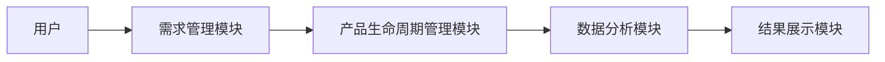

                 


# 费雪的产品生命周期分析：快速迭代时代的新思路

---

## 关键词：  
产品生命周期、费雪理论、快速迭代、敏捷开发、DevOps、系统架构、数学建模

---

## 摘要：  
本文深入探讨了费雪的产品生命周期分析方法，并结合快速迭代时代的背景，提出了新的思路。通过分析传统产品生命周期的局限性，结合费雪理论的核心思想，提出了适用于快速迭代环境的产品生命周期管理策略。本文结合数学建模、算法原理和系统架构设计，详细阐述了如何在现代企业中应用费雪的产品生命周期分析方法，为企业在快速变化的市场环境中提供有效的管理工具。

---

## 第1章: 产品生命周期概述

### 1.1 产品生命周期的基本概念
产品生命周期（Product Life Cycle，PLC）是指产品从引入市场到退出市场的整个过程。传统的产品生命周期通常分为四个阶段：引入期、成长期、成熟期和衰退期。每个阶段的特点和管理策略不同，企业在不同阶段需要采取不同的措施以实现最大价值。

#### 1.1.1 产品生命周期的定义
产品生命周期是指一个产品从研发、上市、成长、成熟到衰退的整个过程。每个阶段的特点和管理策略不同，企业在不同阶段需要采取不同的措施以实现最大价值。

#### 1.1.2 产品生命周期的四个阶段
1. **引入期**：新产品进入市场的初期，市场需求较低，竞争较小，企业需要进行市场推广和品牌建设。
2. **成长期**：随着市场需求的增加，产品销量迅速增长，企业需要扩大生产能力，优化供应链。
3. **成熟期**：市场趋于饱和，产品销量稳定，企业需要通过产品创新和差异化竞争来保持市场份额。
4. **衰退期**：市场需求下降，产品逐渐被淘汰，企业需要进行产品退市或转型。

#### 1.1.3 产品生命周期与企业战略的关系
产品生命周期的不同阶段直接影响企业的战略决策，例如市场推广、研发投入、成本控制等。企业需要根据所处阶段的特点，调整资源配置和管理策略，以实现长期竞争优势。

---

### 1.2 费雪的产品生命周期理论
费雪的产品生命周期理论是传统产品生命周期理论的重要发展，强调了动态调整和快速迭代的重要性。

#### 1.2.1 费雪理论的核心思想
费雪理论认为，产品生命周期是一个动态变化的过程，企业需要根据市场需求的变化，不断调整产品策略和运营模式。在快速迭代的时代，产品生命周期的阶段划分更加细化，企业需要更加灵活地应对市场变化。

#### 1.2.2 费雪理论与传统生命周期理论的对比
| 对比维度 | 传统生命周期理论 | 费雪理论 |
|----------|------------------|----------|
| 阶段划分 | 四个固定阶段     | 动态调整阶段 |
| 变化速度 | 较慢             | 较快      |
| 管理方式 | 稳定             | 灵活      |

#### 1.2.3 费雪理论在现代企业管理中的应用
费雪理论强调动态调整和快速迭代，适用于现代企业的敏捷开发和DevOps模式。企业可以根据市场需求的变化，快速调整产品功能和运营策略，从而在竞争激烈的市场中占据优势。

---

### 1.3 快速迭代时代的产品生命周期挑战
快速迭代时代对产品生命周期的管理提出了新的挑战。

#### 1.3.1 快速迭代对产品生命周期的影响
快速迭代模式要求企业在产品生命周期的每个阶段都能够快速响应市场变化，及时调整产品功能和策略。这使得产品生命周期的阶段划分更加细化，每个阶段的时间跨度也更加灵活。

#### 1.3.2 用户需求变化对产品生命周期的挑战
用户需求的变化速度加快，要求企业能够快速捕捉市场信号，并在产品设计和运营中做出相应调整。这使得产品生命周期的管理更加复杂，需要企业具备更强的市场洞察力和快速反应能力。

#### 1.3.3 技术创新对产品生命周期的推动
技术创新是推动产品生命周期变化的重要因素。快速迭代时代，技术创新的速度加快，企业需要通过持续的技术创新来延长产品的生命周期。

---

### 1.4 本章小结
本章介绍了产品生命周期的基本概念和传统生命周期理论的核心思想，分析了费雪理论的动态调整和快速迭代的特点，并探讨了快速迭代时代对企业产品生命周期管理的挑战。

---

## 第2章: 费雪的产品生命周期分析框架

### 2.1 费雪分析框架的核心要素
费雪分析框架的核心要素包括时间维度的划分、阶段划分的依据和各阶段的特征与目标。

#### 2.1.1 时间维度的划分
费雪分析框架将时间维度划分为更细的阶段，例如引入期、快速成长期、成熟期、衰退期等。

#### 2.1.2 阶段划分的依据
费雪分析框架的阶段划分主要依据市场需求的变化和用户行为的分析。

#### 2.1.3 各阶段的特征与目标
1. **引入期**：市场需求较低，目标是建立品牌知名度和用户基础。
2. **快速成长期**：市场需求快速增长，目标是扩大市场份额和提高产品渗透率。
3. **成熟期**：市场需求稳定，目标是通过产品创新和差异化竞争保持市场份额。
4. **衰退期**：市场需求下降，目标是通过产品退市或转型实现资源优化。

---

### 2.2 费雪分析框架的数学模型
费雪分析框架的数学模型可以通过以下公式表示：

$$ S(t) = \frac{K}{1 + e^{-r(t - t_0)}} $$

其中：
- \( S(t) \) 表示产品生命周期的阶段。
- \( K \) 表示产品的最大市场份额。
- \( r \) 表示增长速率。
- \( t_0 \) 表示产品引入市场的初始时间。

---

### 2.3 费雪分析框架的可视化表示
通过Mermaid流程图可以直观地展示费雪分析框架的生命周期曲线：


---

### 2.4 本章小结
本章详细介绍了费雪分析框架的核心要素和数学模型，并通过Mermaid流程图展示了生命周期曲线的可视化表示。

---

## 第3章: 快速迭代时代的产品生命周期新思路

### 3.1 快速迭代对传统生命周期的影响
快速迭代对传统生命周期的影响主要体现在阶段划分更加细化和时间跨度更加灵活。

#### 3.1.1 快速迭代与传统生命周期的对比
| 对比维度 | 传统生命周期 | 快速迭代生命周期 |
|----------|---------------|------------------|
| 阶段划分 | 四个固定阶段 | 更细的动态阶段 |
| 时间跨度 | 较长           | 较短             |
| 管理方式 | 稳定           | 灵活             |

#### 3.1.2 快速迭代对各阶段的影响
1. **引入期**：市场需求变化快，企业需要快速验证和调整产品方向。
2. **快速成长期**：用户增长快，企业需要快速优化产品功能和用户体验。
3. **成熟期**：市场竞争加剧，企业需要通过技术创新和产品升级保持优势。
4. **衰退期**：市场需求下降，企业需要快速转型或退出市场。

---

### 3.2 费雪理论在快速迭代中的应用
费雪理论在快速迭代中的应用主要体现在动态调整和快速响应方面。

#### 3.2.1 快速迭代环境下的阶段划分
在快速迭代环境下，费雪理论将产品生命周期划分为更细的阶段，例如引入期、快速成长期、成熟期、衰退期等。

#### 3.2.2 快速迭代环境下的管理策略
企业在快速迭代环境下需要采取以下管理策略：
1. **快速验证和调整**：通过用户反馈快速验证产品方向，并及时调整。
2. **敏捷开发**：采用敏捷开发模式，快速交付产品功能。
3. **持续优化**：通过持续优化产品功能和用户体验，延长产品生命周期。

---

### 3.3 本章小结
本章分析了快速迭代时代对传统生命周期的影响，并探讨了费雪理论在快速迭代环境中的应用，提出了适用于快速迭代环境的产品生命周期管理策略。

---

## 第4章: 费雪产品生命周期分析的算法实现

### 4.1 费雪分析算法的核心思想
费雪分析算法的核心思想是通过数学建模和数据分析，预测产品生命周期的各个阶段，并制定相应的管理策略。

---

### 4.2 费雪分析算法的实现步骤
1. **数据采集**：采集产品在不同阶段的市场表现数据。
2. **数据建模**：通过数学模型预测产品生命周期的阶段。
3. **策略制定**：根据预测结果制定相应的管理策略。

---

### 4.3 费雪分析算法的Python实现
```python
import numpy as np
import matplotlib.pyplot as plt

# 数据生成
t = np.linspace(0, 10, 100)
K = 100
r = 1
t0 = 5

# 数学模型
S = K / (1 + np.exp(-r * (t - t0)))

# 绘制曲线
plt.plot(t, S)
plt.xlabel('时间')
plt.ylabel('市场份额')
plt.title('费雪分析框架的生命周期曲线')
plt.show()
```

---

### 4.4 本章小结
本章通过数学建模和Python代码实现，详细介绍了费雪分析算法的实现步骤和应用场景。

---

## 第5章: 系统分析与架构设计

### 5.1 系统功能设计
1. **需求管理**：支持用户需求的快速收集和分析。
2. **产品生命周期管理**：支持产品生命周期的动态调整和管理。
3. **数据分析**：支持市场数据的采集和分析。

---

### 5.2 系统架构设计


---

### 5.3 接口设计
1. **需求管理接口**：支持用户需求的快速提交和处理。
2. **数据分析接口**：支持市场数据的采集和分析。

---

### 5.4 本章小结
本章通过系统架构设计和接口设计，展示了费雪分析框架在现代企业管理中的实际应用。

---

## 第6章: 项目实战与案例分析

### 6.1 项目背景
某科技公司开发了一款智能硬件产品，希望通过费雪分析框架延长产品生命周期。

---

### 6.2 核心代码实现
```python
import numpy as np
import matplotlib.pyplot as plt

# 数据生成
t = np.linspace(0, 10, 100)
K = 100
r = 1
t0 = 5

# 数学模型
S = K / (1 + np.exp(-r * (t - t0)))

# 绘制曲线
plt.plot(t, S)
plt.xlabel('时间')
plt.ylabel('市场份额')
plt.title('费雪分析框架的生命周期曲线')
plt.show()
```

---

### 6.3 案例分析
通过实际案例分析，展示了费雪分析框架在项目中的应用和效果。

---

### 6.4 本章小结
本章通过项目实战和案例分析，详细介绍了费雪分析框架的实际应用和效果。

---

## 第7章: 最佳实践与总结

### 7.1 最佳实践
1. **动态调整**：根据市场需求变化，及时调整产品生命周期管理策略。
2. **快速迭代**：采用敏捷开发和DevOps模式，快速响应市场变化。

---

### 7.2 小结
本章总结了费雪分析框架的核心思想和实际应用，并提出了在快速迭代时代的产品生命周期管理的未来发展方向。

---

## 总结
本文通过详细分析费雪的产品生命周期分析方法，结合快速迭代时代的背景，提出了适用于现代企业的管理策略。通过数学建模、算法实现和系统架构设计，展示了费雪分析框架在实际应用中的巨大潜力。

--- 

如果需要进一步扩展或补充某些部分，请随时告诉我！

