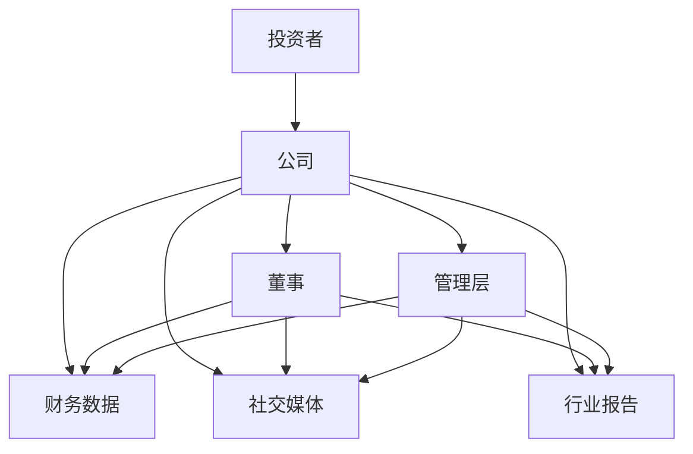
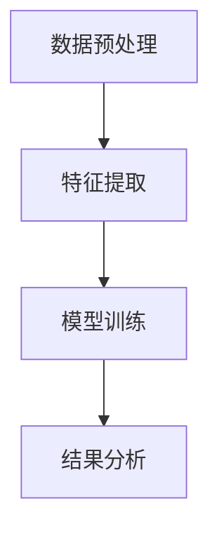
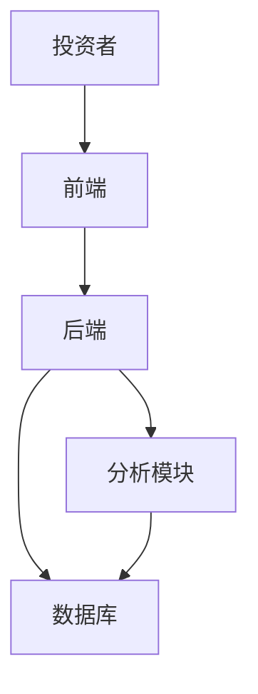

                 


# 费雪的信息网络：如何获取有价值的公司信息

## 关键词：信息网络、投资分析、数据挖掘、信息收集、费雪方法、系统设计

## 摘要：本文探讨了费雪的信息网络方法，通过信息网络的构建与应用，详细讲解如何有效获取和分析公司信息，帮助投资者做出明智决策。文章从背景介绍到系统设计，结合实际案例，深入分析信息网络的核心概念、算法原理及系统架构，为读者提供全面的指导。

---

## 第一部分：背景介绍

### 第1章：信息网络的定义与背景

#### 1.1 问题背景
- **投资者面临的挑战**：在信息爆炸的时代，投资者如何筛选有价值的信息，避免信息过载，是当前的一大挑战。
- **信息不对称的现状**：市场参与者获取信息的能力差异影响投资决策，信息不对称加剧了市场的不确定性。
- **传统投资方法的局限性**：依赖财务报表和市场走势的传统方法在面对复杂市场时显得力不从心。

#### 1.2 问题描述
- **信息网络的概念**：信息网络是通过收集、处理和分析公司相关信息，构建一个网络化的信息体系，帮助投资者识别潜在投资机会。
- **费雪信息网络的核心目标**：通过深入分析公司信息，识别具有长期增长潜力的企业，优化投资决策。
- **信息网络在投资中的作用**：提供更全面的公司分析，帮助投资者做出更明智的投资决策。

#### 1.3 问题解决
- **信息网络如何帮助投资者**：通过系统化的信息收集和分析，识别优质公司，降低投资风险。
- **费雪方法的创新点**：将信息网络与投资分析相结合，提供一种新的投资策略。
- **实际案例分析**：通过具体案例展示信息网络在实际投资中的应用效果。

#### 1.4 边界与外延
- **信息网络的适用范围**：适用于需要深入分析公司基本面的投资者。
- **与其他投资方法的区别**：不同于传统财务分析，信息网络更注重公司信息的网络化分析。
- **信息网络的局限性**：依赖于高质量的数据源，可能面临数据获取成本高的问题。

#### 1.5 概念结构与核心要素
- **核心要素组成**：包括数据源、信息处理、分析模型和投资决策。
- **信息网络的层次结构**：数据层、处理层、分析层和决策层。
- **费雪方法的关键点**：深入分析公司基本面，识别具有强大增长潜力的企业。

---

## 第二部分：核心概念与联系

### 第2章：信息网络的核心概念

#### 2.1 核心概念原理
- **信息收集与分析**：通过多种渠道收集公司信息，包括财务报表、管理层访谈、行业报告等。
- **数据处理与建模**：对收集到的信息进行清洗、整理，并建立数学模型进行分析。
- **模型应用与优化**：将分析结果应用于投资决策，并根据市场变化不断优化模型。

#### 2.2 核心概念属性对比
- **数据来源对比**：传统方法依赖财务数据，而信息网络方法更广泛，包括社交媒体、新闻报道等。
- **数据处理方式对比**：传统方法侧重定量分析，信息网络方法结合定量和定性分析。
- **分析结果的可解释性对比**：传统方法结果较为直观，信息网络方法结果更具深度和综合性。

#### 2.3 ER实体关系图


---

## 第三部分：算法原理讲解

### 第3章：信息网络的算法原理

#### 3.1 算法概述
- **信息网络分析的算法**：包括数据挖掘、自然语言处理和图论算法。
- **算法流程**：数据预处理、特征提取、模型训练、结果分析。

#### 3.2 算法流程图


#### 3.3 算法实现
- **Python代码示例**：
  ```python
  import numpy as np
  import pandas as pd

  # 数据预处理
  data = pd.read_csv('company_info.csv')
  data = data.dropna()
  
  # 特征提取
  from sklearn.feature_extraction.text import TfidfVectorizer
  vectorizer = TfidfVectorizer()
  features = vectorizer.fit_transform(data['description'])
  
  # 模型训练
  from sklearn.cluster import KMeans
  model = KMeans(n_clusters=3)
  model.fit(features)
  
  # 结果分析
  print(model.labels_)
  ```

#### 3.4 数学模型与公式
- **文本相似度计算**：使用余弦相似度。
  $$ \text{similarity} = \frac{\vec{A} \cdot \vec{B}}{|\vec{A}| |\vec{B}|} $$
- **聚类分析**：K-means算法，目标是最小化聚类内距离平方和。
  $$ \text{目标函数} = \sum_{i=1}^{k} \sum_{j \in C_i} (x_j - c_i)^2 $$

---

## 第四部分：数学模型与公式

### 第4章：信息网络的数学模型

#### 4.1 图论模型
- **节点度数**：$$ \text{度数}(v) = \sum_{u \in V} A_{uv} $$
- **PageRank算法**：$$ \text{PageRank}(v) = \sum_{u \in I(v)} \frac{\text{PageRank}(u)}{\text{out-degree}(u)} $$

#### 4.2 数据挖掘模型
- **关联规则挖掘**：使用Apriori算法，目标是发现频繁项集。
  $$ \text{支持度} = \frac{\text{频繁项集的数量}}{\text{总事务数}} $$

---

## 第五部分：系统分析与架构设计

### 第5章：信息网络系统的分析与设计

#### 5.1 问题场景介绍
- **目标**：构建一个信息网络分析系统，帮助投资者获取和分析公司信息。
- **关键需求**：实时数据采集、多源数据融合、智能分析和可视化。

#### 5.2 系统功能设计
- **领域模型**：
  ```mermaid
  classDiagram
      class 投资者 {
          用户ID
          查询历史
          投资组合
      }
      class 公司 {
          公司ID
          财务数据
          社交媒体信息
      }
      class 数据源 {
          数据ID
          数据类型
          更新时间
      }
      投资者 --> 公司 : 查询
      公司 --> 数据源 : 获取数据
  ```

#### 5.3 系统架构设计


#### 5.4 接口设计与交互流程
- **API接口**：RESTful API，支持GET和POST请求。
- **交互流程**：
  1. 投资者提交查询请求。
  2. 系统调用数据源接口获取数据。
  3. 数据处理并返回分析结果。

---

## 第六部分：项目实战

### 第6章：信息网络系统的实现与案例分析

#### 6.1 项目环境配置
- **工具与库**：Python、Pandas、Scikit-learn、Flask。
- **数据来源**：公开公司财报、社交媒体数据、行业报告。

#### 6.2 核心代码实现
```python
from flask import Flask, request, jsonify
import pandas as pd
from sklearn.feature_extraction.text import TfidfVectorizer
from sklearn.cluster import KMeans

app = Flask(__name__)

@app.route('/analyze', methods=['POST'])
def analyze():
    data = request.json['data']
    vectorizer = TfidfVectorizer()
    features = vectorizer.fit_transform(data)
    model = KMeans(n_clusters=3)
    model.fit(features)
    return jsonify({'result': model.labels_.tolist()})

if __name__ == '__main__':
    app.run(debug=True)
```

#### 6.3 案例分析
- **实际案例**：分析某科技公司，通过信息网络识别其市场地位和增长潜力。
- **分析结果**：识别该公司在行业中的领先地位，并预测其未来增长趋势。

---

## 第七部分：最佳实践与总结

### 第7章：总结与建议

#### 7.1 最佳实践
- **数据源选择**：确保数据质量和多样性。
- **模型优化**：定期更新模型，适应市场变化。
- **结果解读**：结合行业知识，全面理解分析结果。

#### 7.2 小结
- 费雪的信息网络方法为投资者提供了强大的工具，帮助其做出更明智的投资决策。
- 通过系统的构建和优化，信息网络分析在投资领域具有广阔的应用前景。

#### 7.3 注意事项
- 数据隐私保护：确保数据处理符合相关法律法规。
- 模型局限性：认识到信息网络分析的局限性，避免过度依赖模型。

#### 7.4 拓展阅读
- 推荐书籍：《投资学》、《数据挖掘导论》。
- 推荐博客：技术博客、投资分析博客。

---

## 附录：参考文献

- 费雪，菲利普. 《如何选择成长股》
- Han, Jia, et al. 《数据挖掘：概念与技术》
- LeCun, Y., Bengio, Y., & Hinton, G. 《深度学习综述》

---

通过以上结构，文章详细探讨了费雪的信息网络方法，从理论到实践，为投资者提供了一套系统化的信息收集和分析框架，帮助其在复杂多变的市场中做出明智的投资决策。

