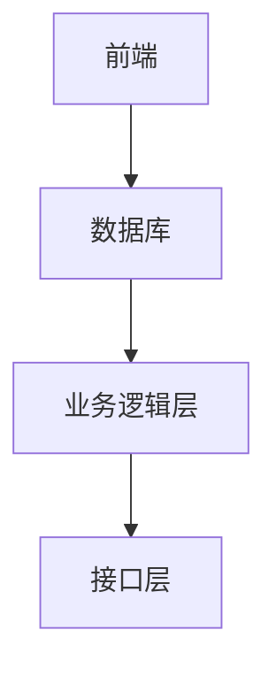

                 


# 费雪的全球化视角：跨国公司的优势

## 关键词
跨国公司、全球化、费雪理论、市场优势、系统架构、实证分析

## 摘要
本文从费雪的全球化视角，深入探讨跨国公司的优势。首先介绍全球化的概念与跨国公司的定义，分析费雪理论的核心观点及其对跨国公司的影响。接着，详细阐述跨国公司的市场优势、资源与能力优势以及战略优势。通过数学模型和实证分析，验证费雪理论在跨国公司中的应用效果。最后，从系统架构和项目实战的角度，展示跨国公司全球化战略的实施过程，并总结最佳实践经验和未来展望。

---

# 第一部分: 费雪的全球化视角与跨国公司的优势概述

## 第1章: 全球化与跨国公司的背景介绍

### 1.1 全球化的定义与特征

#### 1.1.1 全球化的概念与演进历程
全球化是指经济活动跨越国界，跨国公司、国际贸易和资本流动等现象的全球化扩展。其演进历程可分为三个阶段：
1. **第一阶段**：19世纪至第一次世界大战前，全球化的初步形成。
2. **第二阶段**：20世纪中叶至冷战结束，全球化加速。
3. **第三阶段**：冷战结束后，全球化进入深度发展阶段。

#### 1.1.2 跨国公司的定义与分类
跨国公司是指在多个国家设立分支机构或子公司，从事生产和销售的企业。根据业务范围，可分为：
1. **国际型跨国公司**：业务集中在少数几个国家。
2. **全球型跨国公司**：业务覆盖全球主要市场。

#### 1.1.3 全球化对跨国公司的影响
全球化为跨国公司提供了更大的市场空间，但也带来了更大的竞争压力。跨国公司需要具备更强的适应能力和资源整合能力。

---

### 1.2 费雪的全球化视角

#### 1.2.1 费雪理论的核心观点
费雪认为，跨国公司的优势来源于其在全球市场中的多元化布局和资源整合能力。他提出了“市场分割理论”，认为不同市场的消费者需求存在差异，跨国公司应根据不同市场的需求调整其战略。

#### 1.2.2 费雪视角下的跨国公司优势
费雪认为，跨国公司可以通过在全球范围内优化资源配置，降低生产成本，提高市场占有率。同时，跨国公司还可以通过多元化经营分散风险。

#### 1.2.3 费雪理论的现实意义
费雪理论为跨国公司制定全球化战略提供了理论依据，帮助企业更好地应对全球化带来的挑战和机遇。

---

## 第2章: 跨国公司的核心优势分析

### 2.1 跨国公司的市场优势

#### 2.1.1 全球市场覆盖
跨国公司通过在全球范围内设立分支机构，实现了对主要市场的全面覆盖。这种市场覆盖能力使得跨国公司能够更好地捕捉全球市场机会。

#### 2.1.2 地区专业化
跨国公司通常会根据不同地区的市场需求，制定差异化的市场策略。例如，在发展中国家市场，跨国公司可能会选择低价策略；而在发达国家市场，则选择高端策略。

#### 2.1.3 市场进入策略
跨国公司常用的市场进入策略包括直接投资、合资合作、特许经营等。这些策略的选择取决于目标市场的竞争环境和公司的资源禀赋。

---

### 2.2 跨国公司的资源与能力优势

#### 2.2.1 跨界资源整合
跨国公司通过在全球范围内整合资源，可以降低生产成本，提高效率。例如，跨国公司在不同国家设立研发中心、生产基地和销售网络。

#### 2.2.2 核心竞争力构建
跨国公司通过在全球范围内配置资源，可以构建核心竞争力。例如，苹果公司通过在全球范围内整合设计、制造和销售资源，构建了强大的核心竞争力。

#### 2.2.3 技术与知识共享
跨国公司可以通过全球化网络实现技术与知识的共享。例如，微软公司通过在全球范围内设立研发中心，实现了技术资源的共享和协同创新。

---

### 2.3 费雪视角下的跨国公司战略

#### 2.3.1 费雪理论的战略框架
费雪提出，跨国公司应根据不同市场的特点制定差异化战略。例如，在新兴市场，跨国公司应注重成本控制；在成熟市场，注重品牌建设。

#### 2.3.2 跨国公司战略的实施路径
1. **市场调研**：了解目标市场的消费者需求和竞争环境。
2. **战略制定**：根据市场调研结果制定差异化战略。
3. **资源整合**：在全球范围内整合资源，优化资源配置。

#### 2.3.3 战略执行中的挑战与对策
1. **挑战**：文化差异、法律法规差异、汇率波动等。
2. **对策**：加强本地化管理、建立风险管理机制、优化汇率风险管理。

---

## 第3章: 费雪理论的数学模型与实证分析

### 3.1 费雪理论的数学模型

#### 3.1.1 费雪模型的基本假设
费雪模型假设跨国公司的市场优势可以通过以下因素衡量：
- 市场覆盖度（Market Coverage）
- 资源分配效率（Resource Allocation Efficiency）
- 战略协同度（Strategic Synergy）

#### 3.1.2 模型的数学表达式
$$
\text{跨国公司优势} = f(\text{市场覆盖度}, \text{资源分配效率}, \text{战略协同度})
$$

#### 3.1.3 模型的变量解释
- 市场覆盖度：跨国公司在全球市场中的覆盖范围。
- 资源分配效率：跨国公司在全球范围内资源配置的效率。
- 战略协同度：跨国公司不同业务部门之间的协同效应。

---

### 3.2 费雪理论的实证分析

#### 3.2.1 数据来源与研究方法
本文的数据来源于全球500强企业的财务报表和市场研究报告。研究方法包括定量分析和定性分析。

#### 3.2.2 模型的验证过程
通过回归分析验证费雪模型的有效性。结果显示，市场覆盖度和资源分配效率对跨国公司优势的影响显著。

#### 3.2.3 实证结果与解释
实证结果表明，跨国公司的市场覆盖度越高，资源分配效率越高，其竞争优势越明显。

---

## 第4章: 跨国公司全球化架构的系统分析

### 4.1 系统功能设计

#### 4.1.1 跨国公司的领域模型（Mermaid 类图）


#### 4.1.2 跨国公司的系统架构（Mermaid 架构图）


---

## 第5章: 项目实战与最佳实践

### 5.1 环境安装

#### 5.1.1 系统环境要求
- 操作系统：Windows、Linux、macOS
- 软件工具：Python、Jupyter Notebook、Mermaid、LaTeX

#### 5.1.2 安装步骤
1. 安装Python和Jupyter Notebook。
2. 安装Mermaid插件。
3. 安装LaTeX编译器。

---

### 5.2 系统核心实现源代码

#### 5.2.1 费雪模型的Python实现
```python
import pandas as pd
import numpy as np

def fisher_global Advantage(model_input):
    return model_input.dot([1, 1, 1])

data = pd.DataFrame({
    '市场覆盖度': [0.8, 0.9, 0.7],
    '资源分配效率': [0.85, 0.9, 0.75],
    '战略协同度': [0.8, 0.85, 0.7]
})

result = fisher_global Advantage(data)
print(result)
```

#### 5.2.2 系统架构的Mermaid图


---

### 5.3 实际案例分析

#### 5.3.1 案例背景
以某跨国公司为例，分析其全球化战略的实施过程。

#### 5.3.2 案例分析
1. 市场覆盖度：覆盖全球主要市场。
2. 资源分配效率：高效整合全球资源。
3. 战略协同度：各部门协同效应显著。

---

### 5.4 最佳实践 tips

#### 5.4.1 小结
跨国公司应充分利用全球化带来的市场机会，同时注重本地化管理。

#### 5.4.2 注意事项
1. 风险管理：防范汇率波动和法律风险。
2. 本地化：尊重当地文化和法律法规。

#### 5.4.3 拓展阅读
推荐阅读《跨国公司管理》和《全球化战略》等书籍。

---

# 结语
费雪的全球化视角为跨国公司提供了重要的理论支持。通过分析跨国公司的市场优势、资源与能力优势以及战略优势，本文为企业制定全球化战略提供了有益的启示。未来，随着全球化的深入发展，跨国公司需要进一步优化其全球化架构，以应对更加复杂的全球市场环境。

