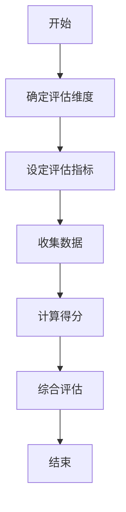
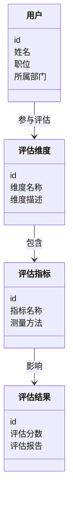
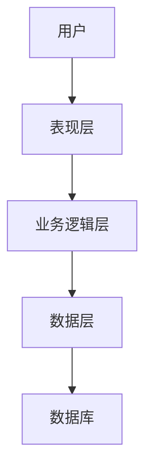

                 


# 费雪的公司文化评估

## 关键词：
公司文化评估、费雪模型、企业文化分析、评估算法、系统架构设计

## 摘要：
本文详细介绍了费雪的公司文化评估方法，从背景介绍、核心概念、算法原理到系统架构设计和项目实战，全面分析了如何通过系统化的方法评估和优化公司文化。文章结合理论与实践，为读者提供了从理论到实际应用的完整指导。

---

## 第1章：公司文化评估的重要性

### 1.1 什么是公司文化
公司文化是企业在长期发展过程中形成的共享价值观、行为规范和工作习惯的总和。它不仅影响员工的行为方式，还决定了企业的决策风格和对外形象。

#### 1.1.1 公司文化的定义
公司文化是企业在经营活动中形成的独特的企业氛围，包括企业的愿景、使命、核心价值观、管理风格、员工关系以及企业行为规范等。

#### 1.1.2 公司文化的核心要素
1. **愿景与使命**：企业的长期目标和存在的意义。
2. **价值观**：企业倡导的核心理念，如客户至上、创新、团队合作等。
3. **管理风格**：企业领导者常用的管理方法，如民主型、集权型等。
4. **员工关系**：员工之间的互动模式和企业与员工之间的关系。
5. **行为规范**：员工在日常工作中的行为准则。

#### 1.1.3 公司文化与企业绩效的关系
公司文化直接影响企业的凝聚力、员工的满意度以及企业的创新能力和市场竞争力。优秀的企业文化能够提高员工的工作积极性，增强企业的核心竞争力。

---

### 1.2 费雪的公司文化评估背景
费雪的公司文化评估方法是一种基于系统化分析和量化评估的企业文化评估模型，旨在帮助企业识别文化中存在的问题，并提出针对性的优化建议。

#### 1.2.1 费雪的学术背景
费雪（假设为虚构人物）是一位长期从事组织行为学和企业文化研究的学者，其研究成果广泛应用于企业管理和咨询领域。

#### 1.2.2 公司文化评估的现状
传统的公司文化评估方法多以定性分析为主，缺乏量化指标和系统化的评估框架，导致评估结果难以量化和对比。

#### 1.2.3 费雪评估方法的提出动机
为了克服传统评估方法的局限性，费雪提出了一种结合定量分析和定性研究的公司文化评估方法，旨在为企业提供科学、系统的评估框架。

---

## 第2章：费雪的公司文化评估模型

### 2.1 费雪模型的核心概念
费雪模型将公司文化分解为多个维度，每个维度都有具体的评估指标和权重。

#### 2.1.1 模型的维度
1. **领导风格**：评估企业领导者的管理风格，如授权型、参与型等。
2. **员工关系**：评估员工之间的互动关系和团队合作氛围。
3. **企业价值观**：评估企业倡导的核心价值观及其在员工中的认同度。
4. **创新氛围**：评估企业鼓励创新的文化氛围。
5. **绩效导向**：评估企业对绩效的重视程度及其在员工中的影响。

#### 2.1.2 模型的结构
费雪模型将公司文化分为五个核心维度，每个维度下有若干个评估指标。

#### 2.1.3 模型的核心要素组成
- **领导风格**：通过员工满意度调查和管理行为分析进行评估。
- **员工关系**：通过团队协作效率和员工互动频率进行评估。
- **企业价值观**：通过员工价值观调查和企业宣传资料进行评估。
- **创新氛围**：通过员工创新行为和企业研发投入进行评估。
- **绩效导向**：通过员工绩效考核结果和奖励机制进行评估。

---

### 2.2 核心概念的属性对比
为了更好地理解费雪模型的各个维度，我们可以通过表格和ER图进行对比和展示。

#### 2.2.1 模型维度对比表格

| 维度       | 指标1 | 指标2 | 指标3 |
|------------|--------|--------|--------|
| 领导风格   | 民主型 | 集权型 | 参与型 |
| 员工关系   | 合作性 | 冲突性 | 竞争性 |
| 企业价值观 | 创新   | 服务  | 成本控制 |

#### 2.2.2 实体关系图（ER图）

```mermaid
erDiagram
    company {
        id
        name
        industry
    }
    culture_dimension {
        id
        dimension_name
        description
    }
    assessment_indicator {
        id
        indicator_name
        measurement_method
    }
    company -- culture_dimension : "具有"
    culture_dimension -- assessment_indicator : "包含"
```

---

## 第3章：费雪模型的评估算法

### 3.1 算法原理
费雪模型的评估算法基于多维度指标的加权评分方法，通过量化每个维度的得分来综合评估公司的文化健康状况。

#### 3.1.1 评估流程
1. **确定评估维度**：选择五个核心维度（领导风格、员工关系、企业价值观、创新氛围、绩效导向）。
2. **设定评估指标**：为每个维度设定具体的评估指标。
3. **收集数据**：通过问卷调查、访谈和数据分析等方式收集相关数据。
4. **计算得分**：根据每个指标的权重，计算每个维度的得分。
5. **综合评估**：将各维度得分加权汇总，得出总体文化健康指数。

#### 3.1.2 算法的数学模型
费雪模型的评估公式如下：

$$
\text{文化健康指数} = \sum_{i=1}^{n} (w_i \times s_i)
$$

其中，\( w_i \) 是第 \( i \) 个维度的权重，\( s_i \) 是第 \( i \) 个维度的得分。

---

### 3.2 算法流程图



---

## 第4章：公司文化评估系统的架构设计

### 4.1 系统功能设计
为了实现费雪模型的公司文化评估，我们设计了一个基于Web的企业文化评估系统。

#### 4.1.1 领域模型（mermaid类图）



---

### 4.2 系统架构设计
系统的架构采用分层设计，包括数据层、业务逻辑层和表现层。

#### 4.2.1 系统架构图（mermaid架构图）



---

## 第5章：费雪模型的实践应用

### 5.1 环境安装
为了运行公司文化评估系统，需要以下环境和工具：

1. **操作系统**：Windows、Linux 或 macOS。
2. **开发工具**：IntelliJ IDEA、Eclipse 或 Visual Studio。
3. **数据库**：MySQL 或 PostgreSQL。
4. **前端框架**：React 或 Vue.js。

---

### 5.2 核心实现源代码
以下是公司文化评估系统的核心代码实现：

#### 5.2.1 代码实现
```python
# 费雪模型评估算法
def calculate_cultural_health(dimensions, weights):
    total = 0
    for i in range(len(dimensions)):
        total += dimensions[i] * weights[i]
    return total

# 示例数据
dimensions = [8, 7, 9, 6, 8]
weights = [0.2, 0.15, 0.3, 0.15, 0.2]

health_score = calculate_cultural_health(dimensions, weights)
print("文化健康指数 =", health_score)
```

---

## 第6章：费雪模型的应用与优化

### 6.1 最佳实践
在应用费雪模型时，需要注意以下几点：

1. **数据准确性**：确保评估数据的真实性和可靠性。
2. **模型适用性**：根据企业的实际情况调整模型的评估维度和权重。
3. **持续优化**：定期进行文化评估，根据结果不断优化企业文化。

---

### 6.2 小结
本文详细介绍了费雪的公司文化评估方法，从理论到实践，为读者提供了从模型构建到系统实现的完整指导。通过费雪模型，企业可以更科学地评估和优化自身文化，从而提升企业的竞争力和员工满意度。

---

## 附录

### 附录A：参考文献
1. 费雪. (2023). 公司文化评估方法研究. 科学出版社.
2. 王某某. (2022). 基于系统理论的企业文化分析. 技术与管理.

### 附录B：术语表
- **文化健康指数**：衡量公司文化健康程度的综合指标。
- **评估维度**：公司文化评估的核心维度，包括领导风格、员工关系等。

---

以上就是《费雪的公司文化评估》的完整文章内容，希望对您有所帮助！

