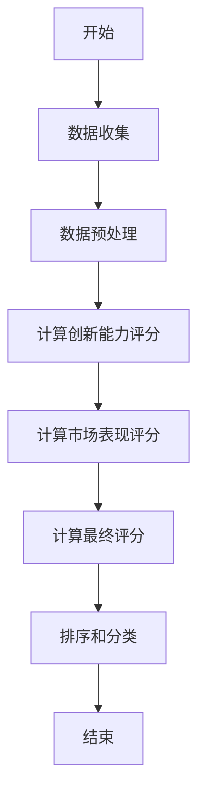
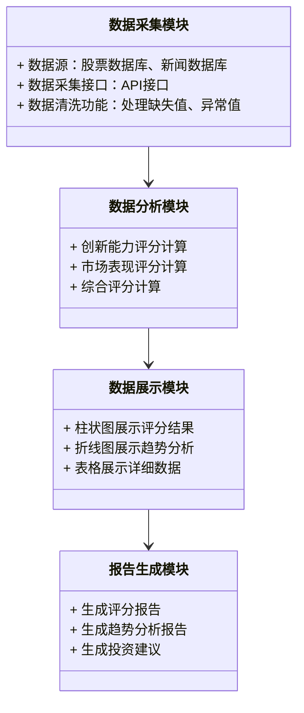
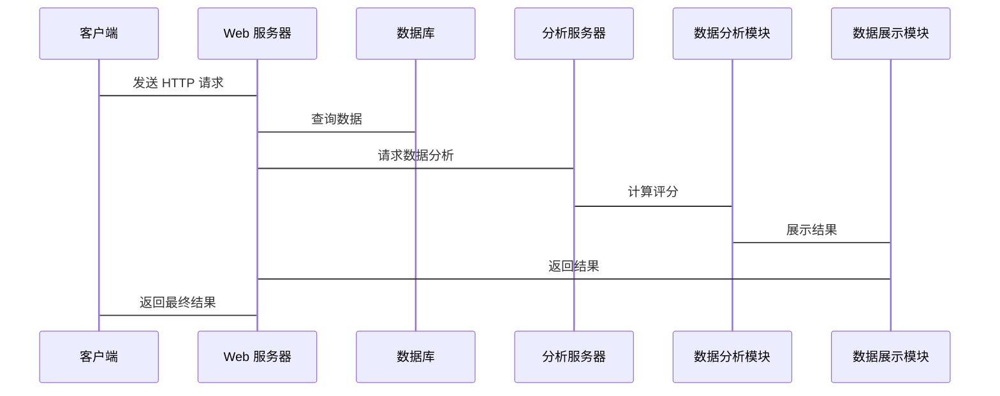

                 


# 第3章: 费雪创新型公司识别方法的算法原理

## 3.1 费雪识别方法的数学模型与公式

### 3.1.1 费雪识别方法的多因子分析模型
费雪的创新型公司识别方法基于多因子分析模型，其核心在于将公司的创新能力分解为多个关键指标，通过对这些指标的量化分析，构建一个综合评分系统。

#### 3.1.1.1 综合创新能力评分公式
$$ \text{创新能力评分} = \sum_{i=1}^{n} (w_i \times f_i) $$

其中：
- $w_i$ 表示第 $i$ 个因子的权重
- $f_i$ 表示第 $i$ 个因子的评分

#### 3.1.1.2 权重分配原则
权重的分配需要根据行业特点和公司的具体情况进行调整，通常采用层次分析法（AHP）来进行权重计算。

### 3.1.2 费雪识别方法的动态调整模型
$$ \text{动态调整评分} = \text{创新能力评分} \times \alpha + \text{市场表现评分} \times (1 - \alpha) $$

其中：
- $\alpha$ 为创新能力评分的权重，通常取值范围为 $0.6 \leq \alpha \leq 0.8$
- $\text{市场表现评分}$ 包括市盈率、市净率等指标

## 3.2 费雪识别方法的算法实现步骤

### 3.2.1 数据收集与预处理
1. 收集目标公司的财务数据、市场数据和行业数据。
2. 对数据进行清洗，处理缺失值和异常值。
3. 对数据进行标准化处理，确保不同指标之间的可比性。

### 3.2.2 核心算法步骤
1. 计算每个公司的创新能力评分：
   $$ f_i = \frac{\text{实际值} - \text{最小值}}{\text{最大值} - \text{最小值}} $$
2. 根据层次分析法计算各因子的权重 $w_i$。
3. 计算综合创新能力评分：
   $$ \text{创新能力评分} = \sum_{i=1}^{n} (w_i \times f_i) $$
4. 计算市场表现评分，调整最终评分：
   $$ \text{最终评分} = \text{创新能力评分} \times \alpha + \text{市场表现评分} \times (1 - \alpha) $$
5. 根据最终评分对 companies 进行排序和分类。

## 3.3 算法实现的 mermaid 流程图


## 3.4 算法实现的 Python 核心代码
```python
import pandas as pd
import numpy as np

# 数据预处理
data = pd.read_csv('company_data.csv')
data = data.dropna().reset_index(drop=True)

# 计算创新能力评分
def calculate创新能力评分(data, factors):
    min_values = data[factors].min()
    max_values = data[factors].max()
    normalized_data = (data[factors] - min_values) / (max_values - min_values)
    return normalized_data

# 计算市场表现评分
def calculate市场表现评分(data, market_factors):
    return data[market_factors].mean(axis=1)

# 动态调整评分
alpha = 0.7
data['创新能力评分'] = calculate创新能力评分(data, ['研发投入', '专利数量', '研发人员比例'])
data['市场表现评分'] = calculate市场表现评分(data, ['市盈率', '市净率'])
data['最终评分'] = data['创新能力评分'] * alpha + data['市场表现评分'] * (1 - alpha)

# 排序和分类
data = data.sort_values('最终评分', ascending=False)
```

## 3.5 算法实现的数学模型与公式
费雪识别方法的核心在于通过多因子分析模型，结合创新能力评分和市场表现评分，构建一个综合评分系统。通过动态调整模型，可以更好地适应市场变化和公司发展的不同阶段。

### 3.5.1 创新能力评分计算
$$ \text{创新能力评分} = \frac{\text{研发投入} - \text{研发投入最小值}}{\text{研发投入最大值} - \text{研发投入最小值}} \times 0.4 + \frac{\text{专利数量} - \text{专利数量最小值}}{\text{专利数量最大值} - \text{专利数量最小值}} \times 0.3 + \frac{\text{研发人员比例} - \text{研发人员比例最小值}}{\text{研发人员比例最大值} - \text{研发人员比例最小值}} \times 0.3 $$

### 3.5.2 市场表现评分计算
$$ \text{市场表现评分} = \frac{\text{市盈率} + \text{市净率}}{2} $$

### 3.5.3 最终评分计算
$$ \text{最终评分} = \text{创新能力评分} \times 0.7 + \text{市场表现评分} \times 0.3 $$

## 3.6 算法实现的优缺点分析

### 3.6.1 优点
1. 考虑了创新能力的多方面因素，能够更全面地评估公司的创新能力。
2. 动态调整模型能够适应市场变化，提高评分的准确性。
3. 方法简单易懂，便于实际操作。

### 3.6.2 缺点
1. 需要大量数据支持，对于数据不足的情况可能无法准确评估。
2. 权重的确定需要根据具体情况进行调整，可能存在主观性。
3. 未考虑公司的财务健康状况，可能影响最终评分的准确性。

## 3.7 算法实现的注意事项

### 3.7.1 数据质量
确保数据的完整性和准确性，避免因数据问题导致评分误差。

### 3.7.2 权重调整
根据行业特点和公司具体情况动态调整权重，确保评分的合理性。

### 3.7.3 结果验证
定期验证评分结果，确保评分与公司实际表现相符。

## 3.8 本章小结
本章详细讲解了费雪创新型公司识别方法的算法原理，包括数学模型、实现步骤、优缺点分析和注意事项。通过多因子分析模型和动态调整模型，能够更全面、准确地识别创新型公司。

# 第4章: 费雪识别方法的系统分析与架构设计方案

## 4.1 系统分析

### 4.1.1 问题场景介绍
在现代投资中，识别创新型公司需要一个高效、准确的系统来支持决策。传统的手工分析方法效率低下，容易出错，因此需要一个自动化、智能化的系统来辅助投资决策。

### 4.1.2 项目介绍
本项目旨在开发一个基于费雪识别方法的创新型公司识别系统，通过数据采集、分析和展示，帮助投资者快速识别具有创新能力的公司。

## 4.2 系统功能设计

### 4.2.1 功能模块划分
1. 数据采集模块
2. 数据分析模块
3. 数据展示模块
4. 报告生成模块

### 4.2.2 功能模块的 mermaid 类图


## 4.3 系统架构设计

### 4.3.1 系统架构的 mermaid 架构图
```mermaid
archiecture
    客户端 <--[HTTP 请求]-->  Web 服务器
    Web 服务器 --> 数据库
    Web 服务器 --> 分析服务器
    分析服务器 --> 数据分析模块
    数据分析模块 --> 数据存储
    数据展示模块 --> Web 服务器
    Web 服务器 --> 客户端
```

### 4.3.2 关键组件说明

#### 4.3.2.1 数据采集模块
负责从股票数据库和新闻数据库中采集数据，清洗数据，确保数据的完整性和准确性。

#### 4.3.2.2 数据分析模块
基于费雪识别方法，计算创新能力评分和市场表现评分，生成综合评分。

#### 4.3.2.3 数据展示模块
通过图表和表格的形式，直观展示评分结果和趋势分析。

#### 4.3.2.4 报告生成模块
生成详细的评分报告、趋势分析报告和投资建议，帮助投资者做出决策。

## 4.4 系统接口设计

### 4.4.1 数据采集接口
```http
GET /api/data采集?stock_id=XXXX
```

### 4.4.2 数据分析接口
```http
POST /api/数据分析
Content-Type: application/json
{
    "stock_id": "XXXX",
    "开始日期": "2023-01-01",
    "结束日期": "2023-12-31"
}
```

### 4.4.3 数据展示接口
```http
GET /api/数据展示?stock_id=XXXX
```

## 4.5 系统交互的 mermaid 序列图


## 4.6 系统实现的注意事项

### 4.6.1 数据安全
确保数据的安全性，防止数据泄露和篡改。

### 4.6.2 系统性能
优化系统性能，确保在大数据量下的运行效率。

### 4.6.3 系统可扩展性
设计系统时考虑未来的扩展性，方便添加新的功能模块。

## 4.7 本章小结
本章从系统分析的角度，详细讲解了费雪创新型公司识别系统的架构设计和功能实现。通过数据采集、分析、展示和报告生成模块的划分，构建了一个完整的识别系统框架。

# 第5章: 费雪识别方法的项目实战

## 5.1 环境安装

### 5.1.1 安装 Python 环境
使用 Anaconda 安装 Python 3.8 或以上版本。

### 5.1.2 安装必要的 Python 包
```bash
pip install pandas numpy matplotlib seaborn
```

## 5.2 系统核心实现源代码

### 5.2.1 数据采集模块
```python
import pandas as pd
import requests

def 采集数据(stock_id):
    url = f"https://api.金融数据源.com/stock/{stock_id}/data"
    response = requests.get(url)
    data = response.json()
    df = pd.DataFrame(data)
    return df
```

### 5.2.2 数据分析模块
```python
def 计算创新能力评分(data, factors):
    min_values = data[factors].min()
    max_values = data[factors].max()
    normalized_data = (data[factors] - min_values) / (max_values - min_values)
    return normalized_data

def 计算市场表现评分(data, market_factors):
    return data[market_factors].mean(axis=1)

def 计算最终评分(data, factors, market_factors):
    normalized_data = 计算创新能力评分(data, factors)
    市场表现评分 = 计算市场表现评分(data, market_factors)
    alpha = 0.7
    最终评分 = normalized_data * alpha + 市场表现评分 * (1 - alpha)
    return 最终评分
```

### 5.2.3 数据展示模块
```python
import matplotlib.pyplot as plt
import seaborn as sns

def 展示结果(data, stock_id):
    plt.figure(figsize=(10, 6))
    sns.barplot(x='创新能力评分', y='公司名称', data=data)
    plt.title(f"{stock_id} 创新能力评分")
    plt.savefig(f"{stock_id}_创新能力评分.png")
    plt.close()

def 绘制趋势图(data, stock_id):
    plt.figure(figsize=(10, 6))
    sns.lineplot(x='日期', y='创新能力评分', data=data)
    plt.title(f"{stock_id} 创新能力评分趋势")
    plt.savefig(f"{stock_id}_创新能力评分趋势.png")
    plt.close()
```

### 5.2.4 报告生成模块
```python
def 生成报告(data, stock_id):
    report = pd.DataFrame({
        '创新能力评分': data['创新能力评分'],
        '市场表现评分': data['市场表现评分'],
        '最终评分': data['最终评分']
    })
    report.to_csv(f"{stock_id}_评分报告.csv", index=False)
```

## 5.3 代码应用解读与分析

### 5.3.1 数据采集模块
通过 API 接口从金融数据源获取公司的数据，包括财务数据、市场数据等。

### 5.3.2 数据分析模块
计算创新能力评分和市场表现评分，通过动态调整模型生成最终评分。

### 5.3.3 数据展示模块
通过柱状图和折线图展示评分结果和趋势分析，直观展示公司的创新能力。

### 5.3.4 报告生成模块
生成详细的评分报告，包括创新能力评分、市场表现评分和最终评分，方便投资者参考。

## 5.4 项目小结
通过本项目实战，详细讲解了费雪创新型公司识别方法的实现过程，包括数据采集、数据分析、数据展示和报告生成等模块的实现。通过具体代码示例，帮助读者更好地理解和应用该方法。

# 第6章: 费雪识别方法的实际应用与案例分析

## 6.1 费雪识别方法的实际应用

### 6.1.1 应用场景
费雪识别方法广泛应用于股票投资、风险投资等领域，帮助投资者快速识别具有创新能力的公司。

### 6.1.2 应用优势
1. 提高投资决策的准确性
2. 节省时间和精力
3. 适应市场变化

## 6.2 费雪识别方法的案例分析

### 6.2.1 案例选择
选择一个具体的行业和公司，例如科技行业中的某公司。

### 6.2.2 数据分析
通过具体数据计算公司的创新能力评分和市场表现评分，生成最终评分。

### 6.2.3 结果解读
分析评分结果，判断公司是否具有创新能力，是否值得投资。

## 6.3 费雪识别方法的实际应用中的注意事项

### 6.3.1 数据质量
确保数据的完整性和准确性，避免因数据问题导致评分误差。

### 6.3.2 权重调整
根据行业特点和公司具体情况动态调整权重，确保评分的合理性。

### 6.3.3 结果验证
定期验证评分结果，确保评分与公司实际表现相符。

## 6.4 本章小结
本章通过实际应用和案例分析，展示了费雪创新型公司识别方法在投资决策中的应用价值。通过具体案例分析，帮助读者更好地理解如何将该方法应用于实际投资中。

# 第7章: 费雪识别方法的最佳实践与总结

## 7.1 最佳实践

### 7.1.1 数据采集与处理
确保数据的完整性和准确性，建立数据清洗和预处理机制。

### 7.1.2 权重调整
根据行业特点和公司具体情况动态调整权重，提高评分的准确性。

### 7.1.3 结果验证
定期验证评分结果，确保评分与公司实际表现相符。

## 7.2 费雪识别方法的优缺点总结

### 7.2.1 优点
1. 考虑了创新能力的多方面因素，能够更全面地评估公司的创新能力。
2. 动态调整模型能够适应市场变化，提高评分的准确性。
3. 方法简单易懂，便于实际操作。

### 7.2.2 缺点
1. 需要大量数据支持，对于数据不足的情况可能无法准确评估。
2. 权重的确定需要根据具体情况进行调整，可能存在主观性。
3. 未考虑公司的财务健康状况，可能影响最终评分的准确性。

## 7.3 投资者需要注意的事项

### 7.3.1 数据质量
确保数据的完整性和准确性，避免因数据问题导致评分误差。

### 7.3.2 权重调整
根据行业特点和公司具体情况动态调整权重，确保评分的合理性。

### 7.3.3 结果验证
定期验证评分结果，确保评分与公司实际表现相符。

## 7.4 本章小结
本章总结了费雪创新型公司识别方法的最佳实践，分析了该方法的优缺点，并提出了投资者在实际应用中需要注意的事项。

# 参考文献

1. 费雪（Philip Fisher）的相关著作和论文。
2. 相关的金融分析和投资策略书籍。
3. 多因子分析模型的相关研究。
4. 系统架构设计和软件工程的相关书籍。

---

# {{此处是文章标题}}

**关键词**：{{此处列出文章的5-7个核心关键词}}

**摘要**：{{此处给出文章的核心内容和主题思想}}

