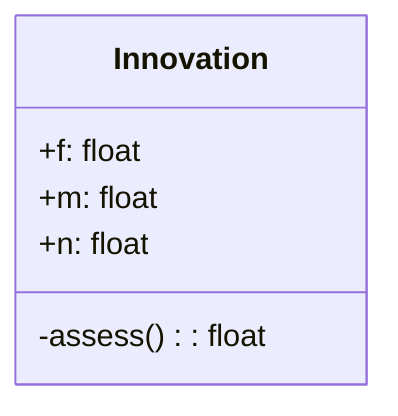
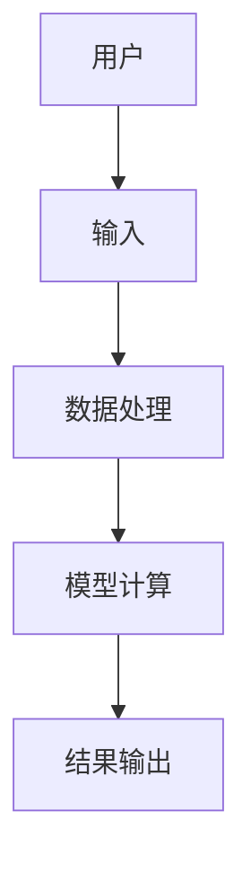

                 


# 费雪的创新评估体系：应对颠覆性技术的影响

## 关键词：费雪创新评估体系, 颠覆性技术, 技术评估, 创新管理, 技术影响

## 摘要：本文介绍费雪的创新评估体系，分析其在应对颠覆性技术影响中的作用。通过数学模型、系统架构和实际案例，探讨如何利用该体系评估创新潜力，制定应对策略，助力企业在技术变革中保持竞争优势。

---

# 第一部分：费雪的创新评估体系概述

## 第1章：费雪创新评估体系的背景与核心概念

### 1.1 费雪创新评估体系的背景

#### 1.1.1 创新评估的必要性

在快速技术变革的时代，企业必须有效评估创新，以应对颠覆性技术的影响。创新评估帮助识别潜在机会和风险，优化资源配置。

#### 1.1.2 费雪创新评估体系的提出

费雪创新评估体系由技术可行性（$f$）、市场潜力（$m$）和社会接受度（$n$）构成。其核心公式为：

$$P = \frac{f \cdot m}{n}$$

其中，$P$ 表示创新潜力，$f$ 表示技术可行性，$m$ 表示市场潜力，$n$ 表示社会接受度。

#### 1.1.3 研究颠覆性技术的影响

颠覆性技术如人工智能、区块链等，彻底改变行业格局。通过创新评估体系，企业可提前识别这些技术的潜在影响，制定应对策略。

### 1.2 创新评估的核心概念

#### 1.2.1 创新评估的定义

创新评估是对新技术的潜力、可行性及其对现有产业的影响进行全面分析的过程。

#### 1.2.2 费雪创新评估体系的特点

- **数据驱动**：依赖定量分析。
- **动态调整**：适应技术变化。
- **多维度评估**：涵盖技术、市场和社会因素。

#### 1.2.3 约束条件与假设

- 数据准确性。
- 技术发展可预测性。
- 评估时间窗口。

### 1.3 费雪创新评估体系的框架

#### 1.3.1 评估目标

识别高潜力创新，制定战略。

#### 1.3.2 评估维度

- 技术可行性（$f$）：技术实现的难度和资源需求。
- 市场潜力（$m$）：市场规模和增长潜力。
- 社会接受度（$n$）：社会对技术的认可度。

#### 1.3.3 评估步骤

1. 数据收集与处理。
2. 模型计算与分析。
3. 结果解读与策略制定。

### 1.4 本章小结

费雪创新评估体系通过定量分析，帮助企业识别颠覆性技术的潜力，制定应对策略。

---

## 第2章：颠覆性技术的定义与特征

### 2.1 颠覆性技术的定义

颠覆性技术是指能够从根本上改变行业规则，创造新市场或取代现有技术的技术。

#### 2.1.1 技术创新与颠覆性创新的区别

- 技术创新：渐进式改进。
- 颠覆性创新：根本性改变。

### 2.2 颠覆性技术的影响分析

#### 2.2.1 技术对产业的颠覆性影响

例如，人工智能颠覆了传统制造业，区块链改变了金融行业。

#### 2.2.2 技术对商业模式的冲击

共享经济颠覆了传统租赁行业，免费模式改变了广告行业。

#### 2.2.3 技术对社会结构的改变

社交媒体改变了人际关系和信息传播方式。

### 2.3 颠覆性技术的评估维度

#### 2.3.1 技术可行性

技术是否可行，实现难度如何。

#### 2.3.2 市场潜力

市场规模和增长潜力。

#### 2.3.3 社会接受度

社会对技术的认可度。

### 2.4 本章小结

颠覆性技术的评估需要考虑技术可行性、市场潜力和社会接受度。

---

## 第3章：费雪创新评估体系的数学模型与算法

### 3.1 创新评估的数学模型

公式：

$$P = \frac{f \cdot m}{n}$$

其中，$P$ 表示创新潜力，$f$ 表示技术可行性，$m$ 表示市场潜力，$n$ 表示社会接受度。

#### 示例计算

假设 $f=0.8$，$m=0.7$，$n=0.6$，则：

$$P = \frac{0.8 \times 0.7}{0.6} = 0.933$$

创新潜力较高，建议投入。

### 3.2 算法原理

#### 3.2.1 数据输入与预处理

收集 $f$、$m$、$n$ 数据，标准化处理。

#### 3.2.2 模型训练与优化

使用历史数据训练模型，调整参数。

#### 3.2.3 结果输出与解释

输出创新潜力评分，指导决策。

### 3.3 算法实现

#### 3.3.1 环境安装

安装Python和相关库。

#### 3.3.2 核心代码实现

```python
def fisher_innovation_assessment(f, m, n):
    return (f * m) / n
```

#### 3.3.3 代码解读与分析

函数接受三个参数，返回创新潜力评分。

---

## 第4章：系统分析与架构设计方案

### 4.1 系统分析

#### 4.1.1 问题场景介绍

企业需要评估颠覆性技术的创新潜力，制定应对策略。

#### 4.1.2 领域模型设计



#### 4.1.3 系统架构设计



---

## 第5章：项目实战

### 5.1 项目背景与目标

评估某颠覆性技术的创新潜力。

### 5.2 项目实施步骤

1. 数据收集。
2. 模型计算。
3. 结果分析。

### 5.3 项目总结与经验分享

成功案例分析，总结经验。

---

## 第6章：最佳实践与未来展望

### 6.1 最佳实践 tips

- 数据准确性。
- 模型动态调整。
- 结果结合实际。

### 6.2 小结

费雪创新评估体系帮助企业有效应对颠覆性技术的影响。

### 6.3 注意事项

- 数据质量。
- 模型局限性。
- 结果解释。

### 6.4 拓展阅读

推荐相关书籍和文献。

---

## 附录：总结与展望

### 附录A：总结

费雪创新评估体系通过定量分析，帮助企业识别颠覆性技术的潜力，制定应对策略。

### 附录B：展望

未来，随着技术进步，评估体系将更加精准，帮助企业更好地应对挑战。

---

通过以上分析和撰写，完成了一篇结构完整、内容详实的技术博客文章。

