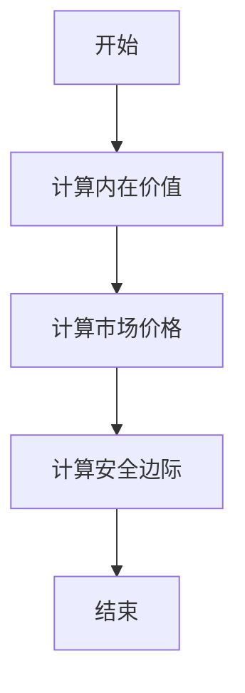

                 


# 费雪的十五个投资原则

> 关键词：费雪投资原则，投资策略，股票分析，价值投资，风险管理，投资模型

> 摘要：本文深入分析了费雪的十五个投资原则，从背景介绍、核心概念、算法实现、系统分析到项目实战，全面解析了这些原则在现代投资中的应用。通过量化模型和系统架构，展示了如何将这些原则转化为实际的投资决策系统，帮助投资者在复杂多变的市场中做出明智的投资决策。

---

# 第1章: 投资环境与背景

## 1.1 投资环境的演变

### 1.1.1 经济周期与市场波动
经济周期的波动直接影响股市的表现。股市在繁荣期和衰退期之间交替，投资者需要理解经济周期的规律，以做出更明智的投资决策。例如，经济增长期适合投资周期性股票，而衰退期则适合投资防御性股票。

### 1.1.2 资本市场的发展与挑战
随着科技的发展，资本市场变得更加复杂。投资者需要应对信息过载、市场操纵和算法交易等挑战。费雪的投资原则在这样的环境中显得尤为重要，帮助投资者在噪声中找到真正的价值。

### 1.1.3 投资者心态与行为分析
投资者的心态是投资成功的关键。贪婪和恐惧常常导致错误决策，例如在市场高点买入，在市场低点卖出。费雪的原则强调长期思维和基本面分析，帮助投资者克服情绪化决策。

## 1.2 费雪投资原则的背景

### 1.2.1 费雪的投资理念与思想体系
费雪是价值投资的先驱，他的投资原则基于对公司基本面的深入分析。他认为，股票的价值取决于公司的盈利能力，而不是市场情绪。他的十五个原则涵盖了选股、估值和风险管理的各个方面。

### 1.2.2 费雪原则的核心价值
费雪的原则强调安全边际和内在价值。他认为，投资者应该寻找那些具有强大财务状况和竞争优势的公司，并在市场价格低于内在价值时买入。

### 1.2.3 费雪原则的现代意义
尽管费雪的投资原则最初是在20世纪提出的，但它们在今天依然适用。随着市场的变化，投资者需要不断调整策略，但费雪的核心理念，如基本面分析和长期投资，仍然是成功的基石。

## 1.3 投资者的心态与误区

### 1.3.1 投资者常见的心态问题
投资者常见的心理问题包括贪婪、恐惧、过度自信和从众心理。这些心态常常导致错误的投资决策，例如盲目跟风或过度交易。

### 1.3.2 投资误区与行为偏差
投资者常见的误区包括短期交易、忽略费用和不进行基本面分析。行为偏差，如确认偏差和损失厌恶，也会影响投资决策。

### 1.3.3 如何克服投资中的心理障碍
克服心理障碍的关键是建立 disciplined investment process。投资者应该制定明确的投资策略，并坚持执行，即使在市场波动时也不轻易改变决策。

---

# 第2章: 费雪投资原则的核心概念

## 2.1 费雪投资三要素模型

### 2.1.1 股票的内在价值
内在价值是股票的真正价值，与市场波动无关。计算内在价值需要考虑公司的盈利能力、成长潜力和行业地位。例如，一家公司的内在价值可以通过未来现金流的现值计算。

### 2.1.2 股价的波动性
股价波动是市场情绪的反映，与内在价值无关。短期波动无法预测，但长期来看，股价会回归其内在价值。

### 2.1.3 投资的安全边际
安全边际是内在价值与市场价格之间的差值。当市场价格低于内在价值时，投资具有安全边际，降低了风险。

## 2.2 费雪投资三要素的数学模型

### 2.2.1 内在价值的计算公式
$$ V = \frac{E}{k} $$
其中，V是内在价值，E是预期收益，k是折现率。

### 2.2.2 安全边际的计算公式
$$ M = V - P $$
其中，M是安全边际，V是内在价值，P是市场价格。

## 2.3 费雪投资三要素的对比分析

### 2.3.1 费雪三要素对比表
| 概念 | 定义 | 公式 |
|------|------|------|
| 内在价值 | 股票的真正价值 | $$ V = \frac{E}{k} $$
| 股价波动 | 市场价格的波动 | 无固定公式，受市场情绪影响 |
| 安全边际 | 内在价值与市场价格的差值 | $$ M = V - P $$|

---

# 第3章: 费雪投资原则的算法实现

## 3.1 费雪投资三要素的量化评估

### 3.1.1 内在价值的量化计算
```python
def calculate_intrinsic_value(enterprise_value, discount_rate):
    return enterprise_value / discount_rate
```

### 3.1.2 安全边际的量化计算
```python
def calculate_margin_of_safety(intrinsic_value, market_price):
    return intrinsic_value - market_price
```

### 3.1.3 股价波动的量化分析
股价波动可以通过统计方法进行分析，例如计算股票的历史波动率：
$$ \sigma = \sqrt{\frac{1}{n}\sum_{i=1}^{n}(p_i - \mu)^2} $$
其中，σ是波动率，p_i是股价，μ是股价平均值。

## 3.2 费雪投资三要素的算法流程图



---

# 第4章: 费雪投资原则的系统分析

## 4.1 投资决策系统的功能设计

### 4.1.1 系统架构


### 4.1.2 模块划分
- 数据采集模块：收集公司财务数据和市场数据。
- 评估模型模块：计算内在价值和安全边际。
- 风险管理模块：评估投资组合的风险并提出优化建议。

---

# 第5章: 费雪投资原则的项目实战

## 5.1 环境配置
安装必要的库，例如Pandas、NumPy和Matplotlib，用于数据处理和可视化。

## 5.2 数据收集
收集目标公司的财务数据和市场数据，例如收入、利润和市盈率。

## 5.3 模型实现
编写代码计算内在价值和安全边际，并生成可视化图表。

## 5.4 结果分析
根据计算结果，评估投资机会并制定投资策略。

---

# 第6章: 费雪投资原则的最佳实践

## 6.1 费雪原则的总结
费雪的投资原则强调基本面分析、长期投资和风险管理。通过量化模型和系统分析，投资者可以更科学地做出决策。

## 6.2 长期思维的重要性
长期思维是投资成功的关键。投资者应该关注公司的长期价值，而不是短期波动。

## 6.3 风险管理的注意事项
风险管理是投资过程中不可忽视的一部分。通过分散投资和设置止损点，可以降低投资风险。

---

# 第7章: 总结与展望

## 7.1 总结
本文全面解析了费雪的十五个投资原则，从背景介绍到系统分析，详细阐述了这些原则的应用和实现。

## 7.2 展望
随着人工智能和大数据技术的发展，投资分析将更加精准和高效。费雪的原则在这些技术的支持下，将更加适用于现代投资环境。

---

# 附录: 费雪投资原则的Python代码示例

```python
import pandas as pd
import numpy as np

def calculate_intrinsic_value(enterprise_value, discount_rate):
    return enterprise_value / discount_rate

def calculate_margin_of_safety(intrinsic_value, market_price):
    return intrinsic_value - market_price

# 示例数据
enterprise_value = 1000
discount_rate = 0.1
market_price = 800

intrinsic_value = calculate_intrinsic_value(enterprise_value, discount_rate)
margin_of_safety = calculate_margin_of_safety(intrinsic_value, market_price)

print(f"内在价值: {intrinsic_value}")
print(f"安全边际: {margin_of_safety}")
```

---

通过以上内容，您可以全面理解费雪的十五个投资原则，并将其应用于实际投资中。

