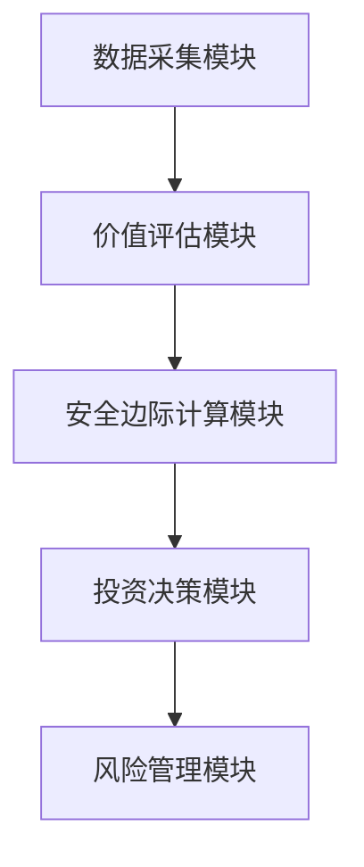

                 


# 费雪的十五个投资点及其现代应用

> 关键词：费雪投资理论，价值投资，安全边际，市场先生，现代投资策略

> 摘要：本文系统地探讨了费雪的投资理论，特别是其十五个核心要点，并分析了这些原则在现代投资环境中的应用。文章通过详细解释每个要点，结合数学模型和实际案例，展示了如何将费雪的理论应用于当前的投资实践中。

---

## 第1章：费雪投资理念的背景与核心要点

### 1.1 费雪的生平与投资背景
费雪（Philip Fisher）是20世纪的投资大师，以其价值投资理念闻名。他出生于一个金融世家，父亲是著名的金融家，这为他提供了丰富的投资知识和经验。费雪的投资理念深受其父影响，但他在实践中进一步发展了这些理念，形成了自己独特的投资策略。

#### 1.1.1 费雪的生平简介
费雪于1906年出生于美国旧金山，早年在哈佛大学学习化学，后来转向金融投资。他在1934年出版的《共同股的性质》一书中首次系统阐述了他的投资理论。费雪的投资理念强调长期价值和成长性，反对短期投机。

#### 1.1.2 费雪投资理念的形成背景
20世纪30年代的经济大萧条为费雪的投资理论提供了重要的背景。他在实践中观察到，许多投资者在市场下跌时恐慌卖出，而在市场上涨时贪婪买入，这种情绪波动为价值投资者提供了机会。

#### 1.1.3 费雪投资理论的核心思想
费雪的投资理论以“价值投资”为核心，强调购买那些具有强大成长潜力的公司股票，并长期持有，避免频繁交易。他认为市场先生（市场的波动性）是投资中的敌人，投资者应避免被市场情绪左右。

### 1.2 费雪的十五个投资要点
费雪提出的十五个投资要点是其价值投资理论的核心。这些要点涵盖了从公司基本面分析到市场情绪管理的各个方面。

#### 1.2.1 投资要点的定义与分类
费雪的十五个要点可以分为三类：公司基本面分析、市场分析和心理因素。

#### 1.2.2 十五个要点的核心列表
1. **长期投资**：避免频繁交易，降低交易成本。
2. **购买优秀公司**：选择具有强大竞争优势和成长潜力的公司。
3. **内在价值**：计算股票的内在价值，作为买入价格的基准。
4. **安全边际**：买入价格应低于股票的内在价值，提供安全空间。
5. **市场先生**：市场波动是机会，而非障碍。
6. **分散投资**：避免过度集中，降低风险。
7. **成长股投资**：选择具有高增长潜力的公司。
8. **股息率**：关注股息率，但不过分依赖。
9. **行业分析**：选择具有增长前景的行业。
10. **管理层素质**：关注公司管理层的能力和诚信。
11. **财务报表分析**：通过财务报表评估公司的财务健康状况。
12. **竞争优势**：选择具有独特竞争优势的公司。
13. **市场周期**：识别市场周期，避免在市场高点买入。
14. **心理因素**：避免情绪化决策，保持理性。
15. **长期视角**：关注公司的长期价值，而非短期波动。

#### 1.2.3 每个要点的简要说明
- **长期投资**：通过长期持有优质股票，获得复利效应。
- **购买优秀公司**：选择那些在行业中具有领先地位的公司。
- **内在价值**：通过DCF模型等方法计算股票的内在价值。
- **安全边际**：买入价格低于内在价值，以应对市场波动。
- **市场先生**：市场波动为投资者提供了低价买入的机会。
- **分散投资**：通过投资不同行业和公司的股票，降低风险。
- **成长股投资**：选择那些 revenue 和利润增长迅速的公司。
- **股息率**：股息率高表明公司有稳定的盈利和现金流。
- **行业分析**：选择处于增长周期的行业。
- **管理层素质**：管理层的诚信和能力直接影响公司的发展。
- **财务报表分析**：通过资产负债表、利润表和现金流量表评估公司财务状况。
- **竞争优势**：公司具有独特的竞争优势，如专利、品牌或技术。
- **市场周期**：识别市场周期，避免在市场高点买入。
- **心理因素**：避免贪婪和恐惧等情绪影响投资决策。
- **长期视角**：关注公司的长期价值，而非短期价格波动。

### 1.3 费雪投资理论的现代意义
费雪的投资理论在今天依然具有重要的现实意义。随着金融市场的复杂化和科技的发展，他的理论为投资者提供了宝贵的指导。

#### 1.3.1 现代投资环境的变化
现代投资环境与费雪时代相比，发生了显著变化。科技股的崛起、指数基金的普及、全球化进程的加快以及金融工具的多样化，都为投资者提供了新的机会和挑战。

#### 1.3.2 费雪理论在现代的应用领域
费雪的理论在多个领域都有应用，包括：
- **科技股投资**：选择具有强大技术创新能力的科技公司。
- **指数基金投资**：通过分散投资降低风险，获得市场平均收益。
- **私募基金与对冲基金**：利用费雪的理论进行更有效的投资决策。

#### 1.3.3 理论的局限性与改进方向
尽管费雪的理论在实践中取得了巨大成功，但仍存在一些局限性。例如，他的理论主要适用于长期投资，对短期波动的应对较少涉及。此外，随着市场的变化，投资者需要结合新的情况，对理论进行适当的调整和补充。

---

## 第2章：价值投资的核心原则

### 2.1 价值投资的定义与特征
价值投资是一种投资策略，强调以低于内在价值的价格买入优质股票，并长期持有。

#### 2.1.1 价值投资的定义
价值投资是指通过分析股票的内在价值，以低于内在价值的价格买入股票，并长期持有的投资策略。

#### 2.1.2 价值投资的核心特征
- **长期视角**：关注公司的长期价值，而非短期价格波动。
- **安全边际**：买入价格低于内在价值，提供安全空间。
- **优质公司**：选择具有强大竞争优势和成长潜力的公司。
- **分散投资**：通过投资不同公司和行业降低风险。

#### 2.1.3 价值投资与其他投资策略的对比
与成长股投资、指数投资等策略相比，价值投资更注重股票的内在价值和长期成长潜力。

### 2.2 费雪的"安全边际"原则
安全边际是价值投资中的一个重要概念，指买入价格低于股票的内在价值。

#### 2.2.1 安全边际的定义
安全边际是指买入价格与股票内在价值之间的差额。通过安全边际，投资者可以在市场波动中保护自己的投资。

#### 2.2.2 安全边际的计算方法
安全边际 = 内在价值 - 市场价格

#### 2.2.3 安全边际在投资决策中的作用
安全边际为投资者提供了保护，避免在市场高点买入股票，同时为长期持有提供了缓冲空间。

### 2.3 费雪的"市场先生"理论
市场先生理论是费雪对市场波动性的一种比喻，强调市场波动为投资者提供了机会。

#### 2.3.1 市场先生的定义
市场先生是市场的化身，他的情绪波动导致股票价格的波动。

#### 2.3.2 市场先生的波动性分析
市场先生的情绪波动是不可预测的，但投资者可以通过分析市场周期，识别市场先生的错误，并利用这些错误进行投资。

#### 2.3.3 投资者如何应对市场先生的变化
投资者应避免被市场先生的情绪左右，坚持长期投资，避免短期交易。

---

## 第3章：费雪投资要点的数学模型与公式

### 3.1 安全边际的数学模型
安全边际是价值投资中的重要指标，其计算公式如下：

$$
\text{安全边际} = \text{内在价值} - \text{市场价格}
$$

### 3.2 市场先生的波动性分析模型
市场波动性可以通过标准差来度量：

$$
\text{波动性} = \sqrt{\text{方差}} = \sigma
$$

### 3.3 价值评估的数学模型
内在价值可以通过现金流折现模型（DCF）进行计算：

$$
\text{内在价值} = \sum_{t=1}^{\infty} \frac{\text{现金流}}{(1 + r)^t}
$$

其中，\( r \) 是折现率，通常使用无风险利率加上风险溢价。

---

## 第4章：现代投资环境下的费雪理论应用

### 4.1 科技股投资中的费雪原则
科技股的投资需要结合费雪的价值投资理念和现代科技发展的特点。

#### 4.1.1 科技股的内在价值评估
通过DCF模型评估科技公司的内在价值，重点关注其研发能力和市场地位。

#### 4.1.2 科技股的安全边际计算
计算科技股的内在价值与市场价格之间的差额，确定安全边际。

#### 4.1.3 科技股投资中的市场先生应对策略
避免被市场波动影响，选择具有强大技术优势的公司长期持有。

### 4.2 指数基金投资中的费雪理念
指数基金通过分散投资降低了个股风险，符合费雪的分散投资原则。

#### 4.2.1 指数基金的价值评估
通过分析指数基金的成分股，评估其整体内在价值。

#### 4.2.2 指数基金的安全边际分析
指数基金的价格波动较小，安全边际相对较高。

#### 4.2.3 指数基金的长期投资策略
坚持长期投资，定期定额买入，获得市场平均收益。

### 4.3 私募基金与对冲基金中的费雪理论
私募基金和对冲基金可以通过费雪的理论优化投资组合。

#### 4.3.1 私募基金的价值评估
通过基本面分析，选择具有强大竞争优势的公司。

#### 4.3.2 对冲基金的安全边际分析
对冲基金通过套利等策略，可以在市场波动中获得安全边际。

#### 4.3.3 对冲基金的市场先生应对策略
利用市场波动，通过做空或做多获利。

---

## 第5章：费雪投资理论的系统架构与实现

### 5.1 投资系统架构设计
为了更好地应用费雪的投资理论，可以设计一个投资管理系统。

#### 5.1.1 系统功能模块划分
- **数据采集模块**：收集股票的基本面数据和市场数据。
- **价值评估模块**：计算股票的内在价值。
- **安全边际计算模块**：计算安全边际。
- **投资决策模块**：基于安全边际和市场分析做出投资决策。
- **风险管理模块**：监控投资组合的风险。

#### 5.1.2 系统架构的Mermaid图



---

## 第6章：项目实战

### 6.1 科技股投资实战
以苹果公司为例，应用费雪的理论进行投资分析。

#### 6.1.1 实际案例分析
苹果公司（AAPL）是具有强大竞争优势的科技公司，符合费雪的成长股投资原则。

#### 6.1.2 代码实现与解读
通过Python代码计算苹果公司的内在价值和安全边际。

```python
import pandas as pd
import numpy as np

# 假设我们有苹果公司的现金流数据
cash_flows = [100, 120, 140, 160, 180]  # 现金流
discount_rate = 0.10  # 折现率

# 计算内在价值
intrinsic_value = sum(cash_flow / (1 + discount_rate)**t for t, cash_flow in enumerate(cash_flows))

print(f"苹果公司的内在价值为：{intrinsic_value}")
```

---

## 第7章：最佳实践与小结

### 7.1 总结与反思
费雪的投资理论在现代投资环境中依然具有重要的指导意义。通过价值投资和安全边际的原则，投资者可以在市场波动中保持理性，获得长期稳定的收益。

### 7.2 投资建议
- **长期投资**：坚持长期投资，避免短期波动的影响。
- **优质公司**：选择具有强大竞争优势的公司。
- **分散投资**：通过分散投资降低风险。
- **安全边际**：在买入股票时，确保有足够的安全边际。

### 7.3 拓展阅读
- 费雪的《共同股的性质》
- 本杰明·格雷厄姆的《证券分析》
- 巴菲特的《投资策略》

---

通过以上章节的详细分析，我们可以看到费雪的投资理论在现代投资环境中的广泛适用性。无论是科技股、指数基金还是私募基金，费雪的理论都为我们提供了宝贵的指导。投资者在实际操作中，应结合市场变化和公司具体情况，灵活运用这些理论，以实现长期稳定的收益。

