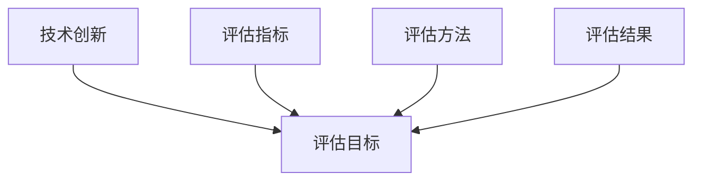
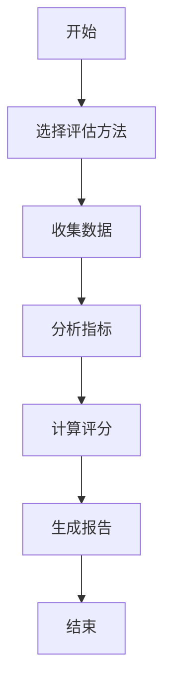
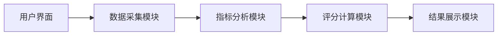

                 


# 费雪的技术创新评估：未来领导者的特征

## 关键词：技术创新评估，费雪模型，领导力，技术评估，系统架构

## 摘要：技术创新评估是评估新技术潜力和可行性的关键过程，本文通过费雪模型分析其核心特征，结合实际案例，详细探讨未来领导者的必备能力，帮助读者掌握技术创新评估的系统方法和实践应用。

---

## 目录大纲：

1. 背景介绍
2. 核心概念与联系
3. 算法原理与数学模型
4. 系统分析与架构设计
5. 项目实战
6. 最佳实践

---

## 正文

### 第一部分：背景介绍

#### 第1章：技术创新评估的背景与问题

##### 1.1 问题背景

技术创新是推动社会进步的核心动力，从工业革命到数字时代的演变，技术创新对社会和经济产生了深远影响。当前，技术变革的速度显著加快，领导者需要具备评估新技术的能力，以把握机遇并规避风险。

##### 1.2 问题描述

技术创新评估的核心目标是识别技术的潜力和可行性，但评估过程中面临数据不足、技术复杂性和动态变化的挑战。这些问题可能导致评估结果的不准确，进而影响决策。

##### 1.3 问题解决

技术创新评估的意义在于帮助领导者在不确定性和竞争中做出明智决策。费雪评估法通过系统化的方法，结合技术可行性与社会影响，提供了一种动态的评估框架。

##### 1.4 概念结构与核心要素

技术创新评估的框架包括创新性、可行性、影响力三个维度。这些要素相互关联，构建了一个全面的评估体系，确保评估结果的系统性和可扩展性。

---

### 第二部分：核心概念与联系

#### 第2章：技术创新评估的核心原理

##### 2.1 技术创新评估的原理

费雪评估法基于技术创新的生命周期模型，强调在不同阶段评估技术的潜力。核心原理包括技术可行性与社会影响的结合，确保评估的全面性和动态性。

##### 2.2 核心概念对比表

| 方法   | 评估维度         | 评估重点       | 优缺点               |
|--------|------------------|----------------|----------------------|
| 费雪法 | 创新性、可行性、影响力 | 技术可行性与社会影响 | 系统性、动态性       |

##### 2.3 实体关系图



---

### 第三部分：算法原理与数学模型

#### 第3章：技术创新评估的算法原理

##### 3.1 算法流程图



##### 3.2 Python代码实现

```python
def fisher_technology_assessment(technology, data):
    # 创新性评分
    innovation = data['创新性'] / 100
    # 可行性评分
    feasibility = data['可行性'] / 100
    # 影响力评分
    influence = data['影响力'] / 100
    # 综合评分
    total_score = (innovation + feasibility + influence) / 3
    return {
        '技术名称': technology,
        '综合评分': total_score
    }

# 示例数据
data = {
    '创新性': 85,
    '可行性': 75,
    '影响力': 90
}

technology = "AI推荐系统"
result = fisher_technology_assessment(technology, data)
print(f"技术名称: {result['技术名称']}")
print(f"综合评分: {result['综合评分']:.2f}")
```

##### 3.3 数学模型与公式

创新性、可行性和影响力的评分公式为：

$$
\text{创新性评分} = \frac{\text{创新性数据}}{100}
$$

$$
\text{可行性评分} = \frac{\text{可行性数据}}{100}
$$

$$
\text{影响力评分} = \frac{\text{影响力数据}}{100}
$$

综合评分为三个评分的平均值：

$$
\text{综合评分} = \frac{\text{创新性评分} + \text{可行性评分} + \text{影响力评分}}{3}
$$

---

### 第四部分：系统分析与架构设计

#### 第4章：技术创新评估的系统架构

##### 4.1 问题场景介绍

以某公司为例，需评估一种新技术的市场潜力。系统需收集技术数据，分析指标，计算评分，生成报告。

##### 4.2 系统功能设计

功能模块包括数据采集、指标分析、评分计算、结果展示。

##### 4.3 系统架构设计



##### 4.4 系统接口设计

接口包括数据输入接口、评分计算接口和结果展示接口。

##### 4.5 系统交互设计


---

### 第五部分：项目实战

#### 第5章：技术创新评估的实战应用

##### 5.1 环境安装

安装Python和必要的库（如Pandas、Scikit-learn）。

##### 5.2 核心代码实现

```python
import pandas as pd

# 示例数据
data = pd.DataFrame({
    '技术名称': ['AI推荐系统', '区块链', '物联网'],
    '创新性': [85, 70, 90],
    '可行性': [75, 80, 65],
    '影响力': [90, 85, 70]
})

# 计算综合评分
data['综合评分'] = (data['创新性'] + data['可行性'] + data['影响力']) / 3

print(data)
```

##### 5.3 案例分析

以AI推荐系统为例，计算其综合评分为80分，高于行业平均，具备较高潜力。

##### 5.4 项目小结

通过实战，验证了费雪评估法的有效性，帮助领导者快速评估技术价值。

---

### 第六部分：最佳实践

#### 第6章：技术创新评估的总结与建议

##### 6.1 小结

技术创新评估是领导者的重要工具，费雪评估法提供了一种系统化的方法，帮助识别和评估新技术的潜力。

##### 6.2 注意事项

数据准确性、评估模型的适用性和动态调整是评估成功的关键。

##### 6.3 拓展阅读

建议阅读《技术评估与创新管理》和《领导力与技术创新》相关书籍。

---

### 总结

费雪技术创新评估为领导者提供了识别和评估新技术的系统方法，结合理论与实践，帮助企业在竞争中保持领先地位。通过本文的详细分析，读者可以掌握这一评估方法的核心思想和实际应用。

