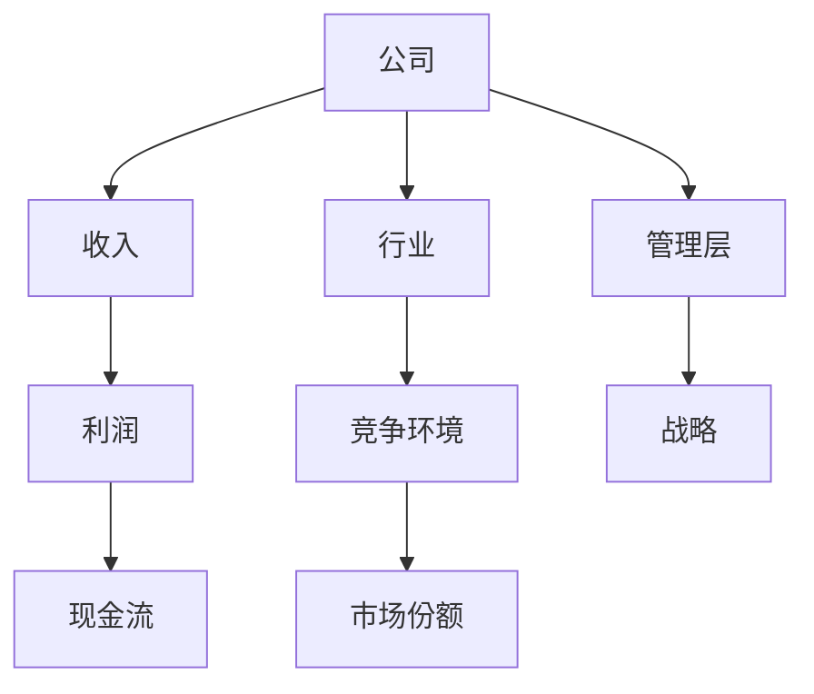
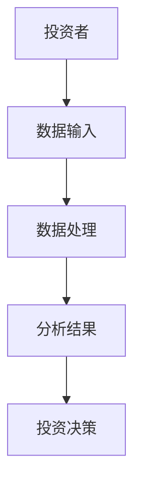
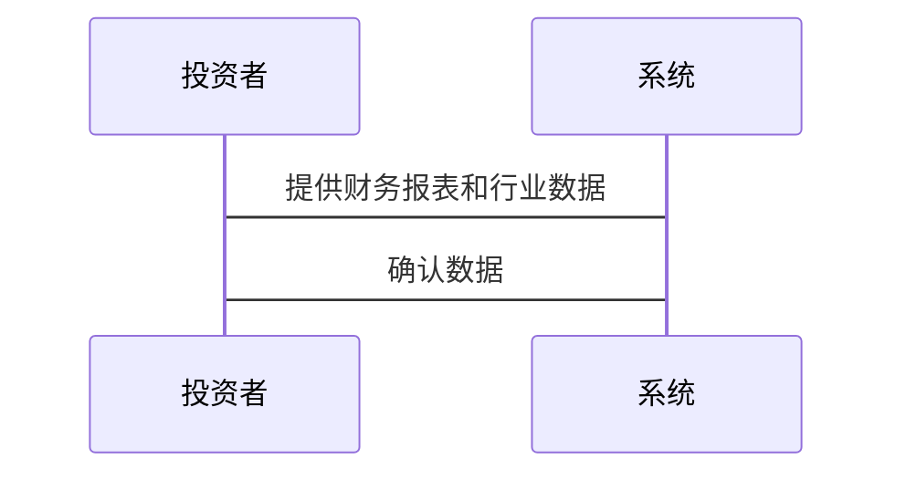
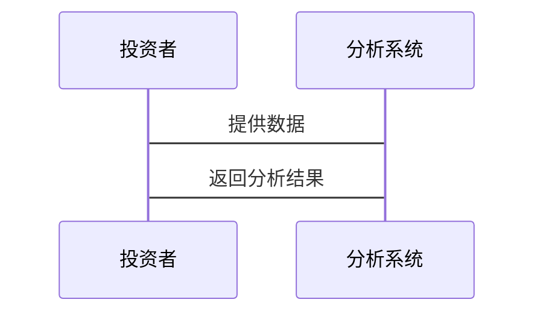

                 


# 费雪的探照灯理论：深入研究公司的方法

> 关键词：费雪, 投资理论, 探照灯理论, 企业分析, 财务分析, 投资策略

> 摘要：本文深入探讨了费雪的探照灯理论，通过分析其核心概念、数学模型、系统架构以及实际案例，详细阐述了如何应用该理论进行公司研究。文章从背景介绍到项目实战，层层递进，帮助读者全面掌握探照灯理论的精髓。

---

# 第一部分: 费雪的探照灯理论概述

## 第1章: 费雪的生平与投资理念

### 1.1 费雪的生平简介

#### 1.1.1 费雪的早期经历
菲利普·费雪（Philip Fisher）是20世纪著名的投资理论家，被誉为“成长型投资之父”。他出生于1907年，早年在加州大学伯克利分校学习 electrical engineering，后转到哈佛法学院攻读法律学位，但最终选择了投资领域。

#### 1.1.2 费雪的投资生涯
费雪在1930年代开始投资生涯，初期通过分析铁路公司股票，逐渐形成自己的投资理念。他强调长期投资和深入研究公司基本面，反对短期交易。

#### 1.1.3 费雪的学术贡献
费雪是《投资的艺术》一书的作者，书中详细阐述了他的投资理念，特别是探照灯理论，对后世投资理论发展影响深远。

### 1.2 费雪的投资理念

#### 1.2.1 价值投资的核心思想
费雪认为，投资的核心是寻找那些具有持续增长潜力的优秀公司，而非仅仅关注市场价格波动。

#### 1.2.2 费雪对投资学的贡献
费雪提出了“成长股”概念，强调公司未来收益的增长潜力，而非当前的市盈率。

#### 1.2.3 探照灯理论的提出背景
探照灯理论源于费雪对投资分析的深入思考，旨在为投资者提供一套系统化的公司研究方法。

### 1.3 探照灯理论的定义与特点

#### 1.3.1 探照灯理论的定义
探照灯理论是一种通过深入分析公司的各个方面（如财务状况、行业地位、管理团队等），来评估其投资价值的方法。

#### 1.3.2 探照灯理论的核心要素
- **公司基本面**：收入、利润、资产负债表等。
- **行业分析**：行业地位、竞争环境。
- **管理团队**：领导层的能力和决策。

#### 1.3.3 探照灯理论与传统投资理论的区别
探照灯理论更注重长期增长潜力，而传统理论更关注短期价格波动。

### 1.4 探照灯理论的应用范围

#### 1.4.1 探照灯理论的主要应用领域
- 价值投资
- 成长股投资
- 公司基本面分析

#### 1.4.2 探照灯理论的适用场景
- 长期投资者
- 机构投资者
- 个人投资者

#### 1.4.3 探照灯理论的局限性
- 过于依赖长期预测
- 忽略市场波动
- 需要大量时间和资源进行分析

### 1.5 本章小结
本章介绍了费雪的生平及其投资理念，重点阐述了探照灯理论的核心概念和特点，为后续分析奠定了基础。

---

## 第2章: 探照灯理论的核心概念

### 2.1 探照灯理论的核心要素

#### 2.1.1 公司基本面分析
公司基本面分析包括收入、利润、资产负债表等财务指标。

#### 2.1.2 财务报表分析
通过分析资产负债表、利润表和现金流量表，评估公司的财务健康状况。

#### 2.1.3 行业分析与竞争环境
研究公司所在行业的竞争格局，判断其市场地位和发展潜力。

### 2.2 探照灯理论的分析框架

#### 2.2.1 探照灯理论的分析步骤
1. **行业分析**：了解行业趋势和竞争环境。
2. **公司分析**：研究公司的财务状况、管理团队和市场策略。
3. **估值分析**：计算公司的真实价值，判断其投资吸引力。

#### 2.2.2 探照灯理论的分析工具
- 财务比率分析：如市盈率、ROE等。
- 资产负债表分析：评估公司资产和负债情况。
- 竞争力分析：评估公司在行业中的地位。

#### 2.2.3 探照灯理论的分析流程
从行业分析到公司分析，再到估值分析，形成一个系统化的分析流程。

### 2.3 探照灯理论与企业价值的关系

#### 2.3.1 企业价值的定义
企业价值是公司未来现金流的现值，反映了公司的真实价值。

#### 2.3.2 探照灯理论对企业价值的影响
通过深入分析公司基本面，探照灯理论帮助投资者更准确地评估企业价值。

#### 2.3.3 探照灯理论与企业估值模型的结合
将探照灯理论与DCF模型结合，可以更准确地进行企业估值。

### 2.4 本章小结
本章详细讲解了探照灯理论的核心要素和分析框架，帮助读者理解其理论基础和分析流程。

---

## 第3章: 探照灯理论的数学模型与公式

### 3.1 探照灯理论的数学模型

#### 3.1.1 探照灯理论的基本公式
企业价值（EV）= 净利润 × （1 + g） / (r - g)
其中，g是增长率，r是贴现率。

#### 3.1.2 探照灯理论的扩展公式
EV = EBIT × (1 + 税率) × (1 - 折旧率)

#### 3.1.3 探照灯理论的数学推导
通过对企业未来现金流的贴现，计算出企业价值，并与当前股价进行对比。

### 3.2 探照灯理论的公式应用

#### 3.2.1 公式在企业估值中的应用
使用EV/EBITDA比率评估企业的估值合理性。

#### 3.2.2 公式在财务分析中的应用
通过ROE和ROA分析公司的盈利能力。

#### 3.2.3 公式在投资决策中的应用
结合市盈率和PEG比率，判断股票是否被低估。

### 3.3 探照灯理论的公式对比

#### 3.3.1 探照灯理论公式与其他投资理论公式的对比
与股利折扣模型（DDM）相比，探照灯理论更注重企业整体价值。

#### 3.3.2 探照灯理论公式的优势与不足
优势：适用于成长型企业；不足：对增长率的假设敏感。

#### 3.3.3 探照灯理论公式的未来发展趋势
结合大数据和机器学习，提升预测模型的准确性。

### 3.4 本章小结
本章通过数学公式展示了探照灯理论的应用，强调了理论的实用性和局限性。

---

## 第4章: 探照灯理论的系统分析与架构设计

### 4.1 系统分析

#### 4.1.1 系统分析的定义
系统分析是将探照灯理论分解为多个模块，逐一分析。

#### 4.1.2 系统分析的重要性
确保每个分析步骤都细致入微，避免遗漏关键信息。

#### 4.1.3 系统分析的步骤
1. **数据收集**：收集公司的财务报表和行业数据。
2. **数据分析**：使用财务指标和行业分析工具进行分析。
3. **结果整合**：将分析结果整合到整体估值中。

### 4.2 系统架构设计

#### 4.2.1 领域模型类图


#### 4.2.2 系统架构图


### 4.3 接口设计

#### 4.3.1 数据输入接口


#### 4.3.2 数据处理接口


### 4.4 本章小结
本章通过系统分析和架构设计，展示了探照灯理论在实际应用中的结构和流程。

---

## 第5章: 探照灯理论的项目实战

### 5.1 环境安装

#### 5.1.1 投资分析工具
推荐使用Excel或专业的财务分析软件。

#### 5.1.2 数据来源
使用公司财报、行业报告和市场数据。

### 5.2 核心代码实现

#### 5.2.1 财务分析代码
```python
def calculate_roe(net_income, equity):
    return net_income / equity

def calculate_pe_ratio(price, earnings_per_share):
    return price / earnings_per_share
```

#### 5.2.2 行业分析代码
```python
def industry_comparator(company_data, industry_data):
    return company_data - industry_data
```

### 5.3 案例分析

#### 5.3.1 案例选择
以某科技公司为例，分析其财务状况和行业地位。

#### 5.3.2 分析步骤
1. 收集公司最近5年的财务报表。
2. 分析公司的ROE和ROA。
3. 比较行业平均PE比率。

### 5.4 实际应用

#### 5.4.1 财务指标分析
计算公司的ROE和PE比率，判断其估值是否合理。

#### 5.4.2 行业分析
评估公司所在行业的竞争环境和市场潜力。

### 5.5 本章小结
通过实际案例分析，展示了探照灯理论在实践中的应用步骤和方法。

---

## 第6章: 最佳实践和小结

### 6.1 最佳实践

#### 6.1.1 财务分析技巧
建议使用多种财务指标进行综合分析。

#### 6.1.2 行业分析建议
关注行业趋势和政策变化，及时调整投资策略。

#### 6.1.3 投资组合管理
分散投资，降低风险。

### 6.2 小结

#### 6.2.1 本章总结
探照灯理论是一种系统化的投资分析方法，通过深入研究公司基本面和行业环境，帮助投资者发现潜在的投资机会。

#### 6.2.2 未来展望
随着大数据和人工智能的发展，探照灯理论的应用将更加精准和高效。

---

## 附录

### 附录A: 探照灯理论的公式汇总
- 企业价值公式
- 财务比率公式

### 附录B: 分析工具推荐
- Excel
- Python
- 专业分析软件

### 附录C: 参考文献
- 费雪的著作
- 相关投资理论书籍

---

通过本文的详细讲解，读者可以全面理解探照灯理论的核心思想和应用方法，掌握如何在实际投资中应用这一理论，提升投资决策的科学性和准确性。

