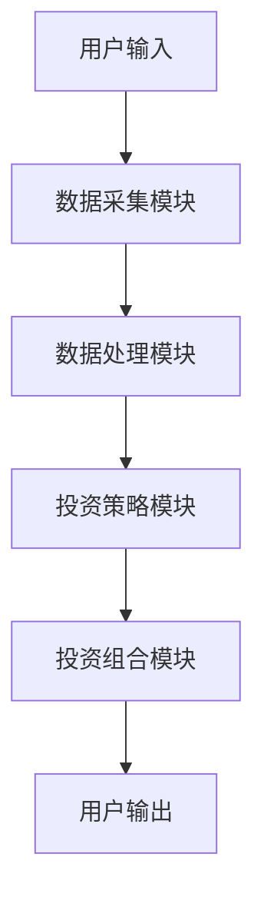

                 


# 费雪的探路者投资法：寻找未来的赢家

> **关键词**：费雪，探路者投资法，价值投资，企业基本面分析，投资策略，风险管理，Python代码实现，投资系统架构

> **摘要**：本文深入探讨了费雪的探路者投资法，从其核心理念、投资原则到具体的投资策略和风险管理方法，结合实际案例和系统架构设计，全面解析如何通过深入的企业基本面分析和科学的投资决策系统，寻找未来的优质投资标的。

---

## 第1章 费雪投资法的背景与核心理念

### 1.1 费雪投资法的起源与发展

#### 1.1.1 费雪的生平与投资理念

**菲德烈·费雪（Philip Fisher）**是20世纪美国著名的投资家和价值投资的先驱之一。他于1906年开始投资生涯，提出了许多重要的投资理念，尤其是在选股和长期投资方面的贡献深远。费雪的投资理念强调**深入研究**和**长期持有**优质股票，这种方法后来被称为**“探路者投资法”**。

费雪认为，投资者应该将资金投入到那些具有强大竞争优势、良好财务状况和持续增长潜力的企业中。他主张通过对企业基本面的深入分析，找到那些能够在未来几年内实现稳定增长的企业，并长期持有这些股票，以获得超额收益。

#### 1.1.2 探路者投资法的定义与特点

探路者投资法的核心在于**“买入并持有”**优质企业的策略。与传统的短期交易不同，这种方法强调通过对企业基本面的深入分析，选择那些具有强大竞争优势、良好财务状况和持续增长潜力的企业进行投资，并长期持有这些股票。

探路者投资法的特点包括：

1. **长期投资**：注重企业的长期增长潜力，而非短期市场波动。
2. **基本面分析**：通过对企业财务状况、竞争优势和行业地位的深入分析，选择优质企业。
3. **买入并持有**：一旦找到优质企业，长期持有，等待企业价值的实现。

#### 1.1.3 费雪投资法在现代投资中的地位

尽管费雪的投资理念提出于20世纪，但其核心思想在今天仍然具有重要的现实意义。探路者投资法为现代投资者提供了以下启示：

1. **长期投资的重要性**：在市场波动中，长期持有优质企业能够平滑短期波动，实现长期收益。
2. **基本面分析的核心地位**：通过对企业基本面的深入分析，选择优质企业，是实现超额收益的关键。
3. **风险管理的重要性**：通过分散投资和长期持有，降低短期市场波动的风险。

---

### 1.2 费雪投资法的核心原则

#### 1.2.1 投资的核心目标

费雪认为，投资的核心目标是通过选择优质企业，实现资产的长期增值。他强调，投资者应该关注企业的基本面，而非短期市场波动。

#### 1.2.2 长期投资的重要性

费雪认为，长期投资是实现资产增值的关键。他指出，短期市场波动会干扰投资者的决策，而长期持有优质企业能够平滑波动，实现稳定的收益。

#### 1.2.3 企业基本面分析的关键性

费雪认为，企业基本面分析是选择优质企业的关键。他强调，投资者应该关注企业的财务状况、竞争优势和行业地位，选择那些具有强大竞争优势和持续增长潜力的企业。

---

## 第2章 探路者投资法的核心概念与联系

### 2.1 投资决策的核心要素

#### 2.1.1 企业价值的评估方法

企业价值的评估方法是探路者投资法的核心，主要包括以下几个方面：

1. **财务指标分析**：通过对企业财务报表的分析，评估企业的盈利能力、财务状况和成长能力。
2. **竞争优势分析**：分析企业的核心竞争力，包括行业地位、市场份额、技术创新能力等。
3. **未来增长潜力**：评估企业在未来几年内的增长潜力，包括行业发展趋势、企业战略和管理能力。

#### 2.1.2 财务指标的分析与权重分配

在探路者投资法中，财务指标的分析与权重分配是企业价值评估的重要部分。常见的财务指标包括：

1. **盈利能力**：净利润率、ROE（净资产收益率）等。
2. **财务健康状况**：资产负债率、流动比率等。
3. **成长能力**：收入增长率、净利润增长率等。

在分析这些指标时，需要根据企业的行业特点和经营状况，合理分配权重。

#### 2.1.3 企业竞争优势的量化标准

企业竞争优势的量化标准是探路者投资法的重要部分。通过对企业竞争优势的量化，可以更好地评估企业的投资价值。常见的竞争优势量化标准包括：

1. **市场份额**：企业在行业中的市场份额。
2. **技术创新能力**：企业在技术创新方面的投入和成果。
3. **成本优势**：企业在生产成本上的优势。

---

### 2.2 核心概念的原理分析

#### 2.2.1 企业价值的计算公式

企业价值的计算公式是探路者投资法的重要工具。以下是企业价值的计算公式：

$$
\text{企业价值} = \text{股东权益} + \text{长期债务}
$$

其中，股东权益包括股本、资本公积、盈余公积等，长期债务包括长期借款、应付债券等。

#### 2.2.2 投资回报率的计算公式

投资回报率的计算公式是评估企业投资价值的重要工具。以下是投资回报率的计算公式：

$$
\text{ROI} = \frac{\text{净利润}}{\text{投资成本}} \times 100\%
$$

其中，净利润是企业在一定时期内的净利润，投资成本是投资者投入的资金。

#### 2.2.3 企业生命周期的阶段划分

企业生命周期的阶段划分是探路者投资法的重要部分。企业生命周期通常分为以下几个阶段：

1. **初创期**：企业刚刚成立，处于产品开发和市场开拓阶段。
2. **成长期**：企业进入快速成长阶段，市场份额逐步扩大。
3. **成熟期**：企业市场份额稳定，收入和利润稳定增长。
4. **衰退期**：企业市场份额逐步被竞争对手抢占，收入和利润开始下降。

---

### 2.3 核心概念的对比分析

#### 2.3.1 企业价值与市场价值的对比

企业价值与市场价值的对比是探路者投资法的重要部分。企业价值是企业实际价值的体现，而市场价值是市场对企业价值的定价。两者的差异反映了市场的理性与非理性。

#### 2.3.2 财务指标与非财务指标的对比

财务指标与非财务指标的对比是探路者投资法的重要部分。财务指标是企业财务状况的直接反映，而非财务指标则是企业竞争优势和未来增长潜力的体现。

#### 2.3.3 企业增长潜力与当前盈利能力的对比

企业增长潜力与当前盈利能力的对比是探路者投资法的重要部分。当前盈利能力反映了企业的经营效率，而增长潜力则反映了企业的未来发展空间。

---

## 第3章 探路者投资法的算法原理

### 3.1 投资决策的数学模型

#### 3.1.1 企业价值的计算公式

企业价值的计算公式是探路者投资法的核心工具之一。以下是企业价值的计算公式：

$$
\text{企业价值} = \text{股东权益} + \text{长期债务}
$$

其中，股东权益包括股本、资本公积、盈余公积等，长期债务包括长期借款、应付债券等。

#### 3.1.2 投资回报率的计算公式

投资回报率的计算公式是评估企业投资价值的重要工具。以下是投资回报率的计算公式：

$$
\text{ROI} = \frac{\text{净利润}}{\text{投资成本}} \times 100\%
$$

其中，净利润是企业在一定时期内的净利润，投资成本是投资者投入的资金。

---

### 3.2 投资组合优化的算法

#### 3.2.1 马科维茨投资组合理论

马科维茨投资组合理论是现代投资组合理论的核心，强调通过分散投资来降低风险。以下是马科维茨投资组合理论的简要介绍：

1. **投资组合理论**：通过合理分配资金在不同资产或股票上，降低投资风险。
2. **风险与收益的关系**：收益与风险成正比，投资者需要在收益与风险之间找到平衡点。

#### 3.2.2 探路者投资法的优化算法

探路者投资法的优化算法是基于企业基本面分析的优化模型。以下是优化算法的简要介绍：

1. **企业筛选**：通过对企业基本面的分析，筛选出具有强大竞争优势和持续增长潜力的企业。
2. **投资组合构建**：根据企业的基本面评分，构建投资组合，并根据市场变化进行动态调整。

#### 3.2.3 算法实现的Python代码示例

以下是探路者投资法优化算法的Python代码示例：

```python
import pandas as pd
import numpy as np

# 假设我们已经获取了企业的基本面数据，包括财务指标和竞争优势指标
# 数据格式：DataFrame，每行代表一家企业，每列代表一个指标
# 指标包括：ROE、净利润增长率、市场份额、技术创新能力等

# 筛选出基本面优秀的股票
def fisher_strategy(data):
    # 定义基本面评分标准
    score_threshold = {
        'ROE': 0.15,
        'net_profit_growth': 0.1,
        'market_share': 0.2,
        'technology_strength': 0.15
    }
    
    # 根据评分标准筛选股票
    filtered_data = data[
        data['ROE'] > score_threshold['ROE'] &
        data['net_profit_growth'] > score_threshold['net_profit_growth'] &
        data['market_share'] > score_threshold['market_share'] &
        data['technology_strength'] > score_threshold['technology_strength']
    ]
    return filtered_data

# 应用筛选策略
data = pd.read_csv('entreprise_data.csv')
filtered_stocks = fisher_strategy(data)
print(filtered_stocks)
```

---

### 3.3 投资风险的量化与管理

#### 3.3.1 风险的定义与分类

风险的定义与分类是探路者投资法的重要部分。以下是风险的定义与分类：

1. **系统性风险**：市场整体波动带来的风险，如经济周期、政策变化等。
2. **非系统性风险**：企业自身经营带来的风险，如财务状况、竞争优势等。

#### 3.3.2 风险的数学模型

风险的数学模型是探路者投资法的重要工具。以下是风险的数学模型：

$$
\text{风险} = \text{标准差}(\text{投资收益})
$$

其中，标准差是衡量投资收益波动性的指标，标准差越大，风险越高。

---

## 第4章 探路者投资法的系统分析与架构设计

### 4.1 投资决策系统的功能设计

#### 4.1.1 系统功能模块划分

投资决策系统的功能模块划分是探路者投资法的重要部分。以下是系统功能模块划分：

1. **数据采集模块**：采集企业的基本面数据，包括财务指标、竞争优势指标等。
2. **数据处理模块**：对采集到的数据进行清洗、转换和标准化处理。
3. **投资策略模块**：根据探路者投资法的筛选标准，筛选出优质企业。
4. **投资组合模块**：根据筛选出的企业，构建投资组合，并进行动态调整。

#### 4.1.2 每个模块的功能描述

1. **数据采集模块**：从数据源（如数据库、API等）获取企业的基本面数据。
2. **数据处理模块**：对数据进行清洗、转换和标准化处理，确保数据的准确性和一致性。
3. **投资策略模块**：根据探路者投资法的筛选标准，筛选出具有强大竞争优势和持续增长潜力的企业。
4. **投资组合模块**：根据筛选出的企业，构建投资组合，并根据市场变化进行动态调整。

---

### 4.2 系统架构设计

#### 4.2.1 系统架构的分层设计

系统架构的分层设计是探路者投资法的重要部分。以下是系统架构的分层设计：

1. **数据层**：数据采集、存储和管理。
2. **业务逻辑层**：数据处理、投资策略和投资组合构建。
3. **用户界面层**：用户交互和结果展示。

#### 4.2.2 模块之间的交互关系

模块之间的交互关系是探路者投资法的重要部分。以下是模块之间的交互关系：

1. **数据采集模块**向**数据层**提供数据。
2. **数据处理模块**从**数据层**获取数据，并进行处理。
3. **投资策略模块**从**数据处理模块**获取数据，并筛选出优质企业。
4. **投资组合模块**从**投资策略模块**获取数据，并构建投资组合。

---

### 4.3 系统接口设计

#### 4.3.1 数据输入接口

数据输入接口是探路者投资法的重要部分。以下是数据输入接口的描述：

1. **数据源**：企业基本面数据，包括财务指标和竞争优势指标。
2. **数据格式**：CSV或Excel格式。
3. **数据清洗**：对数据进行清洗，处理缺失值、异常值等。

#### 4.3.2 数据输出接口

数据输出接口是探路者投资法的重要部分。以下是数据输出接口的描述：

1. **筛选结果**：根据探路者投资法筛选出的优质企业列表。
2. **投资组合**：根据筛选出的企业构建的投资组合。

#### 4.3.3 用户交互接口

用户交互接口是探路者投资法的重要部分。以下是用户交互接口的描述：

1. **用户输入**：用户输入的投资参数和筛选标准。
2. **用户输出**：用户输出的投资结果和投资建议。

---

### 4.4 系统交互流程图

以下是系统交互流程图的Mermaid代码：



---

## 第5章 探路者投资法的项目实战

### 5.1 环境安装与配置

#### 5.1.1 Python环境的安装

安装Python环境是探路者投资法项目实战的第一步。以下是Python环境的安装步骤：

1. **下载Python**：从官方网站（https://www.python.org/）下载并安装Python。
2. **安装Python环境**：运行安装程序，选择安装路径，并完成安装。

#### 5.1.2 数据分析库的安装与配置

安装数据分析库是探路者投资法项目实战的重要部分。以下是数据分析库的安装步骤：

1. **安装Pandas**：使用pip命令安装Pandas库。
   ```bash
   pip install pandas
   ```
2. **安装NumPy**：使用pip命令安装NumPy库。
   ```bash
   pip install numpy
   ```

#### 5.1.3 数据源的获取与处理

获取数据源是探路者投资法项目实战的重要部分。以下是数据源的获取与处理步骤：

1. **数据源获取**：从可靠的金融数据源（如Yahoo Finance、Google Finance等）获取企业的基本面数据。
2. **数据清洗**：对获取的数据进行清洗，处理缺失值、异常值等。

---

### 5.2 核心算法的实现

#### 5.2.1 企业价值评估的代码实现

以下是企业价值评估的代码实现：

```python
import pandas as pd
import numpy as np

# 假设我们已经获取了企业的基本面数据，包括财务指标和竞争优势指标
# 数据格式：DataFrame，每行代表一家企业，每列代表一个指标
# 指标包括：ROE、净利润增长率、市场份额、技术创新能力等

# 筛选出基本面优秀的股票
def fisher_strategy(data):
    # 定义基本面评分标准
    score_threshold = {
        'ROE': 0.15,
        'net_profit_growth': 0.1,
        'market_share': 0.2,
        'technology_strength': 0.15
    }
    
    # 根据评分标准筛选股票
    filtered_data = data[
        data['ROE'] > score_threshold['ROE'] &
        data['net_profit_growth'] > score_threshold['net_profit_growth'] &
        data['market_share'] > score_threshold['market_share'] &
        data['technology_strength'] > score_threshold['technology_strength']
    ]
    return filtered_data

# 应用筛选策略
data = pd.read_csv('entreprise_data.csv')
filtered_stocks = fisher_strategy(data)
print(filtered_stocks)
```

---

### 5.3 投资组合优化的代码实现

以下是投资组合优化的代码实现：

```python
import pandas as pd
import numpy as np
import matplotlib.pyplot as plt

# 假设我们已经筛选出优质企业
# 数据格式：DataFrame，每行代表一家企业，每列代表一个指标
# 指标包括：ROE、净利润增长率、市场份额、技术创新能力等

# 计算投资组合的收益与风险
def portfolio_analysis(data):
    # 计算每只股票的收益率
    data['return'] = data['price'].pct_change()
    # 计算投资组合的收益率
    portfolio_return = data['return'].mean()
    # 计算投资组合的风险
    portfolio_risk = data['return'].std()
    return portfolio_return, portfolio_risk

# 应用投资组合分析
filtered_stocks = pd.read_csv('filtered_stocks.csv')
portfolio_return, portfolio_risk = portfolio_analysis(filtered_stocks)
print(f'投资组合的预期收益率为：{portfolio_return}')
print(f'投资组合的风险为：{portfolio_risk}')

# 绘制收益率与风险的散点图
plt.scatter(filtered_stocks['return'], filtered_stocks['risk'])
plt.xlabel('收益率')
plt.ylabel('风险')
plt.title('投资组合的收益与风险')
plt.show()
```

---

### 5.4 项目小结

通过以上代码实现，我们可以看到探路者投资法在实际项目中的应用。通过对企业基本面的深入分析和投资组合的优化，我们可以筛选出优质企业，并构建稳定的投资组合。这种方法能够有效降低投资风险，实现长期收益。

---

## 第6章 总结与最佳实践

### 6.1 最佳实践

1. **持续学习**：市场环境不断变化，投资者需要持续学习，更新自己的知识和技能。
2. **分散投资**：通过分散投资降低风险，避免将所有资金投入到单一资产或行业。
3. **长期持有**：长期持有优质企业，平滑短期市场波动，实现长期收益。

---

### 6.2 小结

探路者投资法是一种基于企业基本面分析的长期投资策略。通过深入分析企业的财务状况、竞争优势和未来增长潜力，选择优质企业进行投资，并长期持有，能够实现稳定的收益。本文通过理论分析和实际案例，全面展示了探路者投资法的核心理念、算法原理和系统设计，为投资者提供了科学的投资指导。

---

### 6.3 注意事项

1. **数据质量**：数据质量是投资分析的关键，投资者需要确保数据的准确性和完整性。
2. **模型局限性**：探路者投资法是一种基于企业基本面分析的策略，但市场环境的复杂性和不确定性可能导致模型失效。
3. **风险管理**：投资者需要重视风险管理，避免过度集中投资或杠杆投资。

---

### 6.4 拓展阅读

1. **《股市长盛不衰的秘诀》**：菲德烈·费雪的经典著作，深入阐述了他的投资理念和方法。
2. **《投资学》**：现代投资组合理论的经典教材，提供了丰富的投资理论和实践知识。
3. **《Python金融分析》**：介绍如何使用Python进行金融数据分析和投资策略开发。

---

通过本文的详细讲解，读者可以全面了解探路者投资法的核心理念、算法原理和系统设计，并能够通过实际案例和代码实现，掌握这一投资方法的应用技巧。

