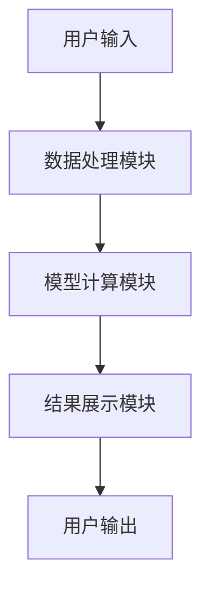
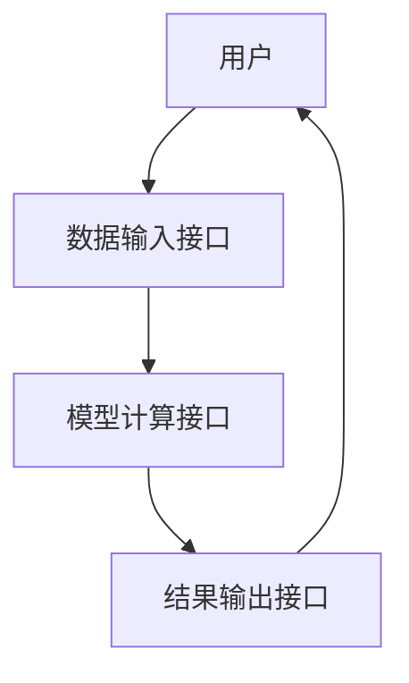

                 


# 《费雪的未来增长预测模型：把握长期趋势》

---

## 关键词：
- 费雪模型
- 未来增长预测
- 股票投资
- 数据分析
- 算法实现

---

## 摘要：
费雪未来增长预测模型是一种基于企业基本面分析的投资模型，旨在通过预测企业的未来收益增长来评估其投资价值。本文详细介绍了该模型的理论基础、实现方法、系统架构以及实际应用，并通过案例分析展示了其在投资决策中的实际价值。文章从模型的背景出发，逐步深入探讨其数学原理、算法实现、系统设计及优化策略，最终为读者提供一套完整的从理论到实践的应用指南。

---

## 目录

### 第1章 费雪未来增长预测模型的背景与概述

#### 1.1 模型的发展历程
- 1.1.1 费雪投资理论的起源
- 1.1.2 模型的演变与完善
- 1.1.3 当前模型的应用价值

#### 1.2 模型的核心概念
- 1.2.1 模型的基本定义
- 1.2.2 模型的核心假设
- 1.2.3 模型的输入与输出

#### 1.3 模型的应用场景与边界
- 1.3.1 模型适用的行业与企业类型
- 1.3.2 模型的边界与限制
- 1.3.3 模型的优缺点对比

#### 1.4 本章小结

---

### 第2章 费雪未来增长预测模型的理论基础

#### 2.1 模型的数学模型
- 2.1.1 模型的基本公式
$$G = \frac{E}{P} \times (1 + g)^n$$
- 2.1.2 模型的变量解释
  - $G$: 预测的未来增长率
  - $E$: 企业预期收益
  - $P$: 当前股价
  - $g$: 收益增长率
  - $n$: 预测年数

#### 2.2 模型的假设条件
- 2.2.1 收益持续增长的假设
- 2.2.2 市场合理定价的假设
- 2.2.3 经济环境稳定的假设

#### 2.3 模型的优缺点分析
- 2.3.1 模型的优点
- 2.3.2 模型的缺点
- 2.3.3 模型的适用场景

#### 2.4 本章小结

---

### 第3章 费雪未来增长预测模型的企业分析与预测

#### 3.1 企业基本面分析
- 3.1.1 收益分析
- 3.1.2 市场地位分析
- 3.1.3 竞争优势分析

#### 3.2 模型在企业分析中的应用
- 3.2.1 数据收集与处理
- 3.2.2 模型的输入参数设定
- 3.2.3 预测结果的解读

#### 3.3 实际案例分析
- 3.3.1 案例背景介绍
- 3.3.2 数据输入与模型计算
- 3.3.3 预测结果与实际对比

#### 3.4 本章小结

---

### 第4章 费雪未来增长预测模型的系统架构与实现

#### 4.1 系统架构设计
- 4.1.1 系统功能模块划分
- 4.1.2 系统流程图


#### 4.2 算法实现
- 4.2.1 模型的数学推导
- 4.2.2 算法流程图
```mermaid
graph TD
A[开始] --> B[输入参数]
B --> C[计算预期收益E]
C --> D[计算当前股价P]
D --> E[计算增长因子(1+g)^n]
E --> F[计算未来增长率G]
F --> G[输出结果]
G --> 结束
```

#### 4.3 系统接口设计
- 4.3.1 接口定义
- 4.3.2 接口交互流程图


#### 4.4 本章小结

---

### 第5章 费雪未来增长预测模型的优化与扩展

#### 5.1 模型的优化策略
- 5.1.1 参数优化
- 5.1.2 算法优化
- 5.1.3 模型的鲁棒性提升

#### 5.2 模型的扩展应用
- 5.2.1 行业预测
- 5.2.2 组合投资
- 5.2.3 风险评估

#### 5.3 本章小结

---

### 第6章 项目实战：费雪模型的应用与实现

#### 6.1 项目环境搭建
- 6.1.1 开发工具安装
- 6.1.2 数据来源与获取
- 6.1.3 开发环境配置

#### 6.2 核心代码实现
- 6.2.1 数据处理代码
```python
import pandas as pd
data = pd.read_csv('stock_data.csv')
```

- 6.2.2 模型实现代码
```python
def fisher_model(E, P, g, n):
    return (E / P) * (1 + g) ** n
```

- 6.2.3 结果展示代码
```python
print(fisher_model(E, P, g, n))
```

#### 6.3 实际案例分析
- 6.3.1 案例背景
- 6.3.2 数据输入与处理
- 6.3.3 模型计算与结果展示

#### 6.4 本章小结

---

### 第7章 总结与展望

#### 7.1 模型的总结
- 7.1.1 核心价值
- 7.1.2 实际应用效果
- 7.1.3 模型的局限性

#### 7.2 未来展望
- 7.2.1 模型的改进方向
- 7.2.2 新技术的应用潜力
- 7.2.3 未来的研究方向

#### 7.3 本章小结

---

### 参考文献
- 费雪原著
- 相关学术论文
- 技术文档与博客

---

通过以上目录结构，读者可以系统地了解费雪未来增长预测模型的理论基础、实现方法和实际应用，同时通过代码和案例深入理解其技术细节和实践价值。

