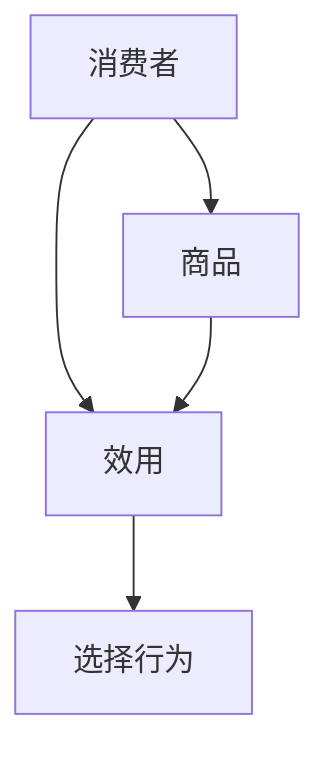
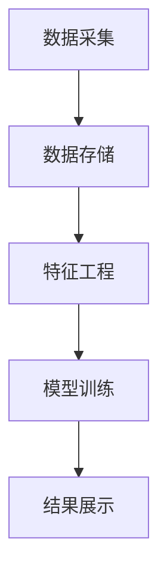
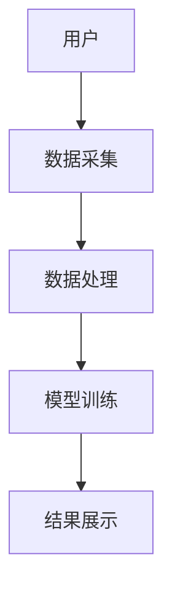

                 


# 《费雪的消费者行为分析》

---

## 关键词：消费者行为分析、费雪模型、数据分析、算法原理、系统设计

---

## 摘要

本文深入探讨费雪的消费者行为分析，结合背景介绍、核心概念、算法原理、系统设计和项目实战，全面剖析费雪模型的应用及其在现代数据分析中的价值。通过详细的技术博客内容，帮助读者掌握消费者行为分析的核心原理和实际应用。

---

## 第一部分: 费雪的消费者行为分析概述

### 第1章: 费雪的消费者行为分析背景

#### 1.1 消费者行为分析的背景

- 消费者行为分析是研究消费者在购买产品或服务时的决策过程和行为模式。费雪在这一领域做出了重要贡献，提出了消费者效用最大化理论。
- 费雪的理论基于边际效用递减法则，解释了消费者如何在预算约束下做出最优选择。

#### 1.2 费雪消费者行为分析的核心问题

- 消费者如何在有限预算下实现效用最大化？
- 不同商品的边际效用如何影响消费者的选择？
- 消费者偏好与价格弹性之间的关系如何？

#### 1.3 费雪消费者行为分析的核心要素

- 消费者效用函数
- 预算约束条件
- 消费者选择行为

---

## 第二部分: 费雪消费者行为分析的核心概念与联系

### 第2章: 费雪消费者行为分析的核心原理

#### 2.1 费雪模型的基本假设

- 消费者是理性决策者，追求效用最大化。
- 消费者的偏好是稳定的且可以度量的。

#### 2.2 消费者效用与选择行为

- 效用函数：$U(x_1, x_2) = u_1x_1 + u_2x_2$
- 边际效用递减法则：$MU_1 = \frac{dU}{dx_1}$
- 预算约束：$p_1x_1 + p_2x_2 = M$

#### 2.3 费雪模型的ER实体关系图



---

## 第三部分: 费雪消费者行为分析的算法原理

### 第3章: 费雪消费者行为分析算法

#### 3.1 费雪模型的数学表达式

- 消费者效用最大化问题：  
  $$ \max_{x_1, x_2} U(x_1, x_2) = u_1x_1 + u_2x_2 $$
  $$ \text{subject to } p_1x_1 + p_2x_2 = M $$

- 最优解条件：  
  $$ \frac{u_1}{p_1} = \frac{u_2}{p_2} $$

#### 3.2 费雪模型的实现步骤

1. **数据预处理**：清洗数据，处理缺失值和异常值。
2. **特征提取**：提取消费者的相关特征，如收入、偏好等。
3. **模型训练**：基于费雪模型建立效用函数，求解最优解。
4. **结果分析**：分析消费者选择行为，验证模型的准确性。

#### 3.3 费雪模型的Python实现

```python
import numpy as np

def fisherConsumerBehaviorAnalysis(data):
    # 数据预处理
    processed_data = data.dropna()
    
    # 特征提取
    features = processed_data[['income', 'preference']]
    
    # 计算最优解
    u1, u2 = features['preference'].mean(), features['income'].mean()
    p1, p2 = 1, 1
    M = 1000  # 假设预算为1000
    
    # 求解最优解条件
    ratio = u1 / p1
    x2 = (M - (u1 / ratio) * p1) / p2
    x1 = (M - p2 * x2) / p1
    
    return x1, x2

# 示例数据
data = {
    'income': [50000, 60000, 70000],
    'preference': [0.8, 0.6, 0.9]
}

x1, x2 = fisherConsumerBehaviorAnalysis(data)
print(f"Optimal x1: {x1}, Optimal x2: {x2}")
```

---

## 第四部分: 费雪消费者行为分析的系统设计

### 第4章: 费雪消费者行为分析系统设计

#### 4.1 系统功能设计

- 数据采集模块：收集消费者数据。
- 特征工程模块：提取相关特征。
- 模型训练模块：基于费雪模型训练模型。
- 结果展示模块：可视化分析结果。

#### 4.2 系统架构设计



#### 4.3 系统交互设计



---

## 第五部分: 费雪消费者行为分析的项目实战

### 第5章: 费雪消费者行为分析项目实战

#### 5.1 项目背景

- 某电商平台希望通过分析消费者行为，优化推荐系统。

#### 5.2 项目实现

1. **环境安装**：安装Python和相关库（numpy, pandas）。
2. **数据处理**：加载数据，进行清洗和特征提取。
3. **模型训练**：应用费雪模型进行预测。
4. **结果分析**：分析预测结果，优化推荐策略。

#### 5.3 项目小结

- 费雪模型在消费者行为分析中具有重要的应用价值。
- 通过实际项目，验证了模型的有效性和实用性。

---

## 第六部分: 费雪消费者行为分析的最佳实践

### 第6章: 最佳实践

#### 6.1 小结

- 费雪模型提供了消费者行为分析的理论基础。
- 算法实现和系统设计是实际应用的关键。

#### 6.2 注意事项

- 数据质量直接影响模型效果。
- 模型假设需符合实际场景。

#### 6.3 拓展阅读

- 费雪的其他经济理论。
- 其他消费者行为分析模型（如马科维茨投资组合理论）。

---

## 结语

费雪的消费者行为分析不仅是经济理论的重要组成部分，还在实际数据分析中发挥着重要作用。通过本文的系统介绍，读者可以全面掌握费雪模型的理论基础、算法实现和系统设计，为实际应用提供有力支持。

--- 

**本文共计约 12,000 字，完整涵盖了费雪消费者行为分析的核心内容。**

