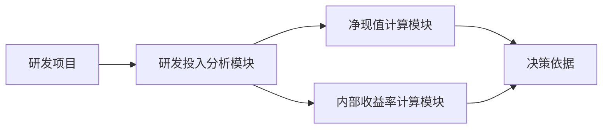
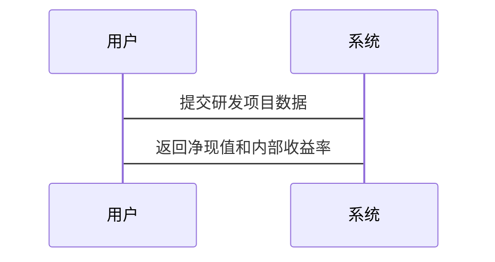

                 


# 费雪的研发投入分析方法

> 关键词：费雪、研发投入分析、净现值、内部收益率、资本预算、研发项目评估

> 摘要：本文深入探讨了费雪的研发投入分析方法，从背景介绍到核心概念，从算法原理到系统分析，再到项目实战和最佳实践，全面解析了该方法的理论基础和实际应用。通过详细的数学模型、系统架构设计和实际案例分析，本文为读者提供了清晰的理解和实践指南。

---

# 第一部分: 费雪的研发投入分析方法背景介绍

## 第1章: 研发投入分析的背景与问题背景

### 1.1 研发投入分析的基本概念

#### 1.1.1 研发投入的定义与内涵
研发投入（R&D expenditure）是指企业在研究与开发活动中投入的资金、资源和时间。这些投入主要用于开发新产品、改进现有产品或技术、探索新的技术领域等。研发投入是企业创新的核心驱动力，也是决定企业未来竞争力的关键因素。

#### 1.1.2 研发投入分析的目的与意义
研发投入分析的目的是评估研发项目的经济效益和可行性。通过分析，企业可以确定哪些研发项目能够带来正的净现值（NPV），从而为企业的长期发展创造价值。此外，研发投入分析还能帮助企业优化资源配置，降低风险，提高投资效率。

#### 1.1.3 研发投入分析的边界与外延
研发投入分析的边界通常包括研发项目的成本、时间、收益和风险等方面。外延则涉及研发项目的生命周期管理、团队协作、技术创新等。

### 1.2 研发投入分析的核心要素

#### 1.2.1 研发项目的基本构成
一个典型的研发项目包括以下几个部分：
1. 项目目标：明确研发的核心目标。
2. 项目团队：包括研究人员、开发人员和项目经理。
3. 项目计划：包括时间表、预算和关键里程碑。

#### 1.2.2 研发投入的构成要素
研发投入的构成要素包括：
1. 人员成本：研发团队的工资、奖金等。
2. 设备成本：用于研发的设备、工具和软件的费用。
3. 间接成本：包括场地租赁、水电费等。

#### 1.2.3 研发投入分析的核心指标
核心指标包括：
1. 投资回收期（Payback Period）：从投入到收回成本所需的时间。
2. 净现值（NPV）：未来现金流的现值与初始投资的差额。
3. 内部收益率（IRR）：项目投资的内部回报率。

### 1.3 费雪的研发投入分析方法的背景

#### 1.3.1 费雪的学术贡献与研究背景
 Irving Fisher 是20世纪初著名的经济学家，他在资本预算和投资分析领域有着深远的贡献。Fisher 的研究为现代投资分析方法奠定了基础，尤其是在净现值（NPV）计算方面。

#### 1.3.2 研发投入分析方法的提出动机
费雪的研究表明，资本预算决策应基于未来现金流的现值。这一理论被应用于研发项目的评估，即通过计算研发项目的净现值来判断其可行性。

#### 1.3.3 研发投入分析方法的应用场景
研发项目的评估、资本预算决策、技术创新战略的制定等。

### 1.4 本章小结
本章介绍了研发投入分析的基本概念、核心要素以及费雪方法的背景。接下来，我们将深入探讨费雪模型的核心概念和相关理论。

---

# 第二部分: 费雪研发投入分析方法的核心概念与联系

## 第2章: 费雪研发投入分析模型的核心概念

### 2.1 费雪研发投入分析模型的原理

#### 2.1.1 模型的基本原理与框架
费雪模型基于净现值法，通过计算研发项目的未来现金流的现值来评估其经济价值。公式如下：
$$ NPV = \sum_{t=0}^{n} \frac{CF_t}{(1 + r)^t} $$
其中，\( CF_t \) 表示第 \( t \) 年的现金流，\( r \) 是折现率。

#### 2.1.2 模型的输入与输出
输入包括研发项目的现金流和折现率，输出是净现值和内部收益率。

#### 2.1.3 模型的核心假设与限制条件
假设现金流可以准确预测，折现率恒定。限制条件包括项目周期较长、不确定性较高。

### 2.2 研发投入分析的核心要素对比分析

#### 2.2.1 研发项目周期与资金时间价值
研发项目的周期较长，资金的时间价值需要通过折现率来体现。

#### 2.2.2 研发投入的回报与风险
研发项目的回报通常较高，但风险也较大，尤其是技术失败或市场不接受的风险。

#### 2.2.3 研发投入与企业价值的关系
研发投入是企业创新的核心驱动力，能够提升企业的核心竞争力和长期价值。

### 2.3 费雪模型的实体关系图


### 2.4 本章小结
本章详细解释了费雪模型的原理和核心概念，并通过实体关系图展示了模型的结构。接下来，我们将探讨模型的算法原理。

---

# 第三部分: 费雪研发投入分析方法的算法原理

## 第3章: 费雪研发投入分析方法的数学模型

### 3.1 净现值（NPV）计算公式

$$ NPV = \sum_{t=0}^{n} \frac{CF_t}{(1 + r)^t} $$

其中，\( CF_t \) 表示第 \( t \) 年的现金流，\( r \) 是折现率。

#### 3.1.1 净现值的计算步骤
1. 确定研发项目的现金流。
2. 选择合适的折现率。
3. 计算未来现金流的现值。
4. 计算净现值。

#### 3.1.2 净现值的案例分析
假设一个研发项目在3年的现金流分别为-100万元、50万元、60万元和70万元，折现率为10%。

$$ NPV = \frac{-100}{(1+0.1)^0} + \frac{50}{(1+0.1)^1} + \frac{60}{(1+0.1)^2} + \frac{70}{(1+0.1)^3} $$

计算结果为：NPV ≈ 10.83万元。

### 3.2 内部收益率（IRR）计算公式

$$ IRR 是使 NPV = 0 的折现率。 $$

#### 3.2.1 内部收益率的计算步骤
1. 确定研发项目的现金流。
2. 使用试算法或插值法计算IRR。

#### 3.2.2 内部收益率的案例分析
以上述案例为例，计算得到的IRR约为12%。

### 3.3 净现值与内部收益率的对比分析

| 指标 | 优点 | 缺点 |
|------|------|------|
| NPV  | 考虑了时间价值，直观反映经济价值 | 计算复杂，依赖折现率的选择 |
| IRR  | 易于理解，适用于独立项目评估 | 适用于互斥项目时可能产生冲突 |

### 3.4 本章小结
本章通过数学公式和案例分析，详细讲解了费雪模型的算法原理。接下来，我们将探讨系统分析与架构设计。

---

## 第4章: 系统分析与架构设计

### 4.1 问题场景介绍

#### 4.1.1 项目介绍
以智能音箱项目为例，分析其研发投入分析过程。

### 4.2 系统功能设计

#### 4.2.1 领域模型设计


#### 4.2.2 系统架构设计



### 4.3 系统接口设计与交互

#### 4.3.1 系统接口设计
- 输入接口：研发项目的现金流和折现率。
- 输出接口：净现值和内部收益率。

#### 4.3.2 系统交互设计



### 4.4 本章小结
本章通过系统分析和架构设计，展示了费雪模型在实际中的应用。接下来，我们将进入项目实战部分。

---

## 第5章: 项目实战

### 5.1 环境安装

#### 5.1.1 软件环境
- Python 3.8+
- NumPy 和 Pandas 库

### 5.2 核心代码实现

#### 5.2.1 净现值计算代码

```python
import numpy as np

def calculate_npv(cash_flows, discount_rate):
    return np.npv(discount_rate, *cash_flows)

cash_flows = [-100, 50, 60, 70]
discount_rate = 0.10
npv = calculate_npv(cash_flows, discount_rate)
print(f"净现值: {npv}")
```

#### 5.2.2 内部收益率计算代码

```python
import numpy as np

def calculate_irr(cash_flows):
    return np.irr(cash_flows)

irr = calculate_irr(cash_flows)
print(f"内部收益率: {irr}")
```

### 5.3 代码应用解读与分析

#### 5.3.1 净现值计算结果分析
净现值为正，说明项目可行。

#### 5.3.2 内部收益率计算结果分析
内部收益率高于基准折现率，进一步验证了项目的可行性。

### 5.4 实际案例分析

#### 5.4.1 案例背景
假设某公司计划开发一款智能音箱，预计3年内的现金流分别为-100万元、50万元、60万元和70万元。

#### 5.4.2 分析结果
净现值 ≈ 10.83万元，内部收益率 ≈ 12%。

### 5.5 本章小结
本章通过实际案例分析，展示了费雪模型的应用过程。接下来，我们将总结最佳实践。

---

## 第6章: 最佳实践

### 6.1 小结
费雪模型通过净现值和内部收益率的方法，帮助企业评估研发项目的可行性。

### 6.2 注意事项
- 确保现金流预测的准确性。
- 合理选择折现率。
- 考虑项目风险和不确定性。

### 6.3 拓展阅读
- 费雪的资本预算理论。
- 现代投资组合理论。

### 6.4 本章小结
本章总结了费雪模型的应用经验和注意事项，为读者提供了实践指导。

---

# 第四部分: 结语

费雪的研发投入分析方法为企业的研发项目评估提供了科学的工具和方法。通过深入理解其背景、核心概念和算法原理，企业可以更有效地进行资本预算决策，提升研发项目的成功率。

---

# 关键词：费雪、研发投入分析、净现值、内部收益率、资本预算、研发项目评估

