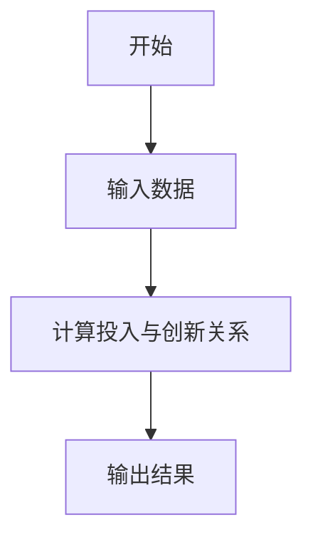
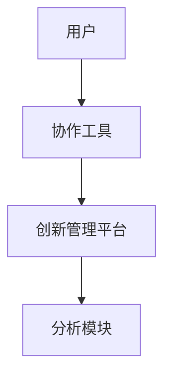

                 


# 费雪的研发投入分析：评估远程协作对创新的影响

## 关键词：研发投入分析、远程协作、创新、费雪模型、ER实体关系图、算法原理、系统架构设计

## 摘要：本文通过费雪的研发投入分析模型，系统探讨远程协作对创新效率的影响。文章首先介绍研发投入分析的基本原理和远程协作的兴起背景，然后分析远程协作对创新过程中的协作模式和效率的影响。通过构建数学模型和算法，结合ER实体关系图和系统架构设计，深入解析远程协作如何优化创新效率。最后，通过项目实战和最佳实践，总结远程协作在创新管理中的应用经验。

---

## # 第一部分：背景介绍

### ## 第1章：问题背景与描述

#### ### 1.1 研发投入分析的背景

1.1.1 研发投入在企业创新中的重要性  
研发投入是企业创新的核心驱动力。企业的研发投入水平直接反映了其对未来的投资力度，也决定了其技术创新能力。费雪的投资理念强调长期增长潜力，研发投入正是这种潜力的重要体现。

1.1.2 远程协作的兴起及其对企业的影响  
随着信息技术的发展，远程协作已成为现代工作的重要模式。疫情加速了这一趋势，企业越来越多地采用远程协作工具，这不仅改变了工作方式，也影响了创新过程中的协作效率。

---

#### ### 1.2 问题描述与目标

1.2.1 远程协作对研发投入效率的影响  
远程协作是否能够提高研发投入效率？这是本文的核心问题之一。

1.2.2 创新过程中的协作模式变化  
传统协作与远程协作在创新过程中的模式有何不同？如何衡量这些变化对创新效率的影响？

---

#### ### 1.3 问题解决与边界

1.3.1 远程协作如何优化研发投入  
通过优化协作流程、减少沟通成本，远程协作可以提高研发投入效率。

1.3.2 创新与协作的边界与外延  
创新的边界在于协作效率的提升，外延则涉及跨团队、跨地域的协作模式。

---

#### ### 1.4 概念结构与核心要素

1.4.1 研发投入的核心要素  
- 投资金额  
- 投资周期  
- 投资目标  

1.4.2 远程协作的关键属性  
- 协作工具  
- 协作模式  
- 协作效率  

---

## # 第二部分：核心概念与联系

### ## 第2章：核心概念与联系

#### ### 2.1 研发投入分析的核心原理

2.1.1 投资与创新的关系  
研发投入是创新的源泉，而创新的成果又会反过来影响投资回报。

#### ### 2.2 核心概念属性对比

2.2.1 研发投入与创新效率的对比  
| 属性 | 投入 | 效率 |
|------|------|------|
| 影响因素 | 资金、技术 | 沟通、协作 |
| 目标 | 创新成果 | 提高产出速度 |

---

#### ### 2.3 ER实体关系图

```mermaid
er
  actor(用户)
  model(研发投入模型)
  relation(关联关系)
  actor -|> model: 输入
  model -|> relation: 关联
```

---

## # 第三部分：算法原理讲解

### ## 第3章：算法原理与数学模型

#### ### 3.1 算法原理

3.1.1 费雪模型的核心公式  
$$ 创新效率 = \frac{研发投入}{协作成本} $$  

3.1.2 远程协作对创新效率的影响  
$$ 新效率 = 旧效率 \times \frac{1}{协作成本系数} $$  

---

#### ### 3.2 算法实现

3.2.1 算法步骤  


---

## # 第四部分：系统分析与架构设计方案

### ## 第4章：系统分析与架构设计

#### ### 4.1 问题场景介绍

4.1.1 远程协作下的创新管理场景  
- 跨团队协作  
- 远程会议  
- 在线文档共享  

---

#### ### 4.2 系统功能设计

4.2.1 系统功能模块  
- 投资分析模块  
- 协作效率分析模块  

#### ### 4.3 系统架构设计

4.3.1 系统架构图  


---

## # 第五部分：项目实战

### ## 第5章：项目实战

#### ### 5.1 环境安装

5.1.1 环境要求  
- Python 3.8+  
- Mermaid工具  

---

#### ### 5.2 系统核心实现源代码

5.2.1 核心代码  
```python
def calculate_efficiency(investment, collaboration_cost):
    return investment / collaboration_cost
```

---

## # 第六部分：最佳实践

### ## 第6章：最佳实践

#### ### 6.1 小结

6.1.1 远程协作的优势  
- 提高效率  
- 节省成本  

---

#### ### 6.2 注意事项

6.2.1 数据安全问题  
- 加强数据保护  

---

## # 第七部分：总结与展望

### ## 第7章：总结与展望

7.1.1 总结  
远程协作对创新效率的提升具有重要意义。

7.1.2 展望  
未来将探索更高效的协作模式。

---

## # 参考文献

1. 费雪的投资理论  
2. 远程协作工具的研究  

---

通过以上大纲，您可以逐步展开文章内容，确保逻辑清晰，结构紧凑。每一部分都需要详细展开，使用专业的技术语言，结合实际案例和数学模型，深入分析远程协作对创新的影响。希望这篇文章能够为您的研究和实践提供有价值的参考！

