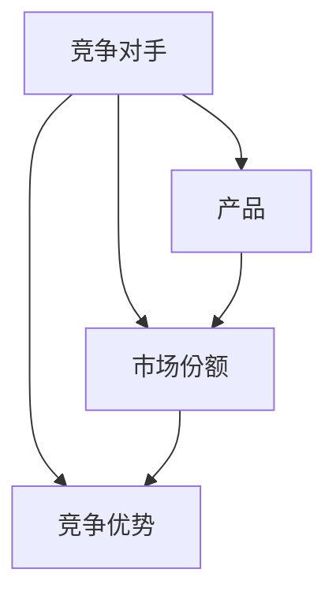
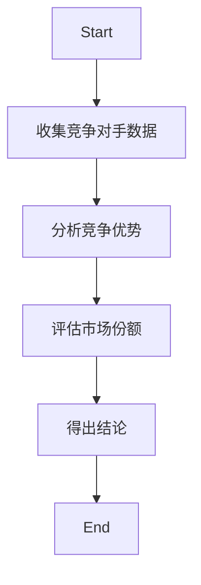
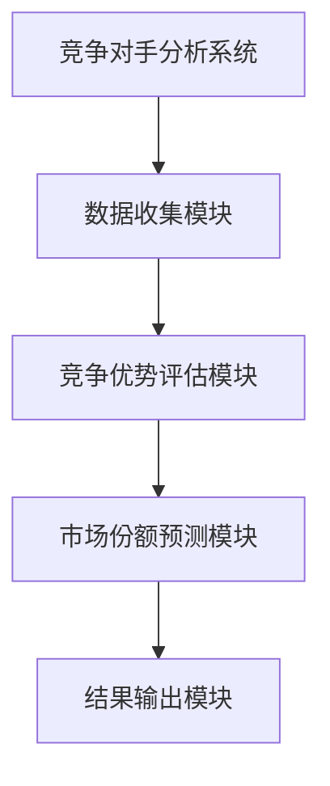

                 


# 费雪的竞争对手分析方法

## 关键词：
费雪、竞争对手分析、投资策略、竞争优势、市场份额

## 摘要：
本文深入探讨了费雪的竞争对手分析方法，分析了其背后的逻辑和数学模型，并展示了如何将这些方法应用于实际投资决策中。通过系统化的分析框架和实战案例，本文为投资者提供了有效的工具和策略，帮助他们在复杂的市场环境中做出明智的投资决策。

---

## 第一部分：费雪竞争对手分析方法的背景

### 第1章：费雪的投资理念与竞争对手分析的背景

#### 1.1 费雪的投资理念概述
##### 1.1.1 费雪的投资哲学与方法
菲利普·费雪（Philip Fisher）是价值投资的重要倡导者之一，他的投资理念强调长期持有优质股票，注重企业的成长性和竞争优势。他认为，投资者应选择那些具有强大竞争优势和良好管理团队的公司。

##### 1.1.2 费雪对竞争对手分析的重视
费雪在其投资实践中特别强调对竞争对手的分析。他认为，只有通过深入分析竞争对手，才能准确评估一家公司的竞争优势和市场地位，从而做出更明智的投资决策。

##### 1.1.3 费雪分析方法的现实意义
在当今竞争激烈的市场环境中，竞争对手分析不仅是投资决策的重要工具，也是企业制定战略的重要依据。费雪的方法为我们提供了一种系统化的分析框架。

#### 1.2 竞争对手分析的定义与重要性
##### 1.2.1 竞争对手分析的定义
竞争对手分析是指对行业内其他企业的优劣势、市场策略、产品特点等方面进行系统研究的过程。通过分析竞争对手，投资者可以更好地了解市场的竞争格局，从而做出更明智的投资决策。

##### 1.2.2 竞争对手分析在投资中的重要性
竞争对手分析在投资中具有重要意义。通过分析竞争对手，投资者可以评估一家公司的竞争优势，预测其未来的市场表现，并制定相应的投资策略。

##### 1.2.3 竞争对手分析的边界与外延
竞争对手分析的边界在于仅关注直接影响公司竞争地位的因素，而外延则包括对行业趋势、市场需求和技术进步的分析。

#### 1.3 费雪分析方法的核心要素
##### 1.3.1 竞争对手的核心竞争力分析
核心竞争力是竞争对手分析的关键。费雪认为，具有强大核心竞争力的企业能够在市场上占据优势地位。

##### 1.3.2 市场地位与竞争优势
市场地位和竞争优势是评估竞争对手的重要指标。通过分析企业的市场份额、品牌影响力和成本优势，可以判断其在市场中的竞争力。

##### 1.3.3 费雪分析方法的独特性
费雪的竞争对手分析方法注重长期视角和系统化分析，强调对企业基本面和管理团队的深入研究。

---

## 第二部分：竞争对手分析的核心概念与联系

### 第2章：核心概念原理
#### 2.1 核心概念原理
##### 2.1.1 竞争对手分析的基本原理
竞争对手分析的基本原理包括对企业的产品、市场策略、财务状况等方面进行系统研究，以评估其竞争优势。

##### 2.1.2 费雪分析方法的理论基础
费雪的分析方法建立在价值投资和长期持有的基础上，强调对企业基本面和竞争优势的深入研究。

##### 2.1.3 核心概念的数学模型
通过数学模型可以量化竞争对手的优势，例如使用市场份额和产品力的乘积来评估竞争优势。

#### 2.2 核心概念属性特征对比表格
| 概念       | 特征1       | 特征2       | 特征3       |
|------------|-------------|-------------|-------------|
| 竞争对手A  | 市场份额高   | 产品力强    | 管理团队优秀 |
| 竞争对手B  | 市场份额低   | 产品力一般   | 管理团队稳定 |

#### 2.3 ER实体关系图


### 第3章：竞争对手分析的算法原理
#### 3.1 算法原理概述
##### 3.1.1 竞争对手分析的基本算法
竞争对手分析的基本算法包括数据收集、竞争优势评估、市场份额预测等步骤。

##### 3.1.2 费雪分析方法的算法特点
费雪的分析方法注重长期视角和系统化分析，强调对企业基本面和竞争优势的深入研究。

##### 3.1.3 算法的数学模型
竞争优势可以通过以下公式进行量化：
$$ \text{竞争优势} = \text{产品力} \times \text{品牌力} $$

#### 3.2 算法流程图


### 第4章：系统分析与架构设计
#### 4.1 竞争对手分析系统的功能设计
##### 4.1.1 系统功能模块划分
竞争对手分析系统主要包括数据收集模块、竞争优势评估模块、市场份额预测模块等。

##### 4.1.2 功能模块的交互流程
数据收集模块首先收集竞争对手的信息，然后传递给竞争优势评估模块，最后输出评估结果。

##### 4.1.3 功能模块的实现方法
每个功能模块可以通过编程实现，例如使用Python编写数据处理和分析的代码。

#### 4.2 系统架构设计图


---

## 第三部分：项目实战

### 第5章：项目实战
#### 5.1 环境安装
需要安装Python、Pandas、Matplotlib等工具，以及相关数据集。

#### 5.2 核心代码实现
##### 5.2.1 数据收集与处理
```python
import pandas as pd

# 数据收集
data = {'竞争对手': ['A', 'B'], '市场份额': [0.5, 0.3], '产品力': [0.8, 0.6]}
df = pd.DataFrame(data)
print(df)
```

##### 5.2.2 竞争优势评估
```python
# 竞争优势计算
def compute_competitive_advantage(product_power, brand_power):
    return product_power * brand_power

# 示例计算
product_power = 0.8
brand_power = 0.7
advantage = compute_competitive_advantage(product_power, brand_power)
print(f"竞争优势：{advantage}")
```

##### 5.2.3 案例分析
以竞争对手A和B为例，通过数据分析和公式计算，得出竞争对手A具有更强的竞争优势。

#### 5.3 项目总结
通过实际案例分析，验证了费雪分析方法的有效性，并展示了其在实际投资中的应用价值。

---

## 第四部分：总结与展望

### 第6章：总结与展望
#### 6.1 总结
本文深入探讨了费雪的竞争对手分析方法，分析了其背后的逻辑和数学模型，并展示了如何将这些方法应用于实际投资决策中。

#### 6.2 展望
未来的研究可以进一步探索竞争对手分析在不同行业中的应用，结合人工智能和大数据技术，提升分析的准确性和效率。

---

通过以上结构和内容，本文系统地介绍了费雪的竞争对手分析方法，为投资者和企业提供了一个有效的工具和策略。

