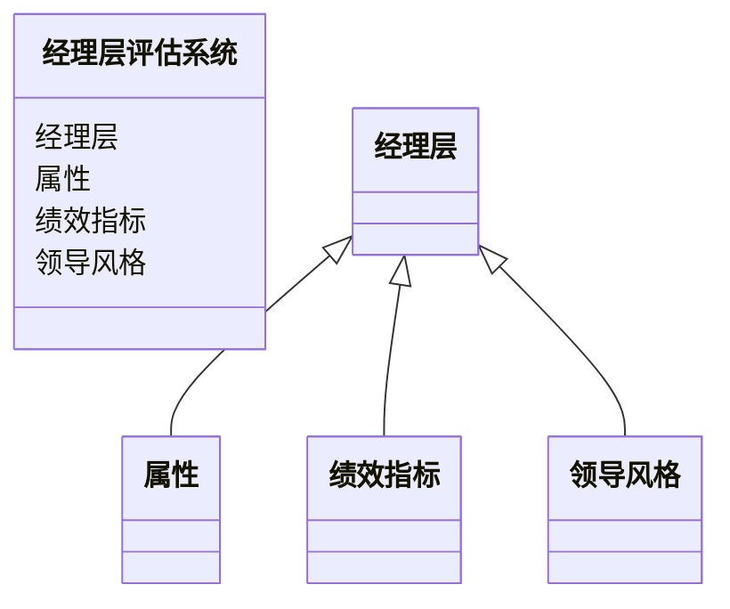
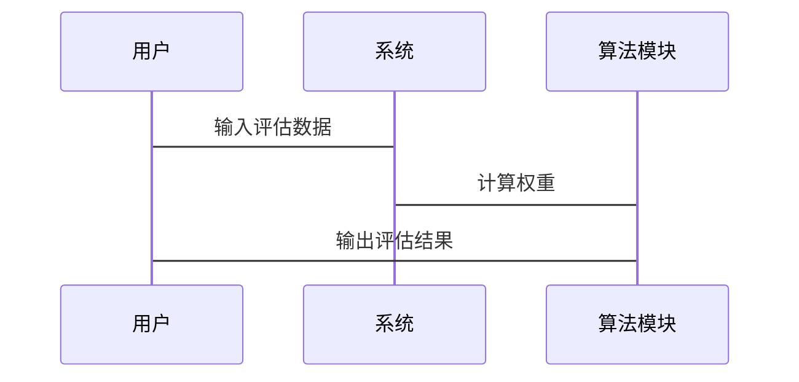

                 


# 费雪的管理层评估：优秀的公司需要优秀的领导

## 关键词：管理层评估，领导力，企业绩效，费雪理论，管理模型

## 摘要：  
费雪的管理层评估是一种系统性的方法，用于识别和培养优秀的企业领导者。本文通过详细分析费雪的领导力模型、管理层评估的核心要素以及实际应用案例，探讨如何通过科学的评估体系提升企业领导力，从而实现企业绩效的持续优化。文章从背景、理论、算法、系统架构到实战应用，全面解析费雪管理层评估的精髓，为企业管理者提供实用的指导。

---

## 第一部分: 费雪的管理层评估基础

### 第1章: 管理层评估的背景与重要性

#### 1.1 管理层评估的背景介绍

##### 1.1.1 管理层评估的定义与范围  
管理层评估是通过对领导者的综合素质、能力、风格和绩效的系统性分析，来判断其是否符合企业战略目标和文化要求的过程。它不仅关注领导者的个人能力，还注重其对团队和组织的整体影响。  

##### 1.1.2 费雪理论的核心观点  
菲利普·费雪（Philip Fisher）是价值投资理论的先驱，他提出，优秀的企业领导者应具备战略思维、决策能力和团队协作能力。费雪认为，管理层的质量是企业长期成功的关键因素之一。  

##### 1.1.3 管理层评估对企业发展的意义  
管理层评估能够帮助企业识别优秀领导者，优化领导团队的结构，提升企业绩效。同时，它还能为企业制定人才发展战略提供依据，从而在竞争激烈的市场中占据优势。

#### 1.2 管理层评估的核心要素

##### 1.2.1 战略思维能力  
战略思维能力是领导者的核心素质之一。优秀的领导者能够从宏观角度审视企业目标，并制定切实可行的战略规划。

##### 1.2.2 决策能力与风险控制  
决策能力是领导者的关键能力之一。在面对复杂问题时，领导者需要具备快速决策的能力，并能够有效控制风险。

##### 1.2.3 团队领导力与文化塑造  
团队领导力决定了领导者如何激发团队潜力，而文化塑造则是领导者通过自身行为影响企业文化的形成。

#### 1.3 管理层评估的边界与外延

##### 1.3.1 评估范围的界定  
管理层评估的范围包括领导者的能力、绩效、风格等多个方面，但需要避免过于宽泛，以免失去评估的焦点。

##### 1.3.2 与其他管理工具的关联  
管理层评估与其他管理工具（如绩效管理、团队建设）密切相关，能够为企业提供全面的领导力分析。

##### 1.3.3 评估的局限性与改进方向  
管理层评估的局限性在于其主观性较强，且难以量化。因此，需要结合定量和定性方法，以提高评估的准确性。

---

## 第二部分: 费雪管理层评估的核心概念与联系

### 第2章: 核心概念的原理与联系

#### 2.1 费雪管理层评估的理论基础

##### 2.1.1 费雪的领导力模型  
费雪的领导力模型强调领导者的核心素质，包括战略思维、决策能力和团队领导力。他提出，优秀领导者应具备长期视野，并能够激励团队实现企业目标。

##### 2.1.2 管理层评估的系统性框架  
管理层评估需要建立一个系统的框架，包括评估指标的设计、评估方法的选择以及评估结果的应用。

#### 2.2 核心概念的属性特征对比

##### 2.2.1 不同领导风格的对比分析  
费雪的领导力模型与其他领导风格（如变革型领导、交易型领导）有显著区别。例如，变革型领导更注重创新，而费雪的领导风格更注重长期稳定。

##### 2.2.2 管理层能力与企业绩效的关系  
研究表明，优秀的领导团队能够显著提升企业绩效。费雪的理论为企业建立了一个领导力与绩效之间的桥梁。

##### 2.2.3 评估指标的权重分配  
在评估指标的设计中，战略思维能力的权重通常高于其他能力，因为它是领导者的首要素质。

#### 2.3 ER实体关系图架构

##### 2.3.1 实体关系图的构建  
以下是一个简化的ER实体关系图，展示了管理层评估的核心实体及其关系：

```mermaid
er
    %% 管理层评估 ER 图
    管理层 (Manager)
        ->[1..n] 属性 (Attribute)
        ->[1..n] 绩效指标 (Performance_Metrics)
        ->[1..n] 领导风格 (Leadership_Style)
```

##### 2.3.2 关键实体之间的关系  
- **管理层**：核心实体，包括所有需要评估的领导者。
- **属性**：领导者的个人特征，如战略思维、决策能力。
- **绩效指标**：用于衡量领导者的实际表现。
- **领导风格**：领导者在团队中的行为模式。

##### 2.3.3 图表解读与应用  
ER图展示了管理层评估的核心要素及其相互关系，为后续的算法设计提供了基础。

---

## 第三部分: 管理层评估的算法原理与数学模型

### 第3章: 管理层评估的算法原理

#### 3.1 管理层评估的算法概述

##### 3.1.1 层次分析法（AHP）的原理  
层次分析法是一种常用的决策支持工具，适用于多指标决策问题。它通过构建层次结构，计算各指标的权重，从而确定最优选项。

##### 3.1.2 决策树模型的应用  
决策树模型是一种基于树状结构的分类方法，适用于领导风格的分类问题。

##### 3.1.3 费雪评估模型的算法流程  
费雪评估模型结合了层次分析法和决策树模型，首先通过AHP确定各指标的权重，然后利用决策树模型进行分类。

#### 3.2 算法的数学模型与公式

##### 3.2.1 层次分析法的数学公式  
层次分析法的核心是计算各指标的权重，公式如下：

$$ AHP\_weight = \frac{\lambda_i}{\sum_{j=1}^{n} \lambda_j} $$

其中，$\lambda_i$ 是第 $i$ 个指标的特征值，$\sum_{j=1}^{n} \lambda_j$ 是所有特征值的总和。

##### 3.2.2 评估权重的计算公式  
评估权重的计算公式如下：

$$ weight_i = \frac{weight_i \times score_i}{\sum_{j=1}^{n} (weight_j \times score_j)} $$

其中，$weight_i$ 是第 $i$ 个指标的权重，$score_i$ 是第 $i$ 个指标的评分。

##### 3.2.3 案例分析与公式应用  
假设某企业需要评估三位领导者的战略思维能力、决策能力和团队领导力。通过层次分析法计算各指标的权重，再结合具体评分，得出每位领导者的综合得分。

#### 3.3 算法的实现与代码

##### 3.3.1 Python实现的层次分析法  
以下是一个简单的Python代码示例，用于计算层次分析法的权重：

```python
import numpy as np

# 定义比较矩阵
matrix = [
    [1, 3, 2],
    [1/3, 1, 1/2],
    [1/2, 2, 1]
]

# 计算特征值和特征向量
eigenvalues, eigenvectors = np.linalg.eig(matrix)

# 提取最大的特征值和对应的特征向量
max_eigenvalue = eigenvalues.max()
max_eigenvector = eigenvectors[:, np.argmax(eigenvalues)]

# 计算权重
weights = max_eigenvector / max_eigenvector.sum()

print("权重为:", weights)
```

---

## 第四部分: 系统分析与架构设计方案

### 第4章: 管理层评估的系统架构设计

#### 4.1 问题场景介绍  
本文构建了一个基于费雪管理层评估模型的系统，用于帮助企业识别和培养优秀领导者。

#### 4.2 系统功能设计

##### 4.2.1 领域模型设计  
以下是领域模型的类图：



##### 4.2.2 系统架构设计  
以下是系统的整体架构图：

```mermaid
container 管理层评估系统 {
    经理层
    属性
    绩效指标
    领导风格
}
```

##### 4.2.3 接口设计  
系统接口包括数据输入、评估计算和结果输出三个部分。

##### 4.2.4 交互设计  
以下是系统交互的序列图：



---

## 第五部分: 项目实战

### 第5章: 项目实战

#### 5.1 环境安装  
需要安装Python和相关的库（如numpy、pandas）。

#### 5.2 系统核心实现源代码  
以下是评估系统的核心代码：

```python
import numpy as np

def calculate_weights(matrix):
    eigenvalues, eigenvectors = np.linalg.eig(matrix)
    max_eigenvalue = eigenvalues.max()
    max_eigenvector = eigenvectors[:, np.argmax(eigenvalues)]
    weights = max_eigenvector / max_eigenvector.sum()
    return weights

# 示例矩阵
matrix = [
    [1, 3, 2],
    [1/3, 1, 1/2],
    [1/2, 2, 1]
]

weights = calculate_weights(matrix)
print("权重为:", weights)
```

#### 5.3 代码应用解读与分析  
上述代码实现了层次分析法的权重计算，可以用于评估领导者的各项能力。

#### 5.4 实际案例分析  
通过一个实际案例，展示如何利用费雪评估模型识别优秀领导者。

#### 5.5 项目小结  
本项目展示了如何将费雪的理论应用于实际的领导力评估中，为企业提供了科学的决策支持。

---

## 第六部分: 最佳实践与总结

### 第6章: 最佳实践

#### 6.1 小结  
费雪的管理层评估方法是一种系统性的领导力分析工具，能够帮助企业识别和培养优秀领导者。

#### 6.2 注意事项  
在实际应用中，需要注意评估的主观性，建议结合定量和定性方法。

#### 6.3 拓展阅读  
推荐阅读菲利普·费雪的相关著作，深入了解他的领导力理论。

---

## 附录

### 附录A: 术语解释  
解释文中出现的专业术语，如层次分析法、决策树模型等。

### 附录B: 参考文献  
列出文章中引用的主要文献和资料。

---

通过以上步骤，我们可以系统地理解和应用费雪的管理层评估方法，为企业培养优秀的领导者，实现企业的可持续发展。

