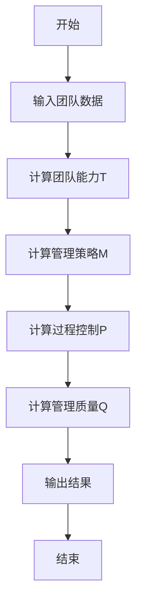
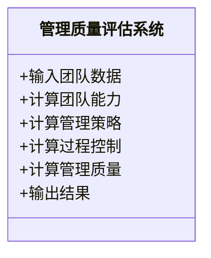
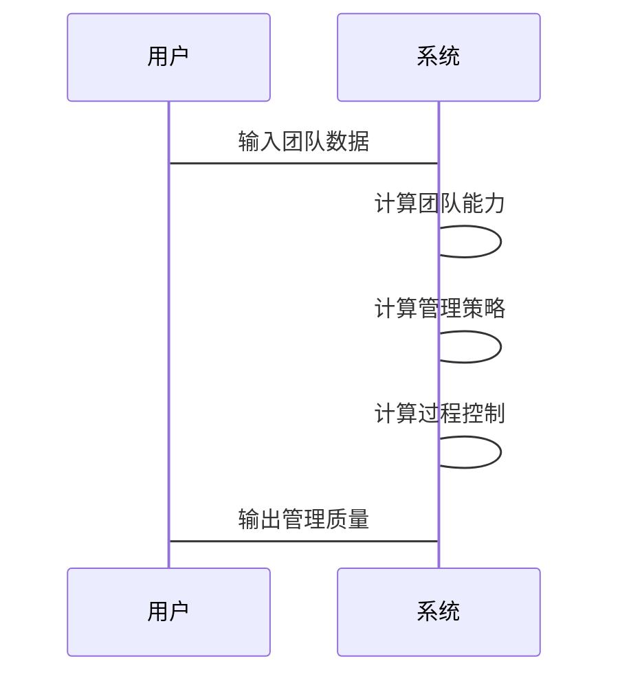

                 


# 费雪的管理质量评估：优秀团队的重要性

## 关键词：管理质量评估，优秀团队，费雪模型，团队管理，质量评估

## 摘要：  
本文深入探讨了费雪的管理质量评估方法，分析了其在现代团队管理中的重要性。通过详细阐述费雪模型的核心概念、算法原理、系统架构以及实际应用案例，本文旨在帮助读者理解如何通过科学的评估方法来提升团队管理效率和质量。文章还提供了丰富的图表和代码示例，以帮助读者更好地理解和应用费雪的管理质量评估方法。

---

## 第一章：费雪管理质量评估的背景与问题背景

### 1.1 管理质量评估的定义与概念  
管理质量评估是对团队或组织在管理过程中的质量进行全面测量和分析的过程。其核心目标是通过量化和定性分析，识别管理中的优缺点，并提出改进建议。管理质量评估的边界包括团队能力、管理策略和过程控制，其外延则涉及团队绩效、员工满意度和组织目标的实现程度。

### 1.2 费雪的管理质量评估问题背景  
费雪的管理质量评估方法是在传统管理评估方法的基础上提出的，旨在解决传统方法中的一些关键问题，例如评估指标过于单一、评估过程缺乏动态性以及评估结果缺乏可操作性。费雪模型通过引入新的评估维度和数学模型，为团队管理提供了一种更加科学和全面的评估方法。

---

## 第二章：费雪管理质量评估的核心概念与联系

### 2.1 费雪模型的核心要素  
费雪模型的核心要素包括团队能力（T）、管理策略（M）和过程控制（P）。这些要素共同构成了管理质量（Q）的评估基础。通过量化这些要素，费雪模型能够为团队管理提供一个全面的评估框架。

#### 费雪模型的核心要素对比
| 要素 | 定义 | 属性 |
|------|------|------|
| T    | 团队能力 | 包括团队成员的知识、技能和经验 |
| M    | 管理策略 | 包括目标设定、资源分配和决策制定 |
| P    | 过程控制 | 包括过程监控、问题解决和反馈机制 |

### 2.2 费雪模型与传统管理质量评估的对比  
传统的管理质量评估方法通常关注单一维度的评估，例如只关注团队绩效或只关注管理策略。而费雪模型则通过综合考虑团队能力、管理策略和过程控制，提供了更加全面的评估方法。这种对比分析可以帮助我们更好地理解费雪模型的优势。

#### 费雪模型与传统模型的对比分析
| 对比维度 | 费雪模型 | 传统模型 |
|----------|----------|----------|
| 评估维度 | 综合 T、M、P | 单一维度 |
| 评估结果 | 动态性高 | 静态性高 |
| 可操作性 | 高 | 低 |

### 2.3 费雪模型的ER实体关系图  
以下是一个简化的ER实体关系图，展示了费雪模型中团队能力、管理策略和过程控制之间的关系。

```mermaid
erd
    管理质量(Q) -- 实现 --> 团队能力(T)
    管理质量(Q) -- 实现 --> 管理策略(M)
    管理质量(Q) -- 实现 --> 过程控制(P)
```

---

## 第三章：费雪管理质量评估的算法原理

### 3.1 费雪模型的数学模型  
费雪模型的数学模型可以表示为：

$$ Q = f(T, M, P) $$

其中，Q为管理质量，T为团队能力，M为管理策略，P为过程控制。该公式表明，管理质量是团队能力、管理策略和过程控制的函数。

### 3.2 费雪模型的评估流程  
以下是费雪模型的评估流程图：



### 3.3 费雪模型的算法实现  
以下是一个Python实现的示例代码，用于计算管理质量：

```python
def calculate_management_quality(team_capability, management_strategy, process_control):
    return team_capability * management_strategy * process_control

# 示例数据
team_capability = 0.8
management_strategy = 0.9
process_control = 0.7

quality = calculate_management_quality(team_capability, management_strategy, process_control)
print(f"管理质量为：{quality}")
```

---

## 第四章：费雪管理质量评估的系统分析与架构设计

### 4.1 系统功能需求分析  
费雪管理质量评估系统的功能需求包括：

- 输入团队数据
- 计算团队能力
- 计算管理策略
- 计算过程控制
- 计算管理质量
- 输出评估结果

### 4.2 系统架构设计  
以下是一个简化的系统架构图：



### 4.3 系统接口设计  
系统的接口设计包括：

- 输入接口：接收团队数据
- 输出接口：输出评估结果
- 计算接口：调用评估算法

### 4.4 系统交互序列图  
以下是系统的交互序列图：



---

## 第五章：费雪管理质量评估的项目实战

### 5.1 环境安装  
要运行费雪管理质量评估系统，需要以下环境：

- Python 3.8+
- Mermaid图表工具
- LaTeX排版工具

### 5.2 核心实现源代码  
以下是核心算法的Python实现：

```python
def calculate_management_quality(team_capability, management_strategy, process_control):
    return team_capability * management_strategy * process_control

# 示例数据
team_capability = 0.8
management_strategy = 0.9
process_control = 0.7

quality = calculate_management_quality(team_capability, management_strategy, process_control)
print(f"管理质量为：{quality}")
```

### 5.3 实际案例分析  
假设我们有一个团队，其团队能力为0.8，管理策略为0.9，过程控制为0.7。通过费雪模型计算得出的管理质量为：

$$ Q = 0.8 \times 0.9 \times 0.7 = 0.504 $$

这意味着该团队的管理质量为0.504，属于中等偏上水平。

---

## 第六章：总结与最佳实践

### 6.1 总结  
费雪的管理质量评估方法通过综合考虑团队能力、管理策略和过程控制，为团队管理提供了一种科学的评估方法。本文通过详细阐述其核心概念、算法原理和系统架构，帮助读者更好地理解和应用费雪模型。

### 6.2 最佳实践  
- 在实际应用中，建议结合具体行业特点对费雪模型进行调整。
- 定期对团队进行评估，以确保管理质量的持续改进。
- 借助工具和技术手段，提高评估过程的效率和准确性。

### 6.3 注意事项  
- 费雪模型是一种理论模型，实际应用中需要结合实际情况进行调整。
- 在使用费雪模型时，应确保数据的准确性和完整性。

### 6.4 拓展阅读  
- 《管理学原理》
- 《团队管理与优化》
- 《质量管理方法与技术》

---

通过本文的分析和讲解，读者可以全面了解费雪的管理质量评估方法，并将其应用于实际的团队管理中，从而提升团队的整体管理质量。

