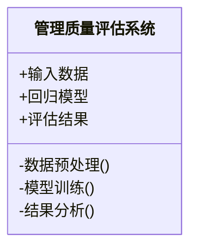
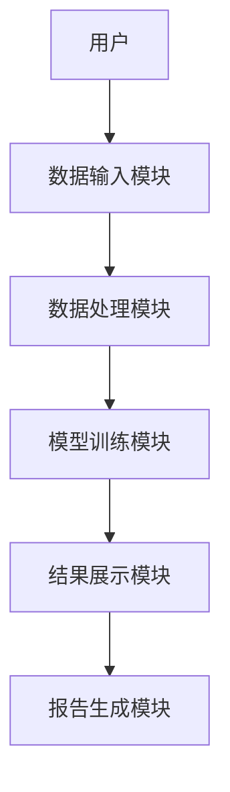

                 


# 费雪的管理质量评估：优秀管理层的特征

## 关键词：管理质量评估、费雪模型、优秀管理层特征、管理能力、绩效评估

## 摘要：本文系统地探讨了费雪的管理质量评估方法，分析了优秀管理层的特征，并通过数学模型和实际案例展示了如何应用这些方法进行管理质量评估。文章从背景介绍、核心概念、算法原理、系统架构到项目实战，全面解析了费雪模型的理论与实践价值。

---

## 第一部分: 管理质量评估的背景与核心概念

### 第1章: 管理质量评估的背景与重要性

#### 1.1 管理质量评估的定义与背景
##### 1.1.1 管理质量评估的基本概念
管理质量评估是对管理者在组织中的表现进行全面分析和评价的过程。它关注管理者的决策能力、执行效率、团队协作以及对组织目标的实现程度。

##### 1.1.2 管理质量评估的背景与现状
随着企业竞争的加剧，管理质量评估已成为企业提升竞争力的重要工具。通过科学的评估方法，企业能够识别优秀管理者，优化管理流程，提升整体绩效。

##### 1.1.3 管理质量评估对企业绩效的影响
管理质量评估直接影响企业的战略执行和运营效率。优秀的管理者能够带领团队实现目标，而低效的管理者可能导致资源浪费和目标偏离。

#### 1.2 管理质量评估的核心要素
##### 1.2.1 管理质量的维度分解
管理质量可以从决策能力、执行效率、团队协作、创新能力和沟通能力等多个维度进行评估。

##### 1.2.2 管理质量评估的指标体系
常见的管理质量评估指标包括决策准确率、团队满意度、项目完成率、成本控制能力等。

##### 1.2.3 管理质量与企业战略的关系
管理质量是企业战略成功的关键因素。优秀的管理者能够将企业战略转化为具体行动，并确保其有效执行。

#### 1.3 优秀管理层的特征分析
##### 1.3.1 优秀管理层的核心特质
优秀管理者通常具备清晰的愿景、良好的沟通能力、决策能力和领导力。

##### 1.3.2 管理层能力与企业绩效的关联
管理层的能力直接影响企业的绩效表现。例如，高效的决策能力可以提高企业运营效率，创新能力强的管理层能够推动企业技术创新。

##### 1.3.3 管理层决策的外部环境影响
外部环境如市场需求、政策变化等也会对管理层决策产生重要影响，管理层需要具备应变能力以适应变化。

#### 1.4 管理质量评估的边界与外延
##### 1.4.1 管理质量评估的适用范围
管理质量评估适用于各类组织，包括企业、政府机构和非营利组织。

##### 1.4.2 管理质量评估的局限性
评估结果可能受到数据质量和评估方法的影响，存在一定的局限性。

##### 1.4.3 管理质量评估与其他管理工具的对比
对比如平衡计分卡、360度评估等方法，分析费雪模型的优势和不足。

#### 1.5 本章小结
本章介绍了管理质量评估的背景、核心要素以及优秀管理层的特征，为后续分析奠定了基础。

---

## 第二部分: 费雪的管理质量评估模型

### 第2章: 费雪管理质量评估模型的核心原理

#### 2.1 费雪模型的基本原理
##### 2.1.1 费雪模型的理论基础
费雪模型基于管理学和统计学理论，通过量化方法评估管理质量。

##### 2.1.2 费雪模型的数学表达式
$$ Q = \frac{S}{T} $$
其中，Q为管理质量，S为管理成果，T为管理投入。

##### 2.1.3 费雪模型的优缺点分析
优点：量化结果直观，易于比较；缺点：可能忽略管理过程中的复杂因素。

---

## 第三部分: 算法原理与数学模型

### 第3章: 费雪模型的数学模型与公式推导

#### 3.1 费雪模型的数学基础
##### 3.1.1 管理质量的线性回归模型
$$ Q = \beta_0 + \beta_1X + \epsilon $$
其中，X为自变量，$\beta_0$为截距，$\beta_1$为回归系数，$\epsilon$为误差项。

##### 3.1.2 管理质量的多元回归模型
$$ Q = \beta_0 + \beta_1X_1 + \beta_2X_2 + \dots + \beta_nX_n + \epsilon $$

#### 3.2 算法实现步骤
##### 3.2.1 数据预处理
- 收集管理成果和管理投入数据。
- 数据清洗和标准化。

##### 3.2.2 模型训练
- 选择回归算法（如最小二乘法）。
- 训练模型并计算回归系数。

##### 3.2.3 模型评估
- 计算R²值，评估模型拟合程度。
- 验证误差分析。

#### 3.3 Python代码实现
```python
import numpy as np
from sklearn.linear_model import LinearRegression
from sklearn.metrics import r2_score

# 示例数据
X = np.array([[1], [2], [3], [4], [5]])
y = np.array([2, 3, 5, 6, 8])

# 模型训练
model = LinearRegression()
model.fit(X, y)

# 模型预测
y_pred = model.predict(X)

# 模型评估
r2 = r2_score(y, y_pred)
print(f"回归系数：{model.coef_}")
print(f"截距：{model.intercept_}")
print(f"R²值：{r2}")
```

#### 3.4 案例分析
使用上述代码分析一个管理层的管理质量，假设数据为：
X = [[2], [3], [4], [5], [6]]
y = [4, 5, 7, 8, 10]

运行代码，得到回归模型，并评估其管理质量。

---

## 第四部分: 系统分析与架构设计

### 第4章: 费雪模型的系统实现

#### 4.1 系统功能设计
##### 4.1.1 领域模型


##### 4.1.2 系统架构


#### 4.2 接口设计
##### 4.2.1 数据接口
- 输入接口：接受管理成果和投入数据。
- 输出接口：返回评估结果和报告。

##### 4.2.2 用户界面
- 数据输入界面：用户输入数据。
- 结果展示界面：显示评估结果和报告。

---

## 第五部分: 项目实战

### 第5章: 费雪模型的项目实现

#### 5.1 环境安装
安装Python和必要的库：
```bash
pip install numpy scikit-learn
```

#### 5.2 核心代码实现
```python
import numpy as np
from sklearn.linear_model import LinearRegression
from sklearn.metrics import r2_score

# 示例数据
X = np.array([[1], [2], [3], [4], [5]])
y = np.array([2, 3, 5, 6, 8])

# 模型训练
model = LinearRegression()
model.fit(X, y)

# 模型预测
y_pred = model.predict(X)

# 模型评估
r2 = r2_score(y, y_pred)
print(f"回归系数：{model.coef_}")
print(f"截距：{model.intercept_}")
print(f"R²值：{r2}")
```

#### 5.3 案例分析
分析某公司管理层的管理质量，使用上述代码进行评估，并生成报告。

#### 5.4 代码解读与分析
解释代码实现的每一步，分析模型训练和评估过程。

---

## 第六部分: 总结与展望

### 第6章: 总结与展望

#### 6.1 最佳实践
- 数据质量是关键，确保数据准确性和完整性。
- 结合具体业务场景，调整模型参数。

#### 6.2 小结
本文详细介绍了费雪的管理质量评估方法，通过数学模型和实际案例展示了其应用价值。

#### 6.3 注意事项
- 模型结果仅供参考，需结合实际情况进行调整。
- 定期更新数据和模型，以适应变化。

#### 6.4 拓展阅读
推荐相关书籍和文献，供读者深入学习。

---

## 结语
费雪的管理质量评估方法为现代企业管理提供了重要工具，通过科学的评估和改进，企业可以显著提升管理效率和绩效。希望本文能为读者提供有价值的参考和启发。

