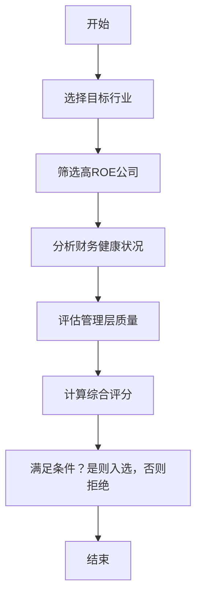
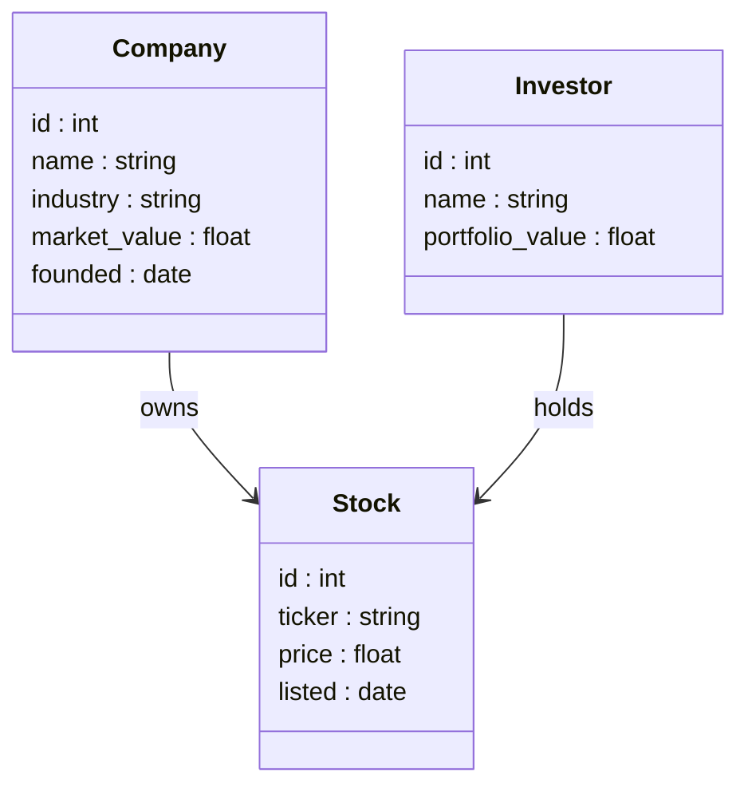

                 


# 费雪的股票筛选技巧

> 关键词：费雪，股票筛选，价值投资，财务指标，投资策略

> 摘要：本文将深入探讨费雪的股票筛选技巧，从其投资理念到具体的选股标准，结合数学模型和系统架构，详细解析其方法的科学性和实践性。通过实际案例分析和代码实现，帮助读者掌握费雪的选股技巧，并结合最佳实践提供投资建议。

---

## 第1章 费雪投资理念概述

### 1.1 费雪投资理念的核心思想
- **价值投资的基本概念**：介绍价值投资的定义、核心原则及其与现代投资理论的联系。
- **费雪的投资哲学**：解析费雪如何通过深入研究公司基本面进行投资决策。
- **费雪与现代投资理论的联系**：探讨费雪方法在现代投资策略中的应用和影响。

### 1.2 股票筛选的基本概念
- **股票筛选的定义**：解释股票筛选的含义及其在投资组合管理中的作用。
- **股票筛选的目标与意义**：分析股票筛选如何帮助投资者优化投资组合、降低风险。
- **股票筛选的核心要素**：列举并详细说明选股的关键指标，如市盈率、ROE等。

### 1.3 费雪选股方法的历史背景
- **20世纪投资环境的演变**：回顾20世纪美国股市的变迁及其对费雪投资理念的影响。
- **费雪选股方法的形成过程**：解析费雪选股方法是如何在实践中逐步形成的。
- **费雪选股方法的现代应用**：探讨费雪方法在当前市场环境中的适用性和改进空间。

---

## 第2章 费雪选股标准的核心概念

### 2.1 费雪选股标准的属性特征对比
- **财务指标对比表格**：列出并对比关键财务指标（如ROE、毛利率等）在选股中的重要性。
- **行业特征对比表格**：分析不同行业在选股标准上的差异及影响。
- **公司治理对比表格**：探讨公司治理结构对投资决策的影响。

### 2.2 费雪选股标准的ER实体关系图
```mermaid
erDiagram
    company {
        key id
        string name
        string industry
        float market_value
        date founded
    }
    stock {
        key id
        string ticker
        float price
        date listed
    }
    investor {
        key id
        string name
        float portfolio_value
    }
    company --> stock : owns
    investor --> stock : holds
```

---

## 第3章 费雪选股标准的算法原理

### 3.1 费雪选股标准的数学模型
- **综合评分公式**：介绍如何通过加权计算对股票进行综合评分。
  $$ \text{综合评分} = \sum_{i=1}^{n} w_i \times \text{指标值}_i $$
- **条件筛选公式**：展示如何通过一系列条件筛选出符合标准的股票。
  $$ \text{入选条件} = \bigwedge_{j=1}^{m} (\text{指标}_j \geq \text{阈值}_j) $$

### 3.2 费雪选股算法的流程图


---

## 第4章 费雪选股标准的系统架构

### 4.1 系统功能设计
- **模块划分**：数据采集、指标计算、筛选逻辑、结果展示。
- **领域模型类图**：


### 4.2 系统架构设计


---

## 第5章 费雪选股标准的项目实战

### 5.1 环境安装
- **工具安装**：介绍所需工具，如Python、Pandas、Matplotlib等。
- **数据获取**：指导如何获取股票数据（如通过API或CSV文件）。

### 5.2 核心实现代码
```python
import pandas as pd

def fisher_stock_screening(data, thresholds):
    # 计算综合评分
    weights = [0.4, 0.3, 0.2, 0.1]
    scores = []
    for index, row in data.iterrows():
        score = sum(weights[i] * row[指标i] for i in range(len(weights)))
        scores.append(score)
    
    # 条件筛选
    selected = data[(data['ROE'] >= thresholds['roe']) &
                    (data['毛利率'] >= thresholds['margin']) &
                    (data['ROA'] >= thresholds['roa'])]
    return selected

# 示例数据
data = pd.DataFrame({
    '公司': ['A', 'B', 'C'],
    'ROE': [0.15, 0.12, 0.09],
    '毛利率': [0.25, 0.20, 0.15],
    'ROA': [0.08, 0.06, 0.04]
})

# 筛选阈值
thresholds = {
    'roe': 0.12,
    'margin': 0.18,
    'roa': 0.05
}

selected = fisher_stock_screening(data, thresholds)
print(selected)
```

### 5.3 案例分析
- **实际案例**：选择一个具体行业（如科技行业）进行分析，展示如何应用费雪选股方法筛选出优质股票。
- **结果解读**：解释筛选结果的意义，并结合市场环境给出投资建议。

---

## 第6章 费雪选股标准的最佳实践

### 6.1 投资建议
- **长期投资**：强调价值投资的长期性，避免短期波动干扰。
- **风险管理**：介绍如何通过分散投资和止损策略降低风险。

### 6.2 注意事项
- **数据准确性**：提醒读者注意数据来源的可靠性。
- **市场变化**：提示投资者需定期更新筛选标准以适应市场变化。

### 6.3 拓展阅读
- **推荐书籍**：推荐与价值投资相关的书籍和资源。
- **进一步研究方向**：建议读者深入研究其他价值投资者的方法，并结合机器学习优化选股策略。

---

## 第7章 小结

### 7.1 费雪选股技巧的核心总结
- 费雪选股方法的科学性和实用性。
- 方法在现代投资中的应用前景。

### 7.2 未来展望
- 结合人工智能优化选股模型。
- 探讨费雪方法在不同市场环境中的表现。

---

通过以上目录结构，读者可以系统地了解费雪的股票筛选技巧，并能够实际操作和应用这些方法。

