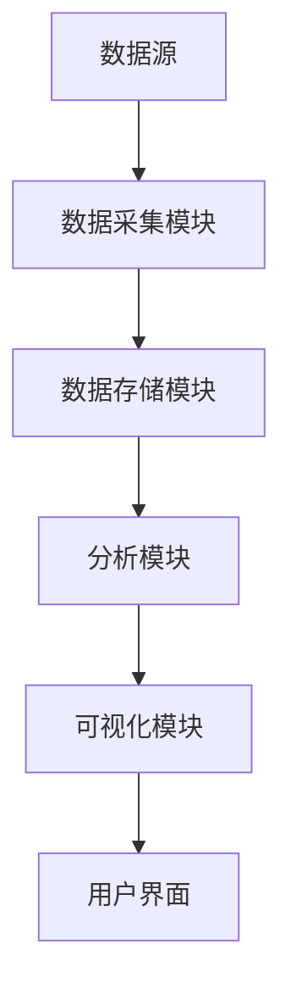
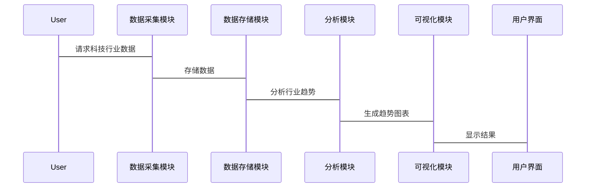

                 


# 费雪的行业趋势分析：把握未来增长机会

> 关键词：费雪投资理论，行业趋势分析，趋势投资，股票分析，增长机会，技术分析

> 摘要：本文将深入探讨费雪投资理论与行业趋势分析的结合，通过详细分析行业趋势的驱动因素、数学模型、系统设计和实际案例，帮助读者掌握如何利用行业趋势分析来把握未来的投资机会。文章结合理论与实践，提供从基础概念到高级算法的全面解析。

---

# {{此处是文章标题}}

---

## 第一章：费雪投资理论与行业趋势分析的背景

### 1.1 费雪投资理论的背景与核心思想

#### 1.1.1 费雪投资理论的起源与发展

费雪（Philip Fisher）是20世纪著名的投资理论家，提出了“趋势投资”理念。他主张长期投资于具有强大竞争优势和增长潜力的公司。费雪理论的核心在于通过深入分析公司的基本面，识别行业趋势中的投资机会。

#### 1.1.2 费雪投资理论的核心观点

- **投资的本质**：投资不是赌博，而是通过研究公司基本面，找到具有持续增长潜力的企业。
- **成长股投资**：关注具有较高增长率和竞争优势的公司，而非单纯追求低市盈率。
- **行业趋势的重要性**：行业的发展趋势是判断公司增长潜力的关键因素。

#### 1.1.3 费雪投资理论在现代投资中的应用

费雪的理论为现代趋势投资奠定了基础，尤其是在技术分析和量化分析领域，费雪的思路被进一步发展。

### 1.2 行业趋势分析的重要性

#### 1.2.1 行业趋势分析的定义与范围

行业趋势分析是通过对行业数据的分析，预测行业未来的发展方向和潜力。它涵盖宏观经济、行业结构、市场需求和技术进步等多个方面。

#### 1.2.2 行业趋势分析的核心要素

- **宏观经济因素**：GDP增长率、利率、通货膨胀等。
- **行业结构**：市场集中度、竞争格局、进入壁垒。
- **市场需求**：消费者行为、市场规模、增长潜力。
- **技术进步**：技术创新对行业的影响。

#### 1.2.3 行业趋势分析与投资决策的关系

行业趋势分析为投资决策提供了方向性指导，帮助投资者识别高增长行业，从而找到具有长期增长潜力的企业。

---

## 第二章：费雪投资理论与行业趋势分析的结合

### 2.1 费雪投资理论在行业分析中的应用

#### 2.1.1 费雪理论与行业生命周期的关系

行业生命周期分为幼稚期、成长期、成熟期和衰退期。费雪理论强调选择处于成长期的行业，投资具有竞争优势的企业。

#### 2.1.2 行业趋势分析在费雪理论中的作用

行业趋势分析帮助投资者识别行业的发展方向，从而选择具有增长潜力的行业和企业。

#### 2.1.3 费雪理论对行业趋势分析的指导意义

费雪理论强调长期投资和深入研究，这对行业趋势分析提出了更高的要求。

### 2.2 行业趋势分析的基本方法

#### 2.2.1 宏观经济分析法

通过分析宏观经济指标（如GDP增长率、利率、通货膨胀等）来判断行业发展趋势。

#### 2.2.2 行业结构分析法

分析行业集中度、竞争格局等，判断行业的竞争优势和潜在风险。

#### 2.2.3 市场需求分析法

通过研究市场需求、消费者行为等，预测行业的增长潜力。

#### 2.2.4 技术进步分析法

分析技术进步对行业的影响，判断行业的未来发展方向。

---

## 第三章：费雪投资理论的数学模型与算法原理

### 3.1 费雪投资理论的数学模型

#### 3.1.1 费雪模型的数学表达式

费雪模型用于估算股票的内在价值，公式为：
$$ P = \frac{E_1}{(r - g)} $$
其中：
- \( P \)：股票的内在价值
- \( E_1 \)：第一年的预期收益
- \( r \)：贴现率
- \( g \)：收益增长率

#### 3.1.2 模型的假设条件与边界

- 假设收益以固定增长率 \( g \) 增长。
- 适用于成长型企业。

#### 3.1.3 模型的优缺点分析

- 优点：简单易懂，适合初步评估。
- 缺点：假设条件严格，实际中难以满足。

### 3.2 行业趋势分析的算法原理

#### 3.2.1 时间序列分析法

时间序列分析用于预测行业未来发展趋势，常用模型包括ARIMA和指数平滑法。

#### 3.2.2 趋势外推法

通过历史数据拟合趋势线，外推未来发展趋势。

#### 3.2.3 聚类分析法

将行业分为不同类别，分析各类别的发展趋势。

#### 3.2.4 回归分析法

通过回归模型分析行业趋势的影响因素。

---

## 第四章：行业趋势分析的系统架构设计

### 4.1 系统功能

#### 4.1.1 数据采集模块

- 数据源：宏观经济数据、行业数据、公司财务数据。
- 数据清洗：处理缺失值、异常值。

#### 4.1.2 分析模块

- 趋势预测：使用时间序列分析、回归分析等方法。
- 竞争分析：分析市场集中度、竞争对手情况。

#### 4.1.3 可视化模块

- 生成趋势图表、竞争分析图表。

### 4.2 系统架构设计

使用Mermaid图展示系统架构：



---

## 第五章：项目实战与案例分析

### 5.1 环境安装

- **工具安装**：安装Python、Pandas、Matplotlib、Scikit-learn等库。
- **数据获取**：获取行业数据，如GDP增长率、行业销售收入等。

### 5.2 核心实现

#### 5.2.1 数据预处理

```python
import pandas as pd

# 读取数据
df = pd.read_csv('industry_data.csv')

# 处理缺失值
df.dropna(inplace=True)

# 标准化处理
from sklearn.preprocessing import StandardScaler
scaler = StandardScaler()
scaled_data = scaler.fit_transform(df)
```

#### 5.2.2 趋势分析

```python
from statsmodels.tsa.arima.model import ARIMA

# 训练ARIMA模型
model = ARIMA(df['revenue'], order=(1, 1, 1))
model_fit = model.fit()

# 预测未来趋势
forecast = model_fit.forecast(steps=5)
```

### 5.3 案例分析

以科技行业为例，分析行业趋势：



---

## 第六章：总结与注意事项

### 6.1 小结

本文详细探讨了费雪投资理论与行业趋势分析的结合，通过数学模型、算法原理和系统设计，帮助读者掌握如何利用行业趋势分析来把握未来的投资机会。

### 6.2 注意事项

- 投资需谨慎，避免盲目跟风。
- 数据分析需结合实际情况，避免过度依赖模型。

### 6.3 未来展望

随着大数据和人工智能的发展，行业趋势分析将更加精准和高效，为投资者提供更有力的支持。

---

通过以上分析，读者可以系统地掌握费雪投资理论与行业趋势分析的核心内容，并能够实际操作，找到未来的增长机会。

