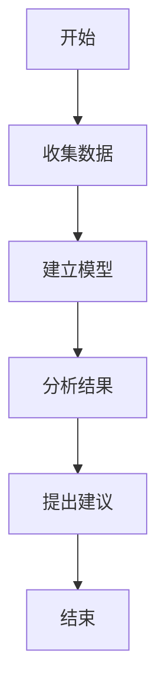

                 

# 费雪的行业领导者投资策略

> 关键词：费雪，行业领导者，投资策略，价值投资，长期持有

> 摘要：本文深入探讨了费雪的投资策略，重点分析了如何识别和投资行业领导者。通过系统分析和案例研究，揭示了行业领导者的特征、识别方法以及投资策略的实施步骤。文章结合技术分析和系统设计，为投资者提供了实用的指导和最佳实践建议。

---

## 第一部分: 费雪投资策略基础

### 第1章: 费雪投资策略概述

#### 1.1 费雪的投资理念

##### 1.1.1 费雪的生平与投资背景
菲利普·费雪（Philip Fisher）是20世纪的投资大师，以“成长型投资”闻名。他强调长期投资、深入研究和选择具有强大竞争优势的企业。费雪的投资理念以基本面分析为核心，注重企业的成长性和管理团队的质量。

##### 1.1.2 费雪的投资哲学
费雪的投资哲学可以总结为：
1. **长期持有**：避免频繁交易，减少交易成本。
2. **深入研究**：对企业进行详尽的调查，包括财务状况、行业地位和管理层能力。
3. **寻找行业领导者**：投资于行业中具有竞争优势的企业，这些企业能够持续增长并为股东创造价值。

##### 1.1.3 费雪策略的核心思想
费雪的核心思想是通过投资于行业领导者，利用企业的持续增长来实现资本增值。他强调，投资的回报不仅仅来自股价的上涨，还来自企业的盈利增长。

---

### 第2章: 行业领导者的定义与特征

#### 2.1 行业领导者的定义

##### 2.1.1 什么是行业领导者
行业领导者是指在特定行业中占据主导地位，具有竞争优势、强大的市场地位和持续盈利能力的企业。

##### 2.1.2 行业领导者的分类
行业领导者可以分为两类：
1. **市场领导者**：市场份额最高的企业。
2. **创新领导者**：在技术和产品创新方面处于领先地位的企业。

##### 2.1.3 行业领导者的竞争优势
竞争优势是行业领导者区别于其他企业的关键因素，包括：
- **成本优势**：生产效率高，成本控制能力强。
- **技术优势**：拥有领先的技术和专利。
- **品牌优势**：品牌知名度高，客户忠诚度高。

#### 2.2 行业领导者的特征

##### 2.2.1 市场地位
市场地位是衡量行业领导者的重要指标，包括市场份额、市场影响力和客户忠诚度。

##### 2.2.2 财务表现
财务表现是行业领导者的另一个重要特征，包括高盈利能力、稳定的现金流和健康的资产负债表。

##### 2.2.3 创新能力
创新能力强的行业领导者能够不断推出新产品，保持竞争优势。

##### 2.2.4 管理团队
优秀的管理团队是行业领导者的重要特征，他们具备战略眼光和执行力。

---

### 第3章: 行业领导者识别的财务指标

#### 3.1 财务指标分析

##### 3.1.1 营业收入增长率
营业收入增长率是衡量企业成长性的关键指标，公式为：
$$ \text{营业收入增长率} = \frac{\text{本期营业收入} - \text{上期营业收入}}{\text{上期营业收入}} \times 100\% $$

##### 3.1.2 净利润率
净利润率反映了企业的盈利能力，公式为：
$$ \text{净利润率} = \frac{\text{净利润}}{\text{营业收入}} \times 100\% $$

##### 3.1.3 资产负债率
资产负债率衡量了企业的财务风险，公式为：
$$ \text{资产负债率} = \frac{\text{总负债}}{\text{总资产}} \times 100\% $$

##### 3.1.4 现金流健康度
现金流健康度反映了企业的资金流动性，公式为：
$$ \text{经营活动现金流净额} = \text{营业收入} - \text{经营成本} - \text{税费} $$

#### 3.2 财务指标的综合评分模型

##### 3.2.1 综合评分公式
$$ \text{综合评分} = \left( \frac{\text{营业收入增长率}}{4} \right) + \left( \frac{\text{净利润率}}{4} \right) + \left( \frac{1 - \text{资产负债率}}{4} \right) + \left( \frac{\text{经营活动现金流净额}}{4} \right) \times 100\% $$

##### 3.2.2 评分标准
- 80分以上：优秀，符合行业领导者标准。
- 60-80分：良好，具有潜力。
- 60分以下：较差，不符合行业领导者标准。

---

### 第4章: 行业领导者识别的非财务指标

#### 4.1 非财务指标分析

##### 4.1.1 市场占有率
市场占有率是衡量企业市场地位的重要指标，公式为：
$$ \text{市场占有率} = \frac{\text{企业销售额}}{\text{行业总销售额}} \times 100\% $$

##### 4.1.2 产品创新能力
产品创新能力反映了企业的技术实力和创新能力，包括新产品推出频率、研发投入比例等。

##### 4.1.3 品牌影响力
品牌影响力是企业市场竞争力的重要体现，包括品牌知名度、客户忠诚度和品牌价值。

##### 4.1.4 管理团队稳定性
管理团队的稳定性反映了企业的治理能力和战略执行力。

#### 4.2 非财务指标的综合评分模型

##### 4.2.1 综合评分公式
$$ \text{综合评分} = \left( \frac{\text{市场占有率}}{4} \right) + \left( \frac{\text{产品创新能力}}{4} \right) + \left( \frac{\text{品牌影响力}}{4} \right) + \left( \frac{\text{管理团队稳定性}}{4} \right) \times 100\% $$

##### 4.2.2 评分标准
- 同上。

---

### 第5章: 费雪投资策略的系统分析

#### 5.1 系统分析框架

##### 5.1.1 系统分析的概念
系统分析是一种通过综合分析各要素之间的关系，制定最优决策的方法。

##### 5.1.2 系统分析的方法
包括定性分析和定量分析，结合财务和非财务指标进行综合评估。

##### 5.1.3 系统分析的工具
使用Mermaid图展示系统分析的流程：

#### 5.2 系统分析的步骤

##### 5.2.1 明确目标
确定分析的目标，例如识别行业领导者。

##### 5.2.2 收集数据
收集企业的财务数据、市场数据和非财务数据。

##### 5.2.3 建立模型
建立综合评分模型，整合财务和非财务指标。

##### 5.2.4 分析结果
根据评分模型对目标企业进行评估。

##### 5.2.5 提出建议
根据分析结果提出投资建议。

---

### 第6章: 投资组合管理与风险管理

#### 6.1 投资组合管理

##### 6.1.1 投资组合的构建
根据费雪策略，投资组合应以行业领导者为主，同时分散投资以降低风险。

##### 6.1.2 投资组合的调整
定期评估投资组合，根据市场变化进行调整。

##### 6.1.3 投资组合的风险评估
使用风险评估模型，识别潜在风险并制定应对策略。

#### 6.2 风险管理策略

##### 6.2.1 风险的识别与评估
通过分析市场、行业和企业风险，制定风险管理计划。

##### 6.2.2 风险的控制与应对
采取分散投资、设置止损点等方法控制风险。

##### 6.2.3 风险的监控与反馈
定期监控投资组合的表现，及时调整风险管理策略。

---

### 第7章: 费雪投资策略的实战案例

#### 7.1 案例分析

##### 7.1.1 某行业领导者的案例
以某行业领导者为例，分析其作为行业领导者的特征和优势。

##### 7.1.2 费雪策略的应用
展示如何通过费雪策略识别行业领导者，并制定投资计划。

---

### 第8章: 总结与最佳实践

#### 8.1 总结
费雪的投资策略强调长期持有和深入研究，通过识别行业领导者实现资本增值。

#### 8.2 最佳实践 tips
- **深入研究**：在投资前对企业进行详尽的调查。
- **长期持有**：避免频繁交易，降低交易成本。
- **分散投资**：通过多样化降低风险。
- **持续学习**：保持对市场和行业的敏感性。

#### 8.3 小结
费雪的投资策略为投资者提供了宝贵的指导，通过识别和投资行业领导者，投资者可以在长期实现资本增值。

#### 8.4 注意事项
- 投资有风险，需谨慎评估。
- 遵守法律法规，合规投资。

#### 8.5 拓展阅读
推荐相关书籍和资源，供读者深入学习。

---

通过以上章节的内容，读者可以全面理解费雪的投资策略，并将其应用于实际投资中，实现长期的资本增值。

