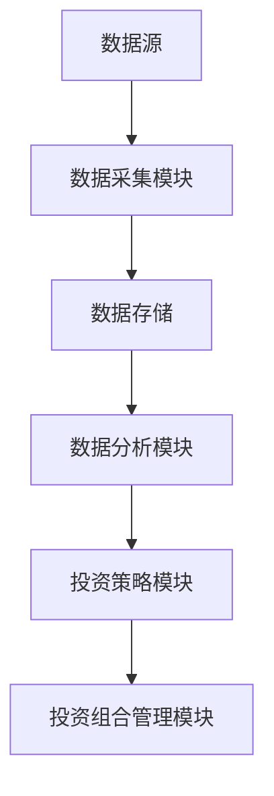

                 


# 费雪的行业领导者理论：投资行业龙头

## 关键词
费雪投资理论、行业领导者、投资策略、企业估值、投资分析、投资管理

## 摘要
本文深入探讨了费雪的行业领导者理论，分析了其核心概念、数学模型、系统架构及实际应用。通过详细讲解投资策略、企业估值和系统设计，结合项目实战和最佳实践，为读者提供全面的理论与实践指导。

---

## 第1章: 费雪行业领导者理论的背景与核心概念

### 1.1 费雪行业领导者理论的背景

#### 1.1.1 费雪投资理论的起源
菲利普·费雪（Philip Fisher）是20世纪著名的投资理论家，提出了“行业领导者”理论，强调投资于行业中的优秀企业，而非仅仅关注价格波动。

#### 1.1.2 费雪理论的核心观点
费雪认为，投资者应选择具有强大竞争优势和持续增长潜力的行业领导者，而非仅关注短期股价波动。

#### 1.1.3 行业领导者理论的演变
费雪的理论在投资界产生了深远影响，成为长期价值投资的重要基石。

### 1.2 行业领导者的定义与特征

#### 1.2.1 行业领导者的定义
行业领导者是指在行业中占据主导地位，具有强大竞争优势的企业。

#### 1.2.2 行业领导者的特征
- 市场份额高
- 竞争优势明显
- 持续盈利能力
- 领先的创新能力

#### 1.2.3 行业领导者的竞争优势分析
- 市场地位：龙头企业通常拥有更高的市场份额和定价权。
- 技术优势：行业领导者往往掌握核心技术或专利。
- 财务实力：强大的财务基础支持持续发展和扩张。

---

## 第2章: 费雪行业领导者理论的核心原理

### 2.1 投资策略的核心要素

#### 2.1.1 企业盈利稳定性分析
分析企业的历史盈利情况和未来盈利能力，确保投资于稳定增长的企业。

#### 2.1.2 企业成长性评估
通过分析企业的收入增长率、净利润增长率等指标，评估企业的成长潜力。

#### 2.1.3 企业估值与投资决策
使用市盈率（P/E）、市净率（P/B）等指标，评估企业的估值是否合理。

### 2.2 费雪的选股标准

#### 2.2.1 初步筛选：行业地位与市场表现
选择行业中的龙头企业，关注其市场表现和行业排名。

#### 2.2.2 深入分析：财务健康状况
通过分析企业的财务报表，评估企业的财务健康状况和盈利能力。

#### 2.2.3 长期投资：竞争优势与未来潜力
选择具有强大竞争优势和持续增长潜力的企业进行长期投资。

---

## 第3章: 费雪行业领导者理论的数学模型与公式

### 3.1 行业领导者的竞争优势评估模型

#### 3.1.1 市场份额计算公式
$$市场份额 = \frac{企业销售额}{行业总销售额}$$

#### 3.1.2 竞争优势指数
$$竞争优势指数 = 市场份额 + 净利润率 + 创新能力$$

### 3.2 企业估值模型

#### 3.2.1 费雪的企业估值公式
$$企业价值 = 收益 \times 合理市盈率$$

#### 3.2.2 市盈率与市净率的比较
$$市盈率 = \frac{股价}{每股收益}$$
$$市净率 = \frac{股价}{每股净资产}$$

#### 3.2.3 股东权益收益率（ROE）
$$ROE = \frac{净利润}{股东权益}$$

---

## 第4章: 费雪行业领导者理论的系统分析与架构设计

### 4.1 投资系统的需求分析

#### 4.1.1 投资目标的确定
明确投资目标，如长期价值增长、风险控制等。

#### 4.1.2 数据采集与处理
收集企业的财务数据、市场数据等，进行清洗和处理。

#### 4.1.3 投资策略的制定
根据分析结果，制定具体的投资策略。

### 4.2 投资系统架构设计

#### 4.2.1 系统功能模块划分
- 数据采集模块
- 数据分析模块
- 投资策略模块
- 投资组合管理模块

#### 4.2.2 系统架构的Mermaid图



#### 4.2.3 系统接口设计
- 数据接口：与数据源对接，获取实时数据。
- 用户接口：提供友好的用户界面，方便用户操作。

---

## 第5章: 费雪行业领导者理论的项目实战

### 5.1 环境安装与配置

#### 5.1.1 投资分析工具的安装
安装Python、Pandas、Matplotlib等工具。

#### 5.1.2 数据源的获取与处理
从可靠的金融数据源获取数据，如Yahoo Finance。

#### 5.1.3 系统环境的配置
配置Python环境，安装必要的库和工具。

### 5.2 核心代码实现

#### 5.2.1 行业领导者筛选算法

```python
import pandas as pd

# 假设df为包含企业数据的DataFrame
# 筛选行业龙头
industry_leaders = df[df['市场份额'] > 0.2]
```

#### 5.2.2 企业估值模型的实现

```python
def calculate_valuation(revenue, net_profit, pe_ratio):
    return revenue * pe_ratio / net_profit

# 示例数据
revenue = 100000000
net_profit = 20000000
pe_ratio = 15

valuation = calculate_valuation(revenue, net_profit, pe_ratio)
print(valuation)
```

#### 5.2.3 投资策略的代码实现

```python
import pandas as pd

# 示例数据
data = {'企业名称': ['A', 'B', 'C', 'D'],
        '市场份额': [0.3, 0.2, 0.1, 0.4],
        '净利率': [0.15, 0.1, 0.08, 0.12]}

df = pd.DataFrame(data)

# 筛选投资组合
portfolio = df[df['市场份额'] > 0.25]
print(portfolio)
```

### 5.3 实际案例分析

#### 5.3.1 案例背景
假设我们关注科技行业，目标是筛选出行业领导者。

#### 5.3.2 数据分析
使用上述代码筛选出市场份额大于25%的企业。

#### 5.3.3 投资策略制定
选择市场份额高、净利率稳定的龙头企业进行投资。

### 5.4 项目总结

#### 5.4.1 项目成果
成功筛选出行业领导者，制定投资策略。

#### 5.4.2 经验与教训
数据质量和模型准确性对投资结果影响重大，需持续优化。

---

## 第6章: 费雪行业领导者理论的最佳实践与小结

### 6.1 最佳实践

#### 6.1.1 定期评估投资组合
定期审查投资组合，确保符合行业领导者标准。

#### 6.1.2 保持长期视角
投资行业领导者需耐心等待，长期持有优质资产。

#### 6.1.3 持续学习与优化
关注行业动态，优化投资策略。

### 6.2 小结

费雪的行业领导者理论强调选择具有强大竞争优势和持续增长潜力的企业，通过长期持有实现财富增长。本文从理论到实践，为投资者提供了全面的指导。

### 6.3 注意事项

- 风险控制：分散投资，避免过度集中。
- 数据准确性：确保数据来源可靠。
- 持续监控：定期评估投资组合。

### 6.4 拓展阅读

- 《股票作手回忆录》
- 《投资学精要》
- 《价值投资实战》

---

通过本文的系统分析和实际案例，读者可以深入了解费雪的行业领导者理论，并将其应用于实际投资中，提升投资收益。

